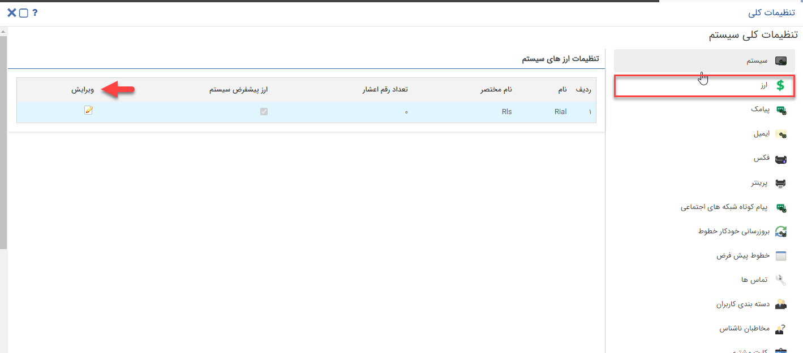

## تنظیمات ارز
مسیر دسترسی: تنظیمات >تنظیمات کلی > تنظیمات ارز

در این قسمت ارز های تعریف شده در سیستم و تعداد رقم اعشار آن نمایش داده می شود.
در حال حاضر فقط ارز ریال در سیستم قابل استفاده است.
در قسمت ویرایش می توانید تعداد رقم اعشار ریال را حداکثر تا 2 رقم اعشار تنظیم کنید.

نکته: تعداد رقم اعشار زمانی استفاده می شود که قصد انتخاب قیمت گذاری در لیست قیمت بر اساس رقم را داشته باشید. به علاوه، برای فیلد های اضافه از نوع پول، برای تنظیم تعداد رقم اعشار آن از این تنظیمات استفاده می شود.

