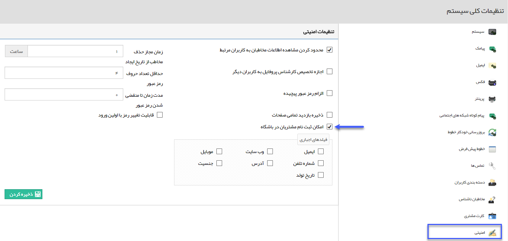
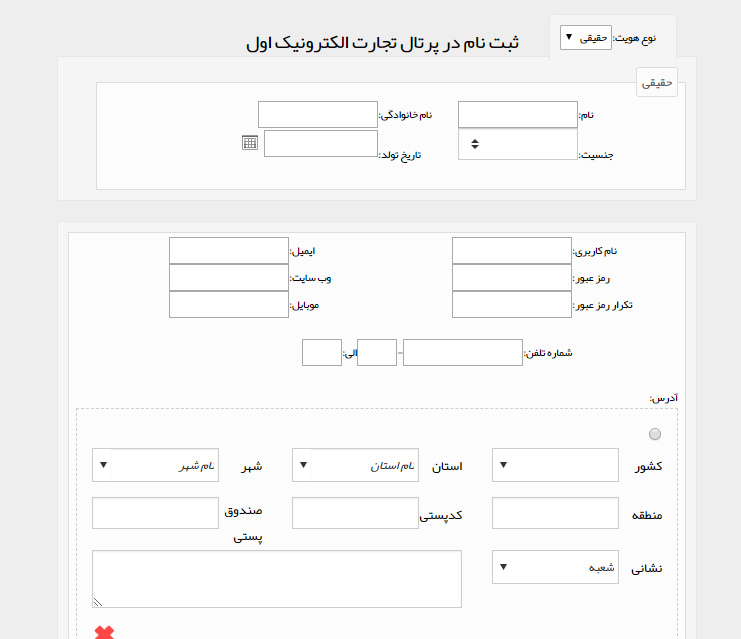
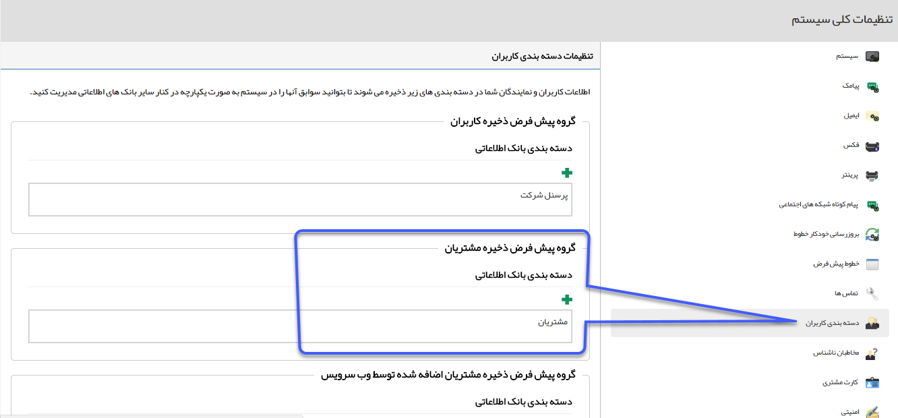

## ایجاد نام کاربری

در باشگاه مشتریان، شما می توانید برای مشتریان و مخاطبان نام کاربری تعریف کنید .

برای عضویت مشتریان در این باشگاه از سه طریق می توان اقدام کرد:

1) از بخش[ مدیریت اعضای باشگاه مشتریان ](https://github.com/1stco/PayamGostarDocs/blob/master/help%202.5.4/Settings/Management-of-customer-club-members/Management-of-customer-club-members.md) در قسمت تنظیمات

2)  برای مشتریان و مخاطبانی که اطلاعاتشان در سیستم CRM ذخیره شده است با ورود به صفحه مشخصات آن مخاطب و کلیک بر روی نام کاربری، برای مخاطب نام کاربری و گذر واژه بسازید. از این پس مخاطب شما می تواند با نام کاربری و گذرواژه اش وارد سیستم شده و صفحه پروفایل خود را ببیند.

3) از طریق[ فعالیت ایجاد کاربر](https://github.com/1stco/PayamGostarDocs/blob/master/help%202.5.4/Settings/Personalization-crm/Overview/Process-design/Create-a-work-cycle/Activity/Create-a-user/Create-a-user.md) طی فرآیند، می توان کاربر باشگاه مشتریان ایجاد نمود.

4) از مسیر مدیریت گروه ها  و کاربران، [ایجاد کاربر ](https://github.com/1stco/PayamGostarDocs/blob/master/help%202.5.4/Settings/Manage-groups-and-users/users/Build-a-new-user/Build-a-new-user.md)می توان با تعیین نوع کاربری بعنوان مشتری، کاربر باشگاه مشتریان تعریف کرد.

5) همچنین می توان در تنظیمات کلی، قسمت امنیتی، امکان ثبت نام در باشگاه مشتریان را فعال نمود. در این صورت هر شخصی که آدرس URL نرم افزار شما را داشته باشد میتواند در باشگاه مشتریان ثبت نام کرده و از امکانات آن بهره مند گردد.

با فعال کردن گزینه نمایش داده شده، در صفحه ورود به نرم افزار لینک ثبت نام نمایش داده خواهد شد، همن طور که مشاهده می کنید میتوانید وارد کردن برخی از فیلدها را در فرم ثبت نام اجباری کنید.

پس از اینکه مشتری بر روی ثبت نام کلیک کند صفحه زیر نمایش داده خواهد شد :

برای مشتریانی که در باشگاه مشتریان ثبت نام می کنند، پروفایلی دردسته بندی که در تنظیمات کلی،بخش دسته بندی کاربران، تنظیم کرده اید ایجاد می شود .

