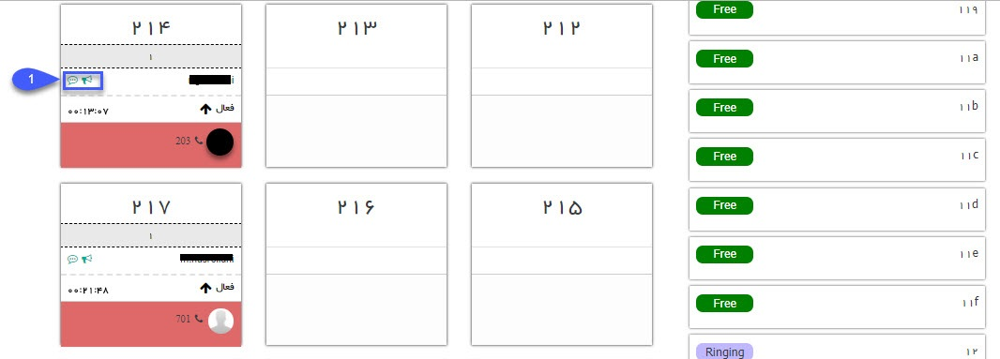

# داشبورد مرکز تماس

در این صفحه امکان مشاهده خطوط داخلی تعریف شده در  نرم افزار وجود دارد. علاوه بر نمایش وضعیت خطوط (مشغول، آزاد و ...)، امکان شنود مکالمه داخلی کاربران و همچنین امکان نجوا (مکالمه با کاربر بدون مطلع شدن فردی که با آن در حال مکالمه است) نیز وجود دارد.

> در صورت استفاده از سیستم تلفنی سانترال که برای ضبط مکالمه از دستگاه تلسا استفاده شده باشد امکان داشتن داشبورد مرکز تماس وجود دارد.(فقط امکان مشاهده وضعیت خطوط و شماره تماسی که با آن صحبت می شود) در صورت استفاده ازسیستم تلفنی ویپ داشبورد مرکز تماس، قابلیت شنود و نجوا رانیز دارد.

در سمت راست لیست خطوط و سمت چپ لیست داخلی ها نمایش داده می شود، داخلی هایی که در حال مکالمه باشند از این قسمت مشخص است و می توانید جزئیاتی مانند نام کاربر متناظر و مدت زمان مکالمه را مشاهده کنید.

**1.شنود و نجوا:** با استفاده از دکمه های این قسمت می توانید مکالمه را شنود کنید و یا پیغامی را برای شخص در حال مکالمه نجوا کنید.

