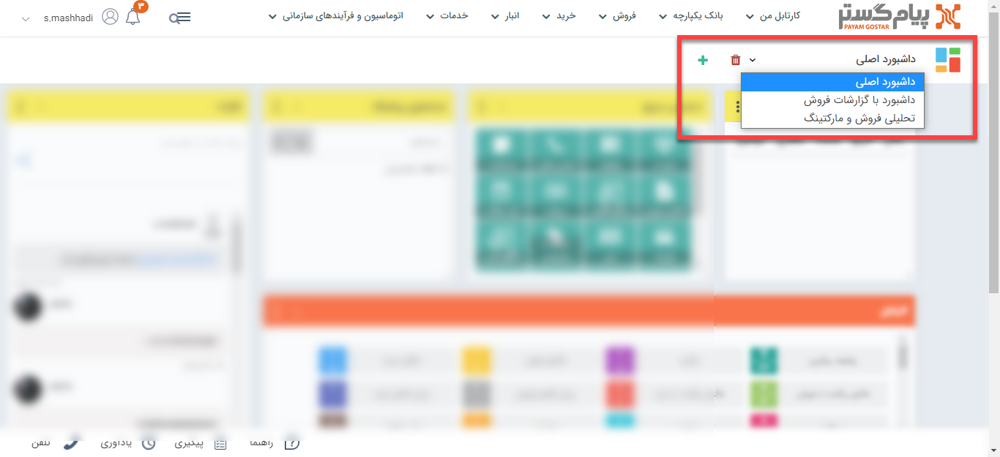
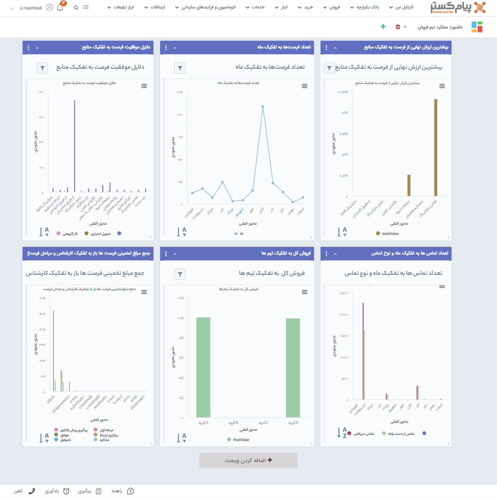
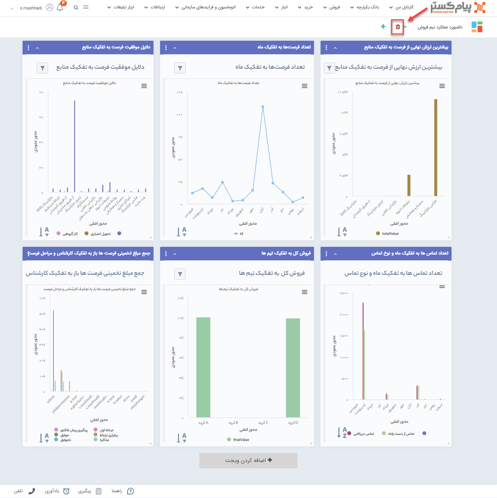

# قابلیت چند داشبورد
در این به موضوعات زیر می‌پردازیم:
- [مزیت استفاده از قابلیت چند داشبورد](#MultiDashboardAdvantage)
- [نحوه ایجاد داشبورد کاری جدید](#CreateNewDashboard)
- [ویرایش داشبورد کاری](#EditeDashboard)
- [حذف داشبوردهای اضافی](#DeleteDashboard)
### مزیت استفاده از قابلیت چند داشبود {#MultiDashboardAdvantage}
داشبوردها محیطی هستند که می‌توانید متناسب با نیاز خود، ویجت‌های پرکاربرد را به آن اضافه کنید، نام آن‌ها را تغییر دهید و رنگ مورد علاقه خود را برای هر ویجت در نظر بگیرید. 
به کمک قابلیت **چند داشبورد**، می‌توانید برای اهداف مختلی که دارید، داشبورد جدیدی ایجاد کنید و در مواقع نیاز به آن‌ها رجوع کنید.

یکی از استفاده‌های مهم از امکانات چند داشبورد، ساخت داشبوردهای مجزا از ترکیت گزارش‌های پرکاربرد است. 
با اضافه شدن **ویجت گزارش** به لیست ویجت‌ها، این امکان فراهم شد تا گزارش‌هایی را که در طول روز مرتبا بررسی می‌کنید، بر روی صفحه اصلی نرم‌افزار آورده و با کمترین کلیک، به آن‌ها دسترسی داشته باشید. 
تصویر زیر نمونه‌ای از داشبوردهای ایجاد شده توسط کاربر است.

> **نکته** 
> داشبورد اصلی، صفحه‌ای است که پس از ورود به نرم‌افزار به صورت پیش‌فرض نمایان می‌شود. می‌توانید به دلخواه خود آن را تنظیم کنید و حتی آن را از لیست داشبوردها حذف نمایید.

### ایجاد داشبورد جدید {#CreateNewDashboard}
 زمانی که برای اولین بار به نرم‌افزار وارد می‌شوید، تنها داشبورد اصلی را مشاهده می‌کنید که می‌توانیدبرای ایجاد داشبورد جدید مراحل ساخت داشبورد جدید را با ذکر یک مثال  آموزش می‌دهیم:
 1. در گوشه سمت راست، بالای نرم‌افزار روی علامت **+** کلیک کنید.
 2. نام داشبورد را وارد کنید. ما در این مثال داشبوردی از گزارش‌های پرکاربرد فروش، برای نظارت بر عملکرد تیم فروش می‌خواهیم ایجاد کنیم.
 3. ویجت‌های مورد نیاز خود را از قسمت **اضافه کردن ویجت**، به صفحه اضافه کنید. برای آشنایی بیشتر با انواع ویجت‌ها، مقاله‌ی [**تعریف ویجت**](https://github.com/1stco/PayamGostarDocs/blob/master/help2.5.4/home/widget/Widgets2.7.0.md) را مطالعه نمایید.

### ویرایش داشبورد کاری {#EditeDashboard}
می‌توانید ویجت‌هایی که به صفحه داشبورد اضافه کرده‌اید را حذف و ویجت جدید را به آن اضافه نمایید. لازم به ذکر است در حال حاضر تغییر نام داشبورد امکان پذیر نمی‌باشد.

### حذف داشبوردهای اضافی {#DeleteDashboard}
از بین داشبوردهای ایجاد شده هر کدام که مورد استفاده نیستند را از لیست داشبوردها انتخاب کرده و با کلیک بر آیکن **سطل زباله** حذف نمایید.

