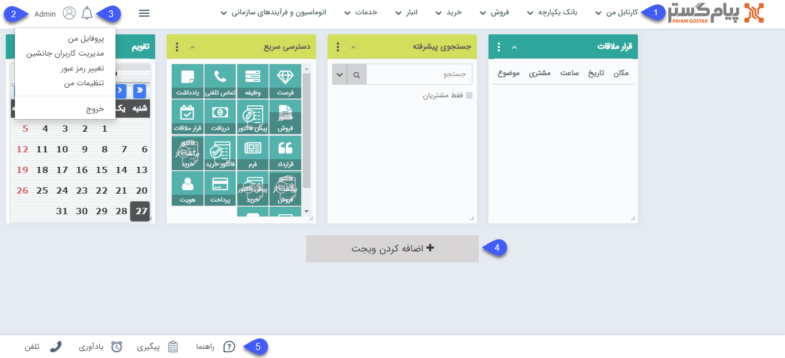

# صفحه خانه پیام‌گستر

در این صفحه با توجه به سطح دسترسی خود منوهای موجود در قسمت بالای صفحه را مشاهده خواهید کرد (1).

در همین صفحه در بخش **اطلاعات کاربری** خود (2) تنظیمات پروفایل خود را انجام دهید. جزئیات مربوط به تنظیمات پروفایل خود را در قسمت‌های زیر مطالعه نمایید.

[پروفایل من]( https://github.com/1stco/PayamGostarDocs/blob/master/help2.5.4/home/my-profile/my-profile.md)

[مدیریت کاربران جانشین]( https://github.com/1stco/PayamGostarDocs/blob/master/help2.5.4/home/Substitute-users/Substitute-users.md)

[تغییر رمز عبور]( https://github.com/1stco/PayamGostarDocs/blob/master/help2.5.4/home/edit-password/edit-password.md)

[تنظیمات من]( https://github.com/1stco/PayamGostarDocs/blob/master/help2.5.4/home/my-setting/my-setting.md)

پیام‌های سیستمی به‌منظور اطلاع‌رسانی به شما در مورد فعالیت‌های انجام شده در سیستم را در بخش پیام‌های سیستمی قابل مشاهده می‌باشد (3). این پیام ها بر اساس رخدادهایی مانند تخصیص وظیفه ، تنظیم شدن قرار ملاقات، تایید و رد آیتم مالی و ... برای شما ایجاد می شوند. 

برای دسترسی سریع به ابزارهای مختلف نرم‌افزار از میان‌برها یا **ویجت‌ها** بر روی صفحه خانه حساب کاربری خود استفاده نمایید و صفحه خانه نرم‌افزار خود را شخصی‌سازی کنید (4).
در هر بخش از نرم افزار که باشید، با کلیک بر آیکون «خانه» یا لوگوی پیام گستر به این صفحه منتقل می شوید.

