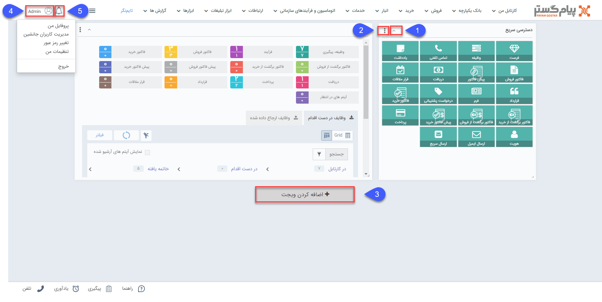

# صفحه خانه پیام‌گستر

در این صفحه با توجه به سطح دسترسی خود منوهای موجود در قسمت بالای صفحه را مشاهده خواهید کرد.

می‌توانید برای استفاده از ابزارهای مختلف نرم‌افزار از میان‌برها یا **ویجت‌ها** بر روی صفحه خانه حساب کاربری خود استفاده نمایید. همچنین در هر بخش از نرم افزار که باشید، با کلیک بر آیکون «خانه» یا لوگوی پیام گستر به این صفحه منتقل می شوید.

نوار ابزار نرم افزار، در این صفحه همواره نمایش داده می شود و شما می توانید به تنظیمات و راهنما و سایر موارد به راحتی دسترسی داشته باشید.

**1**. با استفاده از این دکمه می توانید تنظیمات ویجت مورد نظر را انجام دهید یا در صورت نیاز آن را حذف کنید.

> نکته: رنگ و عنوان هر ویجت را می توانید به صورت دلخواه تعیین کنید.

**2**. ویجت انتخاب شده را کوچک (Minimize) می کند.

**3**. ویجت های مختلف را میتوانید از این قسمت  به صفحه خانه اضافه کنید.

**4. تنظیمات کاربری:** قسمت های ذیل را مطالعه کنید.

[تغییر رمز عبور]( https://github.com/1stco/PayamGostarDocs/blob/master/help2.5.4/home/edit-password/edit-password.md)

[مدیریت کاربران جانشین]( https://github.com/1stco/PayamGostarDocs/blob/master/help2.5.4/home/Substitute-users/Substitute-users.md)

[تنظیمات من]( https://github.com/1stco/PayamGostarDocs/blob/master/help2.5.4/home/my-setting/my-setting.md)

[پروفایل من]( https://github.com/1stco/PayamGostarDocs/blob/master/help2.5.4/home/my-profile/my-profile.md)

**5**. پیام های سیستمی، لیست پیام هایی که در نرم افزار برای کاربری شما ایجاد شده است را نمایش می دهد. این پیام ها بر اساس رخدادهایی مانند تخصیص وظیفه ، تنظیم شدن قرار ملاقات، تایید و رد آیتم مالی و ... برای شما ایجاد می شوند. برای فعال کردن و یا تغییر محتوای این پیام ها قسمت مدیریت پیام های سیستم را مطالعه کنید.
