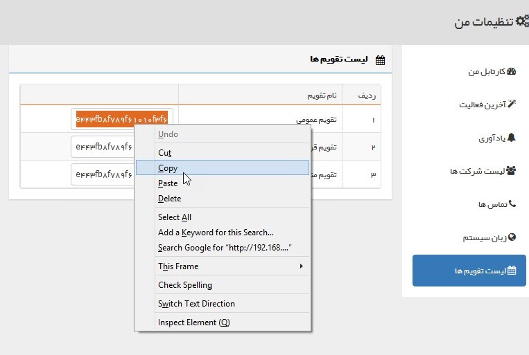

## تنظیمات من

این قسمت تنظیمات مرتبط با هر کاربر نمایش داده می شود.

 1. کارتابل من: تب های نمایش داده شده در[ کارتابل](https://github.com/1stco/PayamGostarDocs/blob/master/help%202.5.4/home/widget/Cardboard/Cardboard.md) خود را در این قسمت می توانید تعیین کنید.
 
 
 
 
 2. آخرین فعالیت: سوابقی که در ویجت آخرین فعالیت نمایش داده می شود را می توانید تعیین کنید.

3. یادآوری: می توانید تعیین کنید که هنگام دریافت کار جدیدی (وظیفه، فرایند و ...) در کارتابل، یک اعلان(notification) نشان داده شود یا خیر، و اینکه این اعلان با هشدار صوتی همراه باشد یا خیر

5. تماس ها: می توانید تعیین کنید که هنگام دریافت یک تماس روی داخلی خود یکی از سه حالت زیر اتفاق بیافتد.

A. پروفایل هویت مرتبط به صورت خودکار برای شما باز شود..

نکته: توجه داشته باشید که برای نمایش داده شدن پروفایل در هنگام تماس، باید در تنظیمات مرورگر خود Pop-up Blocking را غیر فعال کرده باشید.

B. می توانید انتخاب کنید که هنگام دریافت تماس، کدام آیتم مرتبط با هویت به منظور ایجاد به صورت خودکار باز شود. ابتدا نوع آیتم سپس زیر نوع آیتم را مشخص کنید و ذخیره کنید.

> نکته: کاربر برای ایجا آیتم باز شده ، باید مجوز "ذخیره اولیه" را روی آیتم انتخاب شده در این قسمت  داشته باشد.

C. هنگام دریافت تماس هیچ پروفایل یا آیتمی باز نشود.

تعداد تماس های نمایش داده شده در نوار تلفن   را هم می توانید تعیین کنید

6. زبان سیستم: از بین زبان های مجاز در نرم افزار میتوانید زبان دلخواه را انتخاب کنید.

تعریف  زبان  برای سیستم از قسمت مدیریت زبان ها انجام می شود .

7. لیست تقویم ها: لیست تقویم هایی که به آن دسترسی دارید را نمایش می دهد. می توانید از لینک هر کدام جهت اضافه کردن آن تقویم به برنامه ها و وبسایت هایی که از این تقویم پشتیبانی می کنند بهره بگیرید. برای مثال تقویم عمومی را می توانید در گوگل داشته باشید و اگر از همان نام کاربری گوگل در گوشی همراه یا تبلت خود استفاده کنید. قرار ملاقات های تنظیم شده برای شما در تقویم عمومی در آن نمایش داده خواهد شد.

برای مثال برای اضافه کردن تقویم به تقویم گوگل از شیوه زیر استفاده کنید:

ابتدا لینک تقویم پیام گستر را کپی کنید.

سپس وارد تقویم گوگل (Google Calendar) شوید.

بر روی Other Calendars کلیک کنید و گزینه Add by URL را انتخاب کنید.

لینک تقویم هایی که در پیام گستر دارید را یک به یک از این منو اضافه کنید.

