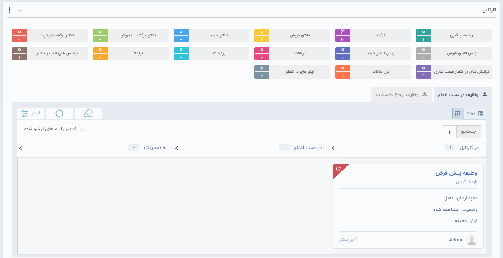

## ویجت کارتابل 

 در این قسمت کارهای ارجاع شده به کاربر(تایید آیتم‌های مالی،فرآیندهاو ... )  در دسته بندی‌های ذیل نمایش داده می شوند.
 
 > نکته: عددی که رو به روی هر کارتابل نمایش داده می شود نشانگر نسبت تعداد کارهایی است که  امروز (از 12:01 بامداد) وارد آن کارتابل شده (عدد بالایی) به کل کارهایی که در اون کارتابل وجود دارد .

**تغییر رنگ آیتم‌ها در کارتابل:**

در صورتی که از تاریخ وظیفه و پیگیری گذشته باشد و یا از تاریخ انقضا یا زمان بحرانی کارتابل تحت چرخه‌های کاری گذشته باشد، رنگ آن آیتم در کارتابل مربوطه قرمز خواهد شد.

در صورتی که از تاریخ یادآوری گذشته باشد، رنگ آیتم در کارتابل مربوطه زرد خواهد شد.

تب‌های مختلف این کارتابل بر اساس میزان دسترسی کاربر به قسمت‌های مختلف نرم افزار ممکن است تغییر پیدا کنند.

#### تنظیمات کارتابل

در صورت نیاز می توانید در تنظیمات این ویجت، کارتابل پیشفرض و کارتابل‌های مختلفی که نمایش داده می شوند را انتخاب کنید.

