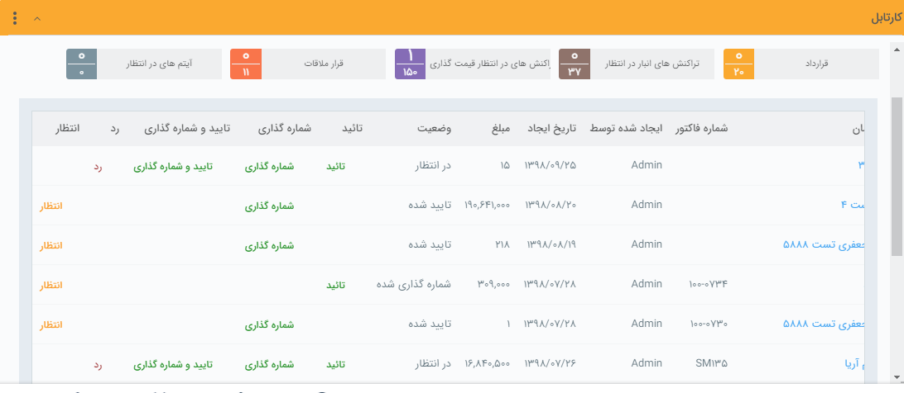

## آیتم های مالی (پیش فاکتور، فاکتور،قرارداد و ... )

> مسیر دسترسی:  >**کارتابل من** > **پیش‌فاکتور فروش/فاکتور فروش/قرارداد/...** 

این کارتابل ها عبارتند از: کارتابل پیش فاکتورها، فاکتورها، فاکتورهای برگشتی، دریافت ها،پرداخت ها و قراردادها که نیاز به تایید ویا شماره گذاری توسط کاربر دارای مجوز دارند.

در صورتی که از قسمت [تنظیمات، شخصی سازی](https://github.com/1stco/PayamGostarDocs/tree/master/help%202.5.4/Settings/Personalization-crm/Factor-management/Factor-management.md) CRM ، تیک مربوط به نیاز به تایید یا نیاز به شماره گذاری هر کدام از این آیتم ها را انتخاب نموده باشید، بعد از صدور هر کدام از این آیتم ها توسط کارشناسان به تایید/شماره گذاری نیاز خواهند داشت. کاربر دارای مجوز تایید یا شماره گذاری آن آیتم شخصی است که می تواند از طریق این صفحه کلیه آیتم های صادر شده را مشاهده، بررسی و تایید و یا شماره گذاری و یا رد نماید.

> نکته: پس از تایید پیش فاکتور، فاکتور، فاکتور برگشتی و یا قرارداد، آن آیتم قابلیت ویرایش یا حذف نخواهد داشت مگر حذف کاربر دارنده مجوز ویرایش  پس از شماره گذاری/ تایید ،  حذف  پس از شماره گذاری/ تایید و یا  " مجوزمدیر فروش".

> نکته: پس از تایید دریافت و یا پرداخت، این آیتم های مالی قابلیت ویرایش و حذف نخواهد داشت مگر کاربر دارنده مجوز ویرایش  پس از شماره گذاری/ تایید ،  حذف  پس از شماره گذاری/ تایید و یا  " مجوزمدیر مالی".

 در این کارتابل امکان شماره گذاری و یا تایید/رد وجود دارد و همچنین با کلیک بر روی هر کدام از سطر ها، آیتم مربوط به مشتری بازخواهد شد و با زدن دکمه های شماره گذاری،تایید و رد در بالای صفحه ، همچنین می توانید آن را تایید/شماره گذاری یا رد نمایید .
 
 
 
 >   نکته: می توانید برای اطلاع مسئول و یا ثبت کننده آیتم از تایید و یا رد آیتم موردنظر، پیامی را از طریق اطلاعات پایه ، [ مدیریت پیام های سیستم](https://github.com/1stco/PayamGostarDocs/blob/master/help%202.5.4/Basic-Information/Manage-system-messages/Manage-system-messages.md) تنظیم کنید.

> نکته : کاربری که بر روی آیتم مورد نظر مجوز بازگشت به وضعیت در انتظار تایید را داشته باشد، میتواند آیتم را از وضعیت تایید خارج کند .
