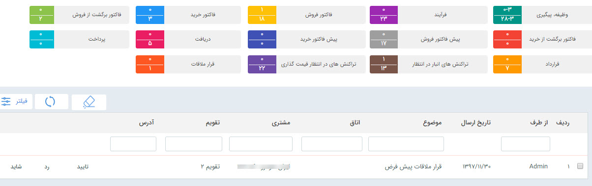

#  مدیریت کارتابل قرارملاقات  

در صورتی که  برای هرکدام از مدعوین در هنگام [ثبت قرار ملاقات](https://github.com/1stco/PayamGostarDocs/blob/master/help2.5.4/Integrated-bank/Database/Records/new-appointment/new-appointment.md)، درخواست تایید حضور ارسال کنید، این درخواست در کارتابل قرارملاقات های کاربر نمایش داده می شود و می تواند از یکی از گزینه های تایید، رد و شاید استفاده کند

> **نکته:** وضعیت تایید حضور کاربر می تواند به هماهنگ کننده قرار ملاقات اطلاع داده شود، برای تنظیم متن پیام مرتبط با این اطلاع رسانی به [مدیریت پیام های سیستم](https://github.com/1stco/PayamGostarDocs/blob/master/help%202.5.4/Basic-Information/Manage-system-messages/Manage-system-messages.md) مراجعه کنید

> **نکته:** در صورتی که کاربری درخواست حضور را تایید نکند، می توان آن کاربر را در قرار ملاقات دیگری در همان زمان دعوت کرد

