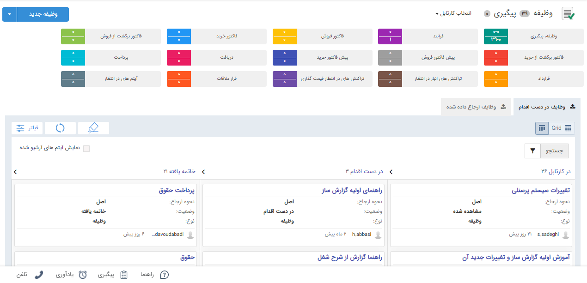
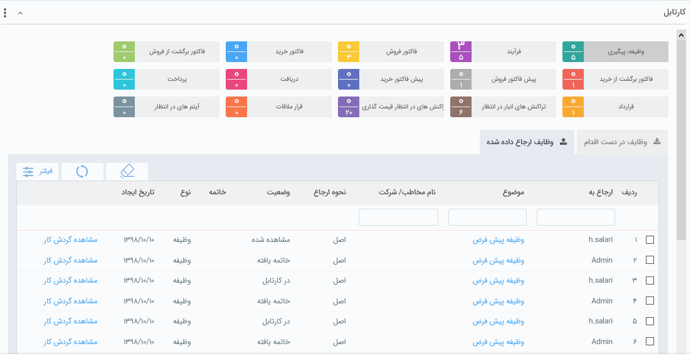

##  کارتابل رسیدگی به وظایف و پیگیری 
 
 

از این قسمت می‌توانید تمام وظایف و پیگیری‌هایی که برای خود ثبت کرده اید، وظایفی که دیگران به شما ارجاع داده اند و وظایفی که شما به کاربران دیگر ارجاع داده اید را مشاهده نمایید .

**حالت نمایش وظیفه‌ها:**

وظایف به دو صورت کانبان و گرید نمایش داده میشود.

در نمایش بصورت کانبان وضعیت وظیفه (درکارتابل،در دست اقدام و خاتمه یافته)  بصورت مراحل کانبان نمایش داده می‌شود .  در رابطه با وضعیت وظیفه جلوتر توضیح داده شده است .

**تغییر رنگ آیتم‌ها در کارتابل:**

در صورتی که از تاریخ وظیفه و پیگیری گذشته باشد و یا از تاریخ انقضا یا زمان بحرانی کارتابل گذشته باشد رنگ آن وظیفه یا پیگیری در کارتابل مربوطه قرمز خواهد شد.

در صورتی که از تاریخ یادآوری گذشته باشد، رنگ آیتم در کارتابل مربوطه زرد خواهد شد.

> نکته: تغییر رنگ آیتم‌ها در کارتابل‌های ذکر شده ربطی به ساعت تنظیم آن‌ها ندارد.

**1. وظایف در دست اقدام:** وظیفه‌هایی که به کاربر ارجاع داده شده اند در این قسمت نمایش داده می‌شود.

وضعیت وظیفه به شرح زیر است:

**الف) در کارتابل:** زمانی که وظیفه ارجاع شده هنوز توسط کاربر دریافت کننده مشاهده نشده است. 

**ب) مشاهده شده:** زمانی که وظیفه ای که برای شما ارسال شده را یکبار باز کرده باشید.

**ج) در دست اقدام:** زمانی که وظیفه را برای کاربر دیگری فرستاده اید.

**د) قفل شده:** زمانی که وظیفه قفل شده باشد. (کسی بر روی آن کار نمی‌کند.)

**ی) خاتمه یافته:** زمانی که وظیفه خاتمه یافته باشد.

**2. وظایف ارجاع داده شده:** وظایفی که به دیگران ارجاع داده شده اند در این قسمت نمایش داده می‌شود..  

در این قسمت نمایش داده می‌شود ارجاع وظیفه به چه کسی بوده و نحوه ارجاع چگونه بوده  و همچنین مشاهده میکنید وظیفه ارجاع شده توسط کاربر ارجاع شونده در چه وضیعتی قرار دارد و گردش کار وظیفه مورد نظر هم قابل مشاهده است . (وضیعت‌ها همانند توضیح بالا)

**3. فیلتر:** برای یافتن یک وظیفه مشخص می‌توانید از فیلترهای مختلف استفاده کنید.

**4. منوی راست کلیک:** با راست کلیک بر روی یک یا چند وظیفه امکان ارجاع، قفل کردن و ... بر روی آن‌ها وجود دار
