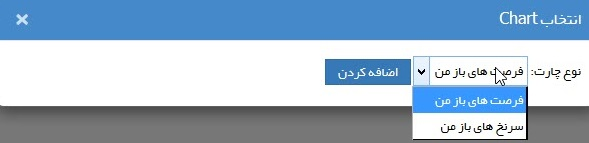

# ویجت چارت  

با استفاده از این ویجت، کارشناسان فروش می‌توانند چارت [فرصت فروش‌های باز](https://github.com/1stco/PayamGostarDocs/blob/master/help2.5.4/Integrated-bank/Database/Opportunities/Opportunities.md) که باید پیگیری کنند را به تفکیک مرحله‌ی آن‌ها مشاهده کنند و یا [لیست سرنخ‌](https://github.com/1stco/PayamGostarDocs/blob/master/help2.5.4/Customer-relationship-management/My-clues/My-clues.md)هایی که نیاز به پیگیری دارند را مشاهده کنند.

برای مثال لیست فرصت‌های باز من به شکل زیر نمایش داده می‌شود. توجه داشته باشید که این فرصت‌ها باید پیگیری کننده (فیلد تخصیص داده شده به) با کاربری که از این ویجت استفاده می‌کند پر شده باشند تا در این چارت  برای کاربر نمایش داده شوند.

> نکته: فرصت‌های باز به فرصت‌هایی گفته می‌شود که به شما تخصیص داده شده و  اما  فیلد علت موفقیت و علت شکست آن ها انتخاب نشده است .  

اگر فیلد علت موفقیت و یا علت شکست فرصت مقدار دهی شود آن فرصت در این ویجت نمایش داده نخواهد شد.

> نکته: سرنخ‌های باز به سرنخ‌هایی گفته می‌شود که وضعیت سرنخ در آن‌ها "نامعلوم" باشد.

**سرنخ‌های باز من:** منظور سرنخ‌هایی است که مخاطب تبدیل نشده است و  کاربر بعنوان ایجاد کننده آن سرنخ و یا مسئول (پشتیبانی،فروش و متفرقه) آن انتخاب شده است .

