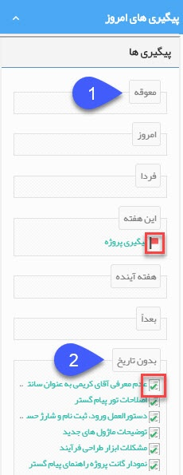

## پیگیری های امروز 

>  مسیر دسترسی:  **خانه** >**اضافه کردن ویجت** > **پیگیری‌ها**  

در این ویجت لیست کلیه پیگیری ها و وظایفی که برای خود ثبت کرده اید یا وظایفی که کاربران دیگر به شما ارجاع داده اند را میتوانید مشاهده کنید

> نکته: نحوه نمایش پیگیری ها و وظایف در این قسمت متفاوت است، پیگیری ها با آیکون پرچم قرمزرنگ و وظایف با آیکون یادداشت سبزرنگ نمایش داده می شوند

> نکته: نحوه قرارگیری وظایف و پیگیری ها در هرکدام از بازه های زمانی این ویجت (معوقه، امروز، فردا و ....) بر اساس تاریخ وارد شده در قسمت موعد/ مقرر می باشد. توجه داشته باشید در صورتی که وظیفه به شما ارجاع داده شده باشد، تاریخ وارد شده در فیلد "مهلت" در قسمت ارجاع وظایف ، به عنوان معیار مرتبط با این موضوع در نظر گرفته خواهد شد.

1- معوقه: در صورتی که تاریخ موعد وارد شده در پیگیری یا وظیفه گذشته باشد آن پبگیری/وظیفه در قسمت معوقه قرار خواهد گرفت

2-بدون تاریخ: در صورتی که برای فیلد موعد مقرر  و یا هنگام ارجاع فیلد مهلت در وظیفه مقداری وارد نکرده باشید این وظیفه در قسمت بدون تاریخ نمایش داده خواهد شد.