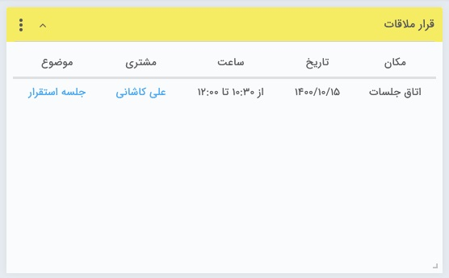

## قرار ملاقات 

> مسیر دسترسی:  **صفحه‌ی خانه** >**افزودن ویجت** > **قرارملاقات** 

 لیست قرار ملاقات‌های موجود در همان روز که موعد آنها(بر اساس ساعت شروع) نرسیده باشد، نمایش داده خواهند شد. به بیانی دیگر، قرار هایی که موعد آنها گذشته باشد، در این ویجت .قابل مشاهده نخواهند بود

نکته : ایجادکننده، هماهنگ کننده و مدعوین قرار ملاقات می توانند در این ویجت، لیست قرار ملاقات های تنظیم شده برای 24 ساعت جاری را مشاهده کنند.

در نظر داشته باشید، ترتیب نمایش قرارملاقات ها در ویجت، به صورت صعودی بر اساس ساعت شروع آنها خواهد بود.

