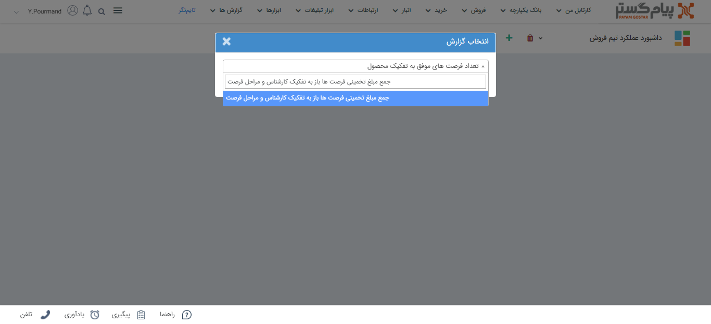
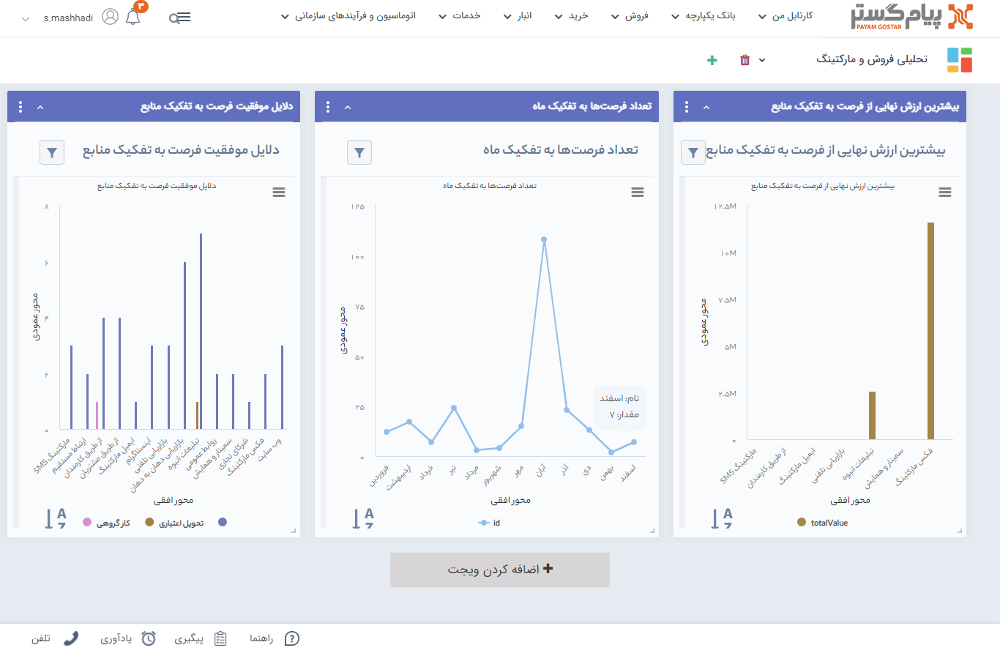

# ویجت گزارش
به کمک این ویجت می‌توانید یک گزارش به صفحه داشبورد خود اضافه کنید.  
*به عنوان مثال* 
مدیر فروش مسئولیت‌ بررسی عملکرد کارشناسان فروش، وضعیت فرصت‌های فروش، تعداد و زمان تماس‌ها، تعداد پیگیری‌ها و از این دست گزارش‌ها را دارد. بنابراین روزانه نیاز دارد به بخش گزارش‌ها رفته و نتایج را در گزارش‌های مجزا و یا یک داشبورد از ترکیت چند گزارش، را ببیند. در اینجا استفاده از ویجت گزارش در داشبورد، سبب صرفه‌جویی در زمان مدیر فروش خواهد شد. 
 برای سهولت دسترسی به گزارش‌ها ویجتی با نام **گزارش** در اختیار شما قرار داده شده که گزارش‌های مورد نظر خود را به صفحه اصلی نرم‌افزار اضافه کنید.  
به کمک قابلیت **چند داشبورد** در صفحه اصلی می‌توانید براساس تنوع گزارش‌های خود، داشبوردهای مجزا ایجاد کنید.

### افزودن ویجت گزارش به صفحه داشبورد
1. روی دکمه **اضافه کردن ویجت** کلیک نمایید.
2. از لیست ویجت‌ها، ویجت **گزارش** را انتخاب نمایید.
3. نام گزارش مورد نظر خود را در کادر مربوطه جستجو کنید. علاوه بر آن می‌توانید از لیست گزارش‌هایی که در ویجت به شما پیشنهاد می‌شود، گزارش خود را انتخاب نمایید.

4. پس از انتخاب گزارش مورد نظر خود، روی دکمه **اضافه کردن** کلیک کنید. در این لحظه شما یکی از گزارش‌های پرکاربرد خود را به صفحه داشبورد اضافه کرده‌اید. گفتنی‌ است شما هیچ محدودتی برای اضافه کردن ویجت گزارش به صفحه داشبورد ندارید.

> **نکته** 

> **نکته**  در ویجت گزارش، تنها استفاده از **گزارش‌های پرکاربرد** امکان پذیر است.
