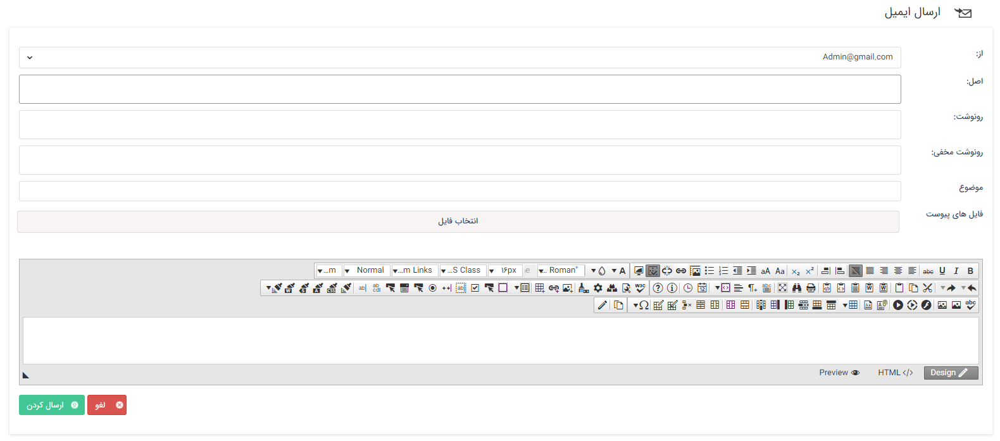

### ویجت ارسال ایمیل

از طریق ویجت ارسال ایمیل در صورت داشتن دسترسی به خطوط ایمیل می‌توانید یک ایمیل جدید ارسال کنید.

**از:** در این قسمت می‌توانید از بین ایمیل‌های به اشتراک گذاشته شده برای شما، یک ایمیل را به عنوان فرستنده انتخاب نمایید.

**اصل:** در این قسمت آدرس ایمیل گیرنده یا گیرندگان مورد نظر خود را وارد کنید.

**رونوشت:** در صورتی که برای چند گیرنده ایمیلی به حالت رونوشت ارسال شود، تمامی گیرندگان می‌توانند لیست باقی گیرندگان و ایمیل‌هایی که در پاسخ ایمیل فرستاده شده است را مشاهده کنند.

**رونوشت مخفی:** در صورتی که ایمیل به حالت رونوشت مخفی ارسال شود، لیست گیرندگان و ایمیل‌هایی که در پاسخ ایمیل فرستاده شده است قابل مشاهده نخواهد بود ( در واقع نمی‌توان فهمید ایمیل به چه کسانی ارسال شده و چه ایمیل‌هایی در جواب ایمیل فرستاده شده است.) .

> نکته: ارسال ایمیل به صورت رونوشت و رو نوشت مخفی تنها از طریق پروتکل SMTP امکان پذیر است. 

 
در صورت نیاز به الصاق فایل (Attach) می‌توانید از گزینه انتخاب فایل استفاده کنید. سپس موضوع و محتوای ایمیل خود را مشخص کرده و روی دکمه "ارسال کردن" کلیک کنید.

