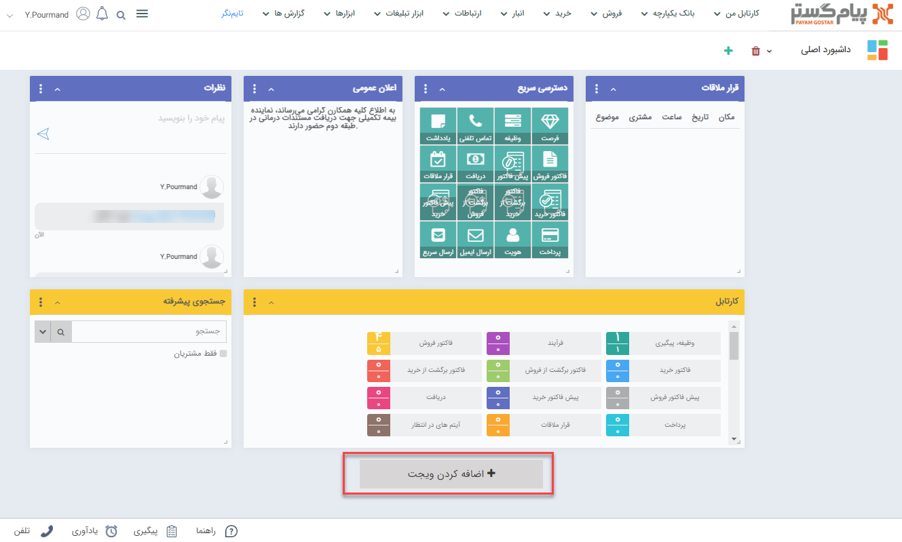
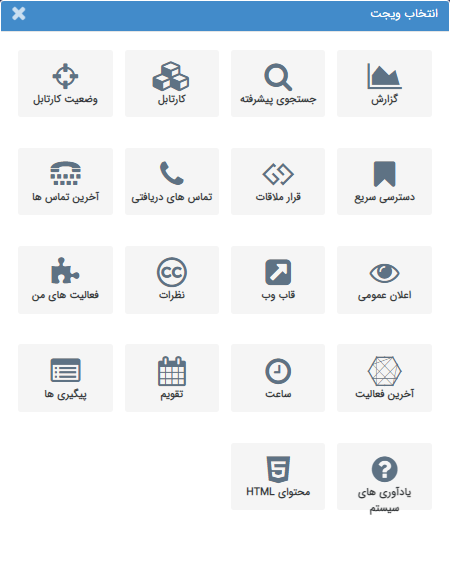

# معرفی ویجت‌‌ها

ویجت‌ها ابزاری برای **دسترسی آسان و سریع** به برخی از بخش‌های نرم‌افزار است که روزانه زیاد سروکار دارید. علاوه بر آن برخی از ویجت‌ها مانند «اعلان عمومی» برای اطلاع رسانی به تمامی کاربران از طریق نرم‌افزار است. 
شما با توجه به نیاز خود می‌توانید ویجت‌های پرکاربرد خود را به صفحه اضافه نموده، نام و رنگ مورد علاقه خود را برای هر ویجت انتخاب کنید و این یعنی شما می‌توانید ویجت‌ها را متناسب با نیاز خود تنظیم کنید. 
زمانی که برای اولین بار به وارد نرم‌افزار می‌شوید ویجت‌هایی به صورت پیش‌فرض روی صفحه وجود دارد. هرکدام از آن‌ها را که نیاز ندارید می‌توانید حذف نمایید و ویجت مورد نیاز خود را به صفحه اضافه کنید.  
*به عنوان مثال*  
ویجت **نظرات** برای ارتباط کاربران با یکدیگر، ثبت نظر یا اطلاع‌رسانی به سایر کاربران بسیار پرکاربرد بوده و لازم است که تمامی کاربران آن را روی داشبورد خود قرار دهند.

### اضافه کردن ویجت به داشبورد
با کلیک روی دکمه **اضافه کردن ویجت** لیست تمامی ویجت‌ها به شما نمایش داده می‌شود و می‌توانید از بین آن‌ها ویجت مورد نظر خود را انتخاب نمایید.

صفحه‌ی جدیدی نمایش داده می‌شود که می‌توانید ویجت مورد نظر خود را از بین آن انتخاب نمایید.

### لیست ویجت‌ها
- [آخرین تماس ها](https://github.com/1stco/PayamGostarDocs/tree/master/help2.5.4/home/widget/Last-calls/Last-calls.md)
- [آخرین فعالیت](https://github.com/1stco/PayamGostarDocs/tree/master/help2.5.4/home/widget/The-latest-activity/The-latest-activity.md)
- [اعلان عمومی](https://github.com/1stco/PayamGostarDocs/tree/master/help2.5.4/home/widget/Public-announcement/Public-announcement.md)
- [پیگیری های امروز](https://github.com/1stco/PayamGostarDocs/tree/master/help2.5.4/home/widget/Follow-up-today/Follow-up-today.md)
- [تقویم](https://github.com/1stco/PayamGostarDocs/tree/master/help2.5.4/home/widget/Calendar/Calendar.md)
- [جستجوی پیشرفته](https://github.com/1stco/PayamGostarDocs/tree/master/help2.5.4/home/widget/Advanced-search/Advanced-search.md)
- [چارت](https://github.com/1stco/PayamGostarDocs/tree/master/help2.5.4/home/widget/Chart/Chart.md)
- [دسترسی سریع](https://github.com/1stco/PayamGostarDocs/tree/master/help2.5.4/home/widget/quick-access/quick-access.md)
- [ساعت](https://github.com/1stco/PayamGostarDocs/tree/master/help2.5.4/home/widget/watch/watch.md)
- [فعالیت های من](https://github.com/1stco/PayamGostarDocs/tree/master/help2.5.4/home/widget/My-activities/My-activities.md)
- [قاب وب](https://github.com/1stco/PayamGostarDocs/tree/master/help2.5.4/home/widget/Web-frame/Web-frame.md)
- [قرار ملاقات](https://github.com/1stco/PayamGostarDocs/tree/master/help2.5.4/home/widget/Meeting-widget/Meeting-widget.md)
- [کارتابل](https://github.com/1stco/PayamGostarDocs/tree/master/help2.5.4/home/widget/Cardboard/Cardboard.md)
- [گزارش]()
- [محتوایHTML](https://github.com/1stco/PayamGostarDocs/tree/master/help2.5.4/home/widget/Html-content/Html-content.md)
- [نظرات](https://github.com/1stco/PayamGostarDocs/tree/master/help2.5.4/home/widget/Comments/Comments.md)
- [وضعیت کارتابل](https://github.com/1stco/PayamGostarDocs/tree/master/help2.5.4/home/widget/Cartel-tatus/Cartel-tatus.md)
- [یادآوری های سیستم](https://github.com/1stco/PayamGostarDocs/tree/master/help2.5.4/home/widget/System-reminders/System-reminders.md)

### ویرایش تنظیمات ویجت
با استفاده سه نقطه بالای ویجت می توانید تنظیمات ویجت مورد نظر را انجام دهید یا در صورت نیاز آن را حذف کنید. شما می‌توانید رنگ و عنوان هر ویجت را به دلخواه خود تعیین کنید.

