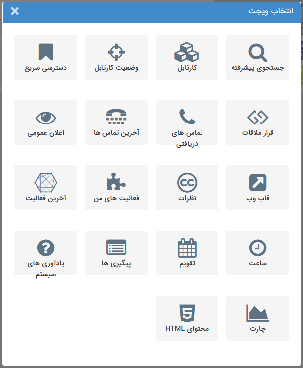

## (Widget) ویجت

ویجت­ها جهت دسترسی سریع تر به برخی از قسمت های نرم افزار می­توانند مورد استفاده قرار گیرند، همچنین برخی از ویجت­ها مانند اعلان عمومی و قاب وب امکاناتی در اختیارتان قرار می­دهند که صرفاً از طریق ویجت قابل انجام است.  هر کاربر بنا بر نیاز می­تواند ویجت های مورد نظر خود را به صفحه اصلی کاربری خود در نرم افزار اضافه نماید.

انواع ویجت های پیام گستر به شرح زیر می باشند:

[جستجوی پیشرفته](Advanced-search%2FAdvanced-search.md)

[کارتابل](Cardboard%2FCardboard.md)

[وضعیت کارتابل](Cartel-tatus%2FCartel-tatus.md)

[دسترسی سریع](quick-access%2Fquick-access.md)

[قرار ملاقات](Meeting-widget%2FMeeting-widget.md)

[آخرین تماس ها](Last-calls%2FLast-calls.md)

[اعلان عمومی](Public-announcement%2FPublic-announcement.md)

[قاب وب](Web-frame%2FWeb-frame.md)

[نظرات](Comments%2FComments.md)

[فعالیت های من](My-activities%2FMy-activities.md)

[آخرین فعالیت](The-latest-activity%2FThe-latest-activity.md)

[ساعت](watch%2Fwatch.md)

[تقویم](Calendar%2FCalendar.md)

[پیگیری های امروز](Follow-up-today%2FFollow-up-today.md)

[یادآوری های سیستم](System-reminders%2FSystem-reminders.md)

[چارت](Chart%2FChart.md)

[محتوایHTML](Html-content%2FHtml-content.md)