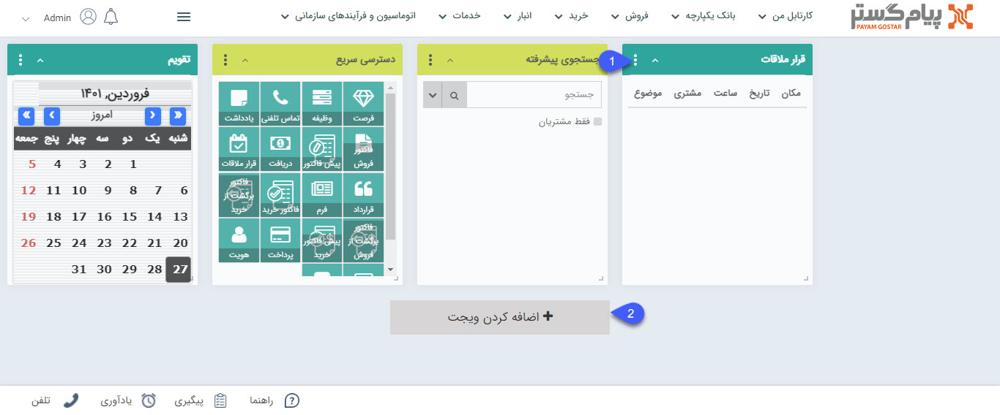

# تعریف ویجت‌

ویجت‌ها جهت دسترسی سریع‌تر به برخی از قسمت‌های نرم افزار می‌توانند مورد استفاده قرار گیرند، همچنین برخی از ویجت‌ها مانند اعلان عمومی و قاب وب امکاناتی در اختیارتان قرار می‌دهند که صرفاً از طریق ویجت قابل انجام است.  هر کاربر بنا بر نیاز می‌تواند ویجت‌های مورد نظر خود را به صفحه اصلی کاربری خود در نرم افزار اضافه نماید.  

با استفاده سه نقطه بالای ویجت می توانید تنظیمات ویجت مورد نظر را انجام دهید یا در صورت نیاز آن را حذف کنید (1). شما می‌توانید رنگ و عنوان هر ویجت را می توانید به صورت دلخواه تعیین کنید.

ویجت‌های مختلف را می‌توانید به صفحه خانه اضافه کنید (2).

### انواع ویجت‌های پیام گستر به شرح زیر می‌باشند:

[جستجوی پیشرفته](https://github.com/1stco/PayamGostarDocs/tree/master/help2.5.4/home/widget/Advanced-search/Advanced-search.md)

[کارتابل](https://github.com/1stco/PayamGostarDocs/tree/master/help2.5.4/home/widget/Cardboard/Cardboard.md)

[وضعیت کارتابل](https://github.com/1stco/PayamGostarDocs/tree/master/help2.5.4/home/widget/Cartel-tatus/Cartel-tatus.md)

[دسترسی سریع](https://github.com/1stco/PayamGostarDocs/tree/master/help2.5.4/home/widget/quick-access/quick-access.md)

[قرار ملاقات](https://github.com/1stco/PayamGostarDocs/tree/master/help2.5.4/home/widget/Meeting-widget/Meeting-widget.md)

[آخرین تماس ها](https://github.com/1stco/PayamGostarDocs/tree/master/help2.5.4/home/widget/Last-calls/Last-calls.md)

[اعلان عمومی](https://github.com/1stco/PayamGostarDocs/tree/master/help2.5.4/home/widget/Public-announcement/Public-announcement.md)

[قاب وب](https://github.com/1stco/PayamGostarDocs/tree/master/help2.5.4/home/widget/Web-frame/Web-frame.md)

[نظرات](https://github.com/1stco/PayamGostarDocs/tree/master/help2.5.4/home/widget/Comments/Comments.md)

[فعالیت های من](https://github.com/1stco/PayamGostarDocs/tree/master/help2.5.4/home/widget/My-activities/My-activities.md)

[آخرین فعالیت](https://github.com/1stco/PayamGostarDocs/tree/master/help2.5.4/home/widget/The-latest-activity/The-latest-activity.md)

[ساعت](https://github.com/1stco/PayamGostarDocs/tree/master/help2.5.4/home/widget/watch/watch.md)

[تقویم](https://github.com/1stco/PayamGostarDocs/tree/master/help2.5.4/home/widget/Calendar/Calendar.md)

[پیگیری های امروز](https://github.com/1stco/PayamGostarDocs/tree/master/help2.5.4/home/widget/Follow-up-today/Follow-up-today.md)

[یادآوری های سیستم](https://github.com/1stco/PayamGostarDocs/tree/master/help2.5.4/home/widget/System-reminders/System-reminders.md)

[چارت](https://github.com/1stco/PayamGostarDocs/tree/master/help2.5.4/home/widget/Chart/Chart.md)

[محتوایHTML](https://github.com/1stco/PayamGostarDocs/tree/master/help2.5.4/home/widget/Html-content/Html-content.md)
