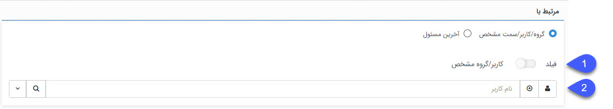

 
## پیش نیازهای نصب نرم افزار پیام گستر

**نکات مهم**

1.	جهت نصب مجدد از طریق Remote Desktop نیاز به آخرین نسخه از DVD نرم افزار می‌باشد. جهت دریافت DVD نرم افزار با داخلی 404 تماس حاصل فرمایید.

2.	خواهشمند است جهت تسریع در روند نصب، قبل از شروع نصب محتوای DVD روی حافظه سیستم قرار گیرد.

3.	مشخصات سیستم انتخابی در سرعت استفاده از نرم افزار موثر می‌باشد، در نتیجه بهتر است از سیستمی با حداقل مشخصات گفته شده و یا بالاتر استفاده نمایید.

4.	برای اتصال سیستم‌ها در شبکه از کابل استفاده شود، شبکه Wireless باعث کاهش سرعت و قطعی ارتباط می‌شود.

5.	برای نصب نرم افزار سیستم‌های فیزیکی نسبت به سیستم‌هایی که با استفاده از نرم افزارهای مجازی سازی ایجاد شده‌اند و منابع آن بین چند سرور مشترک می‌باشد، بستر مناسب‌تری هستند.
6.	در صورت نیاز به نصب آنتی ویروس بر روی سیستم نرم¬افزار، لطفا قبل از حضور کارشناس بر روی سیستم نصب گردد تا پس از نصب نرم افزار، تنظیمات مربوطه بر روی آنتی ویروس صورت گیرد.
7.	در صورت نصب آنتی ویروس پس از تحویل نرم افزار، حتما با داخلی 4 واحد پشتیبانی برای انجام تنظیمات در ارتباط باشید. 
8.	در صورت نصب مجدد نرم افزار و داشتن  Backup و Database قبلی از نرم افزار پیام گستر می‌بایست این مورد نیز قبل از حضور کارشناس بر روی هارد سیستم کپی شود. 
9.	در صورتی که از ماژول‌هایی مانند ارسال پیامک و ایمیل یا باشگاه مشتریان استفاده می‌شود، روی سروری که نرم افزار پیام گستر نصب می‌شود حتما سرور باید دسترسی به اینترنت داشته باشد.
10.	 نصب نرم افزار و Database تنها روی یک سرور امکان پذیر می‌باشد. در صورت تمایل به نصب نرم افزار و Database روی دو سرور قرارداد پشتیبانی می‌بایست به نوع Business  یا VIP ارتقا داده شود.

مشخصات سرور برای نسخه استاندارد پیام گستر

مشخصات سرور برای نسخه پیشرفته پیام گستر

سخت افزار	1 تا 10 کاربر	10 تا 20 کاربر	20 تا 50 کاربر	50 تا 100 کاربر
*پیشنهاد می‌شود جهت استفاده بهینه از سیستم از سیستم‌های سرور Base استفاده شود که قابلیت استفاده از هاردهای SAS  را دارند و برای موضوعFault Tolerance  از قابلیت Raid استفاده شود.
* بیش از 100 کاربر پیش از رزرو جلسه با داخلی 6 واحد امورمشتریان در ارتباط باشید.
مشخصات سرور نرم افزار

مشخصات ویندوز 
ویندوز پیشنهادي: Windows Server 2016 – Windows Server 2019   
نسخه‌ی ( Standard - Datacenter)
نکته : امکان نصب نرم افزار روي  Windows client (مانند  7و  8.1و  10) وجود ندارد. 
 فضاي لازم براي نرم افزار   GB100 است، دقت نمایید نصب نرم افزار تنها به  10GB فضا نیاز دارد و مابقی فضا برای پایگاه داده در نظر گرفته می‌شود.
 SQL قابل استفاده براي نصب نرم افزار  SQL Server 2019 می‌باشد که با توجه به اینکه پایگاه داده استفاده شده داراي  Instanceمربوط  به خود می‌باشد، می‌بایستی توسط کارشناسان نصب شود.
 ارتباط پایگاه داده با  SQLهاي 2017، 2016 نسخه (Enterprise) و نصب Instance مرتبط هم  امکان پذیر است.
 
پیش نیازهای نصب ماژول‌ها
ماژول‌های ارتباط با مراکز تماس
1.  سیستم‌های تلفنی سانترال (ماژول "ارتباط با مراکز سانترال")  
مشخصات دستگاه سانترال: دارای کارت Caller Id باشد و اتصال سانترال از طریق کابل RS232 به سیستم برقرار باشد. 
(در صورتیکه سیستم دارای پورت RS232 نمی‌باشد برای اتصال کابل سانترال از تبدیل  RS232 به USB استفاده شود.)
 سانترال kx1232  قابل پیاده سازی نمی‌باشد، برای سانترال مدل NS500 می‌بایست IP سانترال و رمز SMDR را داشته باشید. 
 تنظیمات سانترال باید به گونه‌ای باشد که پس از اتصال کابل RS232 به سیستم و تست با نرم افزار Hyper Terminal، Log تماس‌ها برای هر تماس ورودی دو Log و هر تماس خروجی یک Log را نمایش دهد.
 در صورتی که سانترال از نوع TDA یا TDE می‌باشد، برای تماس‌های ورودی علاوه بر دو Log مذکور Log RC هم باید نمایش داده شود.

2.  سیستم‌های تلفنی خطوط مستقیم (ماژول "ارتباط با دستگاه‌های  Caller Id")
در این نوع خطوط می‌بایستی از دستگاه Caller Id استفاده شود و در حال حاضر برند تجاری سگال برای ارتباط با پیام گستر مورد استفاده قرار می‌گیرد.  جهت خرید دستگاه  سگال (قبل از نصب نرم افزار)  با توجه به تعداد خطوط (8،4،2) با داخلی 1 واحد فروش پیام گستر تماس حاصل فرمایید.
 تمامی خطوط نیاز به اتصال به دستگاه  سگال دارند لذا نیاز به سیم کشی است که به عهده مشتری گرامی می‌باشد.

3.  سیستم‌های تلفنی VOIP – تلفن‌های تحت شبکه (ماژول "ارتباط با مراکز VOIP") 
	مشخصات هسته: هسته VOIP باید استریسک ((Asterisk باشد.
	در صورت استفاده از سیستم VOIP نیاز به سخت افزارهای دیگر نمی‌باشد.
	برای ارتباط نام کاربری و رمز عبور AMI  مورد نیاز می‌باشد.
	در حال حاضر تا نسخه  استریسک 11 ((Asterisk11 توسط پیام گستر پشتیبانی می‌شود.
	در صورتی که نسخه استریسک 13یا 16باشد و در Event های آن مشکلی نباشد قابل پشتیبانی می‌باشد.
	داخلی‌های تعریف شده در سیستم VOIP باید از نوع Sip باشد و حتما در خود VOIP تعریف شده باشد و از سیستم VOIP به دستگاه سانترال برای استفاده از داخلی‌های سانترال Trunk زده نشده باشد. در اینصورت توسط سرویس تلفنی قابل پشتیبانی نیست. 
	در حال حاضر یک سری از دستگاه‌های VOIP مانند Grandstream و Yeastar مدل U100 که استریسک ساپورت باشند هم پشتیبانی می‌شوند. در صورتی که VOIP روی مدل‌های دیگری از دستگاه‌های ذکر شده باشد قبل از خرید نیاز به هماهنگی واحد فروش با واحد فنی و اعلام زمان پیاده سازی امکان پشتیبانی می‌باشد. 
	امکان پشتیبانی از VOIP سیسکو (cucm) با راه اندازی TAPI و تنظیمات مربوطه می‌باشد، همینطور پشتیبانی از سیستم‌های VOIP که TAPI Support  می‌باشند وجود دارد در صورتیکه شرکت راه اندازی کننده VOIP امکان ارائهTAPI Driver   مرتبط را داشته باشد.

 
ماژول " ضبط مکالمات" در سیستم‌های سانترال 
با توجه به اینکه نرم افزار تلسا در حال حاضر در دو نسخه 6 و 8 ارائه می‌شود، برای استفاده از نسخه 6 حتما باید سیستمی که تلسا روی آن نصب می‌شود دارای ویندوز 7 ، 8.1 و 10 نسخه 32 بیتی باشد. (ویندوز سرور 2008 نسخه 32 بیتی ساپورت نمی‌شود.) همچنین برای نسخه 8 حتما باید ویندوز 64 بیتی روی سیستم نصب شده باشد.
قبل از نصب و ارتباط نرم افزار تلسا با پیام گستر با توجه به اینکه نسخه  8 نرم افزار تلسا دارای لایسنس می‌باشد جهت نصب و راه اندازی با شرکت تلسا هماهنگ شود.
لطفا توجه فرمایید تمامی خطوط، قبل از ورود به سانترال وارد دستگاه ضبط مکالمه خواهند شد. 
دستگاه تلسا به ازای هر دو خط یک ورودی دارد، لذا هر دو خط در یک سوکت قرار گیرد. همچنین ترتیب خطوط ورودی به تلسا اهمیت دارد (طبق شکل شماره1). 
در صورت نیاز به اطلاعات بیشتر لطفا با داخلی 4 واحد پشتیبانی تماس حاصل فرمایید. 
 
                 
شکل 1 نحوه اتصال 2 خط در یک سوکت 
 
	در نسخه جدید سیستم تلفنی امکان اینکه سیستم سانترال و سیستم تلسا در سیستم‌های مختلف نصب باشند وجود دارد.
	در صورتیکه نرم افزار تلسا بر روی سرور پیام گستر نصب می‌شود علاوه بر پیش نیاز سخت افزاری مورد نظر برای نرم افزار پیام گستر منابع مورد نیاز برای تلسا هم در نظر گرفته شود.
	راه اندازی تلسا به هیچ عنوان بر روی سیستم‌های مجازی توصیه نمی‌شود انجام نخواهد شد. 
	در صورت تمایل جهت خرید دستگاه تلسا می‌توانید، (قبل از نصب نرم افزار) با داخلی1 واحد فروش پیام گستر تماس حاصل فرمایید. 
ماژول "ضبط مکالمات" در سیستم‌های تلفنی VOIP
	این ماژول زمانی قابل تنظیم است که ضبط مکالمات روی VOIP فعال باشد. 
	برای ارتباط، نام کاربری و رمز عبور ROOT لینوکس که دسترسی به فایل‌های ضبط شده را دارد، مورد نیاز است. 

ماژول "فکس هوشمند" 
	فکس مودم Voice Support به تعداد مورد نیاز. 
	برای ارسال و دریافت فکس هر دو توسط قابلیت MS FAX ویندوز، یک فکس مودم و یک خط کفایت می‌کند. 
	ارسال در MS FAX ویندوز فقط روی ویندوزهای 7 و 2R 2008 امکان پذیر می‌باشد.
	با توجه به اینکه فکس مودم‌های جدید Caller Id را ساپورت نمی‌کنند جهت نمایش شماره‌های فکس دریافتی از MS FAX در نرم افزار پیام گستر، لازم است دستگاه Caller Id خطوط مستقیم (سگال) خریداری شود. لازم به ذکر است این ویژگی فقط از طریق خط مستقیم امکان پذیر می‌باشد.(در صورتی که خط به صورت داخلی از سانترال به فکس مودم وصل شده باشد این قابلیت وجود ندارد.)
	در صورت تمایل جهت خرید دستگاه  سگال  با داخلی 1 واحد فروش پیام گستر تماس حاصل فرمایید. 
	برای ارسال فکس با پیام پیشواز با ونتا و دریافت فکس توسط پیام گستر با استفاده از (MS  فکس ویندوز) لازم است دو عدد فکس مودم و دو خط به عنوان پیش نیاز آماده شود. 
	در ویندوز  سرور 2008 امکان استفاده از چند فکس مودم برای ارسال و دریافت از طریق MS  فکس امکان پذیر است، در ویندوزهای غیر سرور تنها یک فکس مودم توسط سیستم شناسایی می‌شود. 
	در صورت تمایل جهت خرید فکس مودم می‌توانید، (قبل از نصب نرم افزار) با داخلی 1 واحد فروش پیام گستر تماس حاصل فرمایید. 
 
ماژول "یکپارچگی با سیستم‌های مالی"   
	برای لینک با نرم افزارهای سپیدار باید .Net Framework 4.5.1  را بر روی سرور نرم افزار نصب نمایید. 
	جهت ارتباط نرم افزار با سپیدار حتما باید نسخه سپیدار 6.8.4 به بالا باشد.  
	در صورتی که نسخه سپیدار نرم افزار پایین‌تر از 6.8.4 بود می‌بایست به نسخه‌های بالاتر ارتقا یابد. 
	برای ارتباط با نرم افزارهای پیوست، تدبیر، همکاران و راهکاران حتما نسخه نرم افزار مالی برای یک سال اخیر و SQL  نرم افزار مالی حتما 2008 به بالاتر باشد.
	جهت ارتباط با سیستم‌های مالی نیاز به دسترسی به پایگاه داده سیستم‌های مالی و نام کاربری و رمز عبور مرتبط با آن پایگاه داده می‌باشد. 
	با توجه به Attach شدن پایگاه داده همگام ساز در سرور مالی، در صورت تعویض ویندوز یا هرگونه تغییر در سیستم مالی، نیاز به خریداری جلسه همگام ساز از طریق باشگاه مشتریان می‌باشد.
 
ماژول "پیام کوتاه هوشمند" 
توجه داشته باشید جهت استفاده از ماژول پیام کوتاه هوشمند حتما سرور نرم افزار پیام گستر به اینترنت باید دسترسی داشته باشد. 
پیامک را می توان از طریق 4 روش در پیام گستر ارسال نمود:  
1.	 تجارت اول 
ثبت نام در سایت www.1st.ir که کاملا رایگان می‌باشد، پس از ثبت نام می‌توانید با شماره 02145853 داخلی 701 تماس بگیرید و خط پیامک اختصاصی مورد نظر خود را خریداری نمایید و پس از ارسال مدارک مربوط به خط و فعال سازی، ارسال پیامک انجام دهید. 
2.	URL
جهت ارسال پیامک از سایر اپراتورها از اپراتور مربوطه یک URL ارسال که به شکل Query String باشد دریافت شود. مطابق آدرس زیر: 
server address/post/sendSMS.ashx? .…=username=…...&password=…..&form=….&to=….&text یا http:// IP 

Provider ارسال کننده Url، برای ارسال پارامترها می‌بایست از متد Get استفاده نماید. همچنین می‌بایستی فرمت نوشتاری (  8UTFبرای ارسال فارسی) پشتیبانی نماید.
برای تست آدرس Url، آدرس Url را در Browser وارد می‌کنیم و با زدن دکمه Enter، ارسال را انجام می‌دهیم،
در صورت دریافت پیامک، Url صحیح است. 
حتما برای ارسال Url باید شماره موبایل را بدون گذاشتن 98 در ابتدای آن ارسال کرد. 
 
3.	ارسال از طریق خطوط 3000 
در صورتی که دارای خط به صورت خدمات وب سرویس از اپراتور 3000 هستید، می‌توانید در پیام گستر تنظیم نمایید. 
4.	GSM مودم‌ها 
ارتباط نرم افزار پیام گستر با GSM مودم جهت ارسال پیام، با یکی از سه برند ذیل امکان پذیر می باشد.
برندهایی که برای خرید توصیه می‌شوند: 
	T-mobile       Dlink    	        Data net
با توجه به اینکه GSM مودم روی سرورهای مجازی شناسایی نمی‌شود حتما باید روی سرور پیام گستر به صورت فیزیکی باشد. 
مودم می‌بایست به صورت DONGLE و مطابق شکل زیر باشد: 

  

اتصال ایمیل  به نرم افزار پیام گستر  (قابلیت صندوق پست الکترونیکی)  
جهت تنظیم ایمیل شرکت در پیام گستر می‌بایست قبل از آن ایمیل مربوطه باید در Outlook تنظیم و قابلیت ارسال و دریافت داشته باشد و این تنظیمات در Outlook تحویل کارشناس شده تا بتواند این تنظیمات را بر روی پیام گستر انجام دهد. در حال حاضر دریافت ایمیل با دو پروتکل IMAP و POP3 پشتیبانی می‌شود.
جهت استفاده از ماژول ایمیل حتما باید سرور پیام گستر دارای اینترنت باشد.

تنظیم IP Static (اختیاری)  
برای قابلیت دسترسی به نرم افزار از خارج از محل شرکت با IP، تنها به IP Static و Port Forwarding نیاز داریم. 
در صورت تمایل:  برای قابلیت دسترسی به نرم افزار از خارج از محل شرکت با نام (مانند:  (crm.yoursite.comبه موارد زیر نیاز می‎‌باشد.
1.	IP Static  
2.	انجام  IP Forwarding
3.	تنظیم رکورد A در DNS سرور Domain مربوطه (این تنظیمات باید در Control Panel Host یا توسط شرکت ارائه دهنده خدمات Host و Domain  مربوطه انجام شود.)
4.	تمام موارد باید منجر به این شود که اگر با نام ست شده از بیرون Ping کنیم، IP Static را برگرداند. 

تاییدیه آگاهی از پیش نیازهای نصب
 
 
اینجانب با آگاهی از پیش نیازهای نصب نرم افزار پیام گستر، آمادگی شرکت  خود را جهت نصب و راه اندازی نرم افزار پیام گستر اعلام می‌دارم.
خواهشمند است توجه داشته باشید در صورت آماده نبودن هر کدام از پیش نیازها در روز نصب، نصب مجدد نرم افزار و یا ماژول‌های خریداری شده، مشمول دریافت هزینه نصب مجدد مطابق تعرفه اعلام شده در سایت خواهد بود.  
 
