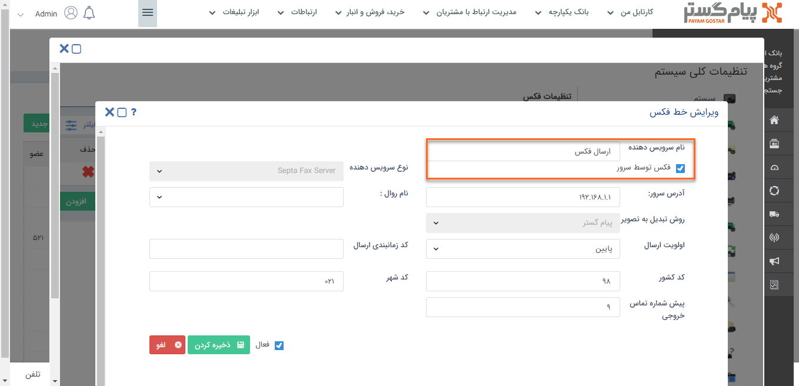
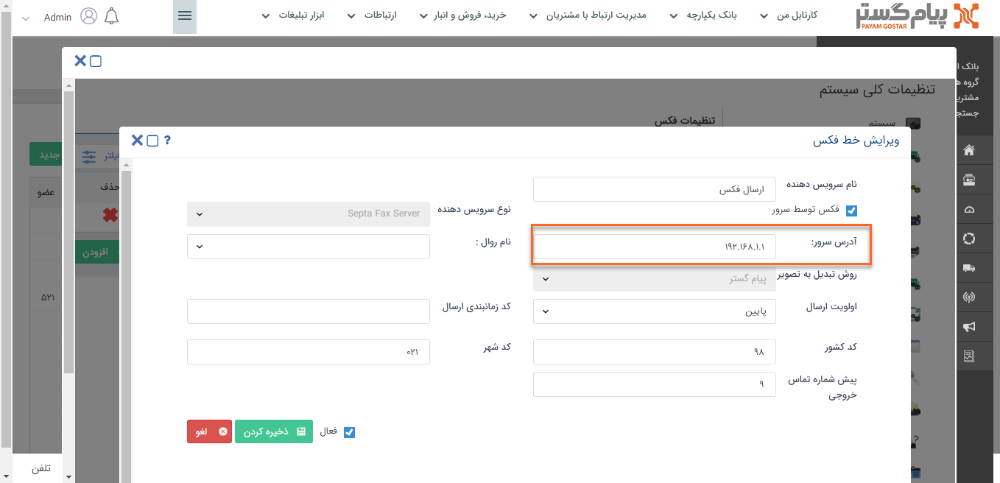
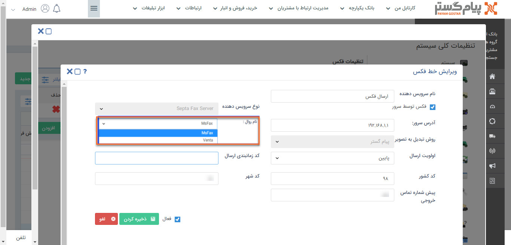
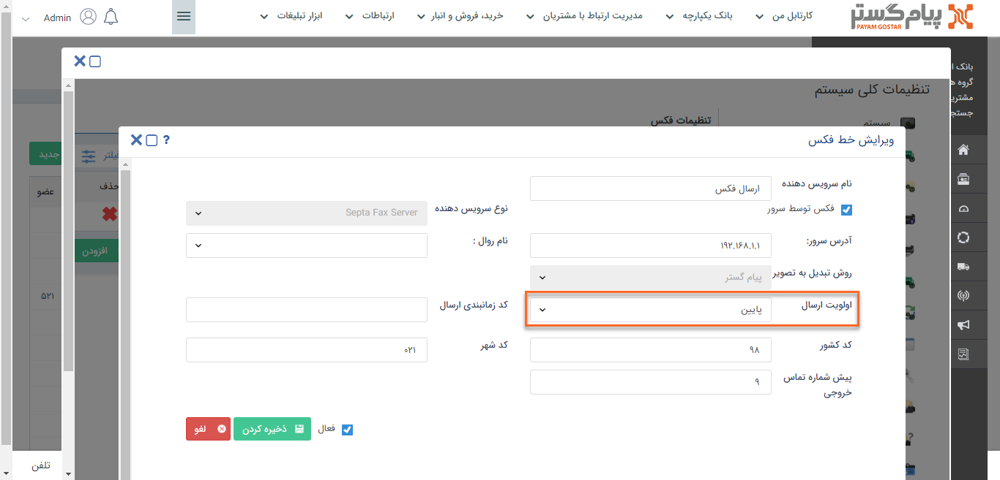
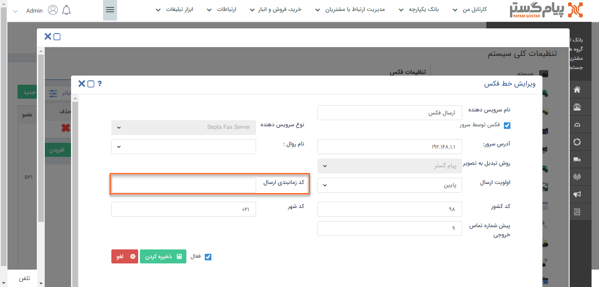
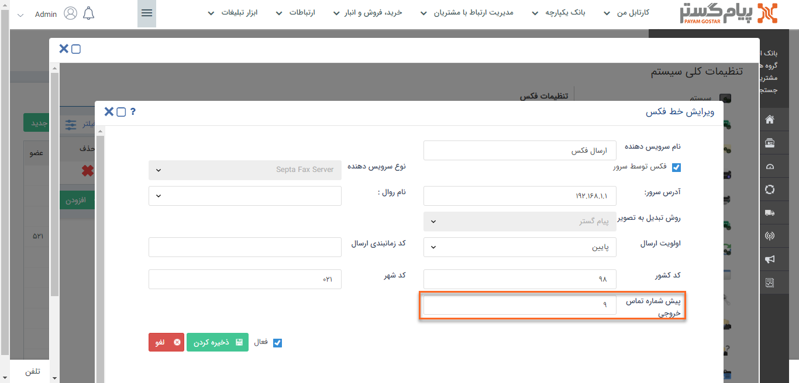
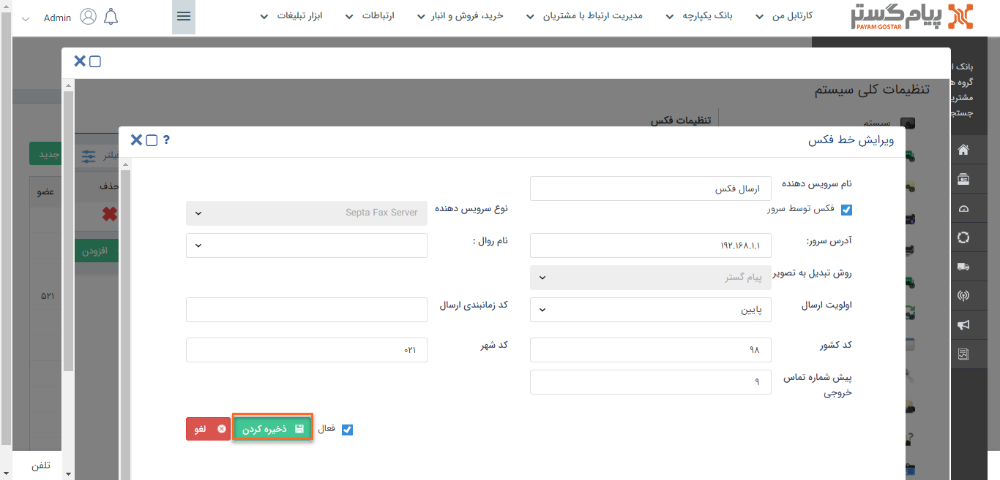

 # نحوه تنظیم خطوط فکس

برای ارسال فکس می‌توانید از سرویس دهنده‌های مختلفی استفاده کنید.

1)  از بخش **تنظیمات کلی**، **فکس** را انتخاب کنید.

2)   بر روی **افزودن** کلیک کنید.

3)  **نام دلخواهی** برای فکس خود تعریف کنید و برای ارسال فکس از طریق فکس سرور چک‌باکس **فکس توسط سرور** را فعال کنید.

4)   آدرس سرور فکس و یا IP آن را در این بخش بصورت faxserver و یا 127.0.0.1 وارد کنید.

5)   در این قسمت درصورت استفاده از فکس ویندوز **روال** **msfax** و درصورت استفاده از ونتا، **روال** **venta** را انتحاب کنید. 

6)   **اولویت ارسال** این خط را مشخص کنید.

7)   یکی از ویژگی های سیستم septaventafax تنظیم **زمابندی ارسال** است که با تعریف و انتخاب کد زمانبندی می توانید مشخص کنید که فکس های شما درهر یک از روز های هفته در چه بازه زمانی ارسال شود.

8)  در صورتی که برای ارسال فکس از خط مستقیم استفاده نمی‌‎کنید باید پیش شماره ای که برای دسترسی به خط آزاد شماره گیری ‌می‌شود را در این بخش وارد کنید.

9)  برای عدم استفاده از این آدرس ایمیل می‌توانید آن را **غیرفعال** کنید.

10)  در انتها بر روی **ذخیره کردن** کلیک کنید.

