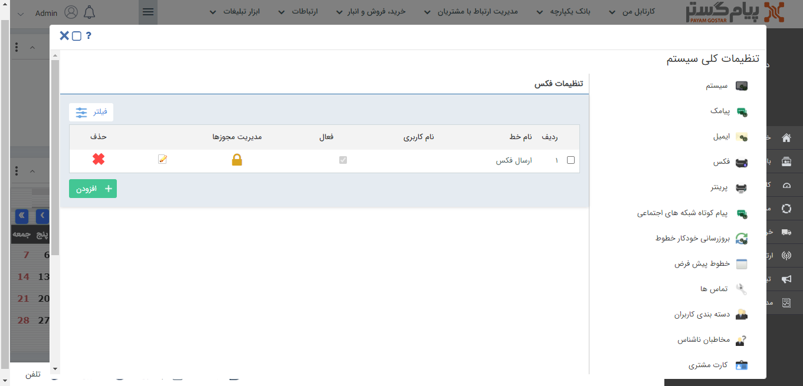

# تنظیمات خطوط فکس 

کاربران دارای دسترسی : **مدیرسیستم**/کاربر با **مجوز مدیریت تنظیمات**(برای مطالعه بیشتر به بخش [تعیین مجوزها](https://github.com/1stco/PayamGostarDocs/blob/master/help2.5.4%20new/Getting-Started/Manage%20groups%20and%20users/Determine%20the%20level%20of%20access.md) مراجعه کنید.)

1)  در منوی **تنظیمات** بخش **تنظیمات‌کلی، فکس** را انتخاب کنید**.**

2)  در لیست فکس‌ها امکان **ویرایش** و **حذف آن‌ها** و یا **تعیین مجوزهای** کاربران بر روی آن‌ها وجود دارد.

3)  برای تعیین **مجوز** با کلیک بر روی **مدیریت مجوزها،** می‌توانید کاربر موردنظر و **سطح دسترسی** او را مشخص کنید.

**نکته:** در صورت عدم تعیین مجوز، آن خط بصورت عمومی لحاظ می‌گردد و همه کاربران به آن دسترسی دارند.

