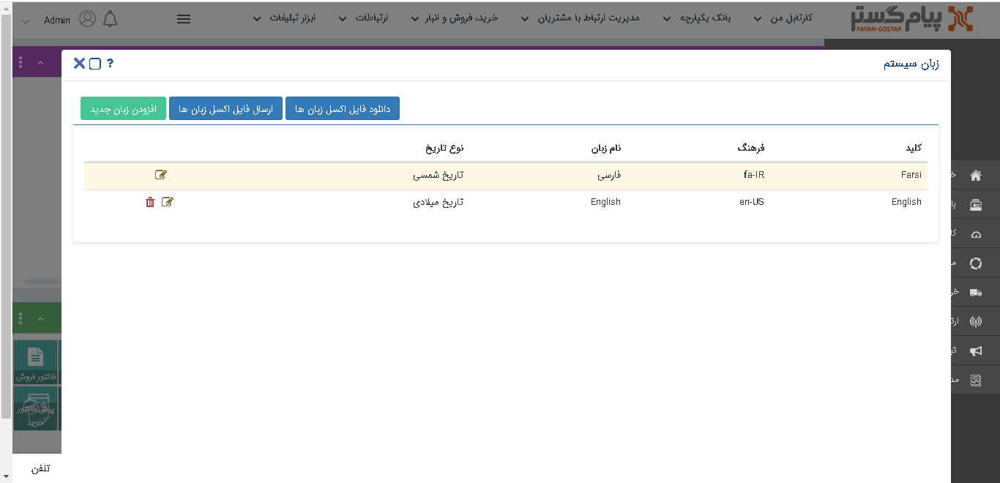
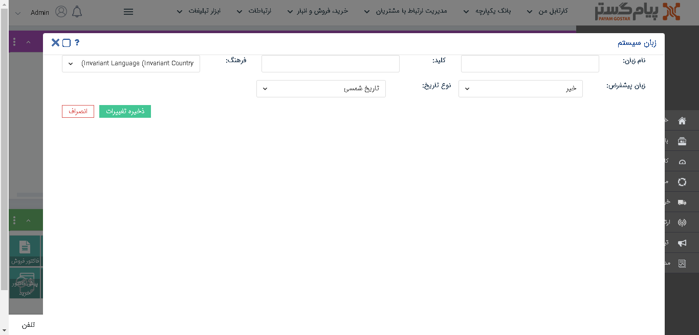

# تعریف زبان جدید

کاربران دارای دسترسی: **مدیر سیستم**

1) از منوی **اطلاعات پابه**، بخش **مدیریت زبان‌ها**، **زبان سیستم** را انتخاب کنید

2)  بر روی **افزودن زبان جدید** کلیک کنید.

3)  **نام زبان**، یک **کلید** دلخواه، **فرهنگ** و **نوع تاریخ** متناظر با این زبان را مشخص کرده و تغییرات را ذخیره نمایید.

4)  همچنین می‌توانید این زبان را به عنوان **زبان پیش‌فرض** نرم ‌افزار انتخاب کنید. (کاربران می توانند در قسمت **تنظیمات من** زبان نرم افزار را برای کاربری خود تغییر دهند.)

5)   با کلیک بر روی **دانلود فایل اکسل زبان ها**، فایل اکسلی حاوی معادل عبارت های موجود در نرم افزار، برای هریک از زبان هایی که تعریف کردید، دانلود خواهد شد. به ازای هر عبارت یک کلید در ستون اول فایل اکسل وجود دارد. علاوه بر این به ازای هر زبان تعریف شده در سیستم، یک ستون اضافی در فایل اکسل وجود دارد که باید معادل آن عبارت، در آن زبان را  وارد کنید.

**نکته:** توجه داشته باشید اگر هریک از مقادیر در ستون زبان مورد نظر خالی باشد، درصورت استفاده از آن زبان، مقدار کلید متناظر با آن عبارت نمایش داده خواهد شد.

6)   با **ارسال فایل اکسل زبان ها** می توانید معادل هریک از عبارت ها که در فایل اکسل تعریف کرده‌اید را در نرم افزار بارگذاری کنید. همچنین می توانید با ویرایش هریک از عبارت های موجود در فایل اکسل، نام فیلدها و سایر موارد پیش‌فرض موجود در نرم افزار را ویرایش نمایید. در واقع این فایل اکسل، لغتنامه تمامی زبان های تعریف شده در سیستم می باشد