

# پیش نیاز ها جهت نصب نرم افزار پیام گستر

## مشخصات سخت افزاری جهت نصب نرم افزار استاندارد 
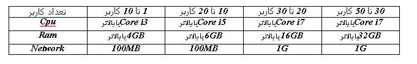

## مشخصات سخت افزاری جهت نصب نرم افزار سازمانی

>نکته سازمانی: پیشنهاد می شود جهت استفاده بهینه در صورت امکان از سیستم های سرور Base استفاده شود که قابلیت استفاده از هاردهای SAS را دارند.

>همینطور برای جلوگیری از FAULT TOLERANCE از قابلیت Raid استفاده شود.

## ملاحضات سرور

1-	نصب نرم افزار پیام گستر برروی ویندوزها‌‌ی سروری انجام می شود.

2-	بهتر است سیستم عامل سرور پیام گستر،ویندوز سرور  2008R2  نسخه 64 بیت و ویندوز سرور  2012 (به جز نسخه web) باشد.

•	در صورت نصب ویندوز سرور 2012 R2 نصب .NET3.5 الزامی می باشد.

•	ویرایش استاندارد و WEB ویندوز SERVER 2008 R2 قابل قبول نمی باشد.(باید قابلیت نصب .NET4.7.2 را داشته باشد.) 

3-	استفاده از ویندوز سرور 2016 هم جهت نصب نرم افزار بلامانع است. فقط در صورتیکه از همین ویندوز جهت سرور فکس هم استفاده می شود به علت عدم پشتیبانی داریور بعضی از فکس مودم ها ، سرور فکس باید جداگانه باشد.

4-	پیشنهاد می شود جهت استفاده بهینه از سیستم، از هاردهای SSD با ظرفیت بالا استفاده شود

5-	ارتباط پایگاه داده با SQL های (2012  ، 2014 و 2016 ) نسخه ( Enterpriseو نصب instance)مرتبط هم امکان پذیر است.

6-	فضای لازم برای نرم افزار 100 GB می باشد.(دقت نمایید نصب نرم افزار تنها به 10 گیگ فضا نیاز دارد و باقی فضا برای دیتا بیس در نظر گرفته میشود.)

7-	برای نصب نرم افزار، سیستم عامل های اصلی نسبت به سیستم عامل های مجازی،بستر مناسب تری هستند.

8-	از اتصال شبکه wire بین سیستم ها استفاده شود.شبکه wireless  باعث کاهش سرعت و قطعی ارتباط می شود.

9-	در صورت نیاز به نصب آنتی ویروس بر روی سیستم نرم افزار، کلیه پوشه ها و سرویس ها پیام گستر می بایست Exclude  شوند.

10-	جهت حفظ امنیت اطلاعات، بهتر است برای تهیه نسخه پشتیبان(backup)، درایو دیگری به جز درایو نصب نصب ویندوز در نظر گرفته شود و ویندوز نصب شده حداقل دارای دو درایو باشد.

# نصب و راه اندازی نرم افزار پیام گستر

قبل از نصب و راه اندازی نرم افزار پیام گستر باید نکاتی مورد بررسی و توجه قرار بگیرد:

1-	با کاربری که دسترسی administrator  دارد، وارد سیستم شوید. 

2-	IPسرور پیام گستر باید بصورت Static، Set شود و هرگز نباید IP سرور بصورت automatically قرار داده شود.

3-	فرمت مربوط به نمایش تاریخ و ساعت سیستم (Region)، باید بر روی English (United State) تنظیم شود.

4-	تنظیم ساعت و تاریخ سیستم برای فعال سازی نرم افزار پیام گستر بسیار مهم می باشد.

5-	در صورت نصب ماژول ها (فکس، چاپ، تلفنی) در سیستمی دیگر، باز کردن پورت 80 روی سرور پیام گستر الزامی است.

6-	برای نصب sql server(پایگاه داده) نام user account و نام کامپیوتر نباید یکسان باشد.

7-	فضای خالی روی درایو C ، حتی اگر نرم افزار بر روی درایو دیگر نصب شود حداقل 2GB باشد.

8-	ﺑﺮاي ﻧﺼﺐ Sql Server در وﯾﻨﺪوز ﺳﺮور ﭘﯿﺸﻨﻬﺎد ﻣﯿﺸﻮد ﮐﻪ وﯾﻨﺪوز ﺳﺮور داﻣﯿﻦ ﮐﻨﺘﺮﻟﺮ ﻧﺒﺎﺷﺪ.

9-	ﻣﺎژول Net Framework 4.7.2و  Net Framework 4 و Net Framework 3.5 ﻧﯿﺎز ﺑﻪ .ﻣﯽ ﺑﺎﺷﺪIIS-Rewrite2.0
پیشنهاد: به هیچ عنوان Firewall ویندوز را Disable نکنید.

پیشنهاد: به لحاظ امنیتی پیشنها نمی شود که UAC به سمت Never Notify کشیده شود.

نکته مهم: اگر بر روی سیستم آنتی ویروس نصب است، ابتدا باید آن را تا پایان نصب Disable کنید. البته برای این موضوع نگرانی وجود ندارد. می توانید بعد از نصب، سرویس های مربوط به نرم افزار را که آنتی ویروس آنها را به عنوان Malware تشخیص می دهد، Exclude کرده و بعد Enable کنید.

تشخیص سرویس های پیام گستر به عنوان Malware یا Virus توسط آنتی ویروس دلایلی دارد که در جایی دیگر تشریح می شود.

در ادامه لازم است که Source  نرم افزار (CD 1 و CD 2) بر روی یکی از پارتیشن های سیستم کپی شود.

>نکته: نصب .Net Framework 3.5 Features و انتخاب ماژول HTTP Activation در .NET Framework 3.5 Features و .NET Framework 4.7.2 Features قبل از فرایند نصب نرم افزار پیامگستر الزامی است.(در رابطه با نصب .net framework در ادامه توضیح داده خواهد شد.)

راه اندازی پیام گستر :

ابتدا وارد فولدر "1" (که نشان دهنده تعداد دیسک های مربوط به نرم افزار می شود) شده و روی گزینه PayamGostarSetup x64/x86 (انتخاب این گزینه بر مبانی معماری سیستم عامل است که می تواند 32 bit یا 64 bit باشد) راست کلیک کرده و گزینه Run as administrator را انتخاب می کنید.

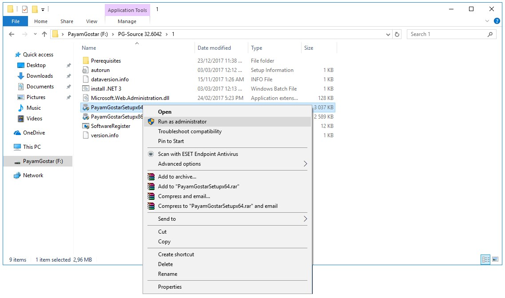

بعد از انتخاب گزینه Run as administrator صفحه اولیه مربوط به نصب نرم افزار نمایش داده می شود.

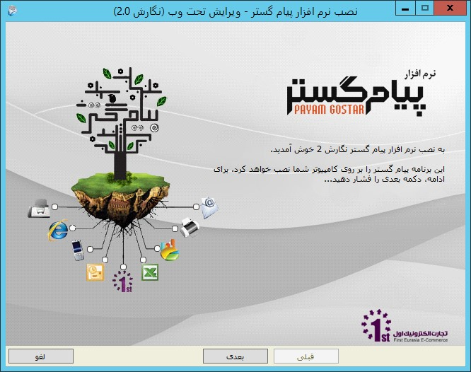

روی گزینه "بعدی" کلیک کنید تا وارد مرحله بعد یا مرحله نصب (Installation) شوید.

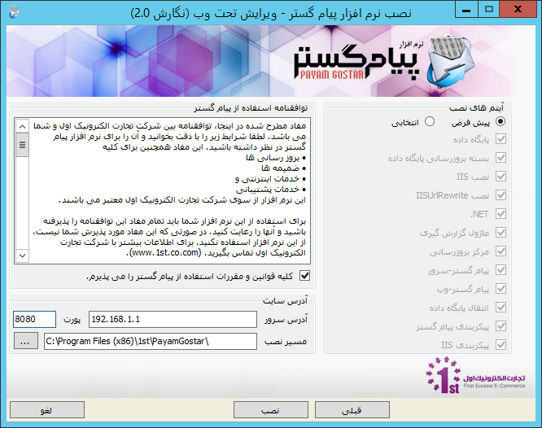

# نصب بصورت پیش فرض(اتوماتیک)

در این مرحله باید به موارد زیر توجه کنید:
IP سیستم به صورت اتوماتیک Find می شود که در نتیجه این IP به عنوان آدرس دسترسی به نرم افزار پیام گستر Set می شود. اما نیاز است که قبل از نصب نرم افزار حتما از IP درست اطمینان حاصل فرمایید یا اگر نیاز به تغییر IP دارید قبل از کلیک کردن بر روی گزینه نصب آنرا تغییر دهید.
فیلدی که تحت عنوان پورت بصورت پیش فرض عدد 8080، تنظیم شده است مربوط به Port Listening سرویس وب پیام گستر در سرویس IIS می باشد.
نکته :  بعد از نصب IIS بصورت پیش فرض روی این سرویس یک سایت تحت عنوان Default Web Site وجود دارد که روی پورت 80، Bind شده است. اگر نرم افزار پیامگستر هم روی پورت 80، تنظیم شود، نمی تواند سرویس بدهد (سایت مربوط به پیامگستر Stop می شود)، چرا که امکان سرویس دادن دو سایت بصورت همزمان روی یک IP و روی یک Port وجود ندارد. به همین دلیل بصورت پیش فرض روی پورت 8080، Bind می شود.
اگر مایل به دادن سرویس پیام گستر روی پورت 80 هستید، Default Web Sit را در IIS، Remove یا Stop کنید تا نرم افزار قادر به سرویس دادن روی پورت 80 باشد.

در ادامه ی نصب، بعد از زدن تیک Agreement (کلیه قوانین و مقررات استفاده از پیام گستر را می پذیریم) می توانید بر روی گزینه نصب کلیک کنید تا فرآیند نصب آغاز شود.

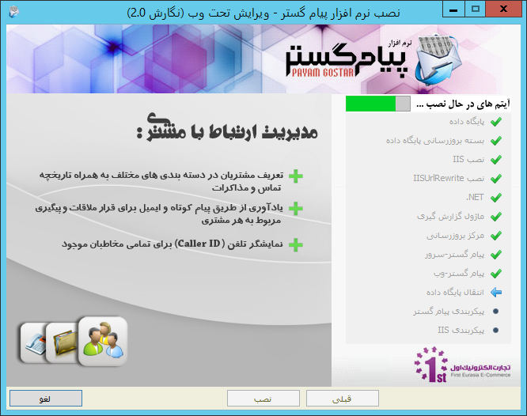

با نصب هر قسمت یک تیک سبز رنگ (مانند تصویر بالا) در کنار نام نرم افزار نصب شده زده می شود که نشان دهنده نصب موفق آن است.
در قسمت "انتقال پایگاه داده" با پیغام زیر مواجه می شوید.

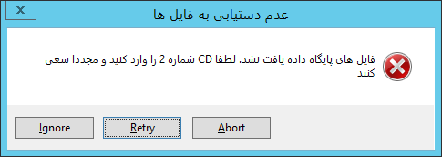

باانتخاب گزینه Retry و بعد Yes، روی فولدر Database همانند شکل زیر کلیک کرده و بعد گزینه OK را کلیک کنید.

>یادآوری: لازم است که Source  نرم افزار (CD 1 و CD 2) بر روی یکی از پارتیشن های سیستم کپی شود.

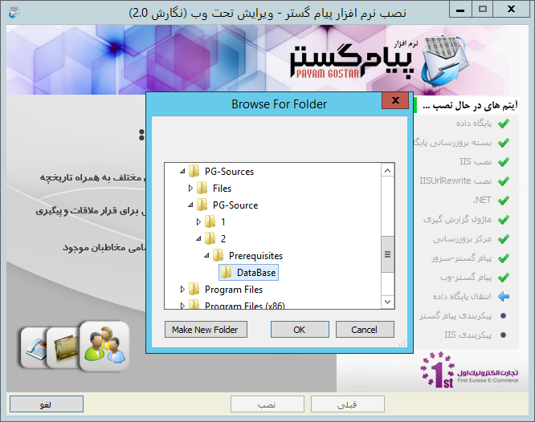

با انتقال پایگاه داده در محل مورد نظر (Drive ?:\Program Files (x86)\1st\PayamGostar\Server v2.0) با پیغام "انتقال پایان یافت. لطفا CD شماره 1 را وارد نمایید" مواجه می شوید که با کلیک بر روی گزینه OK فرایند نصب ادامه می یابد.
در پایان تصویر زیر نمایش داده می شود که نشان دهنده نصب موفق نرم افزار پیامگستر می باشد.

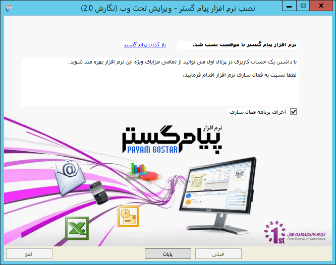

با کلیک بر روی گزینه پایان، طبق تصویر وارد مرحله فعال سازی محصول می شوبد. 

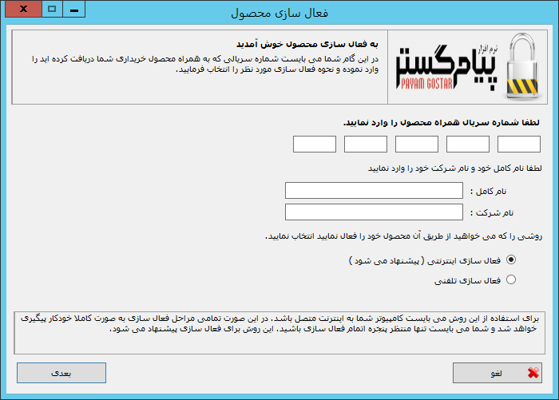

> نکته: جهت فعال سازی نرم افزار به سریال محصول و دسترسی به اینترنت نیازمندید.

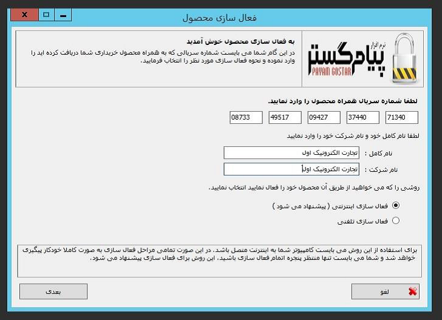

شماره سریال را از روی cd  وارد نموده و از طریق اینترنتی فعال نمایید.در صورت این که اینترنت قطع می باشد نوع فعالسازی را به تلفنی تغییر دهید، کد درخواست داده شده توسط نرم افزار را تلفنی به شرکت اعلام نموده تا کد فعالسازی برای شما صادر شود.

اگر نرم افزار با موفقیت فعال شود پیغامی مبنی بر "محصول شما با موفقیت فعال شد." دریافت خواهید کرد.

# تکمیل فرایند نصب و راه اندازی و ارتباط با نرم افزار پیام گستر

پس از اتمام مراحل نصب، آیکونی تحت عنوان Payamgostar 2.0 Agent Configuration در Desktop ایجاد می شود که با باز کردن آن، وارد قست Services شوید.

در این قسمت سرویس های نرم افزار را مشاهده می کنید که دو سرویس آن تحت عنوان PayamGostar 2.0 Agent  و PayamGostar 2.0 Host، بصورت Disable می باشند که با راست کلیک کردن روی آنها و انتخاب Start Service می توانید آنها را Start کنید (که بصورت یک تیک سبز رنگ نمایش داده می شود). 
حال می توانید با استفاده از مرورگر Firefox یا Chrome و با زدن IP مربوطه (IP سرور پیام گستر که در ابتدای نصب مشخص شد) در بخش URL به نرم افزار متصل شده و با نام کاربری Admin و پسورد admin روی نرم افزار Login و یا ورود کنید.

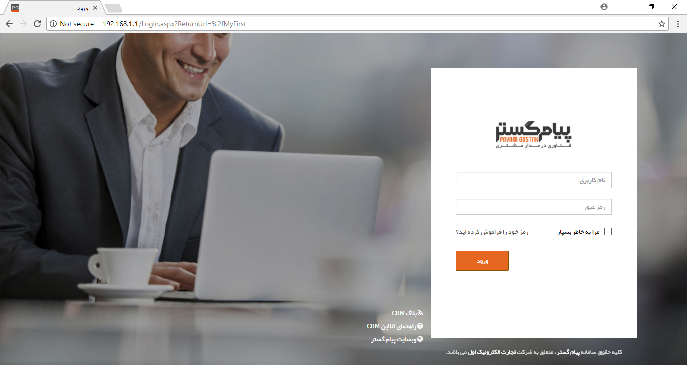

# نصب و راه اندازی نرم افزار پیام گستر بصورت دستی

## نصب و راه اندازی SQL Server 2008 R2

برای نصب و راه اندازی SQL Server 2008 R2 ابتدا وارد مسیر زیر شوید:
This PC > Local Disk (?) > 1 > Prerequisites > SQL Server > 2008 R2
بر روی آیکون Setup کلیک راست کرده و گزینه Run as administrator را انتخاب کنید.

>نکته: قبل از  نصب   SQL Server 2008 R2 بایستی .net3.5 نصب گردد.
در صفحه SQL Server Installation Center ابتدا بر روی گزینه Installation (شماره 1) و بعد گزینه New installation or add features to an existing  installation. (شماره 2) را انتخاب کنید.

در صفحه بعد بر روی دکمه OK کلیک کنید.
نکته: در هر صفحه Setup Support Rules به عملیات یا عملکردی که انجام می شود (Operation completed) دقت کنید.
در صفحه بعد بر روی دکمه OK کلیک کنید.

>نکته: در هر صفحه Setup Support Rules به عملیات یا عملکردی که انجام می شود (Operation completed) دقت کنید.

در این بخش مشکلاتی که ممکن است در هنگام نصب SQL Server رخ دهد شناسایی می شود
به عنوان مثال در تصویر زیر هفت عملیات با موفقیت انجام شده است (Passed:7). هیچ عملکرد ناموفق (Failed) و هشداری (Warning) رخ نداده است. و هیچ پرشی (Skipped) انجام نشده است.
لازم به ذکر است که اگر عمیلات یا عملکرد ناموفقی شناسایی شود می توانید آنرا از قسمت Show detail مشاهده کرده و نسبت به برطرف کردن آن اقدام کنید.

>نکته و توجه مهم: تا زمانی که مشکل را برطرف نکرده اید ادامه نصب را انجام ندهید چرا که در روند نصب دچار مشکل می شوید.

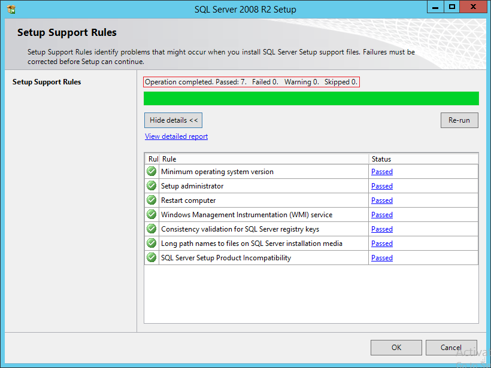

درصفحه Setup support files بر روی گزینه Install کلیک کنید.

صفحه بعدی که مشاهده می کنید، صفحه Setup Support Files می باشد. در خصوص این صفحه قبلا توضیحات لازم داده شده است.
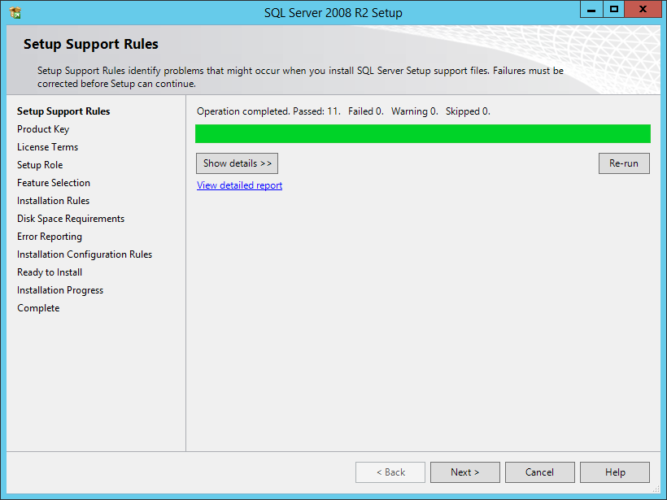

در صفحه Product Key گزینه Enter the product key انتخاب شده است. بر روی گزینه Next کلیک کنید.

در قسمت License Terms، تیک I accept the license terms را انتخاب و در ادامه گزینه Next را بزنید.

در صفحه Setup Role گزینه SQL Server Feature Installation بصورت پیش فرض انتخاب شده است و تنها کافی است که بر روی گزینه Next کلیک کنید.

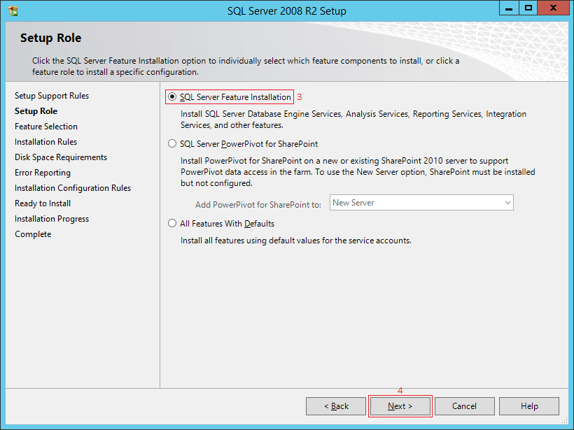

در صفحه Feature Selection (انتخاب ویژگی ها)، تنها انتخاب Database Engine Service (شماره 4) و Full-Text Search (شماره 5) در قسمت Instance Features مورد نیاز است. انتخاب گزینه های دیگر تنها باعث سنگین شدن سیستم و ایجاد Process بیشتر بر روی سیستم می شود. لذا انتخاب دیگر Feature ها برای نرم افزار پیام گستر مورد نیاز نمی باشد.

با کلیک بر روی گزینه Next وارد صفحه Installation Rules شوید.

>نکته: دقت در خصوص Operation complete در این صفحه ضروری می باشد و در هنگام برخورد با مشکل ملزم به برطرف کردن آن هستید.

بر روی گزینه Next کلیک کرده و وارد صفحه یا مرحله بعد شوید.

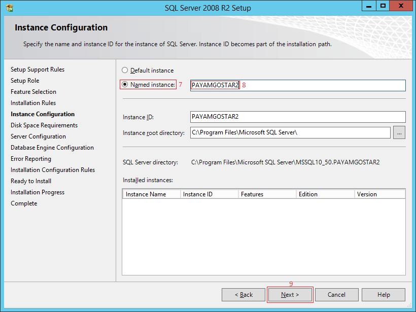

در صفحه Instance Configuration برای ایجاد یک Instance جدید ابتدا بر روی گزینه Named instance (شماره 7) کلیک کرده و نام Instance (شماره 8) را به نام PAYAMGOSTAR2 نوشته و در ادامه بر روی گزینه Next کلیک کنید.

در صفحه Disk Space Requirements مقدار فضای مورد نیاز جهت نصب بررسی شده و در صورت عدم مشکل یک تیک سبز رنگ مشاهده می شود که گویای فضای کافی برای نصب SQL می باشد.

توجه داشته باشید که در صورت عدم فضای کافی برای نصب، باید این نیاز (فضای لازم جهت نصب) محیا و بعد اقدام به نصب کنید.

بر روی گزینه Next کلیک کنید تا وارد صفحه بعد (Server Configuration) شوید.

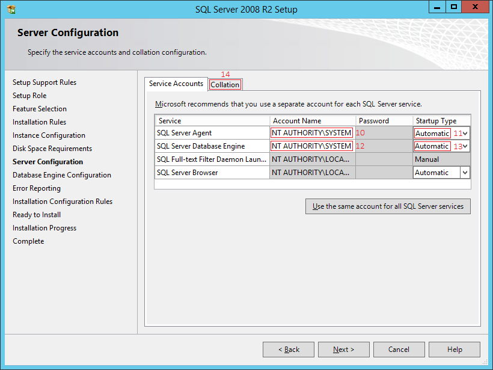

در صفحه Server Configuration تنظمات مربوط به Service Accounts و Collation انجام می شود.

در سربرگ Service Accounts، سرویس SQL Server Agent (شماره 10) و سرویس SQL Server Database Engine (شماره12)، Startup Type هر دو سرویس باید بر روی Automatic (شماره 11 و 13) قرار داده شود.

توجه کنید که این تنظیم جهت Start کردن اتوماتیک این دو سرویس می باشد. این کار به ما کمک می کند که اگر سیستم Reboot (Restart or Power on) شد این دو سرویس بصورت اتوماتیک Start شود.

تنظیم و اعمال تغییر در سربرگ Collation فراموش نشود.

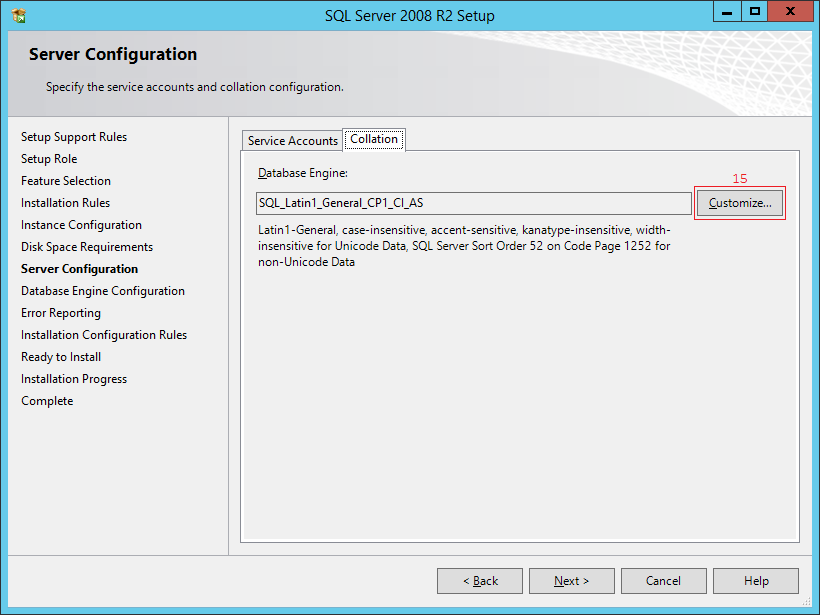

با کلیک بر روی گزینه Customize (شماره 15) پنجره Customize the SQL Server 2008 R2 Database Engine Collation را مشاهده می کنید.

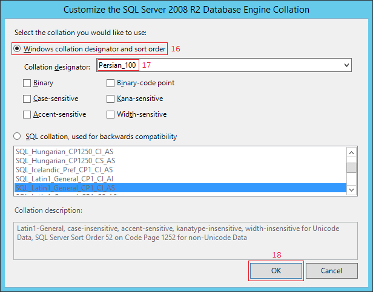

در ادامه با کلیک بر روی گزینه Windows collation designator and sort order (شماره 16) امکان انتخاب Persian_100 (شماره 17) در لیست Collation designator فراهم می شود.

بعد از انتخاب گزینه مربوطه حال می توانید بر روی گزینه OK کلیک کرده و در ادامه بر روی Next کلیک کنید.
در مرحله بعد وارد صفحه زیر می شوید.

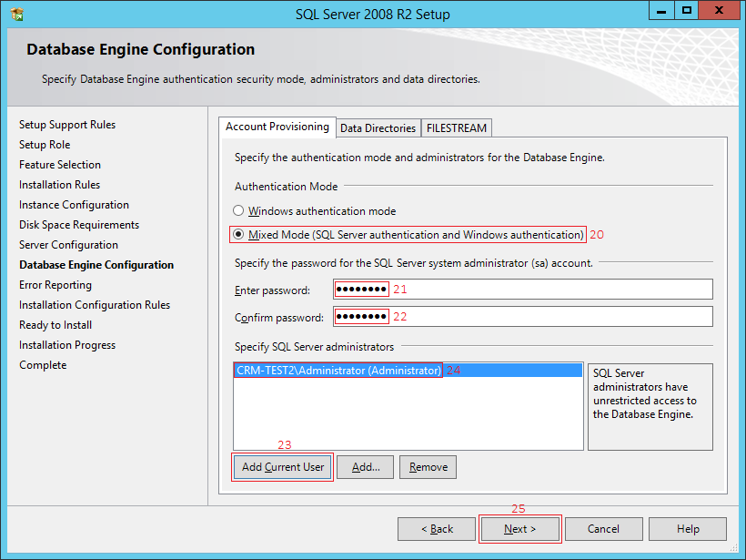

در این مرحله (Database Engine Configuration)، Authentication Mode و Server Administrator مشخص می شود.

در Authentication Mode با انتخاب گزینه Mixed Mode (شماره 20) امکان ست کردن پسورد ایجاد می شود.

>نکته: پسوردی که برای Instance مربوطه ست می شود، aA123456 (شماره 21 و 22) می باشد. این پسورد به اجبار باید ست شود که در این خصوص در جایی دیگر توضیح داده می شود.
با کلیک بر روی گزینه Add Current User (شماره 23) پارامتری (به عنوان مثال: CRM-TEST2\Administrator که با یک \ به دو قسمت تقسیم می شود) (شماره 24) در قسمت Specify SQL Server administrators ایجاد می شود.

در این پارامتر، قسمت اول (CRM-TEST2) نشانگر Computer Name و قسمت دوم نشانگر Current User (کاربری که در حال حاضر روی سیستم Login می باشد) می باشد.

>نکته: Current User با Computer Name نباید هم نام باشد. چرا که هم نام بودن این دو مولفه، ادامه نصب مقدور نمی باشد.

در آخر بر روی دکمه Next (شماره 25) کلیک کنید تا وارد مرحله یا صفحه بعد شوید.

مرحله بعد مربوط به Error Reporting می شود. با کلیک بر روی Next می توانید از این مرحله نیز عبور کنید.
مرحله بعدی، مرحله Installation Configuration Rules می باشد. دقت کافی در این مرحله اهمیت دارد. (قبلا در خصوص این مراحل توضیح داده شده بود))

در ادامه بر روی دکمه Next کلیک کنید تا وارد مرحله بعد شوید.پ

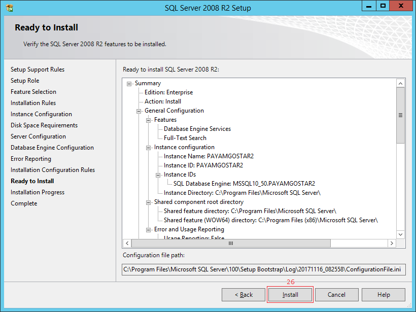

در این مرحله خلاصه ای از تنظیمات انجام شده و محل نصب نمایش داده می شود.
با کلیک بر روی Install (شماره 26) وارد پروسه نصب خواهید شد. که تصویر آن در زیر نمایش داده شده است.

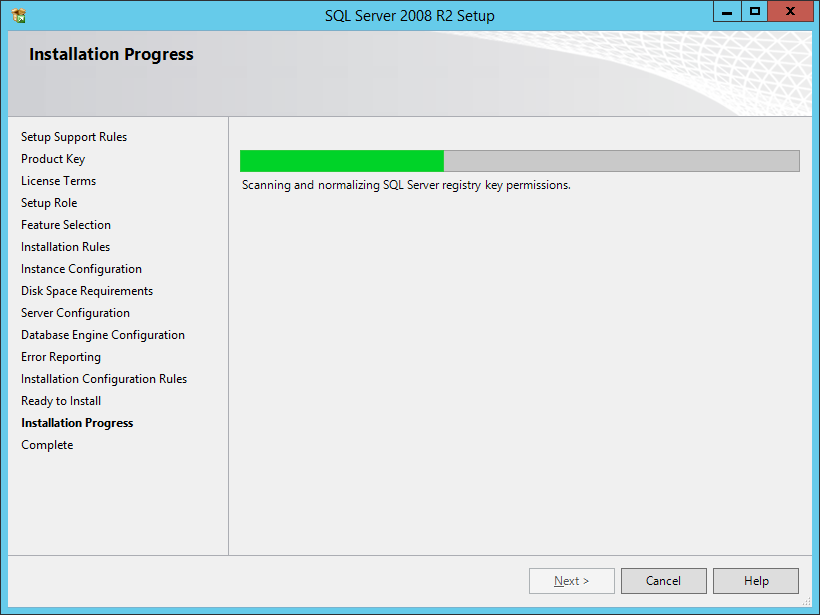

تصویر زیر گویای نصب موفق SQL می باشد که با کلیک بر روی دکمه Close پروسه نصب و راه اندازی SQL Server 2008 R2 به پایان می رسد.

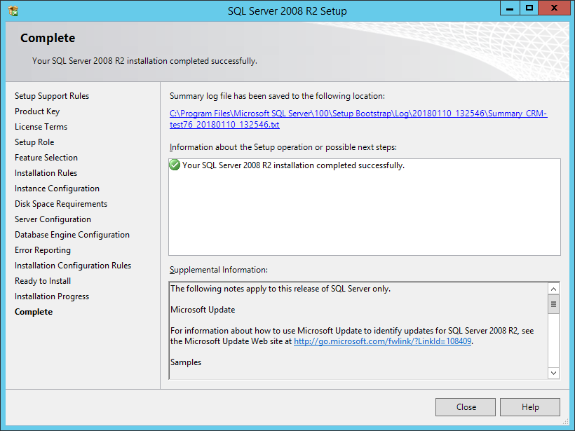

مرحله ای تحت عنوان الزام:
بعد از نصب SQL باید وارد Source نرم افزار (CD 1) شده و با راست کلیک روی آیکون PayamGostarSetupx64/x86 بر روی گزینه Run as administrator کلیک کرده تا صفحه نصب One Click همانند تصویر زیر نمایش داده شود.

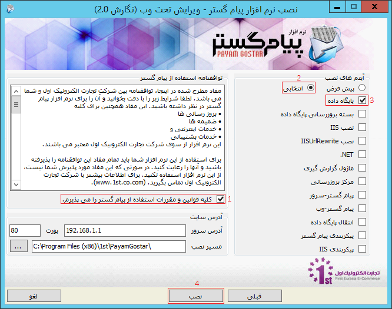

با زدن تیک " کلیه قوانین و مقررات استفاده از پیام گستر را می پذیرم" (شماره 1) و با انتخاب گزینه "انتخابی" (شماره 2) تنها تیک گزینه "پایگاه داده" (شماره 3) را انتخاب کرده و بر روی گزینه "نصب" (شماره 4) کلیک کنید.

بعد از کلیک بر روی گزینه نصب بلافاصله تیک سبز رنگ، به معنای موفقیت آمیز بودن فرایند زده می شود.

سوال مهمی که باید از خود بپرسید: دلیل انجام این کار چیست؟
با انجام این کار Script یی در Background، Run می شود که با پسورد aA123456 در SQL، Login کرده و پسورد را تغییر میدهد. نرم افزار از طریق پسورد مورد نظر می تواند در پایگاه داده Login کرده و ارتباط برقرار کند.

یاد آوری: در مراحل نصب SQL Server 2008 R2 در مرحله Database Engine Configuration، Authentication Mode در حالت Mixed Mode انتخاب شده و پسورد aA123456 قرار داده شد.

## نصب SQL Server 2008 R2 Service Pack 3

در مسیر زیر وارد فایل های مربوط به نصب شده و روی فایل اجرایی تحت عنوان Setup راست کلیک کرده و با انتخاب گزینه Run as administrator مراحل نصب مربوط به SQL Server 2008 R2 Service Pack 3 آغاز می شود.

This PC > Local Disc (?) > 1 > Prerequisites > SQL Server > 2008 R2 SP
در ابتدا، مرحله Setup Support Rules مشاهده می شود که می توان آنرا مرحله Checking نیز نامید. مواردی که در این مرحله چک می شود را می توان در تصویر زیر  مشاهده کرد.

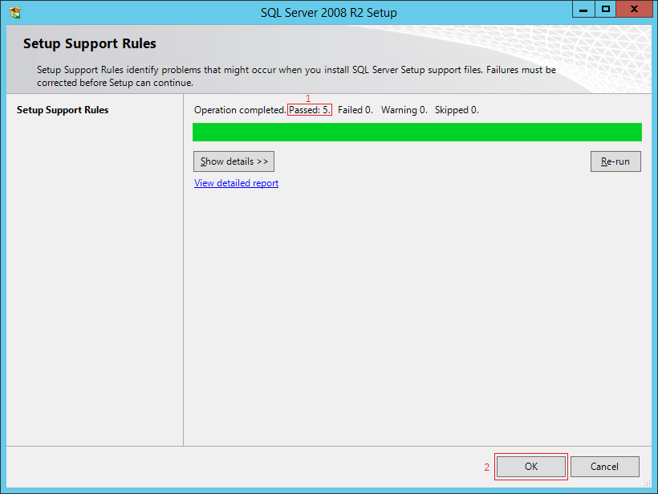

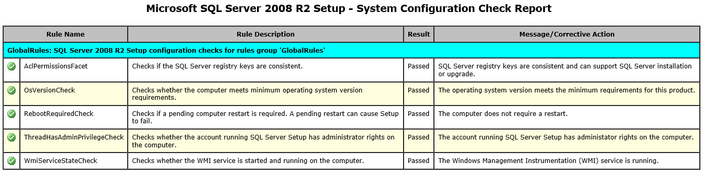

>نکته: مجددا متذکر می شویم که Fail شدن هر یک از این موارد به Fail شدن نصب می انجامد. لذا Passed شدن تمام موارد برای عبور از این مرحله لازم و ضروری می باشد.

با کلیک کردن بر روی گزینه OK (شماره 2) می توانید از مرحله گذشته و وارد مرحله بعد شوید.

در مرحله بعد (مرحله SQL Server 2008 R2 Update) مانند مرحله قبل مواردی جهت Update کردن SQL Server 2008 R2 (که نام این مرحله نیز گویای همین مسائله می باشد)،  بررسی شده که با Pass شدن موارد مربوطه می توانید با کلیک کردن بر روی گزینه Next وارد مرحله بعد شوید.پ

در مرحله License Terms تیک I accept the license terms را زده (که مربوط به پذیرش قوانین و مقررات ماکروسافت جهت ادامه نصب می باشد) و با کلیک بر روی Next وارد مرحله بعد (مرحله Select Features) می شوید.

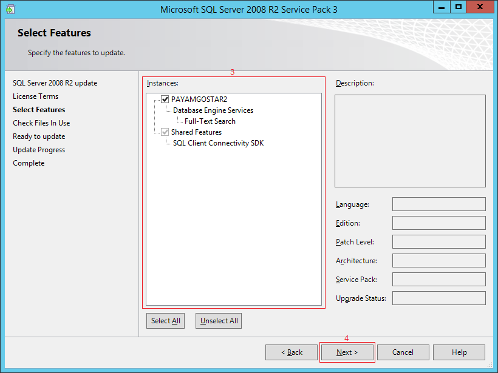

مرحله Select Features در فرایند نصب، مهمترین مرحله ای است که می تواند دارای حساسیت نیز باشد.

توضیحات: در روند Update کردن SQL Server 2008 R2 که توضیحات آن خدمت شما ارائه می شود، بر روی OS تنها یک Instance وجود دارد (همانطور که در تصویر بالا  - SQL 2008 R2 SP3 - مشاهده می کنید) که بصورت پیش فرض Instance موجود جهت Update شدن تیک خورده است.

در این مرحله حتی می توانید Instance یی را Update نکرده و تنها به Update کردن Shared Features ها بسنده کنید.

حساسیت: امکان دارد نرم افزار پیامگستر را در سیستمی نصب می کنید که در آن سیستم نرم افزارهای دیگری (مانند نرم افزار حسابداری و ...)

هم نصب باشد که از SQL Server 2008 R2 استفاده می کنند و Instance مربوط به خود را دارند.
در این شرایط تمام Instance های موجود در پنجره Instance (شماره 3) نمایش داده می شود و بصورت پیش فرض تیک تمام Instance ها جهت Update شدن زده شده است.

امکان دارد که با Update کردن یک Instance باعث اختلال در نرم افزار مربوطه شوید. لذا این نکته حائز اهمیت است که تنها به Update کردن Instance پیامگستر (PAYAMGOSTAR2) اکتفا کنید و Update کردن Instance های دیگر علاوه بر تغییر در Instance های دیگر و امکان بروز مشکل، باعث ائتلاف وقت شما جهت Update شدن Instance های دیگر می شود.

>توجه: Update کردن Instance های دیگر کمکی به بهتر سرویس دادن پیام گستر نمی کند.
با انتخاب Instance پیامگستر (PAYAMGOSTAR2) و با کلیک بر روری گزینه Next (شماره 4) از این مرحله نیز عبور می کنید.

در مرحله Check File in Use، فایل هایی را که در حال حاضر in Use می باشد جهت روند فرایند نصب بررسی کرده تا در انتها نصب برای Restart کردن یا نکردن سیستم تصمیم گیری کند.
برای اطلاعات بیشتر به لینک زیر مراجعه کنید:

https://technet.microsoft.com/en-us/library/dd638068(v=sql.105).aspx

با زدن Next وارد مرحله بعدی، تحت عنوان Ready to Update شده و نمایش لیستی از Feature ها جهت Update شدن را مشاهده می کنید، که با زدن گزینه Update فرایند Update یا Patch (Update Progress) کردن انجام می شود.

در آخرین مرحله (مرحله Complete)، پیغام “Your SQL Server 2008 R2 update operation is complete” (شماره 5) نمایش داده می شود که موفقیت آمیز بودن فرایند Update شدن SQL Server 2008 R2 را اعلام می کند.

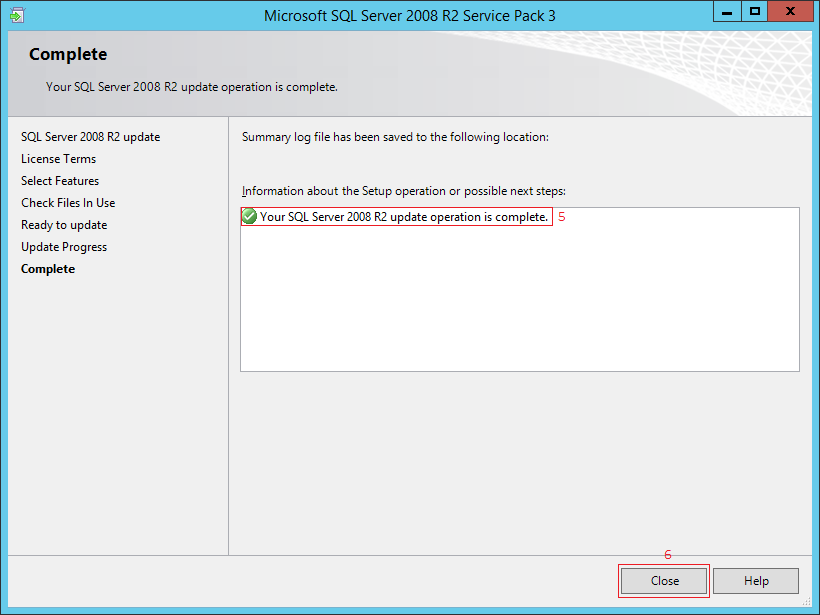

با کلیک بر روی گزینه Close، (شماره 6) فرایند Update کردن SQL Server 2008 R2 به انتها می رسد.

## نصب و راه اندازی IIS (Internet Information Services)

IIS به عنوان یک Role در سیستم عامل ویندوز شناخته می شود که در این بخش توضیح داده می شود که چطور بتوانید IIS را بر روی Windows 2012 R2 نصب کنید.

برای نصب و راه اندازی IIS در کنسول Server Manager، بر روی گزینه Add roles and features کلیک کنید.

در آغاز و قبل از شروع به نصب Role و Feature (در مرحله Before you begin) با رعایت موارد گفته شده می توانید با زدن گزینه Next فرایند نصب را پیش ببرید.

در مرحله Select installation type با انتخاب گزینه Role-based or feature-based installation (گزینه پیش فرض)، بر روی گزینه Next کلیک کنید.

در مرحله Server Selection با انتخاب سیستم یا سرور مورد نظر در Server Pool بر روی گزینه Next کلیک کنید.

در مرحله Server Selection با انتخاب سیستم یا سرور مورد نظر در Server Pool بر روی گزینه Next کلیک کنید.

با کلیک بر روی گزینه Add Features (شماره 2) مجدد مرحله Select server roles را مشاهده می کنید.

در واقع با کلیک بر روی گزینه Add Features، ویژگی ها یا Feature هایی که نیاز است تا Web Server (IIS) نصب شود را تائید می کنید.

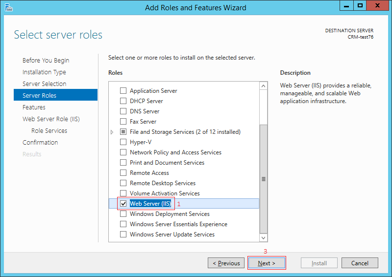

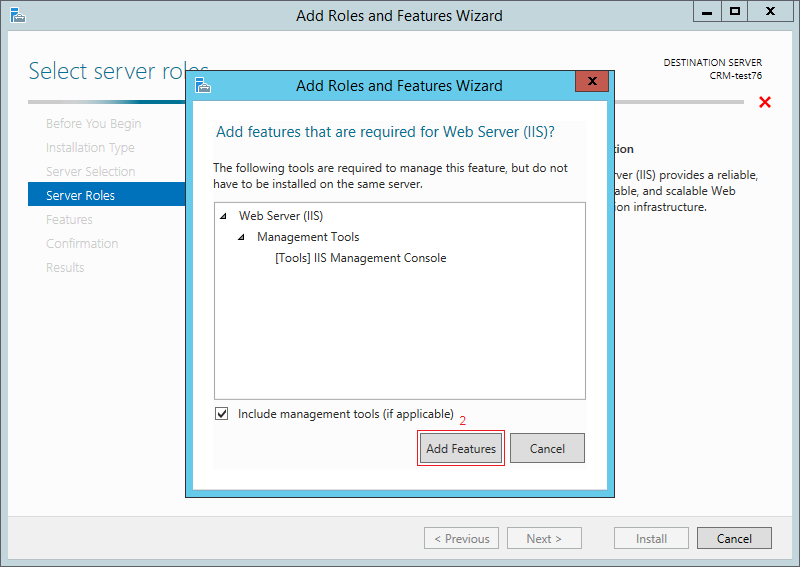

در ادامه با کلیک بر روی گزینه Next وارد مرحله می شوید.

در مرحله Features، اگر Features یا ویژگی مورد نیاز است می توانید در همین مرحله اتنخاب کرده تا همرا با نصب Web Server (IIS)، ویژگی مورد نظر نیز نصب شود.

نکته : Features یا ویژگی های مورد نیاز :

•	IIs management concole

•	ASP. Net

•	Static content

•	Request monitor

•	Dynamic content compression

•	Static content compression

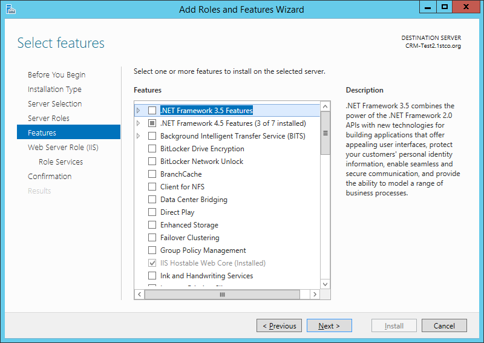

>نکته : قبلا گفته شده بود که برای نصب SQL نیاز به نصب .net 3.5 دارید.

شما می توانید قبل از نصب SQL، نصب Web Server (IIS) را انجام دهید و در این مرحله (مرحله Features)، .NET Framework 3.5 Features را انتخاب کرده تا همراه با IIS نصب شود.

>نکته : لازم است ماژول HTTP Activation (شماره 4 - شماره 5)در .NET Framework 3.5 Features (شماره 1)و .NET Framework 4.7.2 Features (شماره 2) انتخاب و نصب شود. چرا که نرم افزار پیامگستر به این دو ماژول نیازمند است.

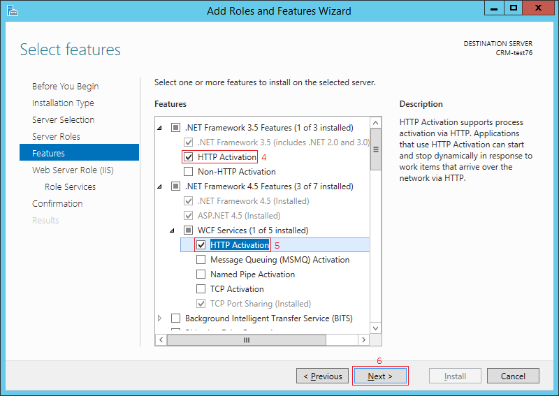

در ادامه بر روی گزینه Next کلیک کرده تا از این مرحله عبور کنید.

در مرحله بعد (مرحله Web Server Role) نیز بر روی گزینه Next کلیک کنید.

در مرحله Role Services، ماژول های مربوط به Web Server نمایش داده می شود.

در این مرحله می توانید که اگر ماژول خاصی از IIS مد نظر می باشد را انتخاب کرده تا همراه با دیگر ماژول ها نصب شود.

در ادامه بر روی Next کلیک کنید تا وارد مرحله بعد شود.

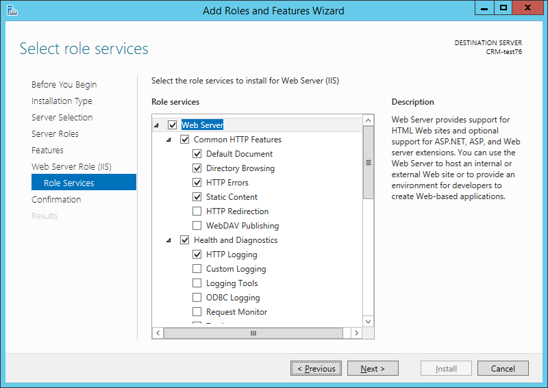

در مرحله آخر (مرحله Confirm installation selection) با کلیک بر روی گزینه Install (شماره 7) شروع به نصب Web Server و Feature های انتخابی می کند.

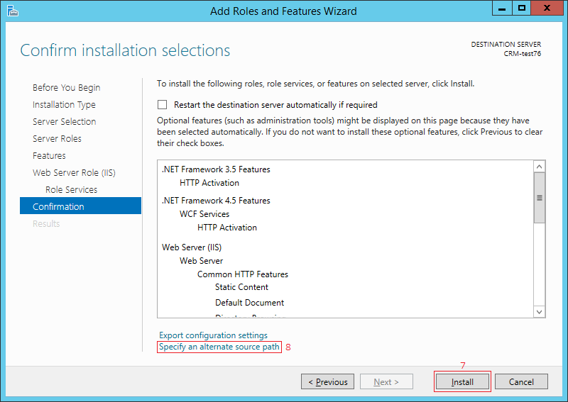

>نکته : در مرحله آخر زمانی که گزینه Install را کلیک می کنید، Web Server (IIS)، همراه با Feature های انتخاب شده را (در فرایندی که توضیح داده شد تیک .NET Framework 3.5 Features هم زده شد) شروع به نصب کردن می کند.

این امکان وجود دارد که در فرایند نصب با خطا مواجه شوید. علت این است که وقتی می خواهد .NET Framework 3.5 Features را نصب کند نیاز به فایل های اولیه جهت نصب دارد. این فایل های اولیه در سیستم عامل وجود ندارد. لذا اگر سیستم متصل به اینترنت باشد، فایل ها را دانلود و بعد نصب می کند. اما احتمال دارد سیستم دسترسی به اینترنت نداشته باشد یا به هر دلیلی نتواند فایل ها را دانلود کند که با خطا مواجه می شود.

در این شرایط قبل از کلیک کردن بر روی گزینه Install، بر روی گزینه Specify an alternate source path (شماره 8) کلیک کرده و مسیر دوم یا Alternate را در فیلد Path (شماره 9) وارد کرده (به عنوان مثال مسیر مشخص شده در تصویر که شماره 10 مشخص شده است) تا Roles یا Features های انتخابی با موفقیت نصب شود (این مسیر دوم می تواند Source ویندوز باشد).

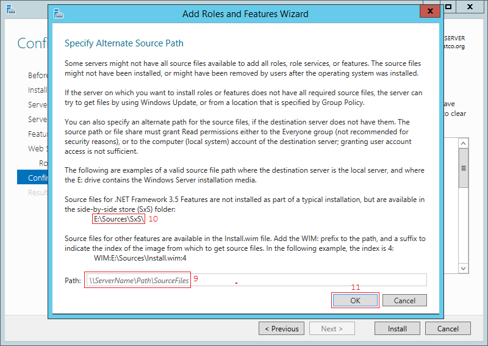

اگر نصب با موفقیت انجام شود تصویر زیر را مشاهده می کنید که نشان دهند Success بودن فرایند نصب (شماره 12) است.

در انتها می توانید بر روی گزینه Close (شماره 13) کلیک کنید.

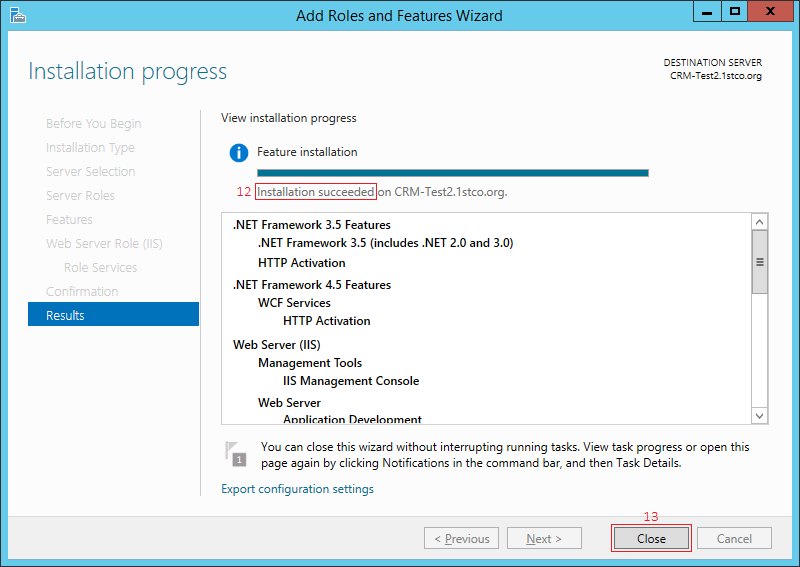

### ایجاد یک Web Site در IIS

حال نوبت به Add کردن یا ایجادWeb Console پیام گستر در IIS می باشد.
از لحظه ای که IIS نصب می شود کنسول آن در Administrative Tools اضافه می شود. ابتدا کنسول مدیریتی IIS را باز کنید.

این کار را می توانید با تایپ IIS در باکس Search ویندوز و انتخاب Internet Information Services (IIS) Manager انجام دهید.

یا از طریق Run menu و با تایپ دستور inetmgr کنسول را باز کنید.

زمانی که کنسول را باز می کنید با این سوال “Do you want to get started with Microsoft Web Platform to stay connected with latest Web Platform Component?” مواجه می شوید.

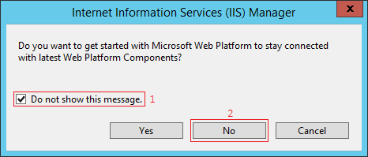

این سوال مربوط به نصب Component ها از طریق Microsoft Web Platform Installer (Web PI) می شود که می توانید برای اطلاعات بیشتر به لینک زیر مراجعه کنید.

http://www.microsoft.com/web/downloads/platform.aspx
می توانید تیک Do not show this message (شماره 1) را زده و بعد گزینه No را بزنید که با هر بار باز کردن کنسول آنرا مشاهده نکنید.

در شکل زیر کنسول IIS را مشاهده می کنید.

Component هایی که مشاهده می کنید (شماره 3) همان گزینه هایی هستند که در هنگام نصب IIS تیک آنها زده شده و نصب شدند.

در قسمت Sites (شماره 4) می توان سایت های موجود در این سرور را مشاهده کرد.
زمانی که IIS نصب می شود یک وبسایت Default تحت عنوان Default Web Site (شماره 5) وجود دارد که روی پورت 80 (شماره) Listening انجام می دهد.

می توانید با راست کلیک کردن روی آن و انتخاب گزینه Remove آنرا پاک کنید یا با انتخاب سایت مربوطه و با کلیک بر روی گزینه Stop (شماره 7) در سمت راست کنسول، مانع سرویس دهی سایت مربوطه شوید.

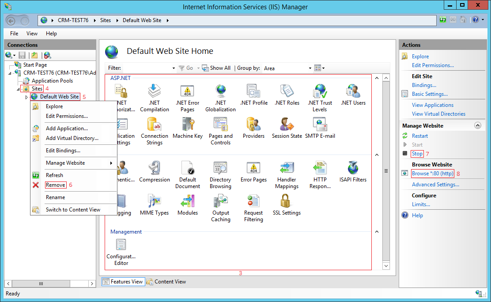

>سوال: چرا باید Default Web Site را Remove یا Disable/Stop کنیم؟

اگر بخواهیم که کنسول وب پیامگستر روی پورت 80 ، Listening یا سرویس دهی انجام دهد، این امکان وجود ندارد که دو سایت بصورت همزمان روی یک IP و روی یک پورت Listening کنند. لذا به ناچار مجبور به Remove یا Stop کردن Default Web Site می باشیم.

در این خصوص نکته ها و Solution های بسیاری وجود دارد که در این مقال نمی گنجد.

برای ایجاد یک سایت یا Add کردن کنسول وب پیام گستر ابتدا بر روی Sites (شماره 4) کلیک راست کرده و بر روی گزینه Add Website کیک کرده تا تصویر زیر را مشاهده کنید.

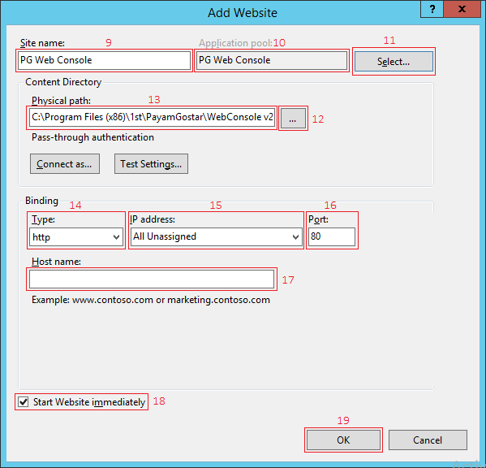

در فیلد Site name (شماره 9)، یک نام برای سایت مربوطه تایپ کنید. این نام یک Friendly Name می باشد. نامی که در کنسول برای شما نمایش می دهد. (مانند سایت پیش فرض که آنرا تحت عنوان Default Web Site مشاهده کردید).

با تایپ نام، یک Application Pool (شماره 10) تحت همان نام تایپ شده ایجاد می شود.

در خصوص Application Pool در جایی توضیحات ارائه می شود.

با کلیک بر روی گزینه ... (شماره 12) فولدری که محتوای سایت در آن می باشد را انتخاب و در نهایت گزینه OK را بزنید.

می توانید آدرس را در Physical Path (شماره 13) مشاده کنید.

در قسمت Binding در فیلد Type پروتکل ارتباطی مشخص می شود که گزینه http گزینه پیش فرض می باشد. با باز کردن Drop Down Menu گزینه https را نیز مشاهده می کنید که برای راه اندازی سایت بر روی https نیاز به Certificate Digital می باشد.

در فیلد IP address (شماره 15) باید تعیین کنیم که این سایت روی چه IP، Bind شود. گزینه ای تحت عنوان All Unassigned و IP یا IP های Set شده روی سیستم را مشاهده می کنید.

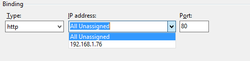

انتخاب All Unassigned به این معنا است که سایت مربوطه با هر IP که در IP address وجود دارد و در حال حاضر به جایی Assign نیست، مشاهده شود (منظور از "جایی" یک Site دیگر می باشد).
توجه داشته باشید که شما می توانید یک IP را به یک سایت Assign کنید تا تنها از طریق IP مورد نظر سایت مربوطه را مشاهده کنید.

در فیلد Port (شماره 16) می توانید پورت پیش فرض را تغییر دهید. به عنوان مثال اگر پورت را به 8080 تغییر دهید، برای ویزیت کردن سایت باید به اجبار پورت را نیز وارد کنید. (مانند: 192.168.1.76:8080)
فیلد Host name یا اصطلاح علمی تر آن Host Header مربوط به ویزیت سایت از طریق Domain Name می شود.

به عنوان مثال: CRM.PayamGostar.com

گزینه Start website immediately (شماره 18) به این معنا است که بعد از کلیک کردن بر روی گزینه OK (شماره 19) سایت ایجاد شده شروع به سرویس دادن می کند.

>نکته خیلی مهم: باید به گروهی تحت عنوان IIS_IUSRS بر فولدری که در آن محتویات وب سایت قرار دارد و آدرس آن در قسمت Physical path (شماره 13) مشخص شد، Modify Permission داده شود که Worker Processor بتواند به آن دسترسی داشته باشد.

برای انجام این کار روی فولدر مورد نظر (WebConsole v2.0) کلیک راست کرده و روند زیر را دنبال کنید.
Properties > Security Tab > Edit > Add > Advanced > Find Now > Select: IIS_IUSRS > OK > OK > Select: Modify Permission > OK > OK
 
## نصب SAP Crystal Reports

این نرم افزار با چند کلیک به سادگی نصب می شود. و نکته خاصی در نصب نرم افزار وجود ندارد (توجه به معماری x86/x64 در نصب نرم افزار اهمیت دارد).

تصویر زیر نصب موفق نرم افزار را نشان می دهد که با کلیک بر روی گزینه Finish به پایان می رسد.

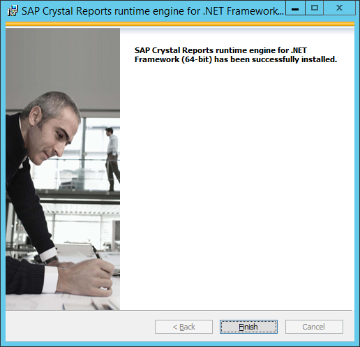

## نصب IIS URL Rewrite Module 2

این نرم افزار یا بهتر است بگوییم ماژول، تنها با یک کلیک نصب می شود. (توجه به معماری x86/x64 در نصب نرم افزار اهمیت دارد).

نصب این نرم افزار ماژولی را به IIS اضافه می کند که نرم افزار پیام گستر نیازمند آن است.

تصویر زیر نصب موفق نرم افزار را نشان می دهد که با کلیک بر روی گزینه Finish به پایان می رسد.

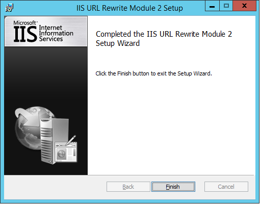

## نصب Microsoft .NET Framework 4.7.2

نصب .NET Framework 4.7.2 نیز تنها با یک کلیک انجام می شود و نکته خاصی در نصب آن وجود ندارد.
پس از پایان نصب و با کلیک بر روی گزینه Finish با پیغامی مواجه می شوید که پیشنهاد می شود حتما گزینه Restart Now را انتخاب کنید تا سیستم Reset شود.

Reset کردن سیستم بعد از نصب .NET Framework از اهمیت خاصی برخوردار است.

## نصب PG Server و PG Web Console پیامگستر

در نصب هر دو نرم افزار با چند کلیک به راحتی این کار انجام می شود. اما نکته ای که وجود دارد این است که در انتهای نصب با Warning یی مانند تصویر زیر مواجه می شوید که خلل یا مشکلی در کار ایجاد نمی کند که کلیک کردن بر گزینه OK می توانید نصب را به پایان برسانید.

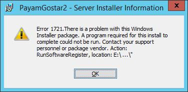

## انتقال Database

دیسک دوم (فولدر 2) حاوی دیتابیس اولیه یا خام نرم افزار پیام گستر می باشد که باید در آدرس زیر کپی شود.

Driver ?:\Program Files (x86)\1st\PayamGostar\Server v2.0

## نصب Septa Update Center

نصب Septa Update Center نیز به سادگی چند کلیک می باشد. اما تنها نکته مهمی که وجود دارد این است که Septa Update قبل از PG Server و PG Web Console نصب شود. که دلایل آن در جایی دیگر گفته می شود.

آخرین مرحله جهت تکمیل فرایند نصب و راه اندازی و ارتباط با نرم افزار پیام گستر

پس از اتمام مراحل نصب نرم افزار، آیکونی تحت عنوان Payamgostar 2.0 Agent Configuration در Desktop ایجاد می شود.

با دابل کلیک کردن روی آیکون مربوطه آنرا باز کرده، وارد قست Services شوید.

در این قسمت سرویس های مختلف نرم افزار قابل مشاهده می باشد که دو سرویس آن تحت عنوان PayamGostar 2.0 Agent و PayamGostar 2.0 Host، Disable می باشند که با راست کلیک کردن روی آنها و انتخاب Start Service می توانید آنها را Start کنید.

پس از Start کردن سرویس ها ( که بصورت یک تیک سبز رنگ نمایش داده می شود) می توانید با استفاده از مرورگر Firefox یا Chrome و با زدن IP مربوطه (IP سیستمی که نرم افزار پیامگستر بر روی آن نصب شده است) در URL به نرم افزار متصل شده و با نام کاربری Admin و پسورد admin روی نرم افزار Login و یا ورود کنید.

# نصب و راه اندازی ماژول های پیام گستر

یکی از نقاط قوت نرم افزار پیام گستر ماژولار بودن این نرم افزار است. یعنی شما می توانید این ماژول ها را بر حسب نیاز نصب و راه اندزی کنید.

این ماژول ها بسیار انعطاف پذیر (Flexible) می باشند. یعنی می توانید این ماژول ها را در هر نقطه ای راه اندازی کرده و با استفاده از ارتباطات Network  ارتباط آن با نرم افزار پیام گستر را محیا کنید.

این قابلیت می تواند دست شما را برای نصب و راه اندازی این ماژول ها باز نگه دارد.

## ماژول فکس (Septa Fax) 

این ماژول امکان ارسال و دریافت فکس از طریق نرم افزار پیام گستر را برای شما محیا می سازد.

قبل از نصب و راه اندازی این ماژول ملزم به رعایت موارد زیر خواهید بود:

ابتدا باید هدف از راه اندازی ماژول مشخص شود.

منظور از هدف این است که ابتدا باید مشخص کنید که می خواهید از طریق این ماژول ارسال فکس داشته باشید یا دریافت فکس و یا هر دو. این امر می تواند در روند راه اندازی این ماژول تاثیر گذار باشد.

با توجه به مشخص کردن هدف به تعداد مورد نیاز فکس مودم تهیه شود.

در واقع اگر بخواهید تنها ارسال فکس یا تنها دریافت فکس داشته باشید، تنها تهیه یک فکس مودم کافی است.

این نکته لازم به ذکر است که می توان از طریق یک فکس مودم هم ارسال فکس و هم دریافت فکس داشت که در این خصوص توضیح داده می شود.

با توجه به فکس مودم ها باید خط تلفن آماده شود.

با توجه به اینکه ارسال و دریافت فکس از طریق خطوط تلفن انجام می شود لذا محیا کردن این خطوط شرط لازم برای راه اندازی این ماژول می باشد.

خطوط تلفن می توانند خطوط آزاد باشند یا می توانند خطوطی باشند که از سانترال به عنوان خطوط داخلی گرفته شده اند.

مشخص کردن سیستم عاملی که قرار است بر روی آن ماژول فکس راه اندازی شود.

این سوال را باید از خود بپرسید که قرار است ماژول فکس روی چه نسخه ای از سیستم عامل نصب شود؟

مشخص کردن نسخه سیستم عامل در هدف راه اندازی این ماژول تاثیر گذار است. چند نکته در این خصوص به این شکل است:
>نکته: نصب این ماژول در سیستم عامل های Vista, 7, 8, 8.1 امکان ارسال و دریافت فکس از طریق یک فکس مودم را به شما می دهد.

>نکته: نصب این ماژول در سیستم عامل 10 تنها امکان دریافت یا ارسال فکس با یک فکس مودم را به شما می دهد.

>نکته: نصب این ماژول در سیستم عامل 2008 امکان ارسال و دریافت فکس از طریق یک فکس مودم را به شما می دهد.

>نکته: نصب این ماژول در سیستم عامل های 2012 و 2016 تنها امکان دریافت یا ارسال فکس را به شما می دهد.

در تمامی نکات گفته شده در بالا این امکان وجود دارد که در تمامی سیستم عامل ها هم ارسال فکس و هم دریافت فکس انجام شود. نکته قابل توجه تنها در تعداد فکس مودم ها می باشد.
یعنی شما می توانید در تمامی سیستم عامل ها از طریق دو فکس مودم (و با استفاده از نرم افزار Venta) دریافت و ارسال فکس داشته باشید.

فکس مودم: فکس مودم ها در دو دسته کلی طبقه بندی می شوند. 1- Internal. 2- External.
در تصویر زیر نمونه ای از فکس مودم های Internal و External را مشاهده می کنید.

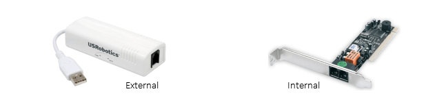

انتخاب فکس مودم بسته به نیاز انجام می شود.

نصب و را ه اندازی مرحله به مرحله ماژول فکس در ویندوز های Vista, 7, 8, 8.1: ارسال و دریافت با یک فکس مودم.

مرحله اول: اتصال فکس مودم به سیستم (Internal/External) و اطمینان از Detect شدن فکس مودم می باشد.

این اطمیان را می توانید از کنسول Device Manager در Control Panel کسب کنید.
تصویر زیر Detect فکس مودم (شماره 1) توسط سیستم یا OS را مشاهده می کنید.

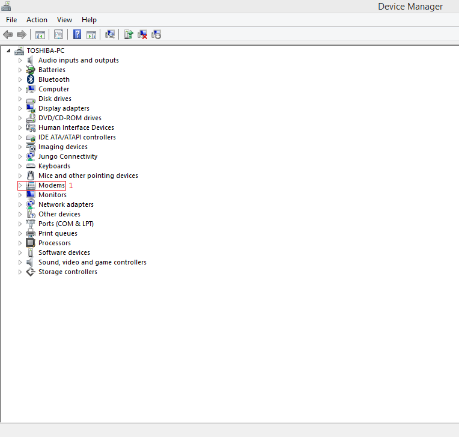

می توانید با Expand کردن Modems و راست کلیک روی مودم مورد نظر وارد Properties شده و در سربرگ Diagnostic (شماره 2) با کلیک کردن بر روی Query Modem (شماره 3) از دیوایس فکس مودم جهت اطمینان از عملکرد و کار کرد دیوایس اطمینان حاصل کنید.

پیغام Success (شماره 4) موفقیت آمیز بودن Query گرفته شده را اعلام می کند.

در ادامه وارد کنسول Phone and Modem در کنترل پنل شده و در Drop down menu مربوط به What country/region are you in now? (شماره 5) گزینه Iran را انتخاب کرده و در فیلد What area code (or city code) are you in now?، کد مربوط به شهرتان را وارد کنید. همانند شکل زیر.

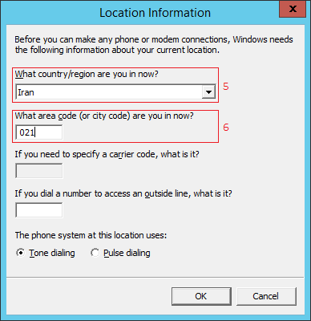

با کلیک کردن بر روی گزینه OK و مجددا کلیک بر روی OK، مرحله اول به اتمام خواهد رسید.

مرحله دوم: در این مرحله باید تنظیمات Windows Fax and Scan انجام شود.

ابتدا واژه Win Fax را در Search Box ویندوز Type کرده تا گزینه مربوط به Windows Fax and Scan رویت شود. با کلیک بر روی این گزینه کنسول Windows Fax and Scan را مشاهده می کنید.

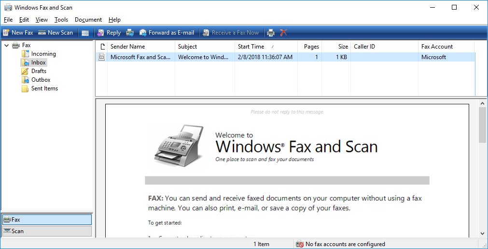

در منوی Tools وارد Fax Accounts شده و با کلیک بر روی گزینه Add و با انتخاب Connect to a fax modem، فکس مودم موجود در سیستم Add می شود (ارتباط Windows Fax and Scan با فکس مودم)

در ادامه مجددا وارد منوی Tools شده و با انتخاب Fax Settings در سربرگ General تنظیمات مربوط به ارسال و دریافت فکس را مشاهده می کنید.

در تصویر زیر پنجره Fax Setting را مشاهده می کنید. از طریق این پنجره می توانید ارسال و دریافت فکس را مشخص کنید.

همانطور که در تصویر زیر مشاهده می کنید، تیک گزینه Allow the device to send faxes جهت ارسال فکس و گزینه Allow the device to receive fax calls جهت دریافت فکس زده شده است که می توانید بصورت Optional بر اساس نیاز مشخص کنید.

گزینه Automatically answer after مربوط به دریافت فکس می باشد که می توانید مشخص کنید که بعد از زدن چند بوق فکس دریافت شود. منظور از بوق تعداد زنگ هایی می باشد که زده می شود و بعد فکس Answer می کند.

با کلیک کردن بر روی گزینه OK تنظیمات خود را ذخیره کنید.

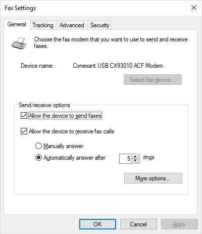

مرحله سوم: نصب ماژول فکس: نصب این ماژول به راحتی کلیک کردن چند Next انجام می شود.

تنها نکته ای که وجود دارد این است که بعد از نصب ماژول فکس، سرویس آن تحت عنوان SeptaFaxService در کنسول Services ویندوز قرار می گیرد که باید Start شود.

مرحله چهارم: انجام تنظیمات در پیام گستر می باشد.

دریافت و ارسال فکس از طریق Windows Fax and Scan و Venta4Net:

نصب و راه اندازی Venta4Net Plus 2.8:

ابتدا در Source نرم افزار، روی آیکون v4np28i راست کلیک کرده و با انتخاب گزینه Run as administrator، فرایند Extracting و بعد نصب آغاز می شود.

نصب نرم افزار بصورت معمول و با کلیک کردن چند Next انجام می شود.

بعد از نصب، آیکونی تحت عنوان Venta4Net Plus 2.8 Server بر روی دسکتاپ ایجاد می شود.

در اولین گام باید Venta4Net را Register یا اصطلاحا Active کنید. برای انجام اینکار با دابل کلیک کردن بر روی آیکون مربوطه، پنجره مانند تصویر زیر نمایان می شود.

نکته: اگر تنظیمات Phone and Modem قبلا انجام نشده باشد با دابل کلیک کردن بر روی آیکون Venta4Net پنجره Location Information را مشاهده می کنید که جهت انجام تنظیمات اقدام کنید

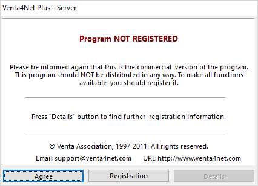

با کلیک کردن بر روی Registration و وارد کردن User Name و Registration Number می توانید این کار را انجام دهید.

تصویر زیر در صورت موفقیت در Registration مشاهده می شد.

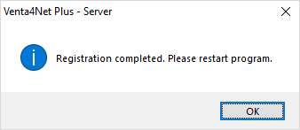

جهت انجام تنظیمات Venta4Net مجددا روی آیکون Venta4Net Plus 2.8 Server دابل کلیک کنید تا نرم افزار باز شود.

با باز شد نرم افزار، Warning یی به شما داده می شود که چند نکته مهم را در خود دارد.

ابتدا می خواهد قبل از شروع به تنظیمات، Fax Mode خود را جهت استفاده نرم افزار از آن مشخص کنید.

>این نکته مهم را بخاطر داشته باشید که استفاده از نرم افزار Venta4Net تنها برای ارسال فکس از طریق پیام گستر استفاده می شود و جهت دریافت فکس از Windows Fax and Scan استفاده می شود.

پس مشخص کردن Fax Modem یی که قرار است برای ارسال بکار گرفته شود مهم است.

نکته مهم تری که وجود دارد این است که بهتر است Fax Modem مشخص شده Voice Supported باشد. این قابلیت در Fax Modem امکان استفاده از پیغام صوتی قبل از ارسال فکس را به شما می دهد.

در ادامه اعلام می کنه که اگر تنها یک Fax Modem به سیستم متصل است، بصورت اتوماتیک آنرا انتخاب می کند و از آن استفاده می کند.

شروع تنظیمات Venta4Net: در هر مرحله تصاویر گویای عملکرد می باشد.

>توجه: در تنظیمات هر جا صحبت از "فولدر" شد منظور المانی می باشد که بصورت پوشه نمایش داد شده است و هر جا صحبت از "قسمت" شد منظور المانی می باشد که بصورت چرخ نمایش داده شده است.

1- انتخاب فکس مودم. هنگام شروع تنظیمات، پیغامی نمایش داده می شود که از شما می خواهد ابتدا Fax Modem خود را از لیست انتخاب کنید و دقت کنید که نرم افزار دیگری از این Fax Modem استفاده نمی کند. پس گام اول انتخاب فکس مودم می باشد.

2-  با انتخاب فکس مودم، پیغام زیر برای شما نمایش داده می شود.

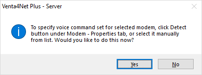

برای اینکه مشخص شود، فکس مودمی را که از لیست انتخاب کرده اید Voice Supported می باشد یا خیر، با انتخاب گزینه Yes بصورت اتوماتیک وارد قسمت Properties شده و با کلیک کردن بر روی گزینه Detect می توانید این کار را انجام دهید. اگر مایل به انجام این کار نیستید و نمی خواهید از این قابلیت فکس مودم استفاده کنید، بر روی گزینه NO کلیک کنید.

3- در ادامه وارد فولدر Fax و بعد General شده و با برداشتن تیک گزینه Disable voice modem when Sending a fax کار را ادامه دهید.

4- در مرحله بعد وارد فولدر "Folders and Files" شده و با زدن تیک Announcement before sending fax فایل صوتی خود را انتخاب کرده یا فایل صوتی خود را در آن کپی کنید.

5- وارد فولدر Dialing شده و بعد قسمت Actions after transmission را انتخاب کنید. در این قسمت تعریف دو Rule مورد نیاز است.

ابتدا تیک Enable را زده و بعد در قسمت Action با کلیک بر روی Drop down menu گزینه Execute a program را انتخاب کنید.

در فیلد Filename وارد مسیر نصب Septa Fax شده و فایل FaxClient را انتخاب کنید.

در اولین Rule (Rule 1) در فیلد Command line options دستور زیر را قرار دهید:

"%FileName" "sent"

گزینه Apply for completed delivery tasks بصورت پیش فرض انتخاب شده است که در Rule 1 همین پیش فرض مد نظر است.

در تصویر زیر تنظیمات انجام شده نمایش داده شده است.

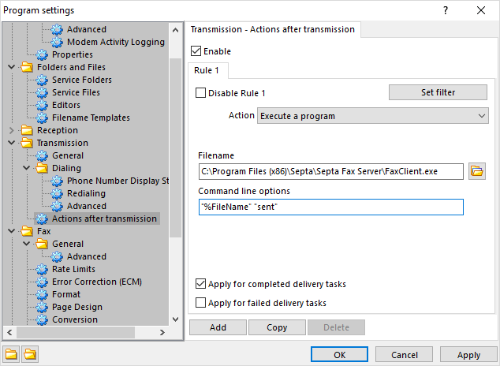

 برای ایجاد دومین Rule (Rule 2) رو گزینه Add کلیک کنید.
 
تنها تغییراتی که در این Rule (Rule 2) انجام می شود به شرح ذیل است.

درفیلد Command line options دستور زیر جایگزین می شود:

"%FileName" "failed"

برداشتن تیک Apply for completed delivery tasks و گذاشتن تیک Apply for failed delivery tasks.

در تصویر زیر تنظیمات انجام شده نمایش داده شده است.

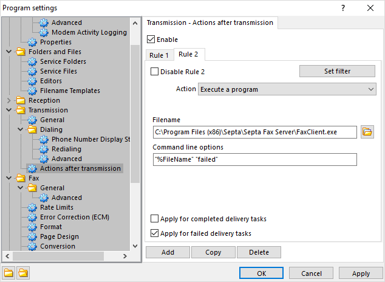

6- در فولدر "Fax" و در قسمت "General" و نهایتا "Format"، فرمت فکس های ارسالی مشخص می شود. هر دو را بر روی فرمت TIFF قرار دهید.

7- در همان فولدر "Fax" وارد قسمت Conversion شوید و تیک گزینه stretch to fit the page width را بزنید.

8- در آخر وارد فولدر "VentaFax Engine" شده و در قسمت "General" تیک هر دو گزینه "Load automatically on windows startup" و "Run as windows service" را انتخاب کنید و بر روی گزینه OK کلیک کنید.

## نصب و راه اندازی پرینتر (Septa Printer)

ابتدا در شبکه، پرینتر هایی را که می خواهید از طریق آنها پرینت انجام شود را در کامپیوتر مورد نظر Add کنید.

منظور از کامپیوتر مورد نظر، کامپیوتری است می خواهید نرم افزار Septa Printer را بر روی آن نصب کنید (کامپیوتر که می خواهید ماژول فکس را بر روی آن نصب و راه اندازی کنید). این کامپیوتر می تواند همان سرور پیام گستر باشد. و منظور از Add کردن، اضافه کردن پرینتر ها در Devices and Printers می باشد. این پرینتر ها می توانند بصورت Local یا Share Printer باشند.

بعد از اضافه کردن پرینترها حتما از هر کدام از آنها Print Test Page گرفته شود تا از عملکرد پرینترها قبل از اضافه کردن آنها در نرم افزار پیام گستر اطمینان حاصل شود.

بعد از انجام موارد گفته شده نوبت به نصب نرم افزار Septa Fax میرسد.

نصب نرم همانند دیگر ماژول ها با چند کلیک انجام می شود و نکته خاصی در نصب وجود ندارد.

توجه: بعد از نصب نرم افزار حتما سرویس آن (Septa Print Service) را در کنسول Services ویندوز Start کنید.

بعد از نصب نرم افزار با جستجوی عبارت Septa Print Server Configuration در Search box ویندوز بر روی آیکون مربوط به ماژول پرینت کلیک کنید.

با کلیک کردن بر روی آیکون مورد نظر، پنجره ای تحت عنوان "تنظیمات سرور چاپ سپتا" همانند تصویر زیر را مشاهده می کنید.

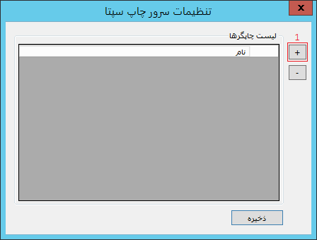

در این پنجره با کلیک بر روی گزینه Plus Sign (+) (شماره 1) پنجره دیگری را مشاهد می کنید که جهت ثبت یا معرفی پرینترهای Add شده در Device and Printers برای سرویس Septa Print استفاده می شود.

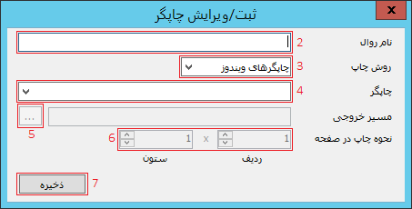

در فیلد "نام روال" (شماره 2) یک نام به دلخواه نوشته شود. این نام جهت اضافه کردن این پرینتر (پرینتری که در فیلد "چاپگر" مشخص می شود) در تنظیمات پیام گستر نمایش داده می شود.

در لیست "روش چاپ" (شماره 3) دو گزینه تحت عنوان "چاپگرهای ویندوز" و "ذخیره در فولدر" وجود دارد که مشخص کننده استفاده از یک چاپگر ویندوزی و ذخیره کردن Result پرینت در یک فولدر به عنوان لیبل می باشد.

با انتخاب گزینه "ذخیره در فولدر" فیلد "مسیر خروجی" به حالت انتخاب، نمایش داده می شود و فیلد "چاپگر" به حالت Greyed out یا خاموش می رود. انتخاب گزینه "چاپگر" بالعکس این موضوع می باشد.

در فیلد "مسیر خروجی" (شماره 5) می توانید آدرس محلی را که می خواهید Result در آنجا ذخیره شود را مشخص کنید. و در "نحوه چاپ در صفحه"، می توان تعداد ردیف و ستون را مشخص کرد.

کلیک بر روی گزینه "ذخیره" در پنجره "ثبت/ویرایش چاپگر" و "تنظیمات سرور چاپ سپتا" می توانید تنظیمات انجام شده را ذخیره کنید.

در نهایت با تنظیماتی که در نرم افزار پیام گستر انجام می شود می توانید از این ماژول استفاده کنید.

## ماژول نمایشگر تماس 

دستگاه سانترال:  دارای کارت کالرآی دی باشد و اتصال سانترال از طریق کابل RS232  به سیستم برقرار باشد.

*استثنا : سانترال kx 1232 قابل پیاده سازی نمی باشد. برای سانترال مدل NS500 می بایست IPسانترال و رمز SMDR را داشته باشید.

>نکته: تنظیمات سانترال باید به گونه ای باشد که پس از اتصال کابل  RS232به سیستم و تست با نرم افزار Hyper Terminal، لاگ تماس ها برای هر تماس ورودی 2 لاگ و هر تماس خروجی 1 لاگ را نمایش دهد.

>نکته: در صورتی که سانترال از نوع TDA یا TDE باشد باید  برای تماس های ورودی علاوه بر دو لاگ مذکور لاگ RCهم باید نمایش داده شود.

خطوط مستقیم:  باید از دستگاه کالرآی دی استفاده شود و در حال حاضر برند تجاری سگال برای ارتباط با پیام گستر مورد استفاده قرار می گیرد.  برای خرید  دستگاه  سگال  با توجه به تعداد خطوط (2،4،8) با بخش فروش تماس حاصل نمایید.

>نکته: تمامی خطوط نیاز به اتصال به دستگاه  سگال دارد پس نیاز به سیم کشی می باشد.
در صورت تمایل جهت خرید دستگاه سگال می توانید، (قبل از نصب نرم افزار )با واحد فروش تماس حاصل فرمایید.

سیستم Voip: در صورت وجود سیستم voip ،هسته voip ،باید استریسک(asterisk) باشد. در زمانی که  از سیستم voip ، استفاده می شود به هیچ سخت افزاری احتیاج نیست. 

>نکته: برای ارتباط نام کاربری و رمز عبور AMI مورد نیاز می باشد.

در حال حاضر تا ورژن  استریسک 11 (asterisk 11) توسط پیام گستر پشتیبانی می شود.

در صورتی که ورژن استریسک 13 باشد و در event  های آن مشکلی نباشد قابل پشتیبانی می باشد.

## ماژول ضبط مکالمات سانترال

درایور سخت افزار ضبط مکالمه – برند تلسا – تنها بر روی ویندوز 32 بیتی نصب می گردد.

لطفا توجه فرمایید تمامی خطوط، قبل از ورود به سانترال وارد دستگاه ضبط مکالمه خواهند شد. 

دستگاه تلسا به ازای هر دو خط یک ورودی دارد، در نتیجه هر دو خط دریک سوکت قرار گیرد. همچنین ترتیب خطوط ورودی به تلسا اشماره 1). در صورت نیاز به اطلاعات بیشتر لطفا با داخلی 403 تماس حاصل فرمایید.

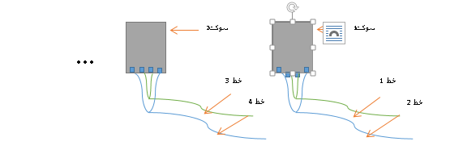

>نکته:دستگاه ضبط مکالمه تلسا دارای  محدودیت نصب برروی ویندوز 32 بیتی است -در صورتی که می خواهید راه اندازی کل نرم افزار بر روی یک سیستم باشد می توانید ویندوز server 2008 R2– 32bit نسخه datacenter و یا enterprise نصب نمایید تا بیش از 4 گیگ رم ساپورت نماید.

>نکته:در صورتی که نرم افزار پیام گستر روی ویندوز 64 بیتی نصب گردد، سیستم دیگری با ویندوز 7 یا سرور R22008 به صورت 32 بیتی برای نصب تلسا باید در اختیار تیم فنی قرار گیرد.کابل RS232 باید به سیستمی که تلسا نصب می باشد متصل گردد.

>نکته:راه اندازی تلسا به هیچ عنوان بر روی سیستم های مجازی انجام نخواهد شد.
در صورت تمایل جهت خرید دستگاه تلسا می توانید، (قبل از نصب نرم افزار )با واحد فروش تماس حاصل فرمایید.

## ماژول ضبط مکالمات VOIP

>نکته: این ماژول زمانی قابل تنظیم است که ضبط مکالمات روی VOIP فعال باشد.

>نکته: برای ارتباط، نام کاربری و رمز عبور ROOT لینوکس که دسترسی به فایل های ضبط شده را دارد، مورد نیاز است.

## ماژول ارتباط با نرم افزارهای سپیدار

برای لینک با نرم افزار های سپیدار باید .net framework 4.5.1 را بر روی سرور نرم افزار نصب نمایید. 

>نکته: لازم به ذکر است  جهت ارتباط نرم افزار با سپیدار حتما باید ورژن سپیدار 4.8.6 به بالا باشد .
در صورتی که نسخه نرم افزار پایین تر از 4.8.6 بود می بایست به نسخه های بالاتر ارتقا یابد.

## ماژول پیامک

پیامک را می توان از طریق 5 روش در پیام گستر ارسال نمود.

### پرتال اول

ثبت نام در سایت www.1st.ir که کاملا رایگان می باشد .پس از ثبت نام، می توانید خط پیامک اختصاصی مورد نیاز خود را از این سایت خریداری نمایید و بعد از فعال سازی با آن ارسال پیامک انجام دهید، سپس تماس باشماره 02149714 داخلی 701  و ارسال مدارک مربوط به خطی که می خواهید از طریق آن ارسال داشته باشید.

###  رایان مارکتینگ (ارسال از شماره خطوط ثابت شرکت خود)

ثبت نام در سایت  www.rayanmarketing.com  که کاملا رایگان می باشد و سپس تماس باشماره 02149714 داخلی 701  و خرید خط ارسال مدارک مربوط به خطی که می خواهید از طریق آن ارسال داشته باشید. 

### url

جهت ارسال پیامک از سایر اپراتورها (غیر از مگفا و رایان مارکتینگ) از اپراتور مربوطه یک URL ارسال که به شکل query string باشد دریافت شود. مطابق آدرس زیر:

http://IP یاserver address/post/sendSMS.ashx?username=…...&password=…..&form=….&to=….&text=….

>نکته: provider ارسال کننده url،   برای ارسال پارامترها می بایست از متد get استفاده نماید. همچنین می بایستی فرمت نوشتاری utf8 (برای ارسال فارسی) پشتیبانی نماید.

تست url: برای تست آدرس url آدرس url را در browser وارد می کنیم و با زدن دکمه اینتر، ارسال را انجام می دهیم. در صورت دریافت پیامک url صحیح است.

>نکته: حتماً برای ارسال url باید بتوان شماره موبایل را بدون گذاشتن 98 در ابتدای آن ارسال کرد.

### . مگفا (اپراتور ارسال خطوط 3000)

در صورتی که مستقیما از این اپراتور خطی را به صورت خدمات وب سرویس دریافت کردید. می توانید در پیام گستر تنظیم نمایید.

### GSM مودم ها

ارتباط نرم افزار پیام گستر با GSM مودم جهت ارسال پیام، با یکی از سه برند ذیل امکان پذیر می باشد.
برندهایی که برای خرید توصیه می شوند:

T-mobile

Dlink

Data net

>نکته: با توجه به اینکه GSM مودم روی سرورهای مجازی شناسایی نمی شود حتما باید روی سرور پیام
گستر به صورت فیزیکی باشد.

در ضمن مودم می بایست به صورت DONGLE باشد . طبق عکس زیر:

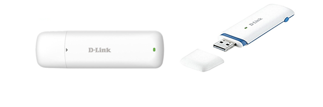

## ماژول صندوق پست الکترونیک

برای اینکه ایمیل شرکتی در پیام گستر تنظیم شود قبل از آن ایمیل مربوطه باید در outlook تنظیم شود و قابلیت ارسال و دریافت داشته باشد و تنظیمات در outlook تحویل کارشناس شود تا بتواند روی پیام گستر انجام دهد. 

>نکته: در صورتی که تنظیمات ایمیل روی ssl ست شده باشد باید هم ارسال و هم دریافت روی ssl ساپورت شود.

