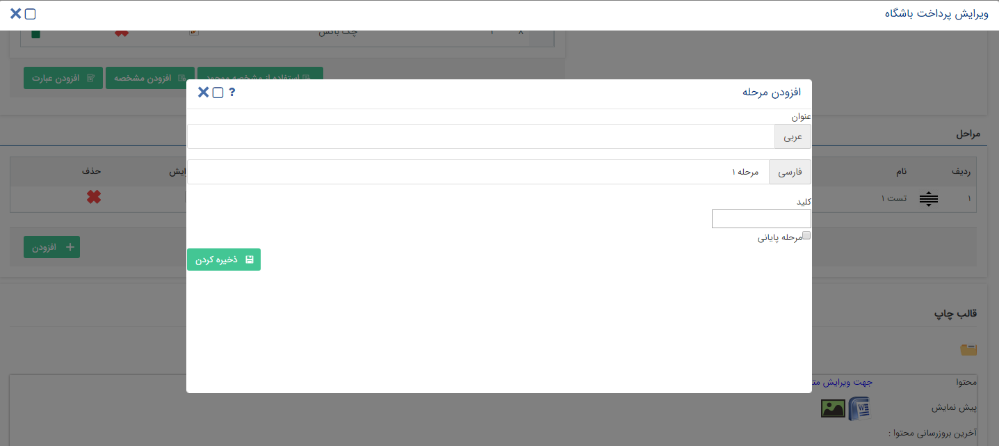

1. نواردسترسی

جهت دسترسی آسان به لیست تماس ها، یادآوری ها و یا پیگیری ها، نوار ابزاری در قسمت پایین تمام صفحات قرار گرفته است. این نوار ابزار جایگزین "پنجره تماس های تلفنی" و آیکون سبز رنگ گوشه چپ صفحات شده است.

با استفاده از این نوار می توانید به آیتم های زیر دسترسی داشت: 

A.	تلفن: با استفاده از این نوار ابزار می توانید لیست تماس های
دریافتی را مشاهده کنید (تماس های جاری و سابقه تماس های دریافت شده). همچنین با استفاده از شماره گیر می توانید با شماره مدنظر خود تماس بگیرید.

B.	یادآوری: در هرجایی از نرم افزار با انتخاب این گزینه، کادر یادآوری باز می شود.

C.	پیگیری: در هرجایی از نرم افزار با انتخاب این گزینه، لیست وظایف و پیگیری ها باز می شود

D.	راهنما: در هرجایی از نرم افزار با کلیک روی گزینه راهنما، توضیح آیتم های موجود در صفحه به صورت تور نمایش داده می¬شود و می توانید مورد استفاده آنها را مطالعه کرده و با انتخاب گزینه "بعدی" یا "قبلی" مطالب را مرور کنید.

2. ایجاد  تنظیمات پنجره تماس ها   

در مورد پنجره تماس هایی که در گوشه صفحه باز می شود، می توان با کانفیگی مشخص کرد که کاربر دریافت کننده تماس چه فرمی را در زمان پاسخگویی به تماس در اختیار داشته باشد. 

هرکاربر در تنظیمات من، در قسمت تماس ها، به لیست آیتم¬ها دسترسی داشته و می تواند مشخص کند که چه آیتمی را برای ثبت در زمان دریافت تماس در اختیار داشته باشد. 

فرم ایجاد آیتم تنها در صورتی که کاربر مجوز ایجاد داشته باشد در اختیار او قرار خواهد گرفت. 

نکته:با توجه به تغییرات ایجاد شده در پنجره تماس ها، ویجت تماس ها بدون کاربرد می باشد.

3.	قابلیت  کپی کردن فیلد های دیگر در زمان تعریف فیلد اضافی

در  صفحه ویرایش تایپ یک سی آر ام آبجکت  بخش افزودن فیلد ها  در انتهای گرید یک دکمه اضافه شده است که برای کپی کردن فیلد از یک CRM Object  دیگر مورد استفاده قرار می گیرد. روال انجام عملیات به شرح زیر می باشد: 

-	پس از استفاده از دکمه یاد شده در صفحه ای که در اختیار کاربر قرار می گیرد، محل فیلد مورد نظر در CRM Object مبدا (آبجکتی که قصد کپی کردن فیلد از آن را داریم)مشخص می شود. همچنین در دراپ دان بعدی پس از انتخاب CRM    مبدا، انواع فیلد های این CRM Object، در اختیار کاربر قرار می گیرد.  به این ترتیب کاربر امکان انتخاب فیلد مورد نظر خود را خواهد داشت. 

-	با انتخاب فیلد مورد نظر  میتوان نام و کلید جدید  جهت کپی را تعریف کرد. با انجام این مرحله سایر تنظیمات معمول تعریف فیلد جدید نیز قابل انجام می باشد. 
لازم به ذکر است که با کپی کردن فیلد های لیست مرتبط، کل ساختار این فیلد ها انتقال می یابد. 

4. قابلیت شخصی سازی ستون های لیست هر آیتم

با توجه به اینکه یکی از نیاز های عمده کاربران در اختیار داشتن صفحات لیست، با ستون های دلخواه می باشد، امکانی جهت تغییر ستونهای قابل نمایش در کلیه لیست های سیستم ایجاد شده است. 

به این ترتیب در این امکان در بخش شخصی سازی تنظیمات اولیه این امکان انجام می شود و پس از آن هر کاربر به فراخور نیاز خود امکان شخصی سازی صفحات لیست را برای خود خواهد داشت. 

در زمان انجام تنظیمات اولیه، کاربر دارای مجوز، باید مشخص کند که چه فیلد هایی برای شخصی سازی در اختیار کاربر عادی قرار می گیرد. بنابراین با مشخص کردن این فیلد ها، حتی اگر کاربر عادی (کاربری که لیست ها را مشاهده می کند.) هیچ شخصی سازی ای روی لیست انجام ندهد کلیه فیلد های مشخص شده در تنطیمات را در لیست مشاهده خواهد کرد.  

برای انجام تنظیمات اولیه، ستونی است به نام "تنظیمات نمایشی فیلد"در شخصی سازی CRM اضافه شده که امکان انتخاب فیلد های built in و اضافه، را برای نمایش در لیست، به کاربر می دهد. همچنین کاربر امکان مشخص کردن ترتیب نمایش ستون های لیست را نیز خواهد داشت.  

این تنظیمات برای کلیه  آیتم¬ها روی Type های موجودیت ها انجام می شود و تنها برای هویت، تنطیمات روی Super Type انجام می شود. 

لازم به ذکر است که فیلد هایی که قبلا در صفحات لیست به کاربران نمایش داده می شدند، همچنان نمایش داده خواهند شد و کاربران حتی اگر از این امکان استفاده نکنند، در لیست تغییر محسوسی نخواهند دید. 

	با توجه به اینکه قبل از ارایه نسخه 2.0.34 امکان شخصی سازی گرید هویت وجود داشت، تغییرات زیر در این زمینه انجام شده است: در مورد هویت ها، تنظیمات گرید از تنظیمات کلی سیستم حذف شده و با یک اسکریپت، مقدارهای True  به فیلد هایی که در تنظیمات کلی سیستم دارای مقدار True می باشند، اختصاص یافته است: 

	بخش تنظیم فیلدهای قابل نمایش در گرید هویت از بخش تنظیمات من حذف شده است. 

	با انجام این تغییر، تنظیمات گرید هویت برای هر کاربر حذف می شود و کاربران در گرید هویت ستون های مشخص شده در بخش تنظیمات را مشاهده خواهند کرد. 

در بالای هر لیست امکانی افزوده شده که کاربر مشاهده کننده لیست با استفاده از آن می تواند فیلد های مشخص شده در شخصی سازی را مشاهده کرده و فیلد های مورد نظر خود را برای نمایش انتخاب نماید. 

>نکته : تنظیمات نمایشی فیلدها تنها بر روی لیست آیتم ها ,افزوده گردیده است و در لیست تاریخچه crm امکان تنظیمات نمایش فیلدها بر روی لیست وجود ندارد.

امکان جابجا کردن ستون های لیست

با استفاده از Drag & Drop می توان ترتیب ستون های لیست ها را به دلخواه عوض کرد. این تغییرات با خروج از سیستم ذخیره شده و کاربر در استفاده های بعدی از سیستم امکان مشاهده مجدد همین ترتیب را خواهد داشت. 

5.	جدا کردن مالیات و عوارض از هم

نیاز اصلی به جدا کردن مالیات و عوارض مربوط به بخش سینک با سیستم های مالی می باشد. 
تغییرات انجام شده به شرح زیر می باشند: 

-	فیلد مالیات در همه جای سیستم به دو فیلد مالیات و عوارض تبدیل شده است. 
-	در تعریف محصول فیلدی افزوده شده که کاربر مشخص کند این محصول عوارض دارد یا خیر.
-	در کلیه مواردی که محصول با اکسل در سیستم ثبت می شود، لازم است که فیلد عوارض نیز در فیلد ها اضافه شود.
-	سرویس هایی که داده های مربوط به مالیات را رد و بدل می کنند، با افزودن عوارض، بروزرسانی شده اند. 
-	نام فیلد موجود در نسخه های قبل که دارای ماهیت مالیات و عوارض با هم بود، به مالیات تغییر کرده است. 
-	فیلد عوارض به پیش نمایش ها افزوده شود.
-	در کلیه انواع فاکتور و پیش فاکتور عوارض به ردیف ها افزوده شده و مجموع عوارض نیز به کاربر نمایش داده می شود.
-	در پیش نمایش، در فیلد هایی که دارای مالیات هستند، (مثل قیمت کل با مالیات و ...)اعمال عوارض نیز افزوده شده است. 
-	در تنظیمات افزودن اضافات، در انتخاب مرحله، نام مرحله "قبل از مالیات" به "قبل از مالیات و عوارض" تغییر کرده است.

6.	اصلاح عملکرد شماره گذاری 

تغییرات کلی

-	برای همه انواع آیتم ها شماره گذاری تنها در سطح  Type قابل انجام خواهد بود و در هیچکدام از Super Type ها امکان ثبت شماره گذاری موجود نخواهد بود.  
-	تیک عمومی شماره گذاری از شخصی سازی همه آیتم ها حذف شده است.  
-	الگوهای شماره گذاری در بخش جدایی تعریف شده اند و به این ترتیب قابلیت استفاده مجدد دارند. 
 
 
تعریف الگوهای شماره گذاری در بخش جدا 

تنها کاربر دارای مجوز "شخصی سازی" عمومی، امکان تعریف الگوهای جدید را توسط سیستم دارد. 

-	برای تعریف قالب های شماره گذاری، روال زیر اجرا شود: 
در منوی تنظیمات، یک گزینه به نام "قالب شماره دهی" افزوده شود. با استفاده از این امکان کاربر می تواند فرم ثبت قالب های شماره گذاری را در اختیار داشته باشد.
-	کاربر با استفاده از امکان افزودن قالب شماره گذاری، قالب مورد نظر خود را به سیستم وارد می کند. 
-	لیست قالب های تعریف شده به کاربر نمایش داده می شود.
-	کاربر برای تعریف یک قالب، دو Text Box در اختیار دارد که قالب و نام آن را به سیستم وارد کرده و تایید می کند. 
-	با درخواست کاربر قالب انتخاب شده ذخیره می شود. خود قالب می تواند تکراری باشد ولی نام آن خیر. 
-	با ذخیره قالب جدید، این قالب در لیست قالب های از پیش تعریف شده قرار گرفته و به کاربر نمایش داده می شود. 

مرتب سازی و بروزرسانی داده های قبلی 

-	کلیه قالب های شماره گذاری که از قبل در آیتم¬ها و Super Type هویت موجود می باشند، در قالب لیستی از قالب های شماره گذاری، تعریف شده اند. 
-	قالب شماره گذاری در Super Type هویت از Super Type حذف شده، به لیست الگوهای شماره گذاری افزوده شده است و همچنین این قالب به کلیه Type های هویت اختصاص یافته است. 
-	در مورد  آیتم هایی که از الگوهای شماره گذاری مشابه استفاده می کرده اند ولی این شماره ها جداگانه به آیتم¬ها اختصاص می یافته اند و Override نمی شده اند، در لیست الگوهای شماره گذاری نیز قالب های جدا با نام های متفاوت تعریف شده و به صورت جدا به CRM Object Type های مرتبط اختصاص یافته است. 
-	در صورتیکه در Super Type هویت هیچ قالب شماره گذاری ای موجود نباشد، کلیه Type های مربوط به آن دارای قالب شماره گذاری 1 تا n  خواهند بود. 
-	برای کلیه آیتم¬ها به جز نوع هویت، چنانچه قالب شماره گذاری خالی بود، به ازای هر نوع یک قالب 1 تا n تعریف شده و به این آیتم¬ها اختصاص می یابد. 
 
 
>نکته: برای همه انواع هویت، از یک قالب 1 تا n استفاده می شود ولی برای هر کدام از سایرآیتم هایی که دارای قالب شماره گذاری نیستند، به صورت مجزا یک قالب 1 تا  nتعریف می شود و به صورت پیش فرض برای مقداردهی این آیتم¬ها از این قالب استفاده می شود. 

-	 همه آیتم ها باید یک قالب شماره گذاری داشته باشد. بنابراین تمامی آیتم هایی که قبلا دارای قالب شماره گذاری نبوده اند، باید به صورت پیش فرض دارای قالب شماره گذاری 1 تا  n مربوط به خود باشند که شیوه ساخت و مقداردهی آن در بند قبل توضیح داده شد. 

-	در مواردی که از الگوی شماره گذاری عمومی استفاده می شده است، الگوی شماره گذاری عمومی نیز به صورت عدد صحیح که از 1 آغاز می شود، به الگوها افزوده می شود. همچنین این الگو به آیتم¬های دارای قالب شماره گذاری اختصاص یابد. 

استفاده از قالب های شماره گذاری 

-	کنترل شماره گذاری در آیتم¬ها از Text Box به کومبو تغییر یافته و این کومبو حاوی مقدار قالب شماره گذاری قبلی آیتم می باشد.  
-	به دلیل اینکه امکان تعریف قالب های شماره گذاری تکراری موجود است، در زمان انتخاب قالب شماره گذاری کاربر باید امکان تشخیص انواع قالب های شماره گذاری را داشته باشد. به این ترتیب در زمان انتخاب قالب های شماره گذاری، روی هر قالبی tool tip حاوی نام قالب نمایش داده می شود. 
-	کاربر می تواند قالب شماره گذاری مورد نظر خود را در لیست قالب های موجود در کومبو جستجو نماید. 
-	در صورتی که از یک قالب برای چندین سی آرام تایپ استفاده کنیم همدیگر را Override می کنند.
به عنوان مثال چنانچه از یک قالب هم در هویت استفاده شود هم در فاکتور  همدیگر را override میکنند.
-	جلوگیری از ثبت شماره تکراری فقط در سطح CRM Object Type  مربوطه  صورت می پذیرد.

مثال: چنانچه از یک قالب هم در فاکتور رسمی هم در غیر رسمی و هم هویت استفاده شود، کلیه این آبجکت ها همدیگر را override می کنند. 

 - چنانچه با شماره دهی دستی، یک شماره به سیستم وارد شود، بررسی تکراری بودن فقط در همان تایپ جاری صورت می پذیرد. در مواردی که کاربر شماره گذاری را به صورت دستی به سیستم وارد می کند، موارد زیر باید در نظر گرفته شوند: 
-	در صورتیکه کاربر به صورت دستی شماره ای را به سیستم وارد کند که از آخرین شماره اختصاص یافته کوچکتر است، تنها در صورتی ذخیره خواهد شد که در CRM Object Type  جاری، تکراری نباشد. 
-	در صورتیکه کاربر به صورت دستی شماره ای را به سیستم وارد کند که از آخرین شماره اختصاص یافته بزرگتر است، چک تکراری بودن در CRM Object Type جاری انجام می شود و آخرین شماره (Max Number) نیز با شماره وارد شده توسط کاربر جایگزین می شود. 

به این ترتیب نکات زیر حائز اهمیت می باشند: 
 
 1.	با شماره دهی دستی ممکن است بین شماره های اختصاص یافته به CRM Object Type جاری، وقفه ایجاد می شود. 
 
2.	در صورتیکه شماره دستی که وارد شده از آخرین شماره اختصاص یافته بزرگتر باشد، شماره دهی های بعدی از شماره ای که کاربر به سیستم وارد کرد ادامه می یابد.  

 -	در تنظیمات سی آر ام تایپ ها یک آپشن وجود دارد با عنوان  تخصیص شماره مشتری هنگام تایید که باید طبق همین تحلیل کار کند.
 
-	فعالیت تخصیص شماره مشتری نیز با همین منطق کار می¬کند.

7.	عدم ایجاد اثر مالی برای سرنخ ها 

-       امکان ایجاد آیتم مالی (فاکتور ها –قرارداد-دریافت-پرداخت) برای هویت هایی از نوع سرنخ وجود ندارد. 

-        در  منوی خرید فروش انبار ،گزینه لینک پرداخت –ایجاد لینک پرداخت جدید، در زمان ذخیره لینک پرداخت، چنانچه هویت مربوطه از نوع سرنخ بود در هنگام ذخیره، سیستم پیام داده و از ذخیره جلوگیری می کند. 

	راه های جلوگیری از ثبت:

o	در صورتی که هنگام ایجاد آیتم مالی از طریق کنترل مرتبط با (شرکت شخص) یک هویت از نوع سرنخ را انتخاب کنیم هنگام ذخیره آیتم سیستم پیغام داده و از ذخیره سازی جلوگیری می کند.

o	در وب سرویس ها هنگام ذخیره آیتم مالی از ثبت آیتم مالی برای سرنخ جلوگیری می شود. 

o	در صورت کلیک راست کردن روی گرید بانک اطلاعاتی در صورتی که هویت مورد نظر سرنخ بود، پس از انتخاب آیتم مالی، سیستم با نمایش پیغام مناسب به کاربر، از انجام عملیات جلوگیری می کند.

o	هنگام باز کرد یک پروفایل و استفاده از ریبون ها در تب مشخصات و سوابق در صورت ایجاد سابقه از نوع مالی، سیستم با نمایش پیغام از افزودن سابقه مالی جلوگیری می کند. 

o	در تمام تب های مالی هویت، (خرید-فروش-قرارداد-دریافت/پرداخت) سوابق در صورت ایجاد سابقه از نوع مالی، سیستم با نمایش پیغام از افزودن سابقه مالی جلوگیری می کند. 

o	در هویت، تب لینک پرداخت افزودن لینک پرداخت غیر فعال شده است. 

	در زمان انتقال سوابق، در صورتیکه هویت مقصد سرنخ باشد، نباید سیستم سوابق مالی را به آن منتقل کند. در صورت بروز این حالت، سیستم عملیات را انجام نداده و پیغام زیر را نمایش می دهد: 
"انتقال سوابق مالی به سرنخ امکانپذیر نمی باشد."
 

8.	ایجاد هویت چابک 

ایجاد هویت به صورت چابک یکی از موارد کاربردی است که به منظور تسریع و سهولت کار با سیستم ایجاد شده است. با ایجاد این امکان کاربران می توانند در هر نقطه ای از سیستم که باید هویت مرتبط انتخاب نمایند، یک هویت جدید ایجاد کرده و این هویت را با آیتم مورد نظر مرتبط کنند. برای انجام این عملیات لازم است که نوع هویت پیش فرض قابل تخصیص به هر کدام از آیتم¬ها و  همچنین دسته بندی ذخیره سازی این هویت ها از قبل مشخص شده باشد. 

همچنین ساختار اولیه دسته بندی بانک اطلاعاتی نیز به سیستم افزوده شده است که علاوه بر سهولت استقرار سیستم در حوزه تعریف هویت ها، این پوشه ها به عنوان پوشه های پیش فرض در ساخت هویت به صورت چابک نیز مورد استفاده قرار می گیرند. 

برای انجام تنظیمات مربوط به انتخاب دسته بندی های هر یک انواع پروفایل¬ها، از قسمت تنظیمات، تنظیمات کلی، دسته بندی کاربران اقدام نمایید.

در ادامه این امکانات به تفکیک شرح داده می شوند: 

ساختار دسته بندی پایه تعریف هویت 

در بانک یکپارچه، یک ساختار درختی برای تعریف انواع اولیه هویت تعریف شده است. این ساختار قبل از ایجاد هر پوشه ای در بانک اطلاعاتی یکپارچه، موجود می باشد. 

ساختار درختی این پوشه ها شامل دسته بندی Profile Type (مشتری، رقبا، نماینده، تامین کننده، اپراتور)، حقیقی/حقوقی و مخاطب و سرنخ می باشد. در این مورد می دانیم که تنها مشتریان می توانند سرنخ باشند. 

1.	ساختار درختی به شکل زیر تعریف شده است: 

-	ریشه: دسته بندی پایه
 
-	سطح یک:

o	 اپراتور

	

	حقوقی

o	مشتری

	سرنخ 

•	حقیقی 

•	حقوقی 

	مخاطب 

•	حقیقی 

•	حقوقی

	تامین کننده 

•	حقیقی 

•	حقوقی 

	نماینده 

•	حقیقی 

•	حقوقی

	رقیب

•	حقیقی 

•	حقوقی 

هر کدام از این دسته بندی ها به صورت پیش فرض، محل ذخیره سازی هویت هایی از نوع مشخص شده قرار می گیرند.

به ازای هر کدام از انواع هویت¬ها، و با تقسیم بندی حقیقی/حقوقی و مخاطب و سرنخ، کاربر امکان مشاهده پوشه های پیش فرض را داشته و می تواند پوشه های مورد نظر خود را برای ذخیره سازی این انواع هویت در نظر بگیرد.  

امکان اختصاص هویت مرتبط پیش فرض  هنگام ایجاد سوابق از هر نوع

-	در قسمت شخصی سازی، تنظیمات هر آیتم، یک فیلد هویت مرتبط پیش فرض به کلیه آیتم ها افزوده شده است. 

-	در مورد همه آیتم¬ها به جز هویت ها، این فیلد در ویرایش Type ها، در اختیار کاربر قرار گرفته است. 

-	کاربر با در اختیار داشتن این فیلد می تواند یک نوع هویت را مشخص کند. به این ترتیب که نوع حقیقی/ حقوقی ، نوع پروفایل(کاربر، نماینده، مشتری و ...) و سرنخ، مخاطب بودن را مشخص می کند. 
-	افزودن هویت مرتبط پیش فرض به آیتم ها اجباری نیست. 

-	در  آیتم¬هایی که ماهیت مالی دارند، کاربر گزینه سرنخ را در اختیار نخواهد داشت.

تعریف هویت به صورت چابک 

سناریوی کار با کنترل جستجو/ تعریف هویت به شکل زیر تغییر یافته است:  
-	کاربر هویت مورد نظر را در نوار جستجو "مرتبط با" هر آیتم وارد کرده و در صورتیکه هیچ نتیجه ای برای عبارت وارد شده یافت نشود، امکان ایجاد هویت به صورت چابک را در اختیار خواهد داشت. این امکان در حال حاضر به صورت پاپ آپ در اختیار کاربر قرار می گیرد. 

-	برای ثبت هویت، نکات و قوانین زیر باید در نظر گرفته شود:

-	سیستم نوع هویت پیش فرض را در صورت وجود، با توجه به تنظیمات آیتم جاری تشخیص داده و در اختیار کاربر قرار می دهد. با این حال کاربر می تواند این نوع را تغییر دهد. در این راستا کاربر امکان تغییر موارد زیر را دارد:

o	حقیقی/حقوقی

o	Profile Type 

o	مخاطب/سرنخ

-	کاربر داده های مربوط به ثبت کاربر را به سیستم وارد کرده و ذخیره می کند. 

-	سیستم قوانین مربوط به ثبت هویت را بررسی کرده و در صورت صحت، این قوانین، هویت را در پوشه از قبل تعیین شده برای ذخیره پیش فرض هویت مورد نظر، ذخیره می کند. 

-	کاربر الزامی به وارد کردن اطلاعات نداشته و در صورت تمایل می تواند هویتی را ثبت نکرده و صفحه باز شده را ببندد.

-	هویت ثبت شده باید به عنوان هویت مرتبط آیتم در نظر گرفته می شود. 

-	در آیتم¬هایی که ماهیت مالی دارند، نمی توان هویت سرنخ ثبت کرد.

-	در ثبت هویت از طریق فرم عمومی، هویت ها کاربر تنها می تواند حقیقی یا حقوقی بودن را مشخص کند. سایر خصوصیات این هویت ها از تنظیمات فرم عمومی دریافت می شود.   

9.	ایجاد فیلد های n تایی 

-	صفحه انتخاب نوع فیلد اضافه به نحوی تغییر کرده که کاربر فیلد های لیستی را به صورت جداگانه در اختیار دارد.  در گزینه های لیستی به جز گزینه های لیست، لیست محصول و لیست های مرتبط، سایر گزینه ها جدید می باشند.  

-	به طور مثال با انتخاب فیلداز نوع "لیست متن"  و اضافه کردن آن به فیلدهای هر ایتم. در هنگام مقداردهی فیلد در هر یک از ایتم ها، در کنار فیلد مربوطه، یک دکمه اضافه +  وجود دارد که مقدار وارد شده را به یک جدول اضافه می کند

ملاحظات انتخاب انواع لیست به شرح زیر می باشد: 
-	در صورت انتخاب نوع فایل، سیستم کنترل موجود حجم فایل را در اختیار کاربر قرار می دهد. این کنترل در اینجا حجم کل لیست را محدود خواهد کرد. همچنین کاربر نباید بتواند عددی بالا تر از عددی که به صورت دستی در زمان طراحی لیست برای حجم لیست فایل در نظر گرفته شده به سیستم وارد کند. 

-	قالب لیست قابلیت نمایش در خلاصه را ندارد. 

-	قالب لیست نمی تواند محاسباتی باشد. 

-	در زمان مقداردهی فیلد قالب لیست، در مواردی که لیست از نوع فیلدهای رفرنسی (فیلدهایی از نوع ایتم های موجود مانند فیلدفاکتور فروش)است، کاربر می تواند از لیست زیرنوع های آیتم¬ها یکی را انتخاب کرده و یا یک نمونه جدید ایجاد کرده و آنرا به لیست بیفزاید.

-	در مواردی که لیست از نوع فایل می باشد، با هر بار افزودن فایل به لیست، حجم کل لیست چک شده و از ساخت لیستی با حجمی بالاتر از حجم مشخص شده، جلوگیری می شود.  

-	در لیست هایی از نوع عدد، کاربر تنها می تواند عدد به لیست اضافه کند.

10.	مجوز خطوط تبلیغات

با توجه به نیاز اعمال مجوز برای دسترسی به خطوط تبلیغاتی و همچنین اختصاص کاربرد های مختلف خطوط به افراد مختلف، امکانی به بخش تعریف خطوط در "تنظیمات کلی" اضافه شده است که می توان سطح دسترسی کاربران مختلف به خط مورد نظر را تعریف کرد. به این ترتیب سه دسترسی زیر قابل تخصیص می باشند: 

-	ارسال:  امکان ارسال به کاربر داده می شود. 

-	دریافت: دسترسی به صندوق دریافتی خط به کاربر داده می شود. 

-	لیست سیاه: 

با توجه به اینکه  خطوط قبل از افزوده شدن این امکان مورد استفاده قرار می گرفته اند و با اضافه شدن این امکان : 

-	در صورتیکه قبلا خط به صورت عمومی تعریف شده بوده و یا تنظیمی در مورد آن انجام نشده باشد، در بروزرسانی کلیه کاربران امکان استفاده از کلیه سطوح ذکر شده مربوط به خط را خواهند داشت. 

-	در صورتیکه این قبلا خط به صورت اختصاصی به یک کاربر اختصاص داده شده بوده، همان کاربر امکان استفاده از سطوح ذکر شده در مورد خط را خواهد داشت. 

11.	قابلیت صدور حواله یا رسید از روی هر سند انبار دیگری

با توجه به اینکه کاربر معمولا رسید ها یا حواله هایی را صادر می کند که ردیف های مشابهی دارند و با هر بار صادر کردن رسید یا حواله، باید ردیف هایی که بارها برای اسناد انبار دیگر به صورت دستی وارد کرده را به سیستم وارد کند، این نیاز مطرح شد که کاربر بتواند ردیف های یک رسید یا حواله را برای صادر کردن یک رسید یا حواله دیگرکپی کند.

روال کار به این ترتیب می باشد: 

	در لیست حواله و رسید های انبار، کاربر امکان انتخاب و کپی کردن یک رسید یا حواله را داشته و با کلیک راست روی ردیف مورد نظر گزینه "رونوشت" را دراختیار دارد.
	با استفاده از امکان "رونوشت" توسط کاربر، سیستم نوع سند انتخاب شده را تشخیص داده و صفحه مورد نظر را به شکل زیر باز می کند:

o	 رسید یا حواله ای که کاربر در حال ایجاد آن می باشد، هیچ وابستگی ای به رسید یا حواله انتخاب شده نداشته و کاربر باید سریال سند را دستی وارد کند. دراین مورد قوانین مربوط به صحت سریال حواله یا رسید باید توسط سیستم بررسی شود.  

o	تاریخ سند باید با تاریخ روز جاری تنظیم شود.

o	ردیف های سند باید ردیف های سند مبدا بوده و کاربر امکان ویرایش آنها را داشته باشد.

o	نوع سند به لحاظ حواله یا رسید بودن و نوع حواله یا رسید، باید برابر با سند مبدا باشد.

o	شماره رسید/حواله باید توسط کاربر به سیستم وارد شود. 

o	هویت های مرتبط با حواله یا رسید در حال صدور، باید توسط کاربر انتخاب شوند.

-	کاربر تنها در مورد انواع رسید و حواله ای که مجوز صدور آنها را دارد می تواند اقدام به صدور به این روش بکند. 

12.	گزارش ساز 

گزارش ساز جدید به سیستم افزوده شده است. کاربر با استفاده از گزارش ساز جدید امکان دریافت گزارش روی لیست های سیستم و همچننین ذخیره سازی و ویرایش گزارش ها را خواهد داشت. 

امکان دسترسی به گزارش ساز جدید از طریق صفحات لیست آیتم های پیامگستر از قبیل لیست فرم ها و قرارداد ها و ... ،  همچنین صفحه بانک اطلاعاتی و جستجوی پیشرفته و... به صورت یک دکمه ایجاد شده است.  

برای ایجاد گزارش با استفاده از این امکان، کاربر باید گام های زیر را طی کند: 

1.	انتخاب منابع داده ای گزارش: کاربر با استفاده از امکان گزارش گیری روی هر کدام از لیست های سیستم که دارای این امکان می باشند در واقع منبع داده ای مورد نظر خود را انتخاب می کند. 
کاربر می تواند از گزینه ساخت گزارش جدید استفاده کند و لیست مورد نظر را به عنوان یک منبع داده ای جدید، به یکی از گزارش هایی که قبلا در سیستم ثبت کرده ، اضافه نماید. 

2.	انتخاب هویت های مرتبط: کاربر می تواند مشخص کند که آیا تمایل به استفاده از داده های مربوط به هویت های مرتبط با لیست انتخابی را دارد یا خیر. نکته مورد توجه این است که کاربر امکان اعمال فیلتر روی لیست مورد نظر را داشته و در واقع می تواند از داده هایی که خروجی اعمال فیلتر می باشند برای دریافت گزارش استفاده نماید. 

3.	طراحی گزارش: کاربر پس از انتخاب منابع مورد نظر، محیط ساخت گزارش را در اختیار داشته و می تواند از امکانات این محیط برای ساختن شکل ظاهری گزارش استفاده نماید. به عنوان مثال با افزودن یک گرید به طراحی گزارش، می توان یک جدول را در طراحی گزارش قرار داد. کاربر در این بخش فیلد های Built in و فیلد های اضافه ای که دارای Key هستند را جهت نمایش در خروجی گزارش در اختیارخواهد داشت. 

قوانین زیر در طراحی گزارش را مد نظر داشته باشید: 

-	فیلد های لیست چند تایی قابلیت استفاده در گزارش ساز را ندارند.

-	هر گزارش طراحی شده هم قابلیت ذخیره سازی به صورت چپ به راست را داشته و هم راست به چپ. قابل ذکر است که در هر کدام از این انواع می توان طراحی های متفاوتی را ذخیره سازی کرد. زمانی که زبان سیستم فارسی باشد، نمونه طراحی راست به چپ در دسترس بوده و نمونه چپ به راست، زمانی که سیستم زبان انگلیسی دارد در دسترس خواهد بود.

-	تنها اشخاصی که مجوز مدیریت گزارش های ساخته شده را داشته باشند  میتوانند گزارش جدید بسازند و یا گزارشی را حذف و ویرایش کنند.

-	بعد از ساخت گزارش این قابلیت وجود دارد که مشخص کنیم چه کاربرانی  قابلیت ویرایش یا مشاهده این گزارش را دارند.

13.	امکان اضافه نمودن ایمیل با پروتکل IMAP

در نسخه های گذشته، با ماژول صندوق پست الکترونیک تنها امکان پشتیبانی از پروتکل POP3 برای ارسال و دریافت ایمیل ها وجود داشت. در این نسخه قابلیت پشتیبانی از پروتکل IMAP  در پیام گستر اضافه شده است. همچنین اگر ایمیلی از قبل در پیام گستر براساس پروتکل POP3 تعریف شده باشد (در صورت پشتیبانی از پروتکل IMAP) می توان با دکمه "تبدیل به IMAP  " تغییر وضعیت داد که از این به بعد براساس این پروتکل کار کند.

14.	امکان Import شدن نام های کاربری ActiveDirectory شبکه (فقط در نسخه پیشرفته پیام گستر)

امکان استفاده از  نام های کاربری اکتیو¬ دایرکتوری شبکه به عنوان نام¬های کاربری پیام¬گستر به نسخه پیشرفته نرم¬ افزار پیام گستر اضافه شد. بعد از فعال کردن این ویژگی رمز کاربران از سمت اکتیو دایرکتوری قابل تغییر می باشد و گزینه رمز کاربری در هنگام تعریف کاربر و همینطور در مدیریت کاربر در پیام گستر غیرفعال می شود. غیرفعال کردن نام کاربری در اکتیودایرکتوری، باعث غیرفعال شدن نام کاربری در پیام گستر نمی شود و میبایست از داخل نرم¬افزار نیز غیرفعال گردد.

> نکته: کنترل تعداد کاربران مجاز فعال، در سمت پیام گستر  و مطابق با تعداد خریداری شده خواهد بود.

15.	اضافه شدن گزارش شرح شغل در گزارشات فرآیندی 

هدف از این گزارش ارائه لیست فرآیندها، کارتابل ها و  اقداماتی است که برای یک کاربر، گروه یا سمت در فرآیند های پیاده سازی شده در نرم افزار به عنوان انجام دهنده آن ثبت شده است. با ارائه این گزارش می توان متوجه شد هر کاربر، سمت یا گروه در چه فرآیندهایی حضور دارد  در چه کارتابل هایی به عنوان مسئول انتخاب شده است و  چه اقداماتی را در هر کارتابل می بایست انجام دهد. در واقع می توان به عنوان شرح شغل به افراد ارائه داد تا با وظایف خود آشنا شوند. 

در زیر مجموعه گزارش های فرآیندی گزارشی افزوده شده با عنوان گزارش شرح شغل ،  عملکرد این گزارش  به صورت زیر است 

 ما میتوانیم بر 3 نوع  ، کاربر، گروه ، سمت گزارش خود را ایجاد کنیم 
در صورت فیلتر بر اساس کاربر خاص :

سیستم  تمام کارتابل هایی که کاربر انتخاب شده  در آنها چه به صورت مستقیم مسئول باشد یا کارتابل مربوط به گروه یا سمتی باشد که کاربر انتخاب شده در آنها عضو باشند برگردانده میشود

در صورت فیلتر بر اساس گروه خاص:

سیستم تمام کارتابل هایی را بر میگرداند که گروه انتخاب شده به صورت مستقیم در آن مسئول باشد 

در صورت فیلتر بر اساس سمت خاص:

سیستم تمام کارتابل هایی را بر میگرداند که سمت  انتخاب شده به صورت مستقیم در آن مسئول باشد 

اطلاعات گزارش در قالب 3 ستون برگردانده میشود :

ستون اول: نام نوع  سی آر ام  تایپ مربوطه  به همراه توضیحاتی که در  فیلد توضیحات آن از قبل
وارد شده  مثال فاکتور فروش پیش فرض

ستون دوم : شامل نام کارتابل هایی که کاربر ، گروه  ، سمت انتخاب شده  در آن مسئول است را به همراه توضیحات آن کارتابل  بر میگرداند.

ستون سوم: شامل تمام اقدام هایی است که مربوط به کارتابل هایی است که کاربر ، گروه ، سمت انتخاب شده  در آن مسئول است  را به همراه توضیحات اقدام بر میگرداند.

>نکته 1: همانطور که از قبل وجود داشته در بخش ویرایش نوع ها ، کارتابل ها و اقدامات و... یک بخش  با عنوان توضیحات وجود دارد که  در صورتی که به سیستم شما زبان انگلیسی هم اضافه شده باشد  آن بخش شامل 2 فیلد فارسی و انگلیسی است و میتوان در آن ها توضیحات مربوطه را وارد نمود. حال چنانچه در ایجاد گزارش نام زبان را روی انگلیسی بزاریم   از  بخش توضیحات ، مقدار آن فیلد توضیحات انگلیسی بر گردانده میشود و چنانچه روی فارسی ، مقدار آن فیلد توضیحات فارسی.

>نکته2: از بین فعالیت ها فقط فعالیت انتظار در گزارش برگردانده میشود . به این صورت که چنانچه  کاربر/گروه/سمت  انتخاب شده  در بخش مسئول  مستقیم خاتمه انتظار در  آن فعالیت انتظار انتخاب شده باشند در این گزارش نمایش داده میشوند.

>نکته3: چنانچه مسئول کارتابل از فیلد ها  یا آخرین مسئول ها انتخاب شده باشد در این گزارش نمایش داده نخواهند شد و فقط در صورتی که از  گروه/کاربر/سمت مشخص استفاده شده باشد در گزارش نمایش داده میشوند.

>نکته4: با زدن دکمه  دریافت گزارش در صفحه باز شده چنانچه تنظیمات پرینت باز شده را روی pdf  Microsoft print to  گذاشته شود میتوانیم گزارش را با قالب هم ذخیره کنیم.

>نکته5: دقت نمایید هر اقدام دارای دو قسمت توضیحات و متن راهنما است، برای این گزارش مدنظر توضیحات است.

16.	امکان مرتب سازی در صفحه های سوابق هویت 

امکان مرتب سازی بر اساس موارد زیر به سوابق هویت افزوده شده است: 
-	تاریخ ایجاد

-	تاریخ ویرایش

-	نام

-	نوع

17.	اعمال جدا کننده پول در زمان ورود رقم پول به سیستم 

در زمان وارد کردن عدد در فیلد پول، اعداد با کاما از هم جدا می شوند. همچنین قالب وارد کردن واحد های ارزی مثل دلار که در انتهای رقم، دو رقم سنت نمایش داده می شود پشتیبانی شده است.

18.	ایجاد پارامتر هوشمند رمز تلفنی

در پارامتر های هوشمند مربوط به هویت ها و همچنین پارامترهای هوشمند مدیریت پیام های سیستم اضافه شده با عنوان رمز تلفنی، که هنگام استفاده از آن چنانچه هویت مورد نظر دارای کاربری در سیستم باشد مقدار رمز تلفنی مشخص شده در کاربری آن را بر می گرداند. 

19.	عدم امکان مشاهده اطلاعات تماس مرتبط بدون مجوز مشاهده هویت

در فیلد مرتبط با در همه آیتم ها و همچنین  فیلد اضافه شرکت /شخص چنانچه هویتی انتخاب گردد،برای مشاهده اطلاعات تماس هویت مورد نظر از طریق این کنترل ها، بایستی دارای مجوز مشاهده هویت انتخاب شده باشید در غیر این صورت امکان مشاهده اطلاعات تماس هویت وجود ندارد

20.	پارامتر هوشمند شهرت /شهرت رسمی هویت

چنانچه قصد داریم در پیش نمایش نام هویت جدا از شماره مشتری نمایش داده شود، یعنی شماره مشتری به نام نچسبد، باید از پارامتر هوشمند  شهرت/ شهرت رسمی استفاده کنیم. 

21.	اضافه شدن مجوز ویرایش قیمت واحد محصول روی انواع فاکتور ها و پیش فاکتورها

در بخش مجوز انواع فاکتور مجوزی اضافه شده است با عنوان ویرایش قیمت واحد محصول و کاربر تنها در صورت داشتن این مجوز در زمان صدور یا ویرایش فاکتور امکان ویرایش قیمت محصول را خواهد داشت. همچنین این مجوز به صورت پیش فرض به کاربرانی که در گذشته مجوز  ویرایش یا ذخیره فاکتور را داشته اند، اختصاص داده شده است. 

22.	افزوده شدن بخش پیشوند برای هویت های حقیقی

در هویت های حقیقی در تب  مشخصات یک بخش اضافه شده با عنوان پیشوند  که در آن گزینه هایی مثل "دکتر" یا "مهندس" به صورت پیش فرض در اختیار کاربر قرار گرفته اند. کاربر قابلیت افزودن گزینه های جدید به این لیست را از طریق مدیریت آیتم های سیستم دارد. همچنین پارامتر هوشمند مربوط به این آیتم نیز به سیستم افزوده شده است. 

23.	اضافه نمودن آدرس ایمیل در پروفایل از باشگاه 

با توجه به اینکه در زمان ثبت نام فیلد آدرس ایمیل اجباری نمی باشد، کاربر باید در زمان ویرایش مشخصات امکان وارد کردن آدرس ایمیل را داشته باشد. این امکان در نسخه جاری ایجاد شده است.  به این ترتیب کاربر باشگاه مشتریان در قسمت "حساب کاربری"، "مشخصات اولیه"، امکان افزودن آدرس ایمیل به پروفایل خود را خواهند داشت. 

آدرس ایمیل وارد شده باید در قالب یک آدرس ایمیل، معتبر باشد.

24.	ارسال کد انبار به سپیدار در سرویس 

در همگام سازی سیستم های مالی، این نیاز مطرح شد که در سرویس فاکتور، کد انبار مورد نظر نیز قابل تشخیص باشد. به این ترتیب کد انبار به داده های قابل انتقال در سرویس افزوده شد و در جستجو مرود استفاده قرار می گیرد. 

25.	ایجاد توضیحات برای هر ردیف از پیش فاکتور

کاربر صادر کننده پیش فاکتور نیاز داشت که بتواند برای هر کدام از ردیف های فاکتور شرحی جدا به سیستم وارد کند. همچنین این نیاز در حوزه سینک پیش فاکتور ها با سیستم های مالی نیز مطرح شده بود. 

به این ترتیب در این نسخه کاربران امکان وارد کردن شرح برای هر کدام از ردیف های فاکتور را دارند. همچنین پارامتر هوشمند توضیحات ردیف فاکتور نیز در دسترس می باشد. 

26.	نمایش تعداد صحیح در گزارشات انبار

در نسخه های قبلی تعداد، در گزارش موجودی انبار و گزارش کاردکس کالا، به صورت عدد اعشاری نمایش داده می شد. در نسخه جاری این عدد در این گزارش ها به صورت صحیح نمایش داده می شود. لازم به ذکر است که این تغییر در سایر اطلاعات اعم از محاسباتی و مبالغ، ایجاد نشده است. 

27.	افزوده شدن مجموع درصد تخفیف ها به فاکتور

-	یک فیلد با نام درصد کل تخفیف به کلیات فاکتور افزوده شده است. 

-	فیلد درصد کل تخفیف از فرمول زیر به دست می آید: 

(مجموع کل مبالغ تخفیف ردیف ها)/(مبلغ کل فاکتور)

-	لازم به ذکر است که در صورتیکه فیلد مبلغ تخفیف در فاکتور به صورت دستی ویرایش شود، فیلد درصد کل تخفیف، دوباره محاسبه می شود. 

28.	افزودن تنظیماتی جهت بررسی  تعداد در فاکتور برگشتی

در تنظیمات کلی، تب فروش، تنظیمی افزوده شده است که در صورت فعال بودن، هنگام صدور فاکتور برگشتی حتما باید ارتباط با یک فاکتور برقرار شود تا موجودی برگشتی قابل کنترل باشد. همچنین در صورت غیر فعال بودن این تنظیم، نیاز به بررسی تعداد بازگشتی وجود نخواهد داشت. 

29.	قابلیت گزارش گیری بر روی گروه محصول و یا محصول خاص

کنترل انتخاب گروه محصول / محصول به فیلتر های گزارش مجموع فروش و میزان دریافت ماهانه فاکتور ها افزوده شده است.

30.	اصلاح عملکرد مجوز مشاهده مشتریان شماره دار

دو مجوز به نام های "مشاهده آیتم هویت" و "مشاهده مشتریان من" در سیستم موجود بود که مجوز "مشاهده آیتم هویت" روی Type تعریف می شد و مجوز "مشاهده مشتریان من" به صورت عمومی قابل تخصیص بود.

به این ترتیب سناریوی زیر اتفاق می افتاد:

با اختصاص مجوز "مشاهده آیتم هویت"، کاربر هویت های مربوط به همان Type را مشاهده می کرد. این هویت ها مشتریانی هستند که دارای شماره نمی باشند.

در صورتیکه می خواستیم کاربر قابلیت مشاهده هویت هایی که مشتری شماره دار می باشند را داشته باشد، باید مجوز "مشاهده مشتریان من" را به کاربر اختصاص می دادیم.

این در حالی است که بود که به دلیل عمومی بودن مجوز "مشاهده مشتریان من"، با دریافت این مجوز، کاربر امکان مشاهده لیست کامل مشتریان شماره دار را داشت و به این ترتیب امکان مشاهده جزئیات Type ای که در مورد آنها مجوز گرفته بود را نیز داشت. 

نیاز بود که  کاربر مشتریان شماره داری که نمی تواند جزئیات آنها را ببیند را در لیست کل مشتریان شماره دار نیز نبیند.

خارج شدن مجوز " مشاهده مشتریان من " از حالت عمومی به روی هر نوع هویت(TYPE).

به این ترتیب در این نسخه ، کاربران تنها می توانند مشتریان شماره داری را در لیست مشاهده نمایند که مجوز "مشاهده مشتریان من" را در مورد Type مربوط به آنها، در اختیار داشته باشند.

 با تبدیل مجوز " مشاهده مشتریان من " به مجوز مربوط به Type، کاربرانی که قبلا این مجوز را داشته اند، در کلیه Type ها هم این مجوز را خواهند داشت.  
 
 31.	مقداردهی فروشنده فاکتور از ثبت کننده پیش فاکتور
 
 زمانیکه صدور فاکتور از پیش فاکتوری زده می شود، ثبت کننده پیش فاکتور به عنوان فروشنده فاکتور در نظر گرفته می شود. 
 
 32.	سینک پیش فاکتورها درهمگام ساز 
 
 هنگامیکه پیش فاکتور از پیام گستر به سپیدار زده میشود و از این پیش فاکتور در سپیدار  فاکتور هم زده شود موقع ادیت پیش فاکتور (به طور مثال اضافه کردن محصول) در صف همگامساز هیچ خطایی نمیدهد و برای همین متوجه نمیشویم که علت اینکه ویرایش نشده است در سپیدار چیست در صورتی که این حالت پیش امد در پنل همگامساز خطا بدهد که متوجه بشویم علت اینکه ادیت نشده است چیست
 
 33.	مجوز های سمت ارث بری داشته باشد. 

در سمت ها، مجوز ها به صورت ارثی قابل تخصیص می باشند. به این معنی که هر سمت کلیه مجوز های سمت های سطح پایین تر را دارد. به طور مثل مدیر هر دپارتمان، مجوزهای تمامی سطوح زیرمجموعه خود را دارا می باشد و لازم نیست در قسمت مجوزهای سمت مدیر مجددا مجوزهای سطوح پایین تر داده شود و فقط کافی است مجوزهای بیشتر به این سمت داده شود.

34.	تغییر عملکرد مدیریت حکم ها بدون ماژول حکم سازمانی

-	هیچ محدودیتی در ایجاد شعبه ،دپارتمان، سمت  وجود ندارد. 

-	کاربر می تواند حکم ثبت کند ولی نمی تواند برای حکم تاریخ پایان ثبت کند.

35.	اصلاح عملکرد حذف نشانی در مدیریت نشانی ها

در مدیریت آدرس ها، در زمان حذف نوع آدرس کاربر باید آدرس جایگزین را انتخاب نماید. 

36.	لینک کردن محتویات کنترل دسته بندی به صفحه دسته بندی بانک اطلاعاتی یکپارچه 

در کنترل دسته بندی، با کلیک روی محتوای کنترل، صفحه دسته بندی مورد نظر در اختیار کاربر قرار می گیرد. 

37.	افزودن کنترل جستجو در درخت بانک اطلاعاتی(صفحه دسته بندی)

در کنترل دسته بندی بانک اطلاعاتی، زمانی که کاربر قصد انتخاب یک دسته بندی با زدن علامت + را دارد، در پاپ آپ انتخاب دسته بندی، می تواند دسته بندی مورد نظر را جستجو کند. 

38.	امکان دریافت پیش نمایش در قالب PDF 

کاربر امکان دریافت پیش نمایش با فرمت PDF را دارد. به این ترتیب که همان طور که قبلا میتوانست با قالب تصویر یا ورد خروجی بگیرد در این نسخه نیز می تواند با فرمتPDF خروجی بگیرد. کافی است از قسمت شخصی سازی، تنظیمات هر آیتم، نوع پیش نمایش تغییر یابد.

39.	مجوز خروجی اکسل در لیست آیتم¬ها

با توجه به اینکه کاربران بر اساس فیلد هایی که در شخصی سازی مشخص شده است ستون های لیست ها را در اختیار دارند، دو نیاز مطرح می باشد: 
1.	کاربران با دریافت خروجی اکسل از لیست ها تنها ستون هایی را مشاهده کنند که در شخصی سازی مشخص شده. 

2.	باید امکانی موجود باشد که در صورت لزوم بتوان از کلیه اطلاعات به صورت کامل خروجی اکسل گرفت. به این ترتیب حتی فیلد هایی که در شخصی سازی برای نمایش در لیست مشخص نشده اند نیز در خروجی اکسل نمایش داده خواهند شد. 

به این ترتیب تنها کاربرانی امکان دریافت خروجی اکسل از  کلیه فیلد ها را خواهند داشت که مجوز "دریافت خروجی کامل آیتم" را داشته باشند

>نکته : این مورد برای تمامی صفحات لیست بجز لیست هویت ها  صدق میکند.

40.	مجوز مشاهده لیست برای هویت ها

در  این نسخه در صفحات بانک اطلاعاتی ،جستجو پیشرفته و...  تنها هویت هایی که مجوز مشاهده لیست آن را داشته باشید، نمایش داده میشوند.

>نکته : این مجوز در بخش مجوز های هر زیر نوع هویت قابل تعریف برای کاربران است.

برای نمونه : در صفحه بانک اطلاعاتی ممکن است دسته بندی با تعداد 50 هویت وجود داشته باشد، اما در لیست آن، هیچ هویتی به علت دارا نبودن مجوز مشاهده لیست روی آن انواع هویت ها، به شما نمایش داده نشود.

41.	فیلتر روی زیرنوع آیتم بر روی لیست ها

برای دسترسی آسان تر به انواع زیرنوع آیتم ها امکانی اضافه شده است که بدون نیاز  به پنل "فیلتر پیشرفته" در هر لیست، بتوانیم زیرنوع آیتم راتغییر دهیم. از این رو بالای تمام لیست ها فیلد کشوئی اضافه شده است که ضمن اینکه زیرنوع فعلی را نمایش می دهد، امکان انتخاب زیرنوع دیگر وجود دارد.
42.	اضافه شدن فیلد عنوان به آیتم از نوع فایل و نمایش در خلاصه 

فیلد عنوان به فیلد های ثابت آیتم از نوع فایل اضافه شده و در صورت استفاده از آن نام فایل مورد نظر در سوابق هویت به صورت خلاصه نمایش داده می شود. 

43.	افزودن موضوع  قرارملاقات به خلاصه سوابق

44.	پیش نمایش و اعمال به فیلدهای نوع لیست n تایی 

فیلد های لیستی در پیش نمایش اضافه شده اند. لازم به ذکر است که در مورد لیست فایل، مقادیر لیست در پیش نمایش قابل نمایش نیست. همچنین لیست های مرتبط نیز قابلیت نمایش در پیش نمایش را ندارند. 

در پیش نمایش تمام ستون های اصلی فیلد از نوع سی آرام آبجکت لود می شوند و در صورت نیاز، مشتری می تواند هرکدام را که نخواست از طریق ابزار طراحی حذف کند.

**قابلیت استفاده از طراحی جدول تو جدول

45.	امکان ارسال گروهی فکس در ماژول قرار ملاقات پیشرفته

در ریبون قرار ملاقات در زیر گزینه ارسال ایمیل  گزینه ای اضافه شده با عنوان ارسال فکس برای حاضران که میتوان از طریق آن برای همه دعوت شدگان قرار ملاقات  یک فکس ارسال کرد.

46.	ذخیره سازی واحد محصول پس از دریافت محصول در سینک از سیستم های مالی

با دریافت محصول در سینک، در صورتیکه واحد محصول در پیام گستر موجود نباشد، واحد در پیام گستر ذخیره شده و به محصول دریافت شده اختصاص داده می شود.

47.	ایجاد لینک وب سایت مشتری 

ماهیت فیلد وب سایت مشتری در صفحه ویرایش هویت فیلد وب سایت به گونه ای تغییر کرده که محتوای فیلد به آدرس وارد شده لینک شده است و با کلیک کاربر باز می شود.

48.	ایجاد تنظیمات برای حذف پرسنل بدون دسته بندی 

در تنظیمات کلی، تنظیمی اضافه شده است که در صورت فعال بودن، هنگام حذف هویت های با سوابق، چنانچه هویت مورد نظر هویت حقوقی و دارای پرسنل باشد و پرسنل دسته بندی نداشته باشد، پرسنل نیز حذف می شود. در صورت غیر فعال بودن این تنظیم، در انجام "عملیات انبوه" خطا تولید می شود.    
49.	افزودن امکان انتخاب آدرس از لیست آدرس های هویت مرتبط با، در فاکتور و پیش¬فاکتور

در صورتیکه هویت ثبت شده دارای بیش از یک آدرس باشد، این امکان ایجاد شده که کاربر لیست آدرس های هویت را در هر آیتم متناسب با آن ایتم انتخاب نماید.

به این ترتیب کاربر در قسمت "مرتبط با " هر آیتم ، با باز کردن منوی کشویی، کنترل انتخاب آدرس را در اختیار دارد. 

آدرس انتخاب شده توسط کاربر در خلاصه سوابق، در صورت فعال کردن خلاصه روی این فیلد،  قابل مشاهده می باشد.  

در پیش نمایش فاکتور ها پارامتری به نام آدرس فاکتور اضافه شده که حاوی آدرس انتخاب شده هویت مرتبط فاکتور می باشد. 

50.	تغییر نام فایل دریافتی در پیش نمایش

در زمان پیش نمایش گرفتن از آیتمها، نام فایل دانلود شده به صورت ترکیب از حروف و اعداد ذهیره می شد که در این ورژن فایل های دریافتی از سیستم با نام مرتبط با آیتم (به طور مثال فرم اعلام شکایات) ذخیره می شوند. 

51.	تعیین جایگاه محصول در ورود محصول از اکسل 

صفحه ویرایش محصول فیلدی به نام جایگاه که مشخص کننده ترتیب نمایش محصول در لیست می باشد، موجود است. در این نسخه این فیلد از طریق اکسل نیز قابل مقداردهی می باشد. 

52.	اضافه شدن ستون موضوع به لیست ایمیل های دریافتی و ارسالی

ستون موضوع ، در  لیست ایمیل های ارسالی و دریافتی که از قسمت ارتباطات یا تبلیغات در دسترس است قابل مشاهده است. 

53.	تنظیمات جلوگیری از ورود کدملی  و کد اقتصادی تکراری

با افزودن دو تنظیم به تنظیمات کلی جلوگیری از ثبت کد ملی و کد اقتصادی تکراری برای هویت های حقیقی و حقوقی ایجاد شده است. 

54.	افزودن ستون واحد محصول به همه انواع فاکتور فروش 

ستون واحد محصول به صورت غیر قابل ویرایش به جدول محصول در هنگام ایجاد فاکتور ها و پیش فاکتورها اضافه شده است. همچنین این  به ستون های لیست محصولات در فرصت نیز افزوده شده است. 

55.	امکان ارسال  فیلد فایل پیوستی با فعالیت ایمیل 

در فعالیت ارسال ایمیل امکانی افزوده شده که کاربر امکان انتخاب فیلد های اضافه  شده از نوع فایل   به یکType یا Super Type مربوط به آن را  در این کنترل خواهد داشت. به این ترتیب محتوی این فیلد فایل انتخاب شده به عنوان Attachment ایمیل در نظر گرفته شده و ارسال خواهد شد. 
همچنین "فایل" از لیست پارامتر های هوشمند حذف شده است. چون با استفاده از این پارامتر در ایمیل، کاربر انتظار داشت که محتوای فایل به عنوان پیوست ایمیل در نظر گرفته شود. 

56.	افزودن به گروه هدف از طریق عملیات انبوه 

افزودن هویت به گروه هدف از طریق عملیات انبوه قابل انجام می باشد. 
تعریف: در مواردی که کاربر اقدام به انجام عملیاتی به صورت گروهی و با تعداد بالا می کند، این عملیات در صف اجرا قرار گرفته و کاربر می تواند در بخش "وضعیت عملیات انبوه" روال انجام عملیات را مشاهده نماید.

57.	انتقال مجوز  اضافه و حذف از گروه هدف  به مجوز های عمومی

در جهت بهبود  (عملکرد )Performance عملیات انبوه، در عملیات حذف و اضافه به گروه هدف در مواردی که تعداد بالاست، مجوز "اضافه به گروه هدف" از مجوزهای تعریف شده بر روی هر یک از انوع هویت به قسمت مجوزهای عمومی ، تب مجوزهای بانک اطلاعاتی انتقال یافته است. 

در این مورد اسکریپتی جهت اختصاص مجوز عمومی به کاربرانی که روی Type مجوز داشته اند نوشته شده و کاربرانی که مجوز حتی یک Type را داشته اند، با این اسکریپت مجوز عمومی را خواهند داشت. 

58.	ماژول فروشگاه آنلاین 

ارتباط با فروشگاه آنلاین به منظور ایجاد امکان فروش محصولات پیام گستر در فروشگاه 1stایجاد شده و این ارتباط به صورت دو طرفه در تعریف و تغییر محصولات و همچنین موجودی محصول عمل می کند. لازم به ذکر است که صدور فاکتور فروش نیز پس از عملیات فروش در فروشگاه آنلاین باید در پیام گستر انجام شود. 

یکی دیگر از عملکرد های پیاده سازی شده در این حوزه ایجاد هویت مرتبط با فاکتور فروش فروشگاه آنلاین در پیام گستر می باشد. 

تنظیمات فروشگاه آنلاین

برای ارتباط با فروشگاه آنلاین، کاربر باید تنظیمات اولیه را به سیستم وارد کند. 

-	تنها کاربری که مجوز "مدیریت تنظیمات" را دارد می تواند وارد تنظیمات کلی شده و برای باز کردن تب "فروشگاه آنلاین" می بایست مجوز مدیریت محصولات را نیز داشته باشد تا تنظیمات مربوط به ان را انجام دهد.

1.	در قسمت تنظیمات، تنظیمات کلی سیستم بخشی به نام فروشگاه آنلاین افزوده شده که با انتخاب آن کاربر امکان انجام تنظیمات ارتباط با فروشگاه آنلاین را دارد. 

2.	با دسترسی به صفحه تنظیمات فروشگاه آنلاین کاربر باید تنظیمات زیر را انجام دهد: 

a)	حساب کاربری فروشگاه آنلاین: 

به دلیل اینکه در ارتباط دوطرفه سیستم ها آیتم¬هایی ایجاد شده و یا مورد تغییر واقع می شوند، لازم است که کاربرانی به عنوان ایجاد کننده یا تغییر دهنده این آیتم¬ها به ثبت برسند. همچنین این کاربران باید مجوزهای لازم برای انجام این امور را داشته باشند. 
به این ترتیب کاربر بخش تنظیمات فروشگاه آنلاین باید یکی از حساب های کاربری فروشگاه آنلاین که قبلا در پیام گستر احراز شده را به عنوان کاربر مرتبط با پیام گستر، در فروشگاه آنلاین انتخاب نماید. این به این معنی است که این حساب کاربری در فروشگاه آنلاین حساب متناظر با کاربر پیام گستر،  برای انجام کلیه موارد کاربرد این حوزه می باشد. لازم است که این کاربر حتما در فروشگاه آنلاین به عنوان "فروشنده" به ثبت رسیده باشد و همچنین  دارای Organization (هویت حقوقی تایید شده در 1st) باشد. به این ترتیب در مراحل بعدی با فراخوانی API از فروشگاه آنلاین، شرایط کاربر بررسی شده، و در صورتی که این شرایط احراز نشود، امکان ذخیره سازی کاربر در تنظیمات فروشگاه آنلاین موجود نخواهد بود.

	در زمان وارد کردن اطلاعات کاربر فروشگاه آنلاین، کاربر می تواند با دسترسی به امکان تعریف کاربر در فروشگاه آنلاین، یک کاربر ایجاد کرده و این کاربر را به عنوان کاربر مورد نظر در تنطیمات انتخاب کند. 

b)	اطلاعات کاربری کاربر پیام گستر

در این بخش کاربر می تواند اطلاعات کاربری خود را جهت Sync با فروشگاه آنلاین  به سیستم وارد کند. به این ترتیب مشخص خواهد شد که فروشگاه آنلاین با کدام نرم افزار پیام گستر در ارتباط بوده و فعالیت های مربوط به این حوزه تحت کدام نام کاربری و مجوز های مربوط به آن انجام می شود.

یکبار وارد کردن اطلاعات صحیح این کاربر به سیستم برای برقراری ارتباط الزامی می باشد ولی در دفعات بعدی، کاربر در صورت نیاز می تواند این اطلاعات را بروزرسانی کند. 

فیلد های زیر به کاربر نمایش داده می شود: 

-	URL: URL نمونه ای از نرم افزار پیام گستر که کاربر در آن در حال کار کردن است می باشد. این اطلاع به صورت خودکار تشخیص داده می شود. این فیلد باید برای کاربر قابل ویرایش است. 

-	نام کاربری: این فیلد به صورت سیستمی با نام کاربری کاربر جاری مقداردهی می شود. این فیلد برای کاربر غیر قابل ویرایش می باشد. 

-	رمز عبور: این فیلد باید توسط کاربر به سیستم وارد شود. 

-	تکرار رمز عبور: این فیلد تکرار رمز عبور است و باید توسط کاربر به سیستم وارد شود. پس از اینکه کاربر رمز عبور را برای بار دوم به سیستم وارد کرد، سیستم یکسان بودن دو فیلد رمز عبور را بررسی کرده و در صورت عدم تطابق، به کاربر پیغام می دهد. 

-	نوع هویت/ دسته بندی 

در این بخش کاربر انواع هویت های  حقیقی و حقوقی تعریف شده با Profile Type  "مشتری" را به تفکیک حقیقی و حقوقی، در اختیار داشته و نوع هویت مورد نظر برای ثبت هویت های دریافتی از فروشگاه آنلاین را مشخص می کند. 

با انتخاب هر کدام از انواع هویت، کاربر باید دسته بندی مورد نظر برای ایجاد هویت در دسته بندی را نیز مشخص کند.

-	نوع فاکتور / دسته بندی 

در این بخش کاربر از بین انواع Type های مربوط به پیش فاکتور یک Typeرا برای ثبت انتخاب می کند. 

-	نوع دریافت/دسته بندی

مانند بخش های قبلی 

-	Sync خودکار محصولات در ویرایش/ ایجاد محصول

این گزینه به صورت یک Check Box در اختیار کاربر قرار گرفته و به صورت پیش فرض دارای مقدار False می باشد. کاربر می تواند با انتخاب این گزینه مشخص کند که در زمان ایجاد یا ویرایش محصولات، تغییرات ایجاد شده به صورت خودکار به فروشگاه آنلاین ارسال شوند.

ارسال محصول به فروشگاه آنلاین

محصولات به منظور فروش باید به فروشگاه آنلاین ارسال شوند. همچنین در فروشگاه آنلاین امکان تعریف محصول وجود داشته و در صورت فروش محصول باید فاکتور این محصول در پیام گستر به ثبت برسد. به همین دلیل در زمان دریافت فاکتور از فروشگاه آنلاین در صورتیکه محصول قبلا در پیام گستر موجود نباشد در لیست محصولات ثبت می شود. 

در این بخش در مورد ارسال محصول و همچنین تغییرات محصولات شرح داده می شود: 

-	تنها کاربری می تواند محصولات را برای فروش به فروشگاه آنلاین ارسال کند که مجوز "مدیریت محصولات " را داشته باشد. 

-	کاربر باید قبلا به عنوان کاربر مرتبط با فروشگاه آنلاین در تنظیمات فروشگاه آنلاین معرفی شده باشد. 

-	امکان ارسال محصولات به فروشگاه آنلاین به صفحه مدیریت محصولات افزوده شده است.  

-	درصفحه مذکور کاربر امکان ارسال محصول بر اساس گروه محصول و همچنین ارسال محصول با توجه به نام محصول را در اختیار دارد. 

-	در بخش ارسال محصول با استفاده از گروه محصول، کاربر امکان انتخاب یکی از گزینه های زیر را به منظور ارسال محصولات به فروشگاه آنلاین خواهد داشت: 

o	همه: ارسال همه محصولات به فروشگاه آنلاین  

o	ارسال نشده ها: گروه محصولاتی که تا به حال به فروشگاه آنلاین ارسال نشده اند. 

o	ارسال شده ها: گروه محصولاتی که قبلا به فروشگاه آنلاین ارسال شده اند 

o	آخرین ارسال: گروه محصولاتی که در مرتبه آخر ارسال، به فروشگاه آنلاین ارسال شده اند. 

o	منتخب: با انتخاب این گزینه کاربر گروه محصولاتی را به صورت دستی برای ارسال به فروشگاه آنلاین انتخاب خواهد کرد.  

برای انتخاب گروه محصولات مورد نظر کاربر امکان جستجوی گروه مورد نظر خود را دارد. به این منظور کاربر درختواره گروه های محصول و فیلتر مورد نیاز را در اختیار دارد. 
کاربر برای ارسال گروه محصول و ارسال موجودی محصولات انتخاب شده دکمه های جداگانه ای را در اختیار دارد. به این معنی که برای ارسال موجودی محصول به فروشگاه آنلاین لازم است که از امکان ارسال موجودی به صورت جداگانه استفاده شود. دکمه ارسال موجودی در این قسمت، موجودی کل  گروه انتخاب شده و زیر گروه های آن را به فروشگاه آنلاین ارسال می کند. 

-	در بخش ارسال محصول با استفاده از نام محصول، کاربر کلیه محصولات را در اختیار داشته و برای انتخاب محصولات قابل ارسال به فروشگاه آنلاین می تواند به یکی از شیوه های زیر عمل کند:  

o	جستجوی محصول و استفاده از کلید اضافه: برای جستجو، انتخاب محصولات مورد نظر و ارسال به فروشگاه آنلاین. (این جستجو روی کلیه محصولات انجام می شود. ) 

o	استفاده از دکمه "همه"، برای انتقال همه محصولات به فروشگاه آنلاین 

o	استفاده از دکمه "آخرین ارسال"، برای انتقال مجدد محصولاتی که در آخرین ارسال به فروشگاه آنلاین ارسال شده اند. 

o	استفاده از دکمه "ارسال نشده ها"، برای انتقال محصولاتی که تا بحال به فروشگاه آنلاین ارسال نشده اند. 

o	استفاده از دکمه "ارسال شده ها"، برای انتقال همه محصولاتی که تا بحال به فروشگاه آنلاین ارسال شده اند. 

.	نکته1:  محصولانت و گروه های ارسالی به فروشگاه آنلاین با ساختار درختی ای که در آن قرار دارند به فروشگاه آنلاین انتقال می یابند. به این معنی که مسیر دسته بندی محصول از خود محصول تا ریشه درخت، در فروشگاه آنلاین ساخته خواهد شد. 

>	نکته 2: در زمان دریافت فاکتور های فروشگاه آنلاین، در صورتیکه محصولی که در فروشگاه آنلاین به فروش رسیده در پیام گستر موجود نباشد، این محصول به همراه ساختار درختی محصول در فروشگاه آنلاین، در پیام گستر ایجاد خواهد شد. 

>	نکته3: یکی دیگر از مواردی که محصول با فروشگاه آنلاین همسان سازی می شود، sync خودکار محصول در حالتی است که این گزینه در تنظیمات دارای مقدار True باشد. 
به این ترتیب با هر بار ویرایش محصولات یا هر بار ایجاد یک محصول جدید، بدون اینکه کاربر از سیستم درخواست کند، تغییرات انجام شده به فروشگاه آنلاین ارسال می شود. لازم به ذکر است که منظور از تغییرات، کلیه تغییرات اعم از محصولات و موجودی بوده و همچنین در این روش نیز ساختار درختی محصول به فروشگاه آنلاین انتقال خواهد یافت.  

>	نکته4 : موجودی هر محصول، مجموع موجودی محصول در کلیه انبارهایی است که محصول در آنها ثبت شده است. 

دریافت و ثبت پیش فاکتور از فروشگاه آنلاین

دریافت فاکتورهای فروشگاه آنلاین به صورت خودکار و با استفاده از فراخوانی سرویس های پیام گستر پس از صدور فاکتور در فروشگاه آنلاین انجام می شود. در این مورد نکات زیر حائز اهمیت می باشد: 
-	فاکتور دریافتی در پیام گستر به عنوان پیش فاکتور ثبت شده و مشمول روال های صدور فاکتور در پیام گسترخواهد بود. 

-	در صورتیکه خریدار فاکتور قبلا در هویت های پیام گستر ثبت نشده باشد، هویت با Profile Type مشتری ایجاد می شود.

-	در صورتیکه محصول فاکتور در پیام گستر موجود نباشد، محصول و درختواره آن در فروشگاه آنلاین در پیام گستر ثبت می شود. 

-	پرداخت مشتری در فروشگاه آنلاین به عنوان یک دریافت در سیستم ثبت می شود. 

59.	ابزار طراحی فرایند جدید 

 با استفاده از این ابزار می توانید فرآیند دلخواه را به صورت شماتیک ایجاد کرده و یا فرایندی که از بخش ویرایش چرخه کاری  ایجاد کرده اید را مشاهده و بازبینی کنید. 
 
 
 
 
معرفی بخش های مختلف این ابزار :

1. زارهای طراحی فرآیند :  در این بخش شما می توانید لیست انواع فعالیت ها و کارتابل را مشاهده و برای طراحی فرآیند از آنها استفاده کنید .  

2. فحه طراحی فرآیند : در این صفحه می توانید با استفاده از افزودن فعالیت ها و کارتابل ها از بخش ابزار طراحی فرآیند، فرآیند مورد نظر خود را طراحی کنید

 نکات : 
 
•	با دوبار کلیک کردن و یا drag&drop  کردن کارتابل و یا فعالیت ها از قسمت ابزار طراحی فرآیند می توان آن ها را به فرآیند اضافه کرد.

•	با کلیک بر روی فعالیت ها ، کارتابل و اقدام ها می توان نامی برای آن ها تعریف کرد.

•	با نگهداشتن ماوس بر روی هر فعالیت و یا کارتابل می توان اقدام های آن را تعریف کرد .

3 . بخش تنظیمات : پس از ذخیره ی طراحی انجام شده، از این بخش می توان تنظیمات مربوط به هر کارتابل، فعالیت و اقدام ها را انجام داد.

این بخش شامل دو قسمت است :

3.1 . ویژگی ها :  در این بخش می توان تنظیمات مربوط به هر کارتابل(انتخاب مسئول،انقضاو...) ، تنظیمات مربوط به فعالیت ها  و اقدامات را انجام داد.  پ

3.2 . رفتار فیلد ها : برای کارتابل ها از این بخش می توان تنظیمات نمایشی فیلدها ( مخفی،غیرفعال و نمایش) را مشخص کرد و همچنین امکان تعریف الزام فیلد ها بر روی اقدامات از این بخش امکان پذیر است.

نکات : 

1 . کارتابل :  محدودیت در تعداد ورودی و خروجی ندارد . 

2 . تصمیم : برای ذخیره این فعالیت باید دو  خروجی با نام های true   و false تعریف شده باشد اما محدودیتی در تعداد ورودی ندارد . 

3 . وب سرویس : برای ذخیره این فعالیت باید  دو خروجی با نام های successو fail تعریف شده باشد اما محدودیتی در تعداد ورودی ندارد .

4 . انتظار : برای ذخیره این فعالیت باید  دوخروجی با نام های breakو  expireتعریف شده باشد اما محدودیتی در تعداد ورودی ندارد .

5 . ارسال پیامک/ایمیل/چاپ/فکس : این فعالیت ها تنها می توانند یک اقدام داشته باشند . 

6 .برخی فعالیت ها مانند ایجاد کاربر،قرارملاقات و ... که حالت موفق بودن و خطا دارد باید دو اقدام تعریف شود . 

7.تصمیم چند شرطی : زمانی که از فعالیت چند شرطی استفاده می شود ،در طراحی فرآیند با توجه به شرط های تعریف شده اقدام ها شماره گذاری میشوند و نمی توان شماره های اختصاص داده شده به این اقدام ها را ویرایش کرد و اگر اقدامی حذف شود کلا آن شرط از ن فعالیت حذف می شود حذف می شود . 

8 . نهایی : محدودیتی در ورودی ندارد اما خروجی نمیپذیرد . 

>نکته: به محل اتصال ورود و خروج اقدامات توجه گردد.

60.	قابلیت افزودن مرحله بندی 

مرحله بندی به قابلیت مدیریت انواع موجودیت ها در پیام‌گستر (به غیر از هویت و وظیفه) از طریق سازوکار کانبان گفته میشود.از این طریق می‌توان تمامی ‌آیتم‌های موجود در پیام‌گستر با مرحله‌بندی چرخه عمری برای آن‌ها در نظر گرفت تا به نتیجه مد نظر برسند.

لازم به ذکر است که در صورتی که آیتم تحت چرخه باشد، تغییر مرحله فقط از طریق فعالیت تعیین مرحله صورت می‌گیرد در غیر این‌صورت ۲ راه برای تغییر مرحله ایتم وجود دارد : 

1.بر روی آیتم کلیک کنید و از طریق نمایش زنجیره ای مراحل، مرحله مورد نظر انتخاب کنید و آیتم را مجددا ذخیره کنید.

2.در لیست هر آیتم دو نوع حالت نمایشی وجود دارد : 1. نمایش لیستی 2. نمایش کانبان
در نمای کانبان میتوانید نام مراحل و تعداد ایتم های موجود در هر مرحله را بهمراه مشخصات آن ایتم مشاهده کنید.

همچنین میتوان آیتم مورد نظر را از یک ستون به ستون دیگر کشیده و منتقل کرد و از این طریق میتوان مرحله و یا کاربر مسئول آن مرحله را تغییر داد. 

زمانی که برای یک آیتم مرحله تعریف میگردد، تمامی آیتم های از پیش تعریف شده از آن نوع آیتم در ستون بدون بدون مرحله و unassigned قرار میگیرند.

>نکته : زمانی که آیتمی در یک مرحله قرار دارد امکان جابه جایی این آیتم به ستون بدون مرحله وجود ندارد.

>نکته : لازم به ذکر است تنها برای آیتم های از نوع فرصت مراحل پیش فرض توسط سیستم تعریف گردیده است و که لیست این مراحل از این بخش قابل مشاهده و ویرایش میباشد لذا ایتم های موجود از این نوع در سیستم از ابتدا دارای مرحله مشخص هستند.

>نکته : در ستون های مراحل پایانی تنها ایتم های 30 روز گذشته نمایش داده میشوند و رکورد های قبلی ارشیو میگردد.

برای نمایش آیتم های آرشیو شده بایستی تیک نمایش آیتم های آرشیو شده فعال گردد.

قابلیت مخفی کردن جزییات مراحل برای بهتر شدن نمایش از طریق فلش کنار نام مراحل وجود دارد و همچنین برای نمایش مجدد جزییات از همان فلش اقدام کنید

>نکته : در پیش‌نمایش نام مرحله، تاریخ تغییر مرحله و تغییر دهنده مرحله قابل دسترسی می‌باشند.

تعریف مرحله 

برای تعریف مرحله برای آیتم های موجود در سیستم میتوان از قسمت ویرایش آیتم موجود در تنظیمات بخش شخصی سازی crm  قسمت نمای کلی اقدام نمود. 

با کلیک بر روی بخش افزودن میتوانید مرحله جدیدی را تعریف نمایید و همچنین لیست مراحل تعریف شده به همراه وضعیت مرحله ( فعال / غیر فعال) نمایش داده میشود و امکان حذف و ویرایش مراحل وجود دارد.

لازم به ذکر است که مشخص کردن یک مرحله پایانی برای ذخیره مراحل ها آیتم ضروری میباشد.

>نکته : امکان تغییر وضعیت مرحله ( فعال / غیر فعال ) از این بخش نیز وجود دارد. مرحله ای که وضعیت آن غیر فعال باشد در نمای زنجیره ای مرحله نمایش داده نمیشود.

زمانی که در یک مرحله آیتم/ آیتم هایی وجود دارد امکان غیر فعالسازی و یا حذف آن مرحله بدون انتخاب یک مرحله جایگزین وجود ندارد.

مرتب سازی مراحل

میتوان یک مرحله را از طریق کشیدن مکان ترتیب نمایش آن را در لیست جابه جا کرد.

ذکر مثال برای مفهموم مرحله بندی

برای نمونه بر روی یک نوع آیتم فرم مثلا فرم مرخصی، لیستی از مراحل ایجاد – بررسی – تایید – رد تعریف و اضافه میکنید.

•	تمام فرم هایی از نوع مرخصی که قبلا ساخته شده اند در حالت بدون مرحله قرار میگیرند.

•	با ساخت یک فرم از نوع مرخصی، کاربر دارنده مجوز  ذخیره آن نوع فرم میتواند مرحله فعلی این آیتم را مشخص کند برای این کار را میتوان با کلیک کردن روی  اسم مرحله ، مرحله آیتم را به مرحله مورد نظر تغییر داد.

•	روش دیگر برای تغییر مرحله آیتم از طریق نمای کانبان لیست ایتم و با کشیدن و رها کردن آن ایتم در  مرحله مورد نظر است.

•	شما فقط زمانی میتوانید مرحله آیتم را تغییر دهید که نوع موجودیت آن  تحت چرخه نباشد،  در صورتی که روی موجودیت چرخه تعریف شده باشد تغییر مرحله فقط از طریق فعالیت تعیین مرحله  امکان پذیر میباشد

•	زمانی که روی یک موجودیت مرحله تعریف شده باشد ،هنگام  استفاده از آن موجودیت یک کنترل جدید با عنوان  مسئول هم اضافه میگردد که میتوان کاربر مسئول ان مرحله را تعیین کرد.

•	میتوان  از پارامتر های نام مرحله –  تغییر مرحله توسط – تاریخ تغییر مرحله  در پیش نمایش و فعالیت تصمیم نیز استفاده نمود.

•	بعد از بروز رسانی شدن نسخه شما،  برای  تمام موجودیت هایی از نوع فرصت تمام مراحلی که قبلا در مدیریت آیتم های سیستم با عنوان مرحله فروش ساخته شده است، به بخش ویرایش موجودیت اضافه میگردند.

•	لازم به ذکر است  برای ساخت موجودیت فرصت جدید،در نظر گرفتن  حداقل 2 مرحله  پایانی (موفق) و پایانی (ناموفق) برای آن موجودیت  الزامی است. 

•	در فرصت هایی که چرخه ندارند،  تنها زمانی میتوان تاریخ موفقیت و شکست  و دلایل موفقیت و شکست  را مقدار دهی کرد که آیتم یا در مرحله موفق یا ناموفق باشد.

•	در فرصت هایی که چرخه ندارند،  دلیل موفقیت و شکست را  فقط در صورتی تنظیم میشوند که آیتم در مرحله موفق  یا ناموفق باشد.

•	در فرصت تحت چرخه، اگر دلیل موفقیت و دلیل شکست هر دو مقدار دهی شده باشند، وقتی آیتم بر روی مرحله موفق قرار گیرد دلیل شکست خالی میگردد و بالعکس وقتی روی شکست برود دلیل موفقیت خالی میگردد.

•	پیش فرض صفحات لیست  برای نوع هایی که دارای مرحله است روی حالت کانبان قرار دارد.

•	در صفحه لیست  کانبان ها میتوان آیتم مورد نظر را بر اساس نام آن جستجو کرد.

61.	خروجی اکسل از هویت ها 

در این نسخه،تنها کاربری میتواند از هویت ها خروجی اکسل بگیرد،که مجوز دریافت خروجی کامل آیتم را دارا باشد. لازم به ذکر است در صورت خروجی گرفتن از داده های فهرست مشاغل اول اطلاعات تماس به صورت * نمایش داده میشوند.

62.	نمایش مانده حساب مشتری 

در این نسخه، در پیش نمایش و خروجی اکسل از هویت ها، مانده حساب هویت ها به صورت بدهکار و بستانکار مشخص میگردد.

63.	امکان حذف از  مدیر و حذف از رابط در تب پرسنل هویت های حقوقی

 در این نسخه در تب پرسنل هویت ها امکان حذف از مدیر و حذف از رابط فراهم گردیده است و همچنین  دکمه های تعیین به عنوان رابط و مدیر درمقابل نام پرسنل نمایش داده میشود.
 
 64.	تغییرات فیلد های اضافه
 
1-در الزامی کردن یک فیلد اضافه، کنترل مقدار اولیه حذف گردیده است.

2-در  الزامی کردن یک فیلد اضافه،  چنانچه از قبل آیتم هایی در سیستم وجود داشته باشند که مقدار آن فیلد در آنها خالی باشد،  در هنگام ذخیره فیلد، ثبت مقدار پیش فرض برای آن الزامی میگردد،در غیر این صورت نیازی به ثبت مقدار پیش فرض نیست

3- در صورتی که یک فیلد  الزامی تعریف شده است و تمام  آیتم های دارای آن فیلد با مقدار پیش فرض آن، مقدار دهی شدند، میتوانید در صورت نیاز فیلد را  ویرایش و مقدار پیش فرض آن را پاک کرد.

4- وقتی یک فیلد  الزامی میشود  همیشه و تحت هر شرایطی در چرخه و خارج از چرخه الزامی میگردد.

5- درصفحه تعیین الزام های یک اقدام در صفحه شخصی سازی تمام فیلد هایی که از قبل دارای  الزام بوده اند در این بخش نیز، پیش فرض تیک الزام آنها خورده و قابل ویرایش نیستند.

6- چنانچه یک فیلد مقدار پیش فرض داشته باشد،در نسخه های پیشین زمانی که یک آیتم جدید ایجاد میگردید (مثلا از نوع فرم) بعد از بارگزاری صفحه مقدار پیش فرض آن فیلد نمایش داده میشد، در این نسخه مقادیر پیش فرض  فیلد های اضافه فقط بعد از ذخیره شدن آیتم نمایش داده میشود.

65.	قابلیت تبدیل گروهی سرنخ به مخاطب

در این نسخه با انتخاب هویت ها و کلیک راست در لیست هویت ها و انتخاب گزینه تبدیل، میتوان از دو عملکرد تبدیل نوع و تبدیل گروهی سرنخ به مخاطب استفاده کرد، که  این عملیات نیز مانند سایر عملیات های گروهی در بخش عملیات انبوه انجام میشود و میتوانید با این قابلیت از این پس، به صورت گروهی سرنخ های از یک نوع را به مخاطب های از همان نوع تبدیل کرد.

66.	قابلیت  تخصیص گروهی رنگ مشتری و مسئول پروفایل

در این نسخه امکان تخصیص رنگ مشتری و مسئول پروفایل به صورت گروهی از طریق کلیک راست روی لیست هویت ها افزوده گردیده است.

قابل ذکر است که این عملیات ها نیز مانند سایر عملیات های گروهی در بخش عملیات انبوه انجام میگردد و امکان مشاهده وضعیت آنها در بخش وضعیت عملیات انبوه وجود دارد.

67.	امکان حذف تمام حاضرین جلسه از قرار ملاقات

در  نسخه های پیشین بعد از ثبت یک قرار ملاقات و افزودن حاضران جلسه به آن قرار ملاقات، امکان حذف تمام حاضران جلسه وجود نداشت و همواره بایستی یک حاضر در قرار ملاقات وجود میداشت،این رفتار در این نسخه اصلاح شده است و اکنون قابلیت حذف تمامی حاضران جلسه از  یک قرار ملاقات وجود دارد.

68.	اصلاح روش افزودن محصول تکراری در فاکتورها 

 در نسخه های پیشین، در صورت فعال کردن قابلیت افزودن محصولات در صفحه ویرایش نوع یک فاکتور، امکان وارد کردن محصولات تکراری در ردیف های فاکتور جداگانه، برای فاکتور های از آن نوع،وجود داشت.
 
در این نسخه برای این امکان، بایستی علاوه بر فعال کردن گزینه ی قابلیت افزودن محصولات تکراری در آن نوع فاکتور،نام محصول نیز بایستی ابتدا ویرایش شود و سپس با دکمه افزودن، آن محصول در ردیف فاکتور جداگانه ای درج میگردد.
در این نسخه در صورت ویرایش نکردن نام محصول تکراری در فاکتور، تعداد آن به تعداد قلم کالای پیشین همان محصول اضافه میگردد

>نکته : لازم به ذکر است برای ویرایش نام محصول در فاکتورها بایستی چک باکس قابل ویرایش بودن آن محصول در فاکتور را فعال کرده باشید.

69.	بخش تنظیمات نمایشی فیلد ها در لیست ها

در نسخه پیشین این قابلیت  به لیست آیتم ها افزوده گردید که با استفاده از این تنظیمات،امکان انتخاب فیلد های مورد نظر از بین فیلد های تعیین شده برای آن نوع آیتم که در بخش شخصی سازی برای نمایش در لیست انتخاب کرده اید، وجود دارد. نکته قابل توجه این است که تنظیمات نمایشی فیلدها تنها بر روی لیست آیتم ها افزوده گردیده است و در لیست تاریخچه crm امکان تنظیمات نمایش فیلدها بر روی لیست وجود ندارد.

 
 
 
 
 
 
 
 
 
 
 
 
 
 
 
 
 
 

