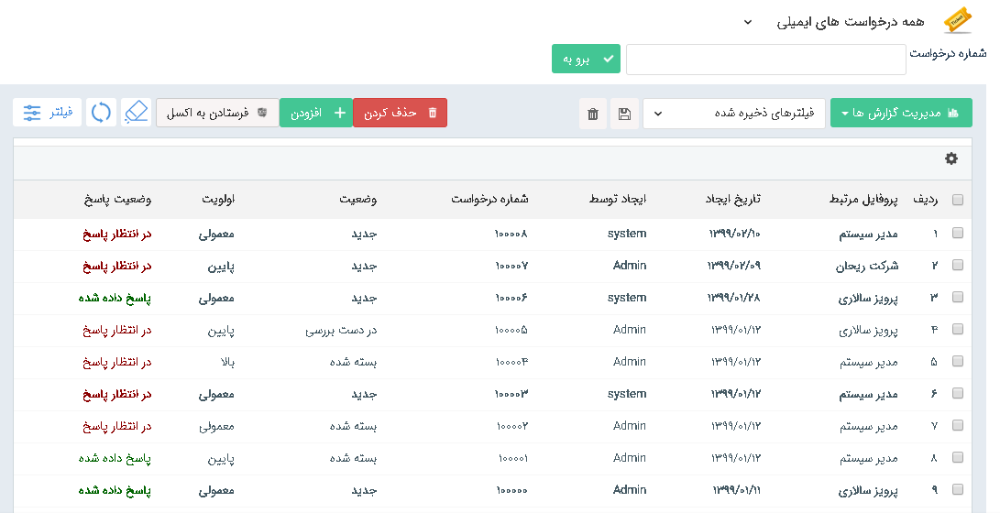

### فعالیت ارسال ایمیل در صورت خالی بودن محتوا

در این نسخه در تعریف فعالیت ایمیل، اگر محتوا پیام خالی نیز باشد، ایمیل ارسال میگردد.

 ### نمایش متن راهنما در فیلد‌های لیستی 
 
در فیلدهایی از نوع لیستی، هرگاه متن راهنما برای آن تعریف گردد، میتوان در آیتمی که این فیلد تعریف شده است با نگه داشتن ماوس روی آن فیلد، متن راهنما تنظیم شده را مشاهده کرد.

### افزودن مجوز مدیریت نشانی‌ها در قسمت مجوز‌های عمومی

با این قابلیت میتوان از طریق مسیر مدیریت مجوز‌ها -> مجوز‌های عمومی، مجوز دسترسی به بخش مدیریت نشانی‌ها را به کاربران سیستم داد. 
 لازم به ذکر است کاربر دارنده مجوز مدیریت نشانی‌ها، امکان مشاهده لیست نشانی‌ها، افزودن، حذف و ویرایش نشانی را دارد.

### افزودن امکان جستجوی فعالیت‌های سیستمی 

در فیلترهای ایجادکننده یا ویرایش کننده با واردکردن گزینه سیستم، لیست آیتم‌هایی که ایجاد کننده یا ویرایش کننده ی آنها سیستم بوده است، قابل مشاهده میباشد.

### امکان حذف مشتری انتخاب شده در فیلد لیست مشتری

هر گاه در فیلد لیست مشتری، یک مشتری انتخاب شود، حذف آن مشتری از لیست امکانپذیر است.

### حذف جداکننده اعداد(٬) در فیلدهای از نوع عدد در پیش نمایش

در پیش نمایش برای مقادیر فیلدهای از نوع عدد، بین هر سه رقم یک جداکننده جایگذاری میشد، که در این نسخه جایگذاری جداکننده صورت نمیگیرد.

### امکان جستجو قرار ملاقات براساس پارامتر محل ملاقات در تقویم 

در این نسخه در بخش تقویم کاری من، با فیلتر محل ملاقات (اتاق‌ها)، میتوان لیست قرار ملاقات‌هایی را مشاهده کرد، که در یک اتاق خاص برگزار میگردند.

کاربر میتواند با کمک این فیلتر، متوجه شود برای اتاقی در بازه زمانی مشخص، قرارملاقاتی ثبت شده است یا خیر

### لغو قرارملاقات 

در این نسخه، برای لغو قرارملاقات می‌توانید از دکمه لغو قرارملاقات از بخش ریبون استفاده کنید، در صورتی که می‌خواهید پیام کنسلی قرارملاقات به مدعوین جلسه ارسال شود می‌توانید از دکمه‌ی لغو قرارملاقات و ارسال پیام، موجود در این قسمت استفاده کنید.

لازم به ذکر است دکمه ارسال پیام لغو از بخش حاضران جلسه حذف گردیده است.

 ### افزودن قابلیت انتخاب همه تقویم‌ها در بخش تقویم کاری

 
در نسخه‌های پیشین بطور پیش فرض،در بخش تقویم کاری، قرارملاقات تمام تقویم‌ها نمایش داده می‌شد و می‌توانستید تقویمی را از بین لیست تقویم‌ها برای نمایش یا عدم نمایش انتخاب کنید.

در این ورژن در صورت این که تعداد تقویم‌های شما بیش از 5 تقویم باشد، بطور پیشفرض تقویمی برای نمایش انتخاب نشده است و شما می‌توانید تقویم مورد نظر خود را برای نمایش انتخاب کنید،همچنین امکان انتخاب همه تقویم‌ها از طریق گزینه همه فراهم گردیده است.

### عدم امکان ثبت پاسخ بر روی درخواست‌هایی که تحت چرخه هستند و به مرحله پایان رفته‌اند.

در صورتی که بر روی درخواستی فرآیندی فعال باشد و آن درخواست به مرحله پایانی برود، امکان ثبت پاسخ مجدد بر روی آن وجود ندارد.

### قالب شماره دهی

از قالب شماره دهی برای شماره گذاری هویت‌ها و انواع آیتم‌های مالی مانند فاکتورها، پیش فاکتورها، قرار دادها، دریافت‌ها و پرداخت‌ها استفاده میشود. شماره دهی این آیتم‌ها همانند پیشین به دو صورت دستی و سیستمی قابل انجام میباشد.

#### شماره دهی سیستمی

 برای شماره دهی آیتم‌ها بایستی مراحل زیر را طی کنید.

 A. تعریف قالب شماره دهی مورد نظر

برای تعریف قالب شماره دهی سیستمی، کاربر بایستی مجوز مدیریت شخصی سازی CRM  را داشته باشد. 
در صورت دارا بودن این مجوز، می‌توان از منو تنظیمات بخش الگو شماره گذاری، از طریق دکمه افزودن الگوی جدیدی برای شماره گذاری تعریف کرد و همچنین در این صفحه امکان مشاهده لیست قالب‌های شماره دهی و  امکان جستجو قالب مورد نظر  از بخش فیلتر براساس پارامترهای عنوان و قالب  وجود دارد.

>نکته : در لیست قالب‌های شماره دهی، تنها امکان حذف قالب‌هایی وجود دارد که تا به حال در آیتمی برای شماره گذاری استفاده نشده است..

با کلیک روی ویرایش نوع/افزودن زیرنوع  در صفحه شخصی سازی crm، و  کلیک بر روی دکمه + نیز میتوان الگوی جدید تعریف کرد و یا از لیست الگوهای تعریف شده، الگویی را برای شماره دهی آیتم‌های از این نوع موجودیت انتخاب کرد.

از هر دو مسیر با کلیک بر روی دکمه افزودن ، فرم زیر برای تعریف قالب شماره دهی نمایش داده میشود.

B.	الگو شماره گذاری: در این قسمت  امکان تعریف فرمت مورد نظر برای الگو شماره گذاری وجود دارد.
سه نوع پارامتر سیستمی برای استفاده در قالب شماره دهی وجود دارد :

1.	پارامتر (AN) برای شماره دهی آیتم‌ها بصورت خودکار میباشد، در صورت استفاده از این پارامتر در الگو شماره گذاری، آیتم‌ها به صورت خودکار براساس مقدار اولیه‌ی تعریف شده به صورت پی در پی شماره دهی میشوند.
نکته : لازم به ذکر است در صورت عدم استفاده از این پارامتر در الگو، تنها فرمت تعریف شده در الگو شماره گذاری به عنوان شماره‌ی آیتم در نظر گرفته می‌شود و مقدار اولیه در شماره نمایش داده نمیشود و باید آن آیتم را بصورت دستی شماره دهی کرد.

2.	پارامتر(MIYY)برای نمایش سال میلادی استفاده میشود.

3.	پارامتر (SHYY) برای نمایش سال شمسی در الگوی شماره گذاری استفاده میشود.
علاوه بر پارامتر‌های سیستمی امکان استفاده از کاراکتر‌های ثابت و تعریف پارامتر دلخواه در قالب شماره دهی وجود دارد که در ادامه به صورت مفصل توضیح داده خواهد شد.

برای تعریف الگو شماره گذاری مراحل زیر را طی کنید :

1-	هر پارامتر سیستمی یا پارامترهایی که توسط شما در قالب تعریف میگردد بایستی در داخل کروشه تعریف گردد.

2-	برای تعریف هر پارامتر در داخل کروشه بایستی تعداد کاراکتر آن مطابق روش‌های زیر مشخص کرد:

2.1.تعریف قالب شماره دهی با تعداد کاراکتر محدود: 

 برای این حصول ، پس از کروشه میتوان با کاراکتر underline  تعداد کاراکتر‌های مجاز  قالب شماره دهی را تعیین
کرد. 

برای نمونه در  در صورت استفاده از سه underline ، تعداد 3 کاراکتر  برای این قالب در نظر گرفته خواهد شد. مثال:  

لازم به ذکر است در این حالت فیلد مقدار اولیه بایستی حداکثر سه کاراکتره تعریف گردد. 

برای نمونه : در صورت تعریف مقدار اولیه 000 برای الگو مثال بالا، شماره آیتم‌ها از 001 الی 999 خواهد بود و پس از شماره 999 آیتم جدید دیگری ذخیره نخواهد شد.

2.2. تعریف قالب شماره دهی با تعداد کاراکتر‌های نامحدود :   

با استفاده از کاراکتر *  محدودیتی برای تعداد کاراکتر قالب شماره دهی در نظر گرفته نخواهد شد و  در این صورت شما میتوانید مقدار اولیه را با تعداد کاراکتر دلخواه مقدار دهی کنید.

برای نمونه ، در قالب شماره دهی  زیر با وارد کردن * پیش از (AN) و  تعریف مقدار اولیه 0 برای این قالب،  شماره آیتم‌ها از 1 الی بی نهایت خواهد بود.

4.	برای استفاده از پارامترها سیستمی نام پارامتر بایستی داخل پرانتز مطابق الگوی بالا تعریف گردد.

5.	در صورت اینکه بخواهید شماره‌ها از کاراکترهای ثابت پیروی کنند،این کاراکتر بایستی در قالب تعریف گردد.

مثال : فرض کنید شما میخواهید از کاراکتر dr- به صورت ثابت در شماره آیتم‌های خود استفاده کنید برای این حصول قالب میتواند به صورت نمونه به شکل زیر تعریف گردد.

dr-{*(AN)}

در صورت تعریف این الگو با مقدار اولیه 1، شماره اولین آیتم با این الگو به این صورت خواهد بود.

6.	در صورت اینکه بخواهید از یک پارامتر دلخواه در قالب شماره دهی استفاده کنید که این پارامتر در شماره قابل ویرایش باشد، بایستی الگوی زیر  را تعریف نمایید.

}(مقدار پیش فرض پارامتر:نام پارامتر بصورت دلخواه) مشخص کردن تعداد کاراکترها با استفاده از  underline {

با فرض تعریف این الگو برای یک قالب، مقدار پیش فرض A به جای این پارامتر در شماره آیتم‌ها نمایش داده میشود که به صورت دستی قابل ویرایش است .

#### برای تعریف الگو شماره گذاری رعایت موارد زیر الزامی میباشد : 

-	از یک نوع پارامتر سیستمی نمیتوان به دفعات در یک قالب استفاده کرد.

مثال :  نمیتوان از پارامتر (SHYY) بیش از یکبار در یک قالب استفاده کرد.

-	امکان استفاده از چند پارامتر سیستمی باهم وجود دارد.

برای نمونه میتوان در یک قالب هم از پارامتر میلادی هم از پارامتر شمسی در یک قالب استفاده کرد.

-	لازم به ذکر است در تعریف پارامتر‌های شمسی و میلادی به منظور مشخص نمودن تعداد کاراکترهای آن پارامتر،  بایستی  چهار underline  و یا * در داخل کروشه قبل از پارامتر قرارگیرد.

-	 در صورت استفاده از پارامترهای SHYY  و MIYY  در قالب شماره دهی، هنگام شماره دهی دستی آیتم می‌توان از سال 1357 الی یک سال پس از سال جاری، آیتم را شماره گذاری کرد.

-	بین هر دو پارامتر استفاده شده در قالب شماره دهی بایستی از یک کاراکتر برای جدا کردن آنها استفاده کرد. این کاراکتر می‌تواند بصورت دلخواه(به جز کاراکتر . و +) انتخاب شود. 

### ذکر چند نمونه برای تعریف الگوی شماره گذاری : 

فرض کنید می‌خواهید آیتم‌های مورد نظرتان بصورت موارد زیر شماره دهی شود، بنابراین به صورت زیر الگو آن تعریف گردد.

شماره :  002

•	شماره : 1/1398-100  

•	شماره:          

1398-100-DR/1

•	شماره : 

-1398-100A/4 

>نکته : در مثال اخر در تعریف الگو شماره گذاری از پارامتر دلخواه با نام H و با مقدار پیش فرض A استفاده شده است(که می‌توان هر پارامتری را با نام و مقدار پیش فرض دلخواه تعریف کرد) هنگام استفاده از این الگو، در شماره آیتم مقدار A بعنوان مقدار پیش فرض نمایش داده می‌شود که بصورت دستی می‌توان این پارامتر را در آیتم ویرایش کرد.

C.	مقدار اولیه : این مقدار بعنوان مقدار شروع شماره دهی قالب  در الگو در نظر گرفته می‌شود . 

>نکته : اولین شماره ای که به آیتم اختصاص داده می‌شود یکی پس از مقدار اولیه تعریف شده می‌باشد برای نمونه اگر مقدار اولیه 001 تعریف شود ، اولین شماره ی آیتمی که از این الگو استفاده می‌کند 002 خواهد بود .

D.	عنوان : عنوان قالب را وارد می‌کنیم. 

E.	در صورتی که بخواهیم با تغییر سال ، عدد سال یک واحد افزایش پیدا کند و شماره از ابتدای مقدار اولیه الگو پیروی کند ، باید این چک باکس فعال شود. در غیر این صورت با تغییر سال یک واحد به سال اضافه می‌شود و شماره از ادامه شماره‌های قبلی پیروی می‌کند.

F.	ذخیره کردن : با کلیک روی دکمه ذخیرهکردن ، این الگو در لیست قالب‌ها قرار میگیرد. با نگهداشتن ماوس روی آن قالب، میتوان عنوان قالب را هم مشاهده کرد . 

>نکته: امکان استفاده از یک قالب برای آیتم‌های مختلف وجود دارد. در صورتی که از یک قالب برای چندین آیتم استفاده شود در زمان شماره دهی به هر آیتم، آخرین شماره قالب مورد نظر به عنوان آخرین شماره اختصاص یافته در نظر گرفته شده و سیستم این شماره را یک واحد افزایش داده و به آیتم اختصاص می‌دهد. لازم به ذکر است که در این روش کلیه شماره‌های یک قالب به آیتم‌های مختلف اختصاص می‌یابند. به این ترتیب در کلیه نمونه‌های یک نوع آیتم، شماره‌ها ممکن است پشت سر هم نباشند.

برای نمونه : اگر در این بخش یک الگویی تعریف کنیم که قالب شماره دهی آن A_{*(AN)} و مقدار اولیه برای آن 1000 تعریف شده باشد و این الگو در هویت حقوقی و پیش فاکتور پیش فرض استفاده گردد، با فرض اینکه اول یک هویت ایجاد شود و بعد پیش فاکتور پیش فرض، شماره A_1001 به هویت و شماره A_1002 به پیش فاکتور پیش فرض اختصاص می‌یابد.

>نکته : در صورت انتخاب یک قالب شماره گذاری برای یک نوع موجودیت در بخش شخصی سازی، اگر از آن نوع آیتم ایجاد شده باشد و شماره گرفته باشد، دیگر امکان تغییر قالب شماره گذاری و انتخاب قالب دیگر برای آن آیتم وجود ندارد.

>نکته : لازم به ذکر است، الگوی شماره گذاری طبق آیتم‌های ذخیره شده پیش میرود.

>نکته : باید در نظر داشت که اگر الگویی به آیتمی اختصاص داده شود نمیتوان به آن آیتم به صورت دستی شماره ای خارج ار الگو تخصیص داد.

>نکته : لازم به ذکر است فعالیت تبدیل نوع برای آیتم‌های مالی و یا تبدیل هویت ،اگر آیتم و یا هویت شماره داشته باشد، تنها در صورتی تبدیل نوع انجام می‌شود که قالب شماره دهی آیتم مبدا و مقصد یکسان باشد.

### ویرایش قالب شماره دهی
در صورت ویرایش قالب شماره دهی، تمامی آیتم‌هایی که از این الگو استفاده کرده اند طبق الگوی جدید ویرایش می‌شوند.

برای نمونه :

شماره آیتم :

فرض کنید الگوی تعریف شده بصورت زیر ویرایش شود :

شماره آن آیتم بصورت زیر ویرایش خواهد شد : 

#### شماره دهی دستی
موارد زیر در مورد وارد کردن شماره دستی باید درنظر گرفته شوند:

1. در صورتی که کاربر شماره ای را به صورت دستی وارد کند، تنها در صورتی ذخیره می‌شود که شماره وارد کرده در تمام آیتم‌های دارای این قالب تکراری نباشد.

2. در صورتی که آخرین شماره در یک آیتم به صورت دستی وارد شده باشد، شماره دهی‌های بعدی این آیتم، از آخرین شماره ای که کاربر به صورت دستی وارد کرده بوده، ادامه می‌یابد.

نکته : کاربر برای شماره دهی دستی آیتم‌ها نیاز به مجوز شماره گذاری روی آن نوع ایتم را دارد . 

### تعریف الویت برای درخواست

درنسخه‌های پیشین، امکان تعیین اولویت برای درخواست‌ها، از طریق فیلد کشویی موجود در درخواست وجود داشت  .

در این نسخه، فیلد اولویت براساس دو فیلد شدت و تاثیرگذاری که به موجودیت درخواست اضافه شده اند،مقدار دهی میگردد.

>نکته : فیلد الویت در درخواست‌ها قابل ویرایش نیست و براساس ماتریس الویت مقدار دهی میشود. در صفحه شخصی سازی crm ، بخش ویرایش زیر نوع موجودیت درخواست، امکان تعریف ماتریس اولویت وجود دارد.

در تعریف  ماتریس اولویت  در سطر اول مقادیر فیلد تاثیر گذاری و در ستون اول مقادیر فیلد شدت  نمایش داده می‌شود . شما می‌توانید  به ازای هر مقدار شدت و تاثیر گذاری یک اولویت را تعیین کنید. 

برای نمونه : طبق تصویر اگر شدت درخواست ،در وضعیت جزئی  و تاثیرگذاری درخواست در وضعیت پایین باشد طبق تعریف انجام شده در این بخش، اولویت آن درخواست  پایین در نظر گرفته می‌شود .  

>نکته : در هنگام ثبت درخواست توسط مشتری در باشگاه مشتریان و یا از طریق ارسال ایمیل مقدار فیلد شدت بصورت پیش فرض متوسط و مقدار فیلد تاثیر گذاری، جدی در نظر گرفته می‌شود 

>نکته : در تنظیمات نمایشی فیلدها امکان انتخاب فیلد شدت و تاثیرگذاری برای نمایش در لیست و نمایش در خلاصه وجود دارد.

>نکته : امکان استفاده از پارامترهای هوشمند اولویت، شدت و تاثیر گذاری در نسخه فعلی وجود دارد .

>نکته : فیلد شدت و تاثیرگذاری در فعالیت‌های تخصیص مقدار و شرط در فرآیند قابل استفاده می‌باشد .

### ترتیب نمایش آیتم‌ها در لیست 

تنظیماتی با عنوان ترتیب نمایش به بخش ویرایش زیر نوع همه موجودیت‌ها در بخش شخصی سازی crm اضافه گردیده است با این امکان، میتوانید لیست آیتم‌ها را براساس فیلد مورد نظر خود مرتب سازی کنید.

از بخش ترتیب نمایش، فیلدی که میخواهید مرتب سازی آن نوع آیتم براساس آن صورت بگیرد و همچنین نحوه ی نمایش آن آیتم براساس مقادیر آن فیلد (صعوی/نزولی) انتخاب کنید .  

فیلدهایی که امکان مرتب سازی آیتم‌ها براساس آن‌ها وجود دارد تنها فیلد‌های اضافه شده ی از نوع عدد ،شناسه خودکار،تاریخ شمسی و تاریخ میلادی که دارای الزام می‌باشند به موجودیت‌های اصلی و زیر نوع موجودیت‌ها افزوده گردیده است.

 >نکته : اگر مقادیر فیلد انتخاب شده برای مرتب سازی، در بین آیتم‌ها یکسان باشد، حالت نمایش این آیتم‌ها در لیست، براساس تاریخ ایجاد و به صورت نزولی خواهد بود .

برای نمونه فرض کنید به آیتم فرم یک فیلد با عنوان تاریخ مرخصی اضافه کرده ایم و ترتیب نمایش فرم را براساس این فیلد تنظیم کرده ایم. اگر فرم‌هایی با یک تاریخ مرخصی یکسان وجود داشته باشند، ترتیب نمایش بین این چند فرم در لیست براساس تاریخ ایجاد و به صورت نزولی میباشد.

>نکته : قابل ذکر است تنها لیست آیتم‌ها براساس این ترتیب نمایش تعریف شده، مرتب سازی میگردد، و در سایر بخش‌ها مانند بانک یکپارچه و تب سوابق هویت و ... چینش آیتم‌ها به صورت قبل است.

>نکته : قابل ذکر است که ترتیب نمایش آیتم‌ها در لیست‌ها بصورت پیش فرض براساس تاریخ ایجاد آیتم و نزولی است 

### تنظیمات نمایشی فیلدها در موجودیت‌های اصلی نرم افزار 

در نسخه‌های پیشین در صفحه شخصی سازی crm، بخش تنظیمات نمایشی فیلدها تنها بر روی زیر نوع‌های موجودیت‌های crm وجود داشت. در این نسخه با افزودن این بخش به موجودیت‌های اصلی نرم افزار، این امکان فراهم گردیده است که فیلدهای مدنظر برای نمایش در لیست همه ی آیتم‌های از آن نوع، انتخاب گردد.

بنابراین در صفحات لیست آیتم‌های crm در صورت اینکه که فیلتر بر روی همه موجودیت‌های از آن نوع قرار گیرد، فیلد‌های تنظیم شده از این بخش در لیست آیتم‌ها نمایش داده میشود.

>نکته : میتوان از طریق بخش تنظیمات لیست آیتم‌ها(چرخ دنده بالای لیست آیتم‌ها) از لیست فیلد تعیین شده در این بخش، فیلد‌هایی را برای نمایش در لیست و یا دریافت خروجی اکسل انتخاب کرد.

>نکته : قابل ذکر است از طریق بخش تنظیمات نمایشی فیلدها بر روی موجودیت‌های اصلی نرم افزار تنها امکان انتخاب فیلد‌ها برای نمایش در لیست وجود دارد و نمیتوان تنظیمات نمایشی فیلدها در خلاصه را بر روی خود موجودیت اصلی تعریف کرد. زیرا در لیست آیتم‌ها برای هر آیتم بسته به نوع زیر نوع آن و مطابق تنظیمات صورت گرفته برای نمایش در خلاصه که برای همان زیر نوع خاص تعریف شده است، برخورد میشود.

### امکان انتخاب پیش شماره کشورها برای ثبت شماره هویت 

در این نسخه،هنگام ثبت شماره تماس برای هویت‌ها، میتوان پیش شماره کشور را انتخاب نمود. این پیش شماره به صورت لیست در کنار فیلد شماره تماس نمایش داده میشود.

در صورت اینکه در بخش تنظیمات کلی در قسمت تماس‌ها پیش شماره ای برای کشور انتخاب گردد، این پیش شماره بصورت پیش فرض در فیلد شماره تماس نمایش داده می‌شود.

>نکته : در هنگام ذخیره شماره تماس مخاطب ناشناس توسط سیستم و همچنین افزودن شماره تماس از لیست تماس، این شماره در فیلد شماره تلفن ذخیره میگردد) به عنوان مثال شماره موبایل هویت نیز با نوع تلفن ذخیره می‌شود که در صورت نیاز امکان ویرایش نوع از تلفن به سایر نوع‌ها ( موبایل و ..) وجود دارد.)

>نکته : در این نسخه، هنگام ذخیره شماره موبایل فرمت خاصی برای شماره موبایل بررسی نمیگردد.

>نکته : لازم به ذکر است در این نسخه برای ارسال فکس و یا استفاده از click to call برای برقراری تماس، از فرمت شماره بدون درج پیش شماره و یا شماره به همراه کدکشور و شهر پشتیبانی میگردد و در صورت اینکه تنها از پیش شماره شهر و یا کشور قبل از شماره استفاده گردد این ارسال صورت نمیگیرد.

### قابلیت ایجاد هویت جدید، از بخش مرتبط با تمامی آیتم‌ها، فیلد شرکت/شخص و فیلد لیست مشتری

در  این نسخه، در صورت جستجو هویت مورد نظر در فیلد‌های مرتبط با، شرکت/شخص و فیلد لیست مشتری، در صورت یافتن هویت مورد نظر، امکان انتخاب آن و در غیر این صورت با کلیک بر روی دکمه افزودن، امکان ایجاد هویت جدید وجود دارد.

### امکان ویرایش data set گزارش ذخیره شده 
در صورت این که بخواهید از گزارشات طراحی وذخیره شده خود، گزارش جدیدی با همان تنظیمات اما برای آیتم دیگری از همان نوع موجویت گزارشی تهیه کنید. این امکان با ویرایش گزارش مد نظر خود و از طریق دکمه ویرایش data set  امکان پذیر است.

میتوانید نوع  data set  گزارش خود  از بین آیتم‌های همان نوع انتخاب کنید.

### امکان تعریف نام دلخواه برای پارامتر‌های تعریف شده در گزارش ساز     

در صورت تعریف پارامتر در مرحله طراحی گزارش ،  با کلیک  بر روی دکمه بعدی صفحه ذیل نمایش داده میگردد 

1.با استفاده از این قسمت می‌توانید نوع هر پارامتر را از بین انواع فیلد‌های موجود در پیام گستر انتخاب نمایید. 

2 . با کلیک بر روی این قسمت، امکان تعریف نام به انواع زبان‌هایی که در بخش مدیریت زبان‌ها تعریف کرده اید وجود دارد.
قابل ذکر است شما در نمایش این گزارش، پارامترها را با نام و نوع تعیین شده ، مشاهده میکنید و میتوانید فیلتر و یا مرتب سازی خود را براساس این پارامترها  اعمال نمایید.

### امکان فیلتر هویت‌های بانک اطلاعاتی براساس انواع هویت

در این نسخه میتوان در بخش بانک اطلاعاتی، از طریق این فیلتر و انتخاب نوع هویت مورد نظر، تنها هویت‌های آن نوع را در دسته بندی بانک اطلاعاتی مشاهده و جستجو کرد.در صورت اعمال این فیلتر برروی بانک اطلاعاتی،تنظیمات نمایشی لیست هویت‌ها براساس تنظیمات صورت گرفته برای آن نوع هویت انتخاب شده اعمال میشود  و همچنین در صورت اینکه فیلتر بر روی کل بانک اطلاعاتی قرار بگیرد این تنظیمات از تنظیمات نمایشی هویت اصلی خوانده میشود.

### قابلیت اعمال مالیات و عوارض بر روی اضافات در فاکتورها

در بخش تنظیمات اضافات در شخصی سازی انواع فاکتورها، قابلیت اعمال مالیات و عوارض بر روی اضافات افزوده گردیده است که با فعال کردن چک باکس اضافات مشمول مالیات شود از این بخش، مبلغ مالیات تعلق گرفته به اضافات محاسبه و در محاسبات مبالغ فاکتور این مبلغ لحاظ میگردد همچنین با فعال کردن چک باکس اضافات مشمول عوارض گردد، مبلغ عوارض تعلق گرفته به اضافات در محاسبات فاکتور محاسبه و اعمال میگردد.

>نکته : لازم به ذکر است در صورت اینکه نوع اضافات از نوع درصد انتخاب شود و نحوه محاسبه اضافات روی گزینه مبلغ نهایی قرار گیرد امکان اعمال مالیات و عوارض بر روی اضافات وجود ندارد.

### نمایش نوتیفیکیشن هنگام دریافت ایمیل

### حذف دکمه لغو از ایمیل تغییر رمز عبور
