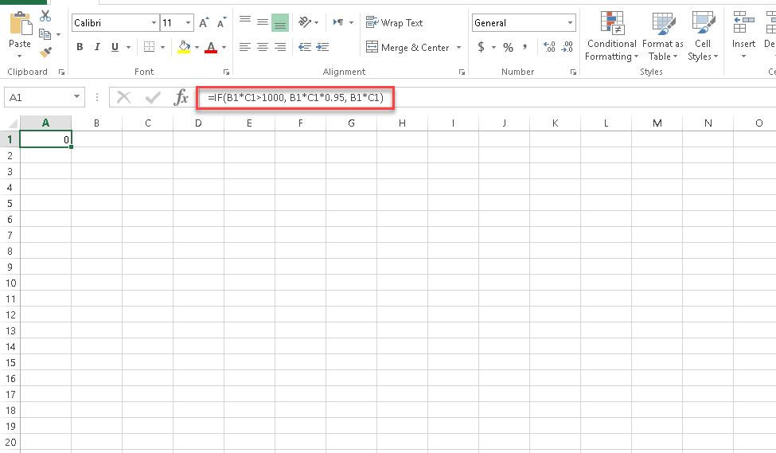

# شرح تغییرات نسخه‌ی 2.5.7

# سوابق
## فرصت
### رفع مشکل ثبت فرصت بصورت گروهی  
در صورتیکه نوع فرصت دارای فیلد لیستی ‌بود، امکان ذخیره فرصت بصورت تکی و گروهی از طریق راست کلیک بر روی هویت در بانک اطلاعاتی وجود نداشت. در این ورژن این مشکل برطرف گردیده است.

### اصلاح نمایش مرتبط با در سابقه‌ی ثبت شده در فرصت
در ورژن قبل اگر در عنوان فرصت کاراکتر کوتیشن " ’ "  گذاشته می‌شد، دیگر مرتبط با مربوط به سوابق ثبت شده برای آن فرصت نمایش داده نمی‌شد، همچنین در پیش نمایش هم فقط لود می‌شد. در این ورژن این مشکل برطرف گردیده است.

## انواع فاکتور
### امکان تعریف فرمول برای فاکتورها بصورت پیشرفته از طریق اکسل
در این ورژن امکان تعریف فرمول برای فیلد قیمت کل و تعداد در فاکتورها از طریق اکسل اضافه شده است.
از قسمت شخصی سازی، مدیریت فاکتورها ، بخش ویرایش فاکتور می‌توان فرمول محاسبه ای برای  تعداد محصولات (مقدار ) و قیمت کل تعریف کرد.

برای تعریف فرمول ابتدا باید "چک باکس " روش محاسبه بر اساس اکسل " فعال گردد و گزینه تنظیمات انتخاب شود.
در این بخش می بایست فایل اکسلی که شامل فرمول تعریف شده می‌باشد، پیوست گردد. 

**ورودی‌ها:**
در بخش کد فیلد، فیلدی را که مقدارش به عنوان ورودی به اکسل در نظر گرفته می شود، انتخاب می کنیم و در قسمت سلول نیز تعیین می کنیم مقدار فیلد انتخاب شده باید برای "کدام" یک از سلول های اکسل لحاظ شود. لازم به ذکر است در این حالت می توان از فیلدهای اضافه ردیف فاکتور به عنوان ورودی استفاده نمود. به علاوه، در محاسبه‌ی قیمت کل، فیلد تعداد و قیمت واحد نیز به عنوان ورودی قابل انتخاب می‌باشند.

**خروجی:**
سلول اکسلی که در آن فرمول موردنظر تعریف شده است باید انتخاب شود، این خروجی در فیلدی که فرمول نویسی برای آن انجام ‌می‌شود(تعداد یا قیمت کل) نمایش داده می‌شود.

مثال: برای قیمت کل پیش فاکتور فرمول زیر در اکسل تعریف شده است. 

اگر قیمت واحد سلول B1 اکسل و تعداد محصول سلول C1 درنظر گرفته شود و هر دو به عنوان ورودی باشند، طبق فرمول بالا در صورتیکه مقدار قیمت واحد ضرب در تعداد بزرگ تر از 1000 باشد، این مقدار در 0.95 ضرب می‌شود و در خروجی که همان قیمت کل است نمایش داده می‌شود و در غیر این صورت اگر مقدار قیمت واحد ضرب در تعداد کوچیک تر از 1000 باشد همان مقدار قیمت واحد ضرب در تعداد در قیمت کل نمایش داده می‌شود.

### رفع مشکل صفر شدن مبلغ عوارض
در صدور پیش‌فاکتور از روی فرصت، درصورت ویرایش قیمت واحد محصول در پیش‌فاکتور، عوارض آن محصول صفر می‌شد. در این ورژن این مشکل برطرف شده است.

### محاسبه‌ی مجدد مبالغ فاکتور پس از ویرایش تخفیف 
در این ورژن درصورت ویرایش مجموع تخفیف بصورت عدد یا بصورت درصد در پیش‌فاکتورها و فاکتورها تمامی مبالغ مرتبط با آن نیز مجدد محاسبه می‌گردد.

منظور از مبالغ مرتبط مجموع مالیات، مجموع عوارض، مبلغ کل و اضافات در صورتیکه پس از اعمال تخفیف محاسبه گردد، می‌باشد.
در ورژن قبل پس از ویرایش تخفیف تنها مبلغ نهایی ویرایش می‌شد.

### رفع مشکل افزودن محصول به انبار از طریق فاکتور خرید
در ورژن قبل در صورتیکه در شخصی سازی فاکتور خرید، صدور رسید خودکار فعال بود، مشکل افزودن محصول به انبار از طریق فاکتور خرید وجود داشت، زیرا هنگام ایجاد فاکتور خرید نام انبار برای انتخاب نمایش داده نمی‌شد. در این ورژن این مشکل برطرف گردیده است.

### رفع مشکل ویرایش دستی اضافات در پیش فاکتورها و فاکتورها
زمانی که در تنظیمات شخصی‌سازی پیش فاکتورها و فاکتورها اضافات تعریف می‌شد، مقدار اضافات در خود پیش فاکتورها و فاکتورها قابل ویرایش نبود، به این معنی که هنگامی که اضافات را ویرایش می‌کردیم پس از ذخیره به حالت قبلی برمی‌گشت، در حال حاضر مشکل برطرف گردیده و اضافات قابل ویرایش می‌باشد.

### رفع مشکل نمایش تعداد رقم اعشار در پیش فاکتور صادر شده از فرصت
در ورژن قبل در صورت صدور پیش‌فاکتور از روی فرصت اگر تعداد(مقدار) محصول در فرصت بصورت اعشاری بود، در پیش‌فاکتور صادر شده تعداد رند می‌شد. در این ورژن این مشکل برطرف گردیده است. به این صورت که در فرصت تعداد(مقدار) محصول تا 4 رقم اعشار می¬پذیرد و  پیش فاکتور براساس تعداد رقم اعشار مقدار  تنظیم شده در شخصی سازی رند می‌شود.

## فرم

### امکان ورود و ویرایش اطلاعات فرم‌ها از طریق اکسل 
در این ورژن قابلیت ورود و ویرایش اطلاعات فرم‌ها از طریق اکسل به پیام‌گستر اضافه شده است.
برای مطالعه‌ی راهنمای ورود اطلاعات از طریق اکسل به بخش پیوست 1 مراجعه کنید.

### رفع مشکل خالی شدن فیلد تلفن و موبایل در فرم عمومی
در فرم عمومی در صورت خالی بودن فیلدهای الزامی یا اشتباه بودن کد اعتبارسنجی صفحه رفرش می‌شود، در ورژن قبل درصورت رفرش صفحه  فیلد شماره تلفن و موبایل خالی می‌شد. این مشکل برطرف گردیده است.

## قرارداد

### امکان ورود و ویرایش اطلاعات قراردادها از طریق اکسل
در این ورژن قابلیت ورود و ویرایش اطلاعات قراردادها از طریق اکسل به پیام‌گستر اضافه شده است.

برای مطالعه‌ی راهنمای ورود اطلاعات از طریق اکسل به بخش پیوست 1 مراجعه کنید.

## دریافت/پرداخت

### امکان ورود و ویرایش اطلاعات دریافت/پرداخت از طریق اکسل
در این ورژن قابلیت ورود و ویرایش اطلاعات دریافت‌ها/پرداخت‌ها از طریق اکسل به پیام‌گستر اضافه شده است.پ

برای مطالعه‌ی راهنمای ورود اطلاعات از طریق اکسل به بخش پیوست 1 مراجعه کنید.

## قرارملاقات 

### اضافه شدن پارامترهای زمان شروع و پایان در پیام‌های سیستمی 
در پیام سیستمی‌های لغو قرارملاقات، تغییر قرارملاقات یا یادآوری قرارملاقات پارامترهای تاریخ شروع قرارملاقات، تاریخ پایان قرارملاقات، زمان شروع قرارملاقات و زمان پایان قرارملاقات اضافه شده است. لازم به ذکر است پارامتر بازه‌ی زمانی همچنان در پیام‌های سیستمی قرارملاقات وجود دارد.

### رفع مشکل حذف مدعوین 
در ورژن قبل حذف مدعوین از قرارملاقات مشکل داشت، به این معنی که هنگام حذف آخرین مدعو موجود در لیست، آن مدعو حذف نشده و مدعو دیگری حذف می‌شد که این مشکل مرتع گردیده است.

## وظیفه 

### اصلاح نمایش ماه در بخش تغییرات وظیفه
در آیتم وظیفه بخش تغییرات، ماه تغییرات را  فقط اسفندماه نمایش می‌داد. این مشکل اصلاح گردیده است.

# تبلیغات 

## افزایش تعداد ارقام فیلد هزینه‌ی برآوردی در فعالیت تبلیغاتی پ
در فعالیت تبلیغاتی در بخش مدیریت کمپین‌ها تعداد ارقام فیلد هزینه‌‌ی برآوردی  از 10 رقم به 14 رقم افزایش یافته است.

## رفع مشکل ارسال خبرنامه از طریق پیامک و ایمیل
در ورژن قبل درصورت تعریف خبرنامه از طریق پیامک و ایمیل لیست ارسال برای مخاطبان تشکیل نمی‌شد و برنامه بصورت تازه درج شده باقی می‌ماند، در این ورژن این مشکل وجود ندارد.

## رفع مشکل ارسال پیامک تبریک با استفاده از مدیریت رویداد
در ورژن قبل ارسال پیامک تبریک در تاریخ تولد با استفاده از مدیریت رویدادها انجام نمی‌شد.

## اصلاح نمایش تاریخ دریافت پیام در خروجی اکسل
در دریافت خروجی اکسل از پیام‌ها، تاریخ دریافت پیام به درستی نمایش داده نمی‌شد.

## امکان انتخاب دسته بندی مشاغل در ارسال گروهی چاپ 
در مدیریت چاپ گروهی، زمانی که از دسته بندی مشاغل برای انتخاب مخاطبان استفاده می‌شد، در صورت انتخاب هر دسته بندی  خطای “ تعداد قابل انتخاب حداکثر 0 می باشد” نمایش داده می‌شد. در این ورژن این مشکل برطرف گردیده است، به این صورت که حداکثر تعداد هویت‌های قابل انتخاب برابر با تعدادهویت‌های موجود در دسته بندی می‌باشد و در صورت تعیین تعداد موردنظر، هویت‌ها بصورت رندوم از آن دسته بندی انتخاب می‌شوند.

# بانک اطلاعاتی

## بهبود عملکرد ورود و ویرایش اطلاعات هویت‌ها از طریق اکسل 
در این ورژن عملکرد ورود و ویرایش اطلاعات هویت‌ها از طریق اکسل تغییر کرده و بهبود یافته است.

برای مطالعه‌ی راهنمای ورود اطلاعات از طریق اکسل به بخش پیوست 1 مراجعه کنید.

## رفع مشکل مشاهده‌ی دسته بندی‌‌های بانک اطلاعاتی با تعداد کم‌تر از 10 عضو 
در بانک اطلاعاتی پیام‌گستر مشاهده‌ی دسته بندی‌ها با تعداد کم تر از 10 عضو مشکل داشت، به این معنی که با کلیک بر روی این دسته بندی‌ها عضوی نمایش داده نمی‌شد، در این ورژن این مشکل برطرف گردیده است.

## عدم امکان انتخاب دسته بندی‌های اختصاصی شده به عنوان زمینه فعالیت
در ورژن قبل امکان انتخاب دسته بندی های اختصاصی شده‌ی کاربران، به عنوان زمینه فعالیت هویت‌ها توسط کاربران دیگر وجود داشت، که در این ورژن این مشکل برطرف گردیده است و هر کاربر می‌تواند دسته بندی‌های عمومی و دسته ‌بندی‌هایی که خود اختصاصی کرده را برای انتخاب زمینه فعالیت هویت مشاهده کند.

## اصلاح نمایش خلاصه در لیست هویت‌ها
برخی فیلدها برای نمونه شماره موبایل در لیست هویت‌ها در بخش خلاصه، بدون مقدار نمایش داده می‌شدند که در این ورژن این مشکل برطرف گردیده است. 

## اصلاح عملکرد ارسال گروهی از طریق راست کلیک بر روی هویت‌ها
ارسال گروهی پیام از طریق راست کلیک بر روی هویت ها خطا داشت که در این ورژن برطرف گردیده است.

## اصلاح عملکرد سطح دسترسی کاربران در تبدیل سرنخ به مخاطب
در ورژن قبل در تبدیل سرنخ به مخاطب، کاربر بدون مجوز ایجاد بر روی نوع مخاطب انتخاب شده می‌توانست سرنخ را به مخاطب تبدیل کند.

در این ورژن در هنگام تبدیل سرنخ، کاربر تنها مخاطب‌هایی را مشاهده می‌کند که نوع آن‌ها با نوع سرنخ یکسان است و مجوز ایجاد آن نوع مخاطب‌ها را داشته باشد.

## نمایش صحیح نام کاربری باشگاه مشتریان در خروجی اکسل 
در صورتیکه در لیست هویت‌ها یا در جستجوی پیشرفته نام کاربری باشگاه مشتریان برای نمایش در لیست انتخاب شده بود،  هنگام دریافت خروجی اکسل از هویت‌ها نام کاربری بصورت صحیح نمایش داده نمی‌شد، در این ورژن مشکل برطرف گردیده است.

# گزارشات 

## گزارشات سیستمی 

### اصلاح عملکرد فیلتر براساس نوع در گزارشات فرصت 
در گزارشات crm، بخش عملیات crm در گزارش از فرصت‌ها اگر بر اساس نوع فرصت فیلتر می‌شد، این فیلتر اعمال نشده و  از تمامی نوع فرصت ها گزارش داده می‌شد. این مشکل اصلاح شده است.

### رفع مشکل نمایش سال تاریخ ایجاد فرصت‌هادر گزارش
در گزارشات crm، بخش عملیات crm در گزارش از فرصت‌ها نمایش سال در فیلد تاریخ ایجاد نادرست بود، که در این ورژن اصلاح گردیده است.

## گزارش‌ساز

### امکان ساخت گزارش از گروه هدف 
در این ورژن امکان دریافت گزارش از گروه‌های هدف در کوئری ساز اضافه شده است.

### امکان ساخت گزارش از مدعوین قرارملاقات
امکان دریافت گزارش از مدعوین قرار ملاقات به کوئری ساز اضافه شده است.

### امکان ساخت گزارش از پاراف وظیفه و کاربران مربوطه
در گزارش ساز امکان دریافت گزارش از پاراف وظیفه و همچنین کاربران مربوط به آن پاراف اضافه شده است.

### اضافه شدن جدول ردیف محصولات فرصت به کوئری ساز
در این ورژن جدول مربوط به ردیف محصولات فرصت به بخش کوئری ساز گزارش ساز اضافه شده است.

### امکان ساخت گزارش از ردیف محصول فرصت 
در گزارش ساز عادی امکان استفاده از دیتا ست ردیف محصولات فرصت در دسترس قرار گرفته شده است.

### امکان ساخت گزارش از ردیف محصول پیش فاکتور
در گزارش ساز عادی امکان استفاده از دیتا ست ردیف محصولات پیش فاکتور در دسترس قرار گرفته شده است.

### امکان ساخت گزارش از لاگ تماس‌ها
در این ورژن جدول مربوط به لاگ تماس‌ها به بخش کوئری ساز گزارش ساز اضافه شده است. 

### الزامی شدن order by در کوئری ساز 
برای استفاده از کوئری ساز استفاده از دستور order by  الزامی شده است.

### اضافه شدن انواع پارامترهای جدید برای فیلتر 
قبل از ذخیره گزارش، می بایست نوع پارامتر تعریف شده جهت انجام فیلتر تعیین شود. حال در این ورژن به این لیست، پارامترهایی به شرح زیر اضافه شده است:

لیست انبار و گروه انبار، لیست محصولات و گروه محصولات، علت موفقیت فرصت، سیستم تلفنی، دسته بندی مشتریان، بازه‌ی زمانی با تفکیک زمانی، بازه ی زمانی، زیر نوع فاکتور فروش و حواله انبار، زیرنوع فاکتور خرید و رسید انبار، زیر نوع حواله/رسید انبار و فاکتور فروش، زیرنوع حواله/رسید انبار و فاکتور خرید، انبار، وضعیت انبار، نوع ارتباط، فیلتر پیشرفته مخاطبان، نوع فعالیت، نوع قرارداد، نوع فرصت، کمپین، نوع تماس، ترتیب بندی تماس و منبع فرصت

### اصلاح محدودیت کاربران برای مشاهده و ویرایش گزارش‌ها 
در دسته بندی گزارش‌ها کاربران باید با توجه به مجوز تعیین شده گزارش ها را مشاهده یا ویرایش (طراحی) کنند، همچنین کاربر سازنده گزارش امکان مشاهده و ویرایش را دارد، در ورژن قبل کاربر بدون مجوز امکان مشاهده گزارش را داشت.

لازم به ذکر است امکان تعیین مجوز و حذف گزارشات توسط ادمین یا سازنده آن ها تعیین می‌شود.

### رفع مشکل حذف پارامتر از گزارش 
در صورتیکه پارامتر اضافه شده به گزارش ساخته شده در هنگام ویرایش گزارش حذف می‌شد، در مرحله سوم هنگام مشاهده گزارش  همچنان پارامتر حذف شده نمایش داده می‌شد، در این ورژن مشکل برطرف گردیده است.

### نمایش صحیح فیلد واریز به و برداشت از در گزارشات دریافت/ پرداخت
در هنگام دریافت گزارش از  آیتم‌های دریافت/پرداخت، مقدار فیلدهای واریز به/برداشت بصورت صحیح نمایش داده نمی‌شد، در این ورژن این مشکل اصلاح گردیده است.

### اصلاح نمایش نام رنگ 
در ایجاد گزارش از هویت با استفاده از گزارش ساز، درصورت انتخاب فیلد پیش نمایش رنگ، خروجی این فیلد بصورت صحیح نمایش داده نمی‌شد. در این ورژن نام رنگ در خروجی بصورت صحیح نمایش داده می‌شود.

### اصلاح عملکرد فیلتر فیلد شرکت/شخص 
در گزارش ساز هنگام فیلتر براساس فیلد از نوع شرکت/شخص، فیلدی از نوع نام کاربری نمایش داده ‌می‌شد، در این ورژن مشکل برطرف گردیده است. 

# کارتابل 

## رفع مشکل تایید و شماره گذاری آیتم‌ها در کارتابل من 
در ورژن قبل در صورتی که تعداد آیتم‌ها در کارتابل من زیاد بود، از صفحه‌ی اول به بعد تایید و شماره گذاری آیتم‌ها بصورت صحیح انجام نمی‌شد و برای نمونه هنگام تایید یک پیش فاکتور، پیش فاکتور دیگری تایید می‌شد که این مشکل رفع شده است.

## رفع مشکل دریافت خروجی اکسل از کارتابل فرآیند
هنگام دریافت خروجی اکسل از کارتابل فرآیند، به جای آیتم‌های تحت فرآیند موجود در کارتابل کاربر درحال دریافت خروجی،  تمامی آیتم‌های تحت فرآیند موجود در نرم‌افزار‌ نمایش داده می‌شد. در این ورژن مشکل برطرف شده است.

## رفع مشکل فیلتر براساس نوع در کارتابل وظیفه و پیگیری 
در کارتابل وظیفه و پیگیری هنگام فیلتر براساس نوع وظیفه و ارجاع، فیلتر اعمال نشده و پیگیری‌ها هم نمایش داده می‌شد که این مشکل برطرف گردیده است.

## اصلاح عملکرد کارتابل من در بخش تنظیمات من 
در تنظیمات من بخش کارتابل من می‌توان آیتم‌های موردنظر را برای نمایش در کارتابل انتخاب نمود، در ورژن قبل تنطیمات این بخش اعمال نمی‌شد که در این ورژن اصلاح گردیده است.

# جستجوی آیتم‌ها

## اضافه شدن امکان فیلتر بصورت بازه‌ای برای فیلدهای پول و عدد
فیلترهایی که براساس فیلدهای از نوع "عدد" و "پول "می‌باشند، مانند فیلدهای از نوع "تاریخ" به فیلترهای بازه‌ای تغییر کرده¬اند. برای نمونه فیلتر فیلد از نوع عدد بصورت "عدد از" و "عدد تا " تغییر کرده است.

## رفع مشکل فیلتر پیشرفته‌ی ‌مخاطبان در موردمعامله
در منوی خرید، فروش و انبار، قسمت معاملات، هنگام استفاده از فیلتر پیشرفته‌ی مخاطبان، بخش موردمعامله، صفحه در حالت لود باقی می‌ماند که این مشکل برطرف گردیده است.

# مرحله بندی 
## اصلاح نمایش کامل مراحل فرصت در نمای کانبان لیست فرصت‌ها 
در لیست فرصت‌ها در نمای کانبان، مراحل فرصت بصورت کامل نمایش داده نمی‌شد، به این معنی که با اسکرول مراحل بعدی نمایش داده نشده و بازهم مراحل اول قابل مشاهده بود، در حال حاضر این مشکل برطرف گردیده است.

## عدم امکان تعریف مرحله در تراکنش های انبار
امکان تعریف مرحله برای تراکنش‌های انبار وجود ندارد و در شخصی سازی تراکنش‌ها این قابلیت حذف شده است.

# تنظیمات 

## اضافه شدن تنظیمات ارز به نرم‌افزار
در بخش تنظیمات کلی نرم‌افزار، تنظیمات مرتبط با ارز اضافه شده است که در حال حاضر تنها ارز قابل پشتیبانی ریال می‌باشد و امکان تعیین تعداد اعشار آن وجود دارد.
تعداد اعشار ارز ریال می‌تواند از 0 تا 2 رقم باشد.
تعداد اعشار در حالتیکه قیمت گذاری در لیست قیمت بر اساس رقم باشد، از این تنظیمات پیروی می کند، به علاوه فیلدهای اضافه از نوع پول نیز به همین شکل می باشند.

## رفع مشکل حذف محتوای پیام‌های سیستمی 
در ورژن قبل امکان حذف محتوای پیام‌های سیستمی وجود نداشت، به این معنی که اگر محتوای یک پیام سیستمی در هر کدام از گام‌ها حذف می‌شد پس از ذخیره مجدد همان پیام‌ها قابل مشاهده بود.

## لیست قیمت 
### دریافت خروجی، ورود و ویرایش اطلاعات لیست قیمت‌ها از طریق اکسل
در این ورژن قابلیت دریافت خروجی از لیست قیمت‌ها و همچنین امکان ورود و ویرایش اطلاعات لیست قیمت‌ها از طریق اکسل به پیام‌گستر اضافه شده است.

برای مطالعه‌ی راهنمای ورود اطلاعات از طریق اکسل به بخش پیوست 2 مراجعه کنید.

### امکان تعریف سیاست قیمت‌گذاری محصول بصورت اعشاری
در بخش مدیریت لیست قیمت‌ها امکان تعریف سیاست قیمت‌گذاری برای محصول براساس رقم و درصد بصورت اعشاری اضافه شده است.

تعداد اعشار در تعریف سیاست قیمت‌گذاری درصدی تا دو رقم اعشار می‌باشد و در صورتی که سیاست قیمت‌گذاری براساس رقم باشد، تعداد اعشار قابل تعریف در این بخش طبق تنظیمات اعمال شده در تنظیمات کلی،  قسمت ارز می‌باشد.

# شخصی سازی

## رفع مشکل عدم نمایش راهنما برای فیلدها
مشکل عدم نمایش راهنمای فیلدهای از نوع متن، تصویر، تاریخ و لیست کشویی برطرف گردیده است.

## امکان حذف نوع درخواست ایجاد شده در شخصی سازی 
در ورژن قبل در صورت ایجادنوع درخواست جدید در شخصی سازی، امکان حذف آن وجود نداشت که در این ورژن این مشکل برطرف گردیده است.

## قالب چاپ(پیش نمایش)
### امکان اشتراک گذاری قالب چاپ آیتم‌ها
در این ورژن امکان اشتراک گذاری قالب چاپ (پیش نمایش) آیتم‌ها از طریق ایجاد لینک اشتراک گذاری فراهم شده است.

برای این منظور در هر آیتم کلیدی با عنوان ایجاد لینک اشتراک گذاری  وجود دارد که با کلیک بر روی آن در صورتیکه آیتم دارای قالب چاپ باشد، لینک اشتراک گذاری آن قالب ایجاد می‌گردد.

با استفاده از این لینک در مرورگر امکان مشاهده‌ی این قالب بصورت تصویر با فرمت TIFF وجود دارد.
همچنین فعالیت ایجاد لینک اشتراک گذاری به طراحی فرآیند اضافه شده است که با استفاده از آن فعالیت، لینک اشتراک گذاری بصورت خودکار ایجاد می‌گردد.

پارامتر هوشمند لینک اشتراک گذاری برای استفاده در پیام‌های سیستمی و پیش نمایش در دسترس قرار گرفته است.

### پارامترهوشمند هویت در قالب پیش نمایش تراکنش‌های انبار
امکان استفاده از پارامترهای هوشمند تحویل گیرنده و تحویل دهنده در قالب پیش نمایش حواله و رسید انبار وجود دارد.

### رفع مشکل پارامتر فیلد از نوع لیست مشتری 
پیش نمایش فیلد از نوع لیست مشتری در صورتی که هویت از نوع حقیقی به آن اضافه می‌شد مشکل داشت و مقدار آن خالی نمایش داده می‌شد.در این ورژن مشکل برطرف شده است.

## چرخه‌ی کاری
### قابلیت استفاده از فیلدهای رسید و حواله انبار در فعالیت ارسال فکس 
در فعالیت ارسال فکس در صورت انتخاب گزینه‌ی Send This Field امکان انتخاب فیلد رسید و حواله انبار فراهم شده است.

### اضافه شدن فعالیت اجرای دستورات پایگاه داده
با استفاده از فعالیت اجرای دستورات پایگاه داده می‎توان از طریق تعریف Expression تبادل اطلاعات را بین پیام‌گستر و دیتابیس‌های دیگری انجام داد.

برای مطالعه راهنمای استفاده از این فعالیت به پیوست شماره 4 مراجعه کنید. 

### امکان استفاده از Expression در فعالیت تخصیص مقدار و چندشرطی
با اضافه شدن قابلیت  تعریف Expression در فعالیت‌های تخصیص مقدار و چندشرطی می‌توان اطلاعات  را از دیتابیس‌های دیگر دریافت کرده و در  خروجی موردنظر مشاهده کرد.

برای مطالعه‌ی راهنمای استفاده از این فعالیت‌ها به فایل پیوست 5 و 6  مراجعه کنید. 

همچنین برای مطالعه‌ی راهنمای تعریف Expression به بخش پیوست 3 مراجعه کنید.

### اضافه شدن فعالیت ایجاد لینک اشتراک گذاری
فعالیتی با نام  ایجاد لینک اشتراک گذاری به طراحی فرآیند اضافه شده است که با این آن فعالیت،  لینک مربوط به قالب چاپ (پیش نمایش) آیتم تحت چرخه را بصورت خودکار ایجاد می‌گردد تا برای اشتراک گذاری استفاده شود.

با استفاده از این لینک در مرورگر امکان مشاهده‌ی این قالب چاپ(پیش نمایش) بصورت تصویر با فرمت TIFF وجود دارد.

### رفع مشکل تبدیل نوع از طریق فعالیت
در ورژن قبل تبدیل نوع از طریق فعالیت انجام نمی‌شد، در حال حاضر با استفاده از فعالیت تبدیل نوع امکان تبدیل نوع هویت به شکل زیر وجود دارد : 

تبدیل مخاطب حقوقی به مخاطب حقیقی

تبدیل مخاطب حقیقی به مخاطب حقوقی

تبدیل سرنخ حقیقی به سرنخ حقوقی

تبدیل سرنخ حقوقی به سرنخ حقیقی

# دسترسی‌ها
## اصلاح عملکرد سطح دسترسی ویرایش مسئول در هویت
مجوزهای مورد نیاز جهت ویرایش مسئول فروش، پشتیبانی و متفرقه‌ی هویت:

1)کاربر با مجوز مدیر پشتیبانی می‌تواند مسئول پشتیبانی،  با مجوز مدیر فروش می‌تواند مسئول فروش و با مجوز مدیر بانک اطلاعاتی و مدیر سیستم می‌تواند هر سه مسئول را ویرایش کند.

2)درصورت فعال بودن چک باکس " اجازه تخصیص کارشناس پروفایل به کاربران دیگر " در تنظیمات کلی، بخش امنیتی، هر کاربر که به عنوان مسئول هویت تعیین شده باشد می‌تواند برای خود جانشین تعیین کند.

3)کاربری که اولین بار این فیلدها را مقدار دهی کرده باشد می‌تواند این سه مسئول را ویرایش کند،
در ورژن قبل هنگامی که کاربر ویرایشی روی هویت انجام می‌داد، بدون داشتن هیچ کدام از مجوزهای ذکرشده این فیلدها را بصورت فعال مشاهده می‌کرد و امکان ویرایش این سه مسئول را داشت. در این ورژن این مشکل برطرف گردیده است و کاربر تنها در صورت داشتن این مجوزها امکان ویرایش سه مسئول را دارد.

## اصلاح عملکرد مجوز جستجوی پیشرفته 
مجوز جستجوی پیشرفته در ورژن قبل مشکل داشت، به این معنی که کاربر با داشتن این مجوز در صفحه‌ی جستجوی پیشرفته با کلیک بر روی فیلتر دسترسی سریع دیگر امکان استفاده از سایر فیلترها را نداشت و خطا نمایش داده می‌شد که این مشکل برطرف شده است.

# انبارداری
## رفع مشکل فیلتر براساس سریال در اقلام کالای تراکنش‌های انبار 
در بخش مدیریت اقلام کالا در رسید مرجوعی، حواله‌ی مرجوعی و حواله‌ها، فیلتری با نام  سریال از و سریال تا در قسمت انتخاب اقلام کالا وجود داشت که عمل نمی‌کرد، در این ورژن این مشکل برطرف گردیده است.

## رفع مشکل انتخاب سریال در تراکنش‌های بین انباری 
زمانیکه سریال کالا در هنگام صدور تراکنش بین انباری انتخاب نمی‌شد و پس از  ذخیره هنگام ویرایش آن تراکنش، سریال انتخاب می‌شد، خطا داشت و ورود و خروج سریال به مشکل می‌خورد، در این ورژن این مشکل برطرف شده است.

## رفع مشکل "مدیریت اقلام کالا" در حواله انبار 
در حواله‌ی انبار صفحه‌ی مدیریت اقلام کالا در هنگام بارگذاری خطای timeout داشت، در این ورژن این مشکل برطرف گردیده است.

# ویجت‌ها
## رفع مشکل ویجت ساعت 
در ویجت ساعت اگر  زمانی که بعداز ظهر است انتخاب شود که براساس pm  نمایش داده شود، باز هم براساس am نمایش داده می‌شود. این مشکل برطرف شده است.

# نظرات
## رفع مشکل نام بردن از کاربران غیر فعال 
در ورژن قبل امکان نام بردن کاربر غیرفعال در قسمت نظرات وجود داشت، در این ورژن این مشکل برطرف گردیده است و در بخش نظرات تنها کاربران فعال قابل انتخاب می‌باشند. 

