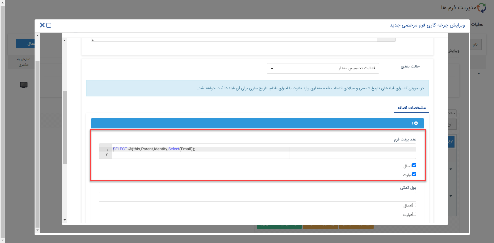

# فعالیت تخصیص مقدار

در این فعالیت امکانی اضافه شده است که مقدار فیلدها از طریق نوشتن Custom Expression که به صورت مجزا در بخش Expression توضیح داده شده است، تعیین شود.

برای استفاده از این فعالیت از مسیر تنظیمات،شخصی سازی crm، نمای کلی، ویرایش چرخه کاری اقدام نمایید. در این بخش با انتخاب فعالیت جدید می توانید، از فعالیت تخصیص مقدار در فرآیند خود استفاده کنید.

در صورتیکه بخواهید مقدار دهی فیلدها از بانک اطلاعاتی پیام‌گستر انجام شود، باید چک باکس عبارت فعال شود و کوئری موردنظر برای دریافت اطلاعات نوشته شود.

> **نکته:** امکان استفاده از عبارت برای مقداردهی فیلدها در حال حاضر فقط بر روی آیتم‌هایی از نوع فرم، هویت، وظیفه، درخواست پشتیبانی و انواع فاکتور، پیش فاکتور و فاکتورهای برگشت از خرید و فروش قابل استفاده می باشد.

> **نکته:** نکته: نوع فیلدی که برای مقدار دهی انتخاب می‌شود باید با نوع آن در فیلدی که به عنوان مبدا می‌باشد، یکسان باشد. نوع فیلد¬های پیش فرض نرم افزار در جداول پیوست شماره 3 آورده شده اند.

**لیست فیلدهای قابل پشتیبانی:**

•	Html

•	پول

•	تاریخ شمسی

•	تاریخ میلادی

•	چک باکس

•	ساعت 

•	عدد

•	کاربر

•	گروه

•	لینک

•	متن 

•	شرکت/شخص

