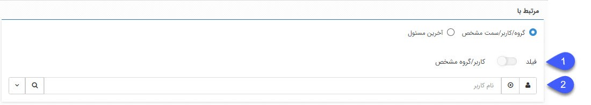
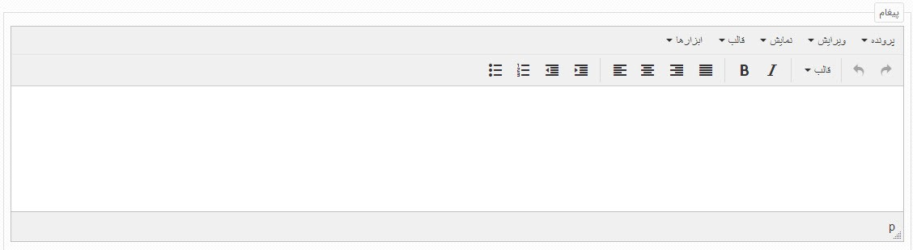
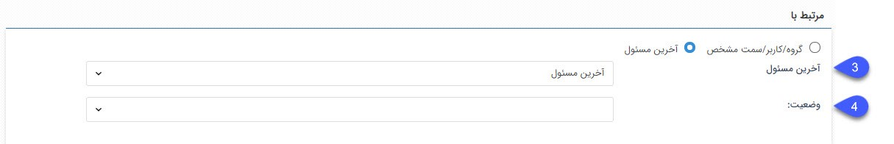

**قابلیت استفاده از فیلدهای رسید و حواله انبار در فعالیت ارسال فکس** 

در فعالیت ارسال فکس در صورت انتخاب گزینه‌ی Send This Field امکان انتخاب فیلد رسید و حواله انبار فراهم شده است.

**اضافه شدن فعالیت اجرای دستورات پایگاه داده**

با استفاده از فعالیت اجرای دستورات پایگاه داده می‎توان از طریق تعریف Expression تبادل اطلاعات را بین پیام‌گستر و دیتابیس‌های دیگری انجام داد. لازم به ذکر است برای استفاده از این فعالیت، می-بایست ماژول "امکانات پیشرفته bpms" فعال باشد.
برای مطالعه راهنمای استفاده از این فعالیت به پیوست شماره 5 مراجعه کنید. 

**امکان استفاده از Expression در فعالیت تخصیص مقدار و چندشرطی**

با اضافه شدن قابلیت  تعریف Expression در فعالیت‌های تخصیص مقدار و چندشرطی می‌توان اطلاعات مورد نیاز را از پیامگستر دریافت کرده و در  خروجی دلخواه در نرم‌افزار مشاهده کرد. لازم به ذکر است برای استفاده از این قابلیت،می¬بایست ماژول "امکانات پیشرفته bpms" فعال باشد.
برای مطالعه‌ی راهنمای استفاده از این فعالیت‌ها به فایل پیوست 6و 7 مراجعه کنید. 

همچنین برای مطالعه‌ی راهنمای تعریف Expression به بخش پیوست 4 مراجعه کنید.

**اضافه شدن فعالیت ایجاد لینک اشتراک گذاری**  

فعالیتی با نام ایجاد لینک اشتراک گذاری به چرخه کاری فرآیند اضافه شده است. این فعالیت، لینک مربوط به قالب چاپ (پیش نمایش) آیتم تحت چرخه را به صورت خودکار ایجاد می کند تا برای اشتراک گذاری استفاده شود. 
با استفاده از این لینک در مرورگر، قالب چاپ(پیش نمایش) آیتم مورد نظر قابل مشاهده است و امکان خروجی گرفتن از آن با فرمت PDF وجود دارد.

**تغییر رفتار ویرایش چرخه کاری آیتم در حالت انتظار**

در ورژن قبل، در صورتیکه آیتمی در حالت انتظار بود، در قسمت مشاهده گردش کار، امکان ویرایش چرخه کاری وجود داشت، اما در ورژن جدید، جهت ویرایش چرخه کاری، ابتدا می بایست آیتم مورد نظر از حالت انتظار خارج شود و وارد کارتابل شود و سپس این ویرایش در گردش کار اعمال گردد.

**اضافه شدن تعریف شرط بر اساس شماره مشتری در فعالیت چند‌شرطی**

در ورژن جدید، امکان تعریف شرط بر اساس شماره مشتری در فعالیت چند‌شرطی اضافه شده است.لازم بذکر است اگر شماره مشتری بصورت دستی وارد شده باشد باید طبق الگو شماره گذاری باشد و در غیر اینصورت فعالیت با خطا مواجه می‌شود.
نکته: می‌توان شرط را بر اساس خالی بودن و پر بودن فیلد شماره مشتری نیز مشخص کرد.

**فعالیت اطلاع رسانی به کاربر**

در فرآیندهای کاری، فعالیت جدیدی به نام اطلاع رسانی به کاربر اضافه شده است که با استفاده از فعالیت اطلاع رسانی به کاربر، می‌توان بصورت خودکار نظری را بر روی آن آیتم به کاربر یا گروه کاربری ارسال نمود.
می‌توان از بین گروه/کاربر/سمت مشخص و آخرین مسؤل مشخص کرد کارتابل بدست چه کاربری برسد.
در صورت انتخاب گروه/کاربر/ سمت مشخص:
 

1. فیلد: می‌توان از بین فیلدهای اضافه شده به آیتم، فیلدی را انتخاب کرد. آخرین مسئول کارتابل، مدیر آخرین مسئو کارتابل و رده بالایی آخرین مسئول کارتابل را انتخاب نمود.

2. می‌توان کاربر را از بین کاربر، گروه و سمت مشخص کرد.

در صورت انتخاب آخرین مسؤل: 

 
3. می‌توان از بین آخرین مسؤل، مدیر آخرین مسؤل و رده بالایی آخرین مسؤل مشخص کرد کار وارد کارتابل چه سمتی شود.

4. وضعیت: مشخص کردن کارتابل مورد نظر.

 
پیغام: در این قسمت متن نظر خود را وارد نمایید.

**انتخاب مسؤل کارتابل**

در ورژن جدید برای انتخاب آخرین مسؤل کارتابل می‌توان مشخص کرد که کارتابل بدست آخرین مسؤل یا مدیر آخرین مسؤل یا رده بالایی آخرین مسؤل برود. لازم بذکر تشخیص مدیر آخرین مسؤل و رده بالایی آخرین مسؤل بر اساس سمت می‌باشد.
در صورت انتخاب گروه/کاربر/ سمت مشخص:

 
1. فیلد: می‌توان از بین فیلدهای اضافه شده به آیتم، فیلدی را انتخاب کرد. آخرین مسئول کارتابل، مدیر آخرین مسئو کارتابل و رده بالایی آخرین مسئول کارتابل را انتخاب نمود.

2. می‌توان کاربر را از بین کاربر، گروه و سمت مشخص کرد.

در صورت انتخاب آخرین مسؤل: 

3. می‌توان از بین آخرین مسؤل، مدیر آخرین مسؤل و رده بالایی آخرین مسؤل مشخص کرد کار وارد کارتابل چه سمتی شود.

4. وضعیت: مشخص کردن کارتابل مورد نظر.

در صورت انتخاب مدیر آخرین مسؤل یا رده بالایی آخرین مسؤل،اگر کارتابل بدست چند سمت (کاربر) برود همانند منطق گروه عمل می‌کند و وارد کارتابل همه در آن رده می‌شود که یک کابر کار را به خود اختصاص دهد. همچنین در صورت فعال بودن چک باکس اختصاص بصورت صف و کاربران حاضر، عملکرد سیستم همانند منطق گروه خواهد بود.
لازم بذکر است بمنظور استفاده از مدیر آخرین مسؤل و رده بالایی آخرین مسؤل لازم است برای کاربرانی که چند حکم سازمانی فعال دارند، در مدیریت حکم‌های سازمانی، حکم پیش‌فرض را مشخص کرد تا اگر آخرین مسؤل دارای چند حکم سازمانی بود با توجه به حکم پیشفرض وی کار وارد کارتابل مدیر آخرین مسؤل یا رده بالایی آخرین مسؤل شود. واضح است در صورت منقضی یا غیر فعال شدن حکم پیش‌فرض، فرآیند با خطا مواجه شده و لازم است حکم پیش‌فرض جدید تعیین شود.
