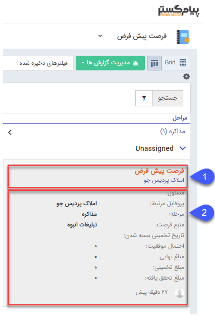
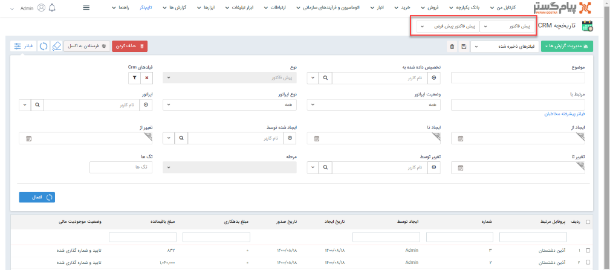

#### لیست آیتم‌ها

**اضافه شدن امکان فیلتر به صورت بازه‌ای برای فیلدهای پول و عدد**

فیلترهایی که براساس فیلدهای از نوع "عدد" و "پول "می‌باشند، مانند فیلدهای از نوع "تاریخ" به فیلترهای بازه‌ای تغییر کرده¬اند. برای نمونه فیلتر فیلد از نوع عدد به صورت "عدد از" و "عدد تا " تغییر کرده است.

**اضافه شدن امکان فیلتر بر اساس مرحله**

از این پس می توان در صورتیکه برای موجودیتی مرحله تعریف شده باشد، براساس آن در لیست موجودیت ها و تاریخچه CRM، فیلتر اعمال نمود.

**اضافه شدن چک باکس به آیتم‌های مالی**

در لیست آیتم‌های مالی، چک باکس در کنار آیتم‌های مالی برای انتخاب گروهی آیتم‌ها اضافه شده است و دیگر لازم نیست از کنترل برای انتخاب گروهی و پاک کردن آیتم‌ها استفاده شود.

**بهبود نمایش کانبان آیتم‌های لیستی** 

در حالت کانبان آیتم‌های لیستی (مثلا فرصت) در صورتی که یکبار بر روی محدوده‌ی 1 (عنوان آیتم) کلیک شود، آیتم در تب جدید باز شده و اگر دوبار بر روی محدوده‌ی 2 (آیتم) کلیک شود، آیتم بصورت پاپ آپ باز می‌شود.

 

**بهبود تاریخچه crm**

در تاریخچه crm مطابق تصویر، انتخاب نوع و زیرنوع آیتم از بالای صفحه بصورت فیلد لیستی بوده که فیلتر زیر نوع تنها از این قسمت می‌باشد و در قسمت فیلتر تنها می‌توان زیر نوع را مشاهده کرد.

#### سابقه‌ی تغییرات 

**اصلاح نمایش ماه در بخش تغییرات آیتم‌ها**

در تمامی آیتم‌ها بخش تغییرات، ماه تغییرات را فقط اسفندماه نمایش می‌داد که این مشکل اصلاح گردیده است

## دریافت خروجی اکسل

### نمایش فیلد اضافه لیستی و فیلد لیستی سیستمی در خروجی اکسل
در ورژن جدید، به هنگام خروجی گرفتن اکسل از آیتم ها، قابلیت نمایش فیلد های لیستی از نوع لیست محصول، لیست متن، لیست عدد، لیست مبلغ، لیست لینک، لیست کاربر، لیست مشتری، لیست سمت، لیست دپارتمان، لیست تاریخ شمسی و میلادی در فایل اکسل اضافه شده است. همچنین، هنگام خروجی گرفتن از هویت ها، امکان نمایش فیلدهای لیستی سیستمی آدرس، انواع تلفن (تلفن، موبایل، فکس، تلفکس) نیز در اکسل وجود دارد. به علاوه، امکان نمایش ردیف های محصول در فایل اکسل، هنگام خروجی گرفتن از فاکتور و پیش فاکتور نیز میسر می‌باشد.
بدین منظور، درصورتیکه که در یک آیتم بیش از یک فیلد لیستی داشته باشید، هنگام خروجی گرفتن از آن، صفحه ای نمایش داده می‌شود که می توان از این طریق فیلد لیستی موردنظر جهت نمایش در خروجی اکسل را انتخاب نمود. لازم به ذکر است در هر بار خروجی گرفتن تنها می‌بایست یک مورد انتخاب گردد. نحوه نمایش مقادیر فیلد لیستی در فرمت اکسل نیز به این صورت می‌باشد که به ازای هر تعداد مقادیر لیستی، رکوردی در ردیف اکسل ایجاد خواهد شد که مقادیر فیلد لیستی در آن نمایش داده می¬شود.

توجه: در نظر داشته باشید برای نمایش فیلد اضافه از نوع لیستی در هویت ها، می بایست در بانک اطلاعاتی زیرنوع هویت مشخص گردد تا فیلد لیستی مربوطه، هنگام خروجی گرفتن قابل انتخاب باشد.

 توجه شود درصورت انتخاب گزینه "هیچ کدام" به هنگام دریافت خروجی اکسل، فایل مربوطه به صورت سابق و بدون اضافه کردن فیلدهای لیستی خواهد بود. در نظر داشته باشید، به هنگام اخذ خروجی از هویت ها در صورت انتخاب گزینه هیچ‌کدام، مقادیر فیلدهای لیستی سیستمی در یک سلول، در کنارهم قرار گرفته و با کاما ازهم جدا می شوند.
 
همچنین امکان افزودن فیلد های اضافه لیستی، جهت انتخاب برای نمایش در لیست نیز در این ورژن اضافه شده است. بدین منظور درصورتیکه تنظیمات نمایش در لیست این نوع فیلد های لیستی را فعال کنید، می توانید در نمای Grid موجودیت های آن آیتم، در ستون مربوطه، بر روی "مشاهده" کلیک کنید و مقادیر آن فیلد لیستی را به صورت پاپ آپ مشاهده کنید.

توجه: در نظر داشته باشید، امکان نمایش فیلدهای لیستی در خلاصه و نمایش به صورت کانبان وجود ندارد.

**امکان دریافت خروجی اکسل از آیتم ها به تعداد حداکثر 10000 مورد**

در ورژن جدید، امکان دریافت خروجی اکسل از آیتم های سیستم در هر بار به تعداد حداکثر 10000 آیتم وجود دارد. اگر لیست تمام آیتم های مورد نظر، بیشتر از این مقدار باشد، می توانید از قابلیت فیلتر استفاده نمایید تا آن تعدادی که نیاز دارید نمایش داده شود.
در نظر داشته باشید اگر تعداد آیتم های مورد نیاز شما برای نمایش در اکسل بیشتر از 10000 مورد باشد، می بایست تنظیمات پیکربندی سرور توسط تیم پشتیبانی، به روز رسانی شود.

