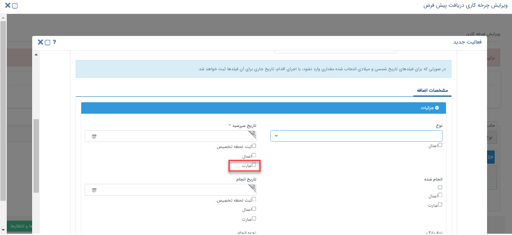

# فرآیند

## امکان استفاده از Expression در فعالیت تخصیص مقدار روی آیتم‌های دریافت و پرداخت
امکان تعریف Expression در [**فعالیت تخصیص مقدار**](https://github.com/1stco/PayamGostarDocs/blob/master/help2.5.4/Settings/Personalization-crm/Overview/Process-design/Create-a-work-cycle/Activity/Allocate-the-amount/2.6.1/set-value-activiy-2.6.1.md) بر روی آیتم‌های **دریافت و پرداخت** اضافه شده است و زین پس می‌توان  فیلدهای این دو آیتم را طی فرآیند، توسط این فعالیت مقدار دهی کرد.

