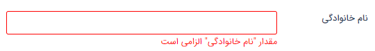

# فیلدهای اضافه

## تغییر شیوه نمایش خطای پر نشدن فیلدهای الزامی در آیتم‌ها

زین پس در صورت مقدار ندادن فیلدهای الزامی در آیتم‌ها بجای نمایش فیلدهای الزامی با ستاره قرمز، با کادر قرمز دور فیلد قابل تشخیص هستند. در گذشته اگر چند فیلد الزامی مقدار نداشت با هر بار کلیک بر دکمه ذخیره، یک فیلد را ستاره دار نمایش می‌داد  ولی در نسخه جدید با کلیک بر دکمه ذخیره، تمام فیلدهای الزامی که مقدار ندارند به رنگ قرمز و با پیغام الزامی بودن نمایش داده می‌شوند.

 