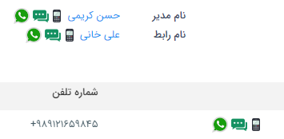

# بانک اطلاعاتی

## اضافه شدن امکان ارسال پیام از طریق واتساپ

در صورتی که شماره موبایل برای هویت‌ها ثبت کرده باشید در قسمت اطلاعات تماس هویت، امکان ارسال پیام از طریق نسخه وب  Whatsapp وجود دارد و با کلیک بر روی آیکن Whatsapp به صفحه چت با آن هویت منتقل می شوید. اگر 98+ را وارد نکرده باشید و شماره موبایل بدون کد را ثبت کرده باشید، سیستم کد کشوری که در تنظیمات کلی تعریف کرده اید را قبل از شماره موبایل قرار می‌دهد و در صورت صحت شماره و کلیک بر آیکن Whatsapp شما را به صفحه چت با هویت منتقل می‌کند.

