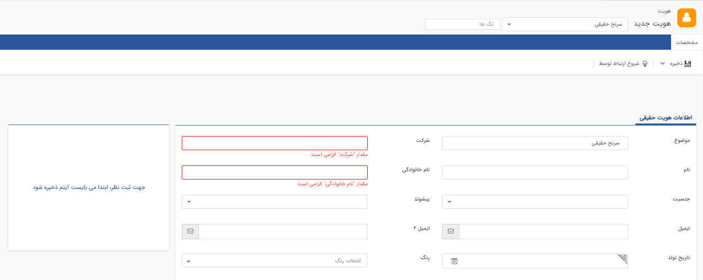
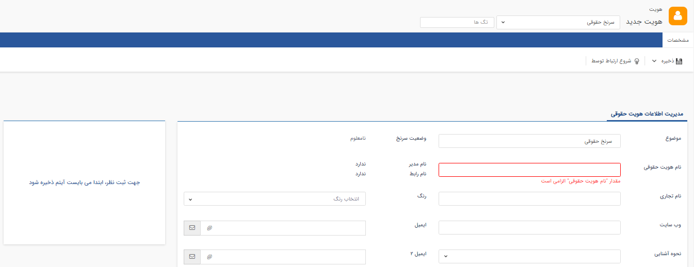

# بانک اطلاعاتی

## الزامی شدن «نام خانوادگی»، «شرکت» و «نام هویت حقوقی» هنگام ثبت سرنخ‌های حقیقی و حقوقی

در نسخه‌های قبل هنگام ذخیره سرنخ حقیقی و حقوقی جدید، **موضوع** به عنوان اطلاعات سرنخ الزامی بود که در نسخه جدید فیلدهای الزامی هنگام ذخیره اولیه سرنخ بهبود یافته و شامل موارد زیر است:

- سرنخ حقیقی: فیلدهای **شرکت** و **نام خانوادگی**

- سرنخ حقوقی: فیلد **نام هویت حقوقی**

 

## حذف فیلد شماره مشتری از صفحه مشخصات سرنخ حقیقی

فیلد **شماره مشتری** از اطلاعات سرنخ حقیقی حذف شده است و در هیچ کدام از مراحل ذخیره اولیه و ویرایش، این فیلد مشاهده نمی‌شود زیرا منطق شماره‌مشتری برای زمانی است که یک سرنخ به مخاطب تبدیل شده و می‌توان با آن تعامل برقرار کنید و در نهایت به مشتری شما تبدیل شود.

## امکان باز شدن نرم افزار WhatsappWeb از طریق کلیک روی شماره موبایل در اطلاعات تماس هویت‌ها

در صورتی که شماره موبایل برای هویت‌ها ثبت کرده باشید و هویت مورد نظر حساب کاربری Whatsapp داشته باشد، در قسمت اطلاعات تماس هویت امکان ارسال پیام از طریق نسخه وب  Whatsapp وجود دارد و با کلیک بر روی آیکن Whatsapp به صفحه چت با آن هویت منتقل می شوید. اگر 98+ را وارد نکرده باشید و شماره موبایل بدون کد را ثبت کرده باشید، سیستم کد کشوری که در تنظیمات کلی تعریف کرده اید را قبل از شماره موبایل قرار می‌دهد و در صورت صحت شماره و کلیک بر آیکن Whatsapp شما را به صفحه چت با هویت منتقل می‌کند.

## بهبود WhatsApp address در صفحه مشخصات هویت

در صفحه مشخصات هویت، زمانی که روی آیکن WhatsApp کلیک کنید، با توجه به نسخه نرم‌افزار، به محیط WhatsApp منتقل می‌شوید. یعنی اگر در نسخه موبایل بر روی آیکن کلیک کنید به برنامه WhatsApp، در صورتی که از محیط تحت وب نرم‌افزار اقدام کنید به WhatsApp Web دسترسی خواهید داشت.