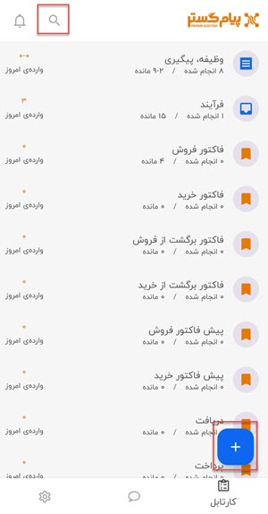
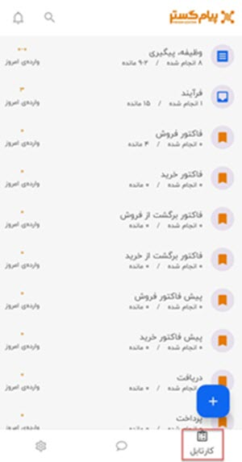

# موبایل
## امکان جستجو و ایجاد انواع موجودیت‌ها در نسخه موبایل پیام‌گستر بر اساس دسترسی مرتبط

در منوی نسخه موبایل امکان جستجوی و ایجاد آیتم جدید اضافه شده است. کاربر آیتم‌هایی را که مجوز **ذخیره اولیه** را داشته باشد می‌تواند ایجاد کند. لیست کامل نتیجه جستجو نیز به مجوز **مشاهده لیست آیتم** بستگی دارد.  

جستجو در نسخه‌های سازمانی و استاندارد موبایل متفاوت است؛ در نسخه استاندارد تنها جستجو بین هویت‌ها انجام می‌شود در صورتی که در نسخه سازمانی بین هویت، سوابق، پیام‌های دریافتی و ارسالی پیامک و ایمیل جستجو انجام می‌شود.

## امکان شروع و توقف زمان فعالیت روی آیتم‌های در کارتابل، با نرم‌افزار تایم نگر در نسخه موبایل
 
زین پس می‌توان ماژول تایم‌نگر را علاوه بر نسخه تحت وب بر روی اپلیکشن موبایل نیز استفاده کرد و وظیفه‌ها، فرآیندها، پیگیری‌ها و قرارملاقات‌ها را از طریق نسخه موبایل شروع (PLAY) و متوقف کرد. برای کار با این قابلیت به نکات زیر توجه کنید:

1.	در نسخه موبایل، نرم‌افزار همانند نسخه تحت وب بعد از 20 دقیقه فعالیت نداشتن متوقف نمی‌شود و در این مرحله لازم است زمان توقف مشخص شود. بصورت پیش فرض زمان 8 ساعت انتخاب شده است و شما می‌توانید از بین زمان‌های نیم ساعت، 1 ساعت، 2 ساعت، 4 ساعت و 8 ساعت یک را انتخاب کنید.

2.	گزارش آیتم‌هایی که در موبایل شروع و متوقف می‌شوند، در قسمت نوار زمانی داشبورد تایم‌نگر با نوار نارنجی رنگ نمایش داده می‌شود. 

