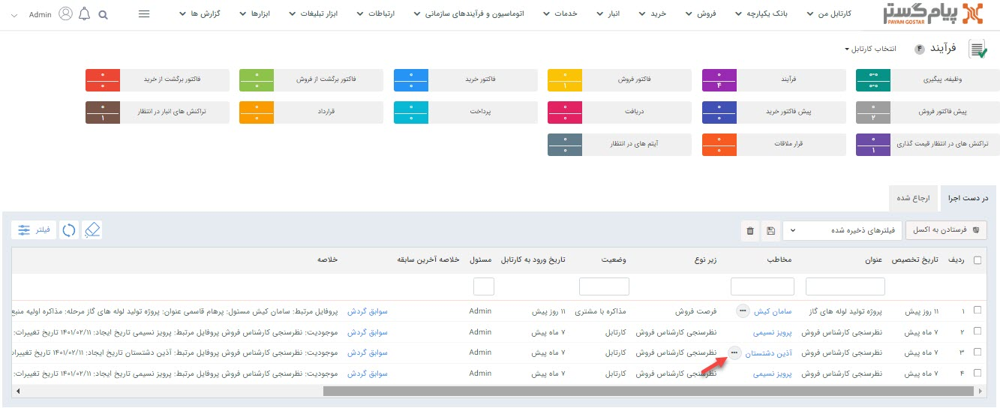
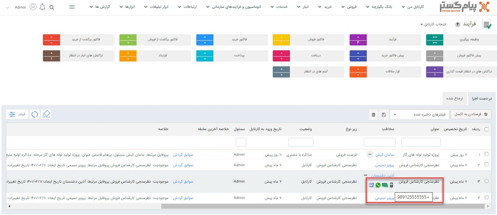

# کارتابل کاربر

## امکان مشاهده و برقراری تماس (Click to  call) با پروفایل مرتبط آیتم‌های موجود در کارتابل فرآیند
جهت ارتباط سریع و آسان با هویت‌ها، امکان برقراری ارتباط در لیست آیتم‌های در کارتابل فرآیند اضافه شده است. برای این منظور در کنار نام هویت، آیکن سه نقطه قرار دارد که با کلیک بر روی آن چهار آیکن موبایل، پیامک، واتس اپ و تلفن قابل مشاهده است. درصورتی که موس را روی آیکن‌های موبایل، پیامک و واتس اپ نگه دارید شماره موبایل پیش‌فرض را نشان می‌دهد و در صورتی موس را روی آیکن تلفن نگه دارید شماره تلفن پیش‌فرض هویت قابل مشاهده خواهد بود. علاوه بر این با کلیک بر روی هر کدام از ابزارهای ارتباطی امکان تماس و ارسال پیام وجود دارد. 
> **نکته**
> در صورتی که بر روی آیتم‌های کارتابل فرآیند، فیلتر انجام داده و کارتابل جدید ساخته باشید، این امکان در کارتابل‌‌های ساخته شده‌ شما نیز قابل استفاده خواهد بود.

