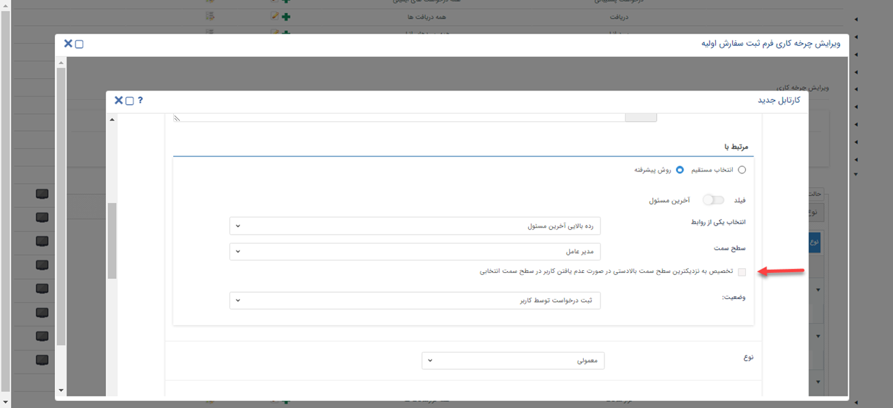

#  شرح تغییرات نسخه 2.6.5

###### 21 دی 1401
##### قابلیت‌های جدید
- [امکان تنظیم نمایش لیست درخواست پشتیبانی براساس «اولویت»](#ُSortTicket)
- [امکان تخصیص کارتابل به «رده‌بالایی آخرین مسئول»، در صورت عدم وجود کاربر فعال، در سمت تعیین شده](#AssignToUserManager)
- [امکان ثبت، ویرایش و حذف محصول در فرصت، از طریق وب سرویس](#ProductInOppByWebService)
- [امکان ذخیره «فیلد متن لیستی» در وب سرویس روی تمامی آیتم‌ها](#TextListField)

****
### شخصی‌سازی آیتم‌ها
- **امکان تنظیم نمایش لیست درخواست پشتیبانی بر اساس «اولویت»**{#ُSortTicket} 
  در تنظیمات شخصی‌سازی آیتم‌ها برای تنظیم ترتیب نمایش آیتم در لیست، گزینه **اولویت** اضافه شده است که می‌توانید لیست درخواست‌های پشتیبانی خود را براساس اولویت تنظیم کنید.
### فرآیند
- **امکان تخصیص کارتابل به «رده‌بالایی آخرین مسئول»، در صورت عدم وجود کاربر فعال، در سمت تعیین شده** {#AssignToUserManager} 
   در تنظیمات چرخه‌کاری، هنگامی که مسئول کارتابل را روی **رده‌بالایی آخرین مسئول** انتخاب کنید، چک باکسی با عنوان **تخصیص به نزدیکترین سطح سمت بالادستی در صورت عدم یافتن کاربر در سطح سمت انتخابی** نمایش داده‌ می‌شود. اگر آن را فعال کنید، در حالتی که در سمت انتخاب شده (مثلا کارشناس ارشد) کاربری فعال نباشد، سیستم سمت بالاتر از آن را چک می‌کند. اگر باز هم در آن سمت کاربر فعال نباشد همینطور سطوح بالاتر آخرین مسئول را چک می‌کند تا به سمتی برسد که کاربر فعال داشته باشد. نهایتا فرآیند به کارتابل آن کاربر ارجاع داده می‌شود.  

****
### فرصت
- **امکان ثبت، ویرایش و حذف محصول در فرصت، از طریق وب سرویس**{#ProductInOppByWebService} 
   زین پس می‌توانید جدول محصولات فرصت را از طریق وب سرویس مدیریت کنید. امکان افزودن، ویرایش و حذف محصول از ردیف محصولات فرصت وجود دارد. جدول مربوط به پارامترهای محصولات فرصت را در بخش [توسعه دهندگان](https://developer.payamgostar.com/soap-docs/) و در مستند **فرصت** مطالعه نمایید.
****
### فیلدهای اضافه
- **امکان ذخیره فیلد «متن لیستی» در وب سرویس روی تمامی آیتم‌ها**{#TextListField} 
   روی تمامی آیتم‌های CRM امکان ذخیره **فیلد متن لیستی** اضافه شده است. 

