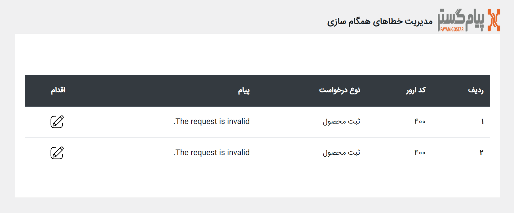

# جدول خطاها
با توجه به اینکه فرآیند انتقال اطلاعات ممکن است بنا بر دلایل مختلف با خطا روبه‌رو شود، جدول خطاهای اتصال در اختیار کاربران قرار داده شده‌است. برای دسترسی به این جدول کافیست از مسیر **تنظیمات پلاگین** > **جدول خطاها** وارد صفحه مدیریت خطاهای همگام‌سازی شوید.  

چنانچه در همگام‌سازی اولیه و یا فرآیند سفارشات، خطایی در روند انتقال اطلاعات رخ دهد، این خطا در ثبت شده و از این طریق قابل پیگیری می‌باشد. با کلیک بر روی آیکون اقدام در هر ردیف، شرح خطا به شما نمایش داده می‌شود. به عنوان مثال در صورت رخداد خطا در انتقال اطلاعات یک محصول، با باز کردن پیام آن از طریق آیکونی که در ستون اقدام مشاده می‌کنید می‌توانید ببینید که انتقال کدام محصول با خطا مواجه شده‌است.  

