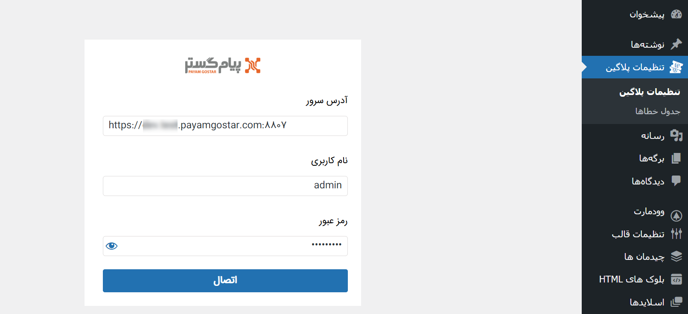
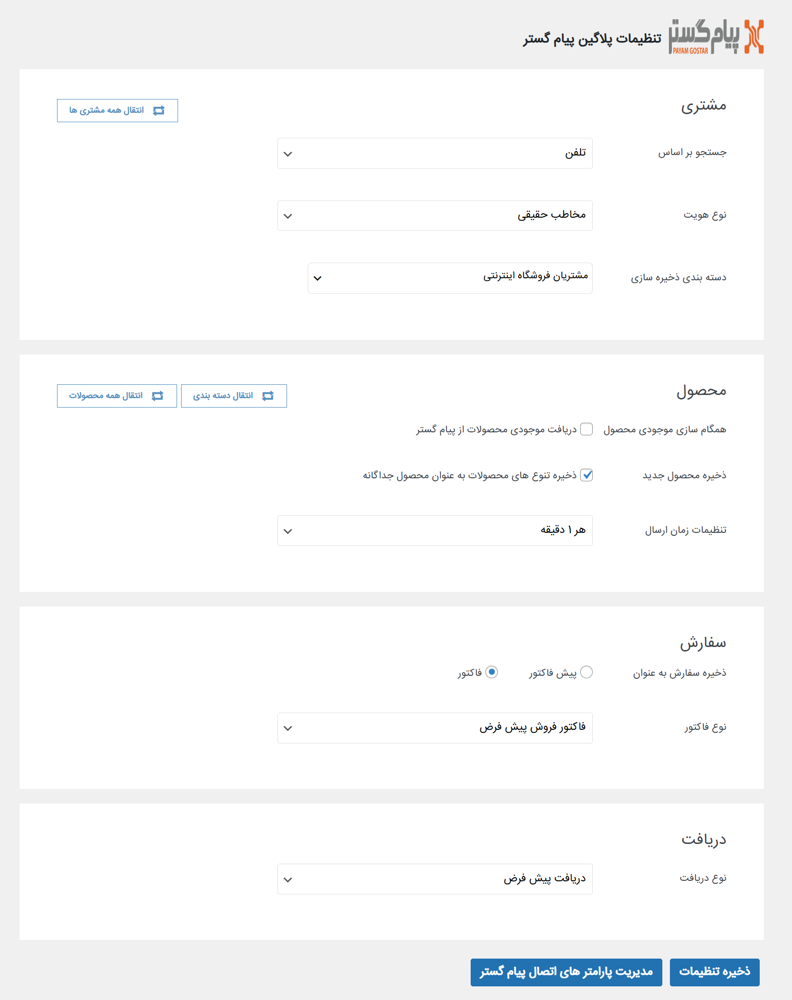

# تنظیمات پلاگین ارتباط پیام‌گستر با ووکامرسی
پس از دریافت افزونه پیام‌گستر، لازم است که تنظیمات آن را تکمیل نمایید. بدین منظور لازم است که ابتدا اتصال با سرور پیام‌گستر را برقرار نمایید و سپس تنظیمات لازم جهت انتقال اطلاعات را تکمیل کنید. در ادامه‌ به مدیریت پارامترهای اتصال و تنظیمات پلاگین پیام‌گستر می‌پردازیم. 
جهت ورود به بخش تنظیمات، در صفحه تنظیمات وردپرس، بر روی «تنظیمات پلاگین» کلیک کنید.  

## مدیریت پارامترهای اتصال
برای اینکه اتصال پیام‌گستر شما با ووکامرس برقرار باشد، لازم است که مشخصات لازم جهت برقراری اتصال را وارد کنید. بدین منظور با کلیک بر روی کلید «مدیریت پارامترهای اتصال پیام‌گستر» که در پایین صفحه قابل مشاهده است، وارد صفحه مشخصات شوید. 

اطلاعات مورد نیاز را بر اساس راهنمای زیر تکمیل نمایید: 
- آدرس سرور پیام‌گستر خود را وارد کنید.
- نام کاربری و رمز عبور ارتباط‌دهنده را انتخاب نمایید.  
به این موضوع توجه داشته‌باشید که پس از برقراری اتصال بین پیام‌گستر و فروشگاه، آیتم‌های مورد نیاز برای ثبت اطلاعات به صورت خودکار در سیستم ایجاد می‌شود. در واقع چنانچه هیچ زیرنوعی از موجودیت مورد نظر یافت نشود، یا در زیرنوع موجود فیلدی لازم باشد، سیستم به صورت خودکار آن را می‌سازد. در نتیجه کاربری که به عنوان رابط اعلام می‌شود باید دسترسی‌های لازم برای شخصی‌سازی موجودیت‌ها و ثبت آیتم‌ها را داشته‌باشد. به همین منظور، داشتن مجوز «مدیر سیستم» می‌تواند از خطاهای احتمالی جلوگیری کند. پیشنهاد می‌شود که یک کاربر با عنوان ShopAdmin با مجوز مدیر سیستم ساخته شده و به این کار تخصیص داده شود. 
پس از درج مشخصات، بر روی کلید «اتصال» کلیک کنید. اگر پیام «احراز هویت با موفقیت انجام شد» را بر روی نمایشگر خود مشاهده کردید، یعنی ارتباط به درستی برقرار شده و می توانید به صفحه تنظیمات بازگرید. 

## مدیریت پارامترهای اتصال
پس از برقراری اتصال، زمان آن است که تنظیمات لازم جهت تعیین شیوه‌ی انتقال اطلاعات را مشخص کنید. در ادامه به تنظیمات مشتری، محصولات، سفارشات و دریافتی‌ها که اطلاعات مشتریان و خرید آن‌ها را به پیام‌گستر منتقل می‌کنند، می‌پردازیم. 

### مشتری
پیش از رسیدن به تنظیمات، لازم است که مروری بر رفتار فروشگاه‌های اینترنتی داشته‌باشیم. اگر تجربه‌های خرید خودتان از فروشگاه‌های اینترنتی را مرور کنید، به خاطر می‌آورید که در برخی موارد فروشگاه شما را ملزم به ساخت حساب کاربری (ثبت‌نام) کرده تا اجازه دهد سفارشتان را ثبت کنید. با این وجود، در برخی از فروشگاه‌ها بدون نیاز به ثبت‌نام، توانسته‌اید خریدتان را ثبت کنید.  بنابر این می‌توان گفت که مشتری، به ۲ شیوه ممکن است اقدام به ثبت سفارش نماید: 
- ساخت و ورود به حساب کاربری که در آن کاربر بنا بر الزام یا به صورت انتخابی، ابتدا ثبت‌نام کرده و سپس، پس از ورود به حساب کاربری خود، خریدش را انجام می دهد.
-  خرید به عنوان مهمان که در این حالت کاربر بدون نیاز به ساخت حساب کاربری (ثبت‌نام)، خرید خود را انجام می‌دهد. 
در صورت برقراری اتصال بین ووکامرس و پیام‌گستر، بر اساس دو رفتار فوق: 
- اگر مشتری در فروشگاه ثبت‌نام کند (برای خودش حساب کاربری ایجاد کند)، در پیام‌گستر یک **هویت** برای او ایجاد شده و **کاربری باشگاه مشتریان** نیز به صورت خودکار برای او ایجاد می‌شود.
- اگر مشتری، بدون ثبت‌نام و به صورت کاربر مهمان در فروشگاه سفارش خود را ثبت کند، در پیام‌گستر یک **هویت** برای او ساخته می‌شود. توجه داشته‌باشید که در این حالت، برای هویت کاربری باشگاه ساخته نمی‌شود. 
در این بخش باید مشخص کنید که پروفایل این مشتریان در پیام‌گستر از چه نوعی ساخته شود، در کجا ذخیره شود و مبنای شناسایی آن چه باشد. بدین منظور:  
- در بخش «جستجو بر اساس»، مبنای شناسایی را مشخص کنید. این مبنا را بر اساس فیلد الزامی و مبنا در فروشگاه اینترنتی‌تان انتخاب کنید. به عنوان مثال اگر حساب‌های کاربری در فروشگاه بر اساس ایمیل است، در این بخش نیز ایمیل را به عنوان مبنای جستجو انتخاب کنید. در این حالت، هنگام ورود مشتری، چنانچه آدرس ایمیل وی پیش‌تر در سیستم ثبت شده‌باشد، پروفایل وی شناسایی می‌شود و سوابق جدید در حساب او ثبت می‌شود. چنانچه در پی جستجوی انجام گرفته ایمیل مذکور یافت نشود، هویت جدید تشخیص داده شده و پروفایل او ایجاد می‌شود. شما می‌توانید جستجو را بر اساس **ایمیل**، **تلفن** یا **نام کاربری** تنظیم نمایید.
- از بین زیرنوع‌های هویت موجود در پیام‌گستر، یک زیرنوع را در بخش «نوع هویت» انتخاب کنید تا پروفایل مشتریان از آن نوع ایجاد شود.
- در قسمت «دسته‌بندی ذخیره‌سازی» دسته‌بندی بانک اطلاعاتی خود در پیام‌گستر را مشاهده می‌کنید. دسته‌بندی مورد نظر که می‌خواهید هویت‌های ایجاد شده (مشتریان) در آن ذخیره شود را انتخاب کنید. توجه داشته‌باشید که در صورت داشتن زیرمجموعه، آخرین لایه‌ی دسته‌بندی را برای ذخیره‌ی هویت انتخاب کنید. برای مشاهده‌ی زیرمجموعه دسته‌بندی‌ها، بر روی علامت + کنار آن‌ها کلیک کنید. 
-  با کلیک بر روی کلید «انتقال همه‌ی مشتری‌ها»، تمامی مشتریانی که در فروشگاه اینترنتی‌تان (وردپرس) دارید، به پیام‌گستر منتقل می‌شود. در نتیجه چنانچه فروشگاه آنلاین شما دارای سابقه می‌باشد، لازم است که با استفاده از این کلید، تمامی مشتریان خود را به پیام‌گستر انتقال دهید. 

### محصول
با توجه به اینکه می‌خواهیم سفارشات مشتریان در پیام‌گستر ثبت شود، بدیهی است که ابتدا نیاز داریم محصولاتی که در فروشگاه به فروش می‌رسد، در پیام‌گستر تعریف شده‌باشد. بدین منظور در این قسمت باید تمامی تنظیمات مورد نیاز برای انتقال محصولات را اعمال نمایید. برای تنظیم مدل انتقال محصول، از راهنمای زیر استفاده نمایید: 
- در صورت فعال‌سازی گزینه‌ی «دریافت موجودی محصولات از پیام‌گستر»، موجودی محصولات در فروشگاه بر اساس موجودی آن‌ها در پیام‌گستر نمایش داده می‌شود. در صورت غیرفعال بودن این گزینه، مبنای موجودی محصول، تعداد انبار فروشگاه در نظر گرفته می‌شود. 
- در لیست محصول فروشگاه، یک محصول می‌تواند دارای چندین نوع مختلف باشد که به جهت تفاوت در رنگ، سایز، مدل و غیره حاصل می‌شود. در صورت فعال کردن «ذخیره تنوع‌های محصولات به عنوان محصول جداگانه» هر یک از این محصولات به عنوان یک محصول جداگانه در پیام‌گستر ایجاد می‌شود؛ در غیر این صورت تمامی این انواع یک محصول در نظر گرفته می‌شود. به عنوان مثال فرض کنید در فروشگاه آنلاین، محصول تیشرت دارای ۳ سایز 36، 38 و 40 می‌باشد. در صورت فعال بودن این گزینه، در پیام‌گستر ۳ محصول با عناوین تیشرت سایز 36، تیشرت سایز 38 و تیشرت سایز 40 ایجاد می‌شود. لکن در صورت غیرفعال بودن آن، در کل یک محصول با عنوان تیشرت در پیام‌گستر خواهیم داشت. این موضوع درباره‌ی سایر ویژگی‌های محصول نظیر رنگ نیز صادق است. در مثال فوق چنانچه تیشرت دارای ۲ رنگ مشکی و سفید باشد، در صورت فعال بودن این گزینه ۶ محصول (تیشرت سفید در ۳ سایز و تیشرت مشکی در ۳ سایز) و در صورت غیرفعال بودن آن تنها یک محصول تیشرت در پیام‌گستر ایجاد می شود. 
- در قسمت «تنظیمات زمان ارسال» مشخص کنید که به‌روزرسانی موجودی و ارسال اطلاعات تغییرات هر چند دقیقه انجام شود. از بین گزینه‌های موجود می‌توانید زمان مورد نطر خود را انتخاب کنید.  
پس از اعمال تنظیمات، لازم است که با فشردن کلیدهایی که در بالای کادر مشاهده می‌کنید، اقدام به انتقال اطلاعات محصولات فعلی فروشگاه به پیام‌گستر نمایید.  
- با کلیک بر روی کلید «انتقال دسته‌بندی»، دسته‌بندی‌ محصولات فروشگاه به پیام‌گستر منتقل شده و دسته‌بندی‌هایی مشابه آن در بخش مدیریت محصولات ایجاد می‌شود. 
- سپس با کلیک بر روی کلیک «انتقال همه‌ی محصولات» می‌توانید محصولات موجود در فروشگاه را به پیام‌گستر بفرستید که طی این فرآیند، در واقع مشابه محصولات موجود در فروشگاه، محصولات شما در پیام‌گستر ایجاد می شود. 

### سفارش
می‌توانید انتخاب کنید که سفارشات ثبت شده در فروشگاه، به صورت پیش‌فاکتور یا فاکتور فروش در پیام‌گستر ثبت شوند. با انتخاب هر گزینه (پیش‌فاکتور/فاکتور) زیرنوع‌های موجود آن در پیام‌گستر در قسمت «نوع فاکتور» به شما نمایش داده می‌شود تا زیرنوع مورد نظرتان را انتخاب کنید. بر این اساس: 
- با انتخاب گزینه‌ی پیش‌فاکتور، در ازای هر ثبت سفارش در فروشگاه، یک پیش‌فاکتور از زیرنوعی که انتخاب کرده‌اید در پیام‌گستر ثبت می‌شود که تمامی محصولاتی که مشتری خریداری کرده را شامل می‌شود. این پیش‌فاکتور در سوابق مشتری قرار می‌گیرد.
- با انتخاب گزینه‌ی فاکتور، در ازای هر ثبت سفارش در فروشگاه، یک فاکتور از زیرنوعی که انتخاب کرده‌اید در پیام‌گستر ثبت می‌شود که تمامی محصولاتی که مشتری خریداری کرده را شامل می‌شود. این فاکتور در سوابق مشتری قرار می‌گیرد.  

### دریافت
به منظور ثبت پرداختی‌های مشتری، یک زیرنوع دریافت (از زیرنوع‌های دریافت که در پیام‌گستر دارید) انتخاب کنید. بدین ترتیب وقتی مشتری در انتهای فرآیند فروش خود، هزینه را پرداخت می‌کند، یک دریافت در سوابق وی در پیام‌گستر ثبت می‌شود.  
در نهایت پس از تکمیل تنظیمات، بر روی کلید «ذخیره تنظیمات» در پایین صفحه کلیک کنید. 