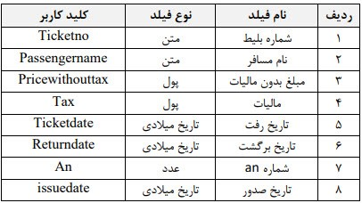

## همگام‌ساز نرم‌افزار فرانگر و پیام‌گستر

این همگام‌ساز کلیه قراردادهای ثبت شده در نرم‌افزار فرانگر که شامل بلیط‌های خریداری شده توسط مشتریان می‌باشد، را در قالب یک **قرارداد** به پیام‌گستر منتقل می‌کند. اقدامات زیر پیش‌نیاز تنظیمات همگام‌ساز فرانگر می‌باشد:

1.    ایجاد نام کاربری و پسورد برای دسترسی به دیتابیس فرانگر که توسط شرکت فرانگر این موارد باید انجام شود.

2.    ایجاد یک **نوع قرارداد** با کد ticket و ایجاد فیلدهای زیر (این فیلدها اطلاعاتی است که از سمت نرم‌افزار فرانگر به پیام‌گستر بر روی آیتم قرارداد منتقل می‌گردد.) 

- این سینک به‌صورت لحظه‌ای نبوده و در **یک‌زمان مشخص** که در تنظیمات فایل config مرتبط همگام‌ساز انجام می‌شود. به عبارتی هر 24 ساعت یکبار انجام می‌شود.

- امکان سینک هویت بر اساس شماره مشتری و ست‌کردن وب هوک از پیام‌گستر به فرانگر وجود دارد، ولی حتماً باید تعداد ارقام شماره مشتری که در فرانگر قابل ایجاد است ابتدا بررسی شود که اطلاعات تکراری ذخیره نشود. 

- این همگام‌ساز دارای پنل نیست و کلیه موارد انجام شده یا خطاها در فایل log در محل نصب همگام‌ساز قابل‌بررسی است.

> **نکته:** لازم به ذکر است قراردادهای منتقل شده از سمت نرم‌افزار، قراردادهای تأیید و نهایی شده می‌باشند. پس از انجام اقداماتی نظیر رزرواسیون و مالی، قرارداد ثبت شده و به پیام‌گستر منتقل می‌شود.  در صورت داشتن ماژول مدیریت چرخه‌کاری و در صورت درخواست کارفرما جهت پیاده‌سازی فرایندهای پیگیری واحدهای مختلف، لازم است ترتیب زمانی و هماهنگی واحدها (کانتر بلیت، رزرواسیون و مالی) در نظر گرفته شود.
