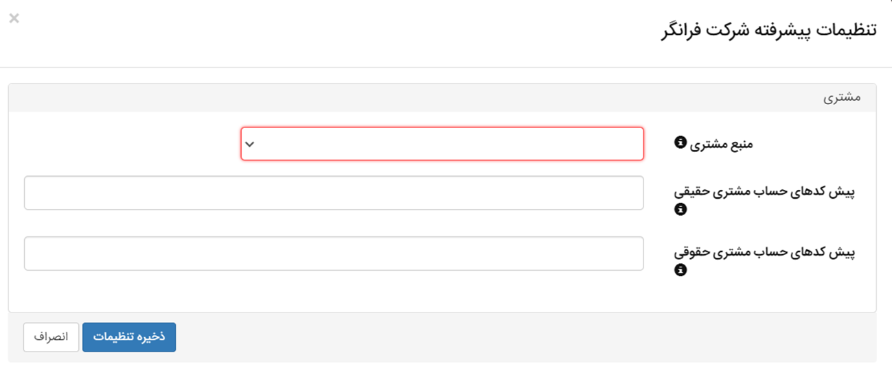

# همگام‌سازی نرم‌افزار فرانگر و پیام‌گستر

با همگام‌سازی نرم‌افزار فرانگر و پیام‌گستر، انتقال اطلاعات مشتریان و همچنین بلیط‌های ثبت‌شده به صورت خودکار به نرم‌افزار دیگر انتقال می‌یابد. این بدین معناست که در صورت ثبت اطلاعات مشتری و بلیط خریداری شده در فرانگر، بدون نیاز به ثبت دستی اطلاعات مذکور در پیام‌گستر،‌این اطلاعات در پیام‌گستر نیز ثبت می‌گردد. بر این اساس تمامی بلیط‌های ثبت شده در فرانگر در قالب **قرارداد** در پیام‌گستر ثبت می‌شود. همگام‌سازی به صورت **آنلاین و در لحظه** و بر اساس **شماره مشتری** انجام می‌پذیرد.<br>
برای برقراری همگام‌سازی به موارد زیر توجه فرمایید:<br>
 - نام کاربری و پسورد لازم برای دسترسی به دیتابیس فرانگر  را ایجاد کنید. این کار باید توسط شرکت فرانگر انجام پذیرد.
- یک زیرنوع قرارداد با کد ticket در پیام‌گستر ایجاد نمایید. ۱۲ فیلد مورد نیاز را بر اساس جدول زیر در این قرارداد ایجاد کنید.

|کلید کاربر | نوع فیلد  | نام فیلد |
|---- | ---- | -----|
|TicketNo         |  متن    |       شماره بلیط |
|PassengerName    |  متن  |        نام مسافر   |
|PriceWithoutTax  | پول| مبلغ بدون مالیات     |
|Tax | پول  |   مالیات |
|TicketDate  | تاریخ میلادی  |   تاریخ رفت |
|ReturnDate  | تاریخ میلادی  |تاریخ برگشت |
|AN   | عدد  |   شماره an |
|IssueDate   | تاریخ میلادی  |   تاریخ صدور |
|Masir   | متن  |   مسیر   |
|companyid   | متن  |   شناسه شرکت |
|FactType    |  متن|   نوع قرارداد|
|Status  |   چک باکس  |   فعال   |

با توجه به اینکه هر قرارداد در فرانگر می‌تواند Status‌های متفاوتی داشته باشد (در وضعیت‌های مختلف باشد) فعال/غیرفعال بودن آن از طریق چک باکس فعال در پیام‌گستر مشخص می‌شود.<br>

- برای ورود به پنل همگام‌سازی کافیست :۹۰۹۲ را به انتهای آدرس IP نرم‌افزار خود اضافه کرده و در نوار  URL وارد نمایید. با استفاده از نام کاربری و رمز عبور ادمین پیام‌گستر خود می‌توانید وارد پنل همگام‌سازی شوید.
- در بخش «شرکت‌ها» گزینه‌ی فرانگر قابل مشاهده است. با کلیک بر روی گزینه‌ی تنظیمات پیشرفته می‌توانید منبع مشتری را در همگام‌سازی خود انتخاب نمایید.



بنابر منبع مشتری انتخابی شرایط همگام‌سازی به شرح زیر است:

## همگام‌سازی بر اساس مشتری
اگر تنظیمات همگام‌سازی بر اساس «مشتری» انجام شده باشد:
- در این حالت امکان همگام‌سازی دو طرفه **هویت** وجود خواهد داشت. این بدین معناست که شما می‌توانید هویت‌ها را از پیام‌گستر به فرانگر و یا از فرانگر به پیام‌گستر انتقال دهید. 
- در این حالت تمامی هویت‌‌ها از نوع **حقیقی** در نظر گرفته می‌شود.
- در همگام‌سازی بر اساس مشتری می‌توانید تمامی مشتریان موجود در نرم‌افزار فرانگر را با سوابق (قراردادهای) موجود، به پیام‌گستر انتقال دهید.
- در این حالت نیاز به درج پیش کدهای حساب مشتری **نمی‌باشد**.
-  زیرالگوی شماره‌گذاری هویت و قرارداد در پیام‌گستر طبق الگوی زیر تنظیم گردد:

```
100-{*(AN)}                       الگوی شماره‌گذاری هویت حقیقی
100-{____(SHYY)}/{*(AN)}      الگوی شماره‌گذاری قرارداد فرانگر
```

## همگام‌سازی بر اساس کد تفصیلی
اگر تنظیمات همگام‌سازی بر اساس « کد تفصیلی» انجام شده باشد:<br>
- در این حالت هویت فقط از فرانگر به پیام‌گستر انتقال می‌یابد. 
- هویت‌ها می‌توانند در دو نوع حقیقی و حقوقی ثبت شوند.
- در همگام‌سازی بر اساس کد تفصیلی مشتری به هنگام ثبت قرارداد به پیام‌گستر انتقال داده می‌شود. این بدین معناست که امکان انتقال سوابق مشتریان پیشین وجود ندارد. در صورت نیاز به اطلاعات مشتریان سابق، اطلاعات باید از طریق اکسل منتقل گردد (کلید انتقال همه در این حالت غیرفعال خواهد بود).
- پیش کدهای حساب مشتری حقیقی و حقوقی باید بر اساس کدهای موجود در جدول حساب مشتری در پایگاه داده‌ی فرانگر در این قسمت درج شود. با بررسی جدول می‌توانید پیشوندهای تکرار شده را مشاهده نمایید (به عنوان مثال ۲-۱۲). در صورتی که بیش از یک پیشوند در بین کدها مشاهده می‌شود، آن‌ها را با استفاده از «؛» جدا نمایید (به عنوان مثال ۲-۱۲؛۲-۱۰).
-  الگوی شماره‌گذاری هویت و قرارداد در پیام‌گستر طبق الگوی زیر تنظیم گردد:
```
100-{*(AN)}                   الگوی شماره‌گذاری هویت حقیقی و حقوقی
100-{____(SHYY)}/{*(AN)}          الگوی شماره‌گذاری قرارداد فرانگر
```

توجه داشته باشید که الگوی شماره‌گذاری هویت‌ها بر اساس کد حساب هویت‌ها در فرانگر می‌تواند متغیر باشد. در صورت دو یا سه بخشی بودن کد حساب، الگوی شماره‌گذاری نیز باید به همین شیوه تعریف شود.

> **نکته**<br>
> در صورت انتقال اطلاعات هویت از پیام‌گستر به فرانگر،‌ با توجه به امکان درج یک شماره تلفن و موبایل در نرم‌افزار فرانگر، شماره تلفن و موبایل پیش‌فرض انتقال پیدا می‌کند.<br>