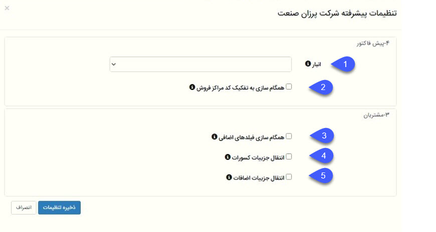

### تنظیمات پیشرفته همگام‌ساز همکاران و پیامگستر
 
 
 
#### پیش فاکتور

1.	انبار: در حال حاضر کاربردی ندارد.

2.	همگام‌سازی به تفکیک کد مراکز فروش: در حال حاضر کاربردی ندارد.

3.	همگام‌سازی فیلدهای اضافی: در حال حاضر کاربردی ندارد.

4.	انتقال جزئیات کسورات: در صورت فعال بودن این گزینه کسورات به فاکتور فروش، پیش فاکتور فروش و فاکتور برگشت از فروش در پیامگستر منتقل می‌شود.

5.	انتقال جزئیات اضافات: در صورت فعال بودن این گزینه، اضافات به فاکتور فروش، پیش فاکتور فروش و فاکتور برگشت از فروش در پیامگستر منتقل می‌شود.

