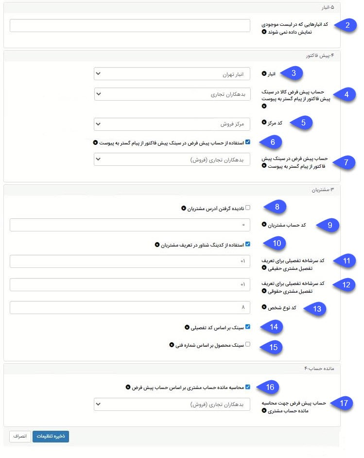

### تنظیمات پیشرفته همگام‌ساز پیوست و پیام‌گستر

#### عمومی:

**1. سینک دیتا بعد یا مساوی با سال مالی:** در این قسمت می‌توان مشخص کرد آیتم‌های مالی از چه سالی به بعد از سپیدار به پیام‌گستر سینک شود.

#### انبار: 

**2.    کد انبارهایی که در لیست موجودی نمایش داده نمی‌شود:** در این قسمت می‌توان کد انبارهایی که نمی‌خواهید نام و موجودی کالایشان در لیست انبارها نمایش داده شوند را وارد کنید.

#### پیش فاکتور: 

3.    **انبار:** در این قسمت می‌توان انبار پیش‌فرض کالا را برای سینک پیش‌فاکتور از پیام‌گستر به پیوست مشخص کرد. لازم به ذکر است در لیست انبارها تنها نام انبارهایی نمایش داده می‌شوند که در تنظیمات انبار محدود نشده باشند. برای ورود چند کد انبار، کدها را با ویرگول از هم جدا کنید. به‌عنوان‌مثال: 001،002،003

4.    **حساب پیش‌فرض کالا در سینک پیش‌فاکتور از پیام‌گستر به پیوست:** در این قسمت می‌توان حساب پیش‌فرض کالا را برای سینک پیش‌فاکتور از پیام‌گستر به پیوست را مشخص کرد. اسم حساب پیش‌فاکتور موردنظر را در این قسمت مشخص کنید.

5.    **کد مرکز:** در این قسمت کد مرکز که در صفحه پیش‌فاکتور وجود دارد را وارد کنید.

6.    **چک باکس استفاده از حساب پیش‌فرض در سینک پیش‌فاکتور از پیام‌گستر به پیوست:** در صورت فعال‌کردن چک باکس، قابلیت سینک پیش‌فاکتور از پیام‌گستر به پیوست فعال می‌شود.

7.    **حساب پیش‌فرض در سینک پیش‌فاکتور از پیام‌گستر به پیوست:** حساب پیش‌فرض برای سینک پیش‌فاکتور از پیام‌گستر به پیوست را انتخاب کنید.

#### مشتریان:

8.**مسیر منو برای چک کردن کد حساب مشتریان:**  درختواره حساب > دسته‌بندی کد موردنظر > پیداکردن اسم مشتری

9. **کد حساب مشتریان:**  کد حساب پیش‌فرض برای سینک شدن آیتم‌های مالی از پیام‌گستر به پیوست

**مسیر منو برای چک کردن کد حساب مشتریان:**  درختواره حساب > دسته‌بندی کد موردنظر > پیداکردن اسم مشتری

10.    **چک باکس استفاده از کدینگ شناور در تعریف مشتریان:** در صورت تیک بودن این گزینه، شماره آیتم‌های مالی که از پیام‌گستر به پیوست سینک می‌شوند طبق الگوی کدینگ تعریف شده در پیوست می‌باشد؛ یعنی شماره آیتم مالی از ادامه آخرین آیتم مالی صادر شده در پیوست است. در صورت فعال نشدن چک باکس شماره آیتم‌های مالی طبق کد پیام‌گستر وارد می‌شوند و طبق الگوی پیوست نیست.

11.    **کد سرشاخه تفصیلی برای تعریف تفصیل مشتری حقیقی:** در این قسمت می‌توان باتوجه‌به نیاز و استراتژی شرکت یک کد سرشاخه تفصیلی برای مشتریان حقیقی در نظر گرفت. در واقع با انتخاب کد سرشاخه تفضیلی می‌توان مشتریان حقیقی و حقوقی را در سطح‌های جداگانه قرارداد. لازم به ذکر است می‌توان کد سرشاخه تفصیلی حقیقی و حقوقی یکسان باشند.

12.    **کد سرشاخه تفصیلی برای تعریف تفصیل مشتری حقوقی:** در این قسمت می‌توان یک کد سرشاخه تفصیلی برای مشتریان حقوقی در نظر گرفت. در واقع با انتخاب کد سرشاخه تفضیلی می‌توان مشتریان حقیقی و حقوقی را در سطح‌های جداگانه قرارداد. برای 
مسیر منو کد سرشاخه تفصیلی: درختواره تفصیلی‌ها > دسته‌بندی کد موردنظر > پیدا کرد اسم مشتری

13.    **کد نوع شخص:** در این قسمت کد نوع شخص را برای سینک شدن هویت‌ها وارد کنید. برای پیداکردن کد نوع شخص مسیر زیر را دنبال کنید. 
مسیر منو کد نوع شخص: بازکردن یک هویت > کلیک روی فیلد نوع > صفحه جدیدی باز می‌شود که کد نوع شخص در آن قرار دارد. 

> نکته: هر یک از کدهای نوع شخص، سرشاخه تفصیلی حقیقی، سرشاخه تفصیلی حقوقی، کد حساب مشتریان اشتباه وارد شود با پیغام خطا داده می‌شود، لذا برای اطمینان از صحت کدهای وارد شده حتماً با مسیر منوها چک شود.

14.    **چک باکس سینک بر اساس کد تفصیلی:** در صورت فعال‌بودن چک باکس، سینک هویت‌ها از پیام‌گستر به پیوست بر مبنای کد تفصیلی خواهد بود. اگر چک باکس فعال نشود، بر اساس کد اشتراک است.

15.    **چک باکس سینک محصول بر اساس شماره فنی:** در صورت فعال‌بودن چک باکس، سینک محصولات از پیام‌گستر به پیوست بر مبنای شماره فنی خواهد بود. اگر چک باکس فعال نشود، بر اساس کد محصول است.

#### مانده حساب: 

16.    **چک باکس محاسبه مانده‌حساب مشتری بر اساس حساب پیش‌فرض:** در صورت فعال‌کردن چک باکس، مانده‌حساب مشتری در پیام‌گستر نمایش داده می‌شود.

17.    **حساب پیش‌فرض جهت محاسبه مانده‌حساب مشتری:** در این قسمت حساب موردنظر برای نشان‌دادن مانده‌حساب مشتری در پیام‌گستر را انتخاب کرده.

با استفاده از کلید ذخیره، تنظیمات اعمال شده ذخیره می‌گردد.

> نکته مهم: بعد از انجام تغییرات در تنظیمات پیشرفته و ذخیره آن حتماً یکبار سرویس‌های همگام ساز restart  شود.

