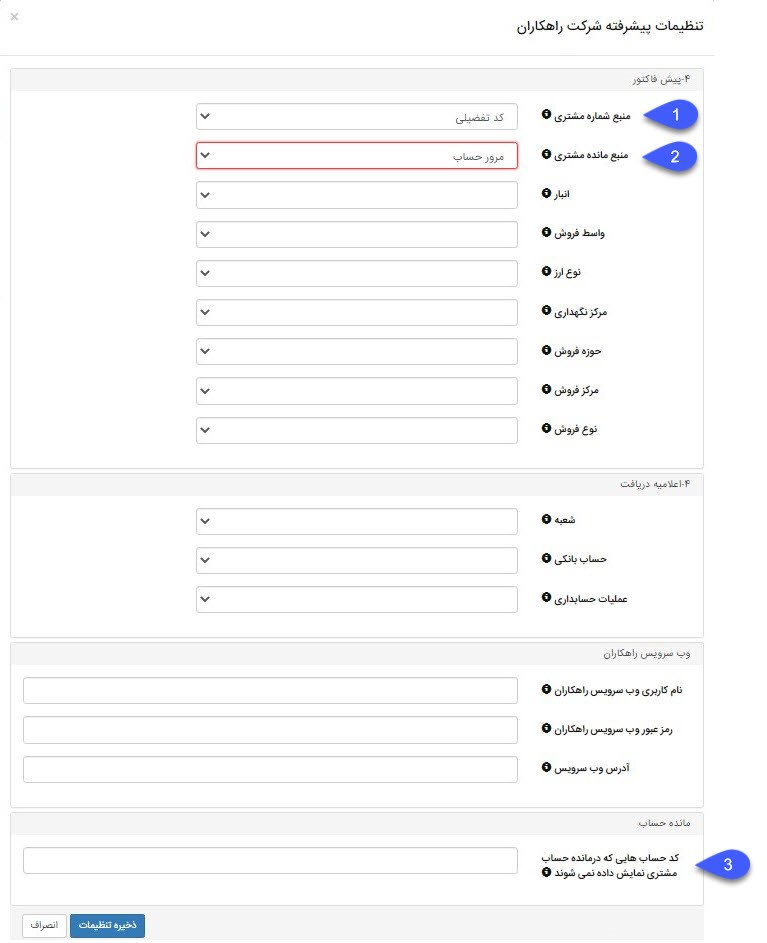

### تنظیمات پیشرفته همگام‌ساز راهکاران و پیامگستر

#### پیش فاکتور

1.	1.	**1	منبع شماره مشتری:** در این قسمت منبع شماره مشتری را برای خواندن در پیامگستر مشخص کنید. منبع شماره مشتری را می‎توان  یکی از کدهای کد حساب، کد تفصیلی و کد مشتری انتخاب کرد. کد طرف حساب، کد مشتری و کد تفصیلی می توانند یکسان نباشند.

آدرس منو کد طرف حساب : تب اشخاص و شرکت‌ها > تب اطلاعات اصلی > کد در بالای صفحه : کد طرف حساب

آدرس منو کد تفصیلی: تب اشخاص و شرکت‌ها > تب اطلاعات تفصیلی > کد در بالای صفحه: کد تفصیلی

آدرس منو کد مشتری: تب مشتری > انتخاب مشتری از لیست مشتریان > کد در بالای صفحه: کد مشتری

2.	**منبع مانده مشتری:** در این قسمت منبع مانده مشتری را برای خواندن در پیامگستر مشخص کنید. منبع مانده مشتری را می‌توان یکی از فیلدهای مرور حساب یا مرور فروش بدون احتساب اعتبار انتخاب کرد.

**آدرس منو مرور حساب:** مرور حساب > حساب تفصیلی > چاپ > گزارش مرور حساب > با اعتبار  =مرور حساب

**آدرس منو بدون احتساب اعتبار:** مرور حساب > حساب تفصیلی > چاپ > گزارش مرور حساب > بدون اعتبار = فروش بدون احتساب اعتبار

#### مانده حساب

3.	**کد حساب‌هایی که در مانده حساب مشتری نمایش داده نمی‌شوند:** در این قسمت تمامی کد‍ حساب‌هایی که نمی‌خواهید در مانده حساب لحاظ شوند را وارد کنید. برای ورود چند کد حساب، کدها را با ویرگول از هم جدا کنید. به عنوان مثال: 001،002،003

