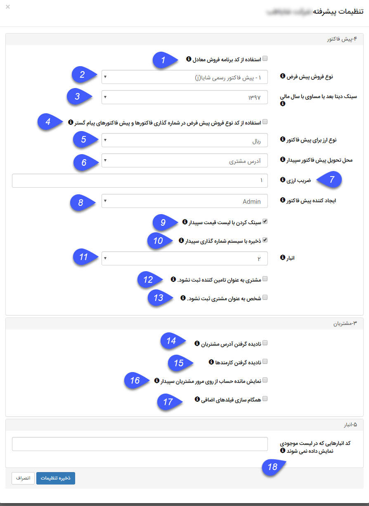

### تنظیمات پیشرفته همگام‌ساز سپیدار و پیامگستر

**پیش‌فاکتور:**  در سیستم سپیدار امکان تعریف پیش فاکتور و فاکتورهای فروش با برنامه فروشهای مختلف وجود دارد (حتی با شماره های تکراری) . برای انتقال این آیتمها براساس برنامه فروش به پیام گستر حتما باید براساس کد برنامه فروش پیش فاکتور و فاکتورهای متناظر در پیام گستر ایجاد و تنظیمات مربوط انجام شود.

1. **استفاده از کد برنامه فروش معادل:** اگر استفاده از برنامه فروش معادل فعال شود باید  به ازای هر برنامه فروش یک فاکتور فروش یا پیش فاکتور فروش در پیام گستر ایجاد شود و در تنظیمات کدهای این آیتمها، کد برنامه فروشی که از سپیدار در تنظیمات پیشرفته وجود دارد وارد میشود.

2. **نوع فروش پیش‌ فاکتور:** نوع برنامه فروشی برای هنگامی که پیش فاکتور از پیام گستر به سپیدار منتقل میشود را جهت ثبت در سپیدارانتخاب کرده. همچنین لیست قیمت محصولات در سپیدار در برنامه فروش قرار دارد در صورت انتخاب این گزینه قیمت محصولات براساس این برنامه فروش به پیام گستر منتقل میشود و در قیمت واحد نشان داده میشود.

**نکته مهم:** در صورت تغییر این برنامه فروش دوباره محصولات باید سینک بشوند که قیمتهای آنها آپدیت شود.

3. **سینک دیتا بعد یا مساوی با سال مالی:** در این بخش می توان مشخص کرد که آیتمهای مالی از چه سالی به بعد از سپیدار به پیام گستر سینک شوند.

4. **استفاده از کد نوع فروش پیش فرض در شماره گذاری فاکتورها و پیش فاکتورهای پیام‌گستر:** قابلیتی در سپیدار وجود دارد که مشتری می تواند شماره تکراری در پیش فاکتور و فاکتور فروش براساس برنامه فروشهای مختلف بزند. در صورتیکه شماره گذاری مشتری بر این اساس باشد و براساس برنامه فروش هم تفکیک نشود باید این گزینه انتخاب شود تا هنگامیکه به پیام گستر منتقل میشود در هنگام شماره گذاری در ابتدای شماره کد نوع فروش هم وارد شود.

5. **نوع ارز برای پیش‌فاکتور:** انتخاب نوع ارز برای پیش فاکتورهایی که از پیام گستر به سپیدار منتقل میشود.

6. **محل تحویل پیش‌فاکتور سپیدار:** انتخاب محل تحویل پیش فاکتور که در سپیدار باید پر شود.

7. **ضریب ارزی:** انتخاب ضریب ارزی تعریف شده در سپیدار   

8. **ایجادکننده پیش‌فاکتور:** انتخاب کاربر مورد نظر بعنوان ایجاد کننده پیش فاکتور در سپیدار در این قسمت انجام میشود. (کاربر  admin  انتخاب شود چون ممکن است کاربران دیگر قابلیت ثبت پیش فاکتور را نداشته باشند)

9. **سینک کردن با لیست قیمت سپیدار:** در سپیدار در بخش اعلامیه قیمت می توان براساس برنامه فروش های متفاوت برای محصول قیمت های مختلفی تعریف کرد.با فعال کردن این گزینه هنگام انتقال پیش فاکتورها از پیامگستر به سپیدار قیمت محصولات براساس این قیمت های تعریف شده مشخص می گردد.

10. **ذخیره با سیستم شماره گذاری سپیدار:** با فعال کردن این گزینه شماره گذاری براساس شماره های موجود در سپیدار انجام می شود.(به بیان دیگر زمانی که پیش فاکتور به سپیدار منتقل می شود شماره آن تغییر کرده و براساس آخرین شماره پیش فاکتور موجود در سپیدار شماره دهی می شود.)

11. **انبار:** در این بخش می توان انبار پیش فرض را انتخاب کرد که هنگام انتقال پیش فاکتور ها به سپیدار در کدام انبار قرار بگیرد.

12. **مشتری به عنوان تامین کننده ثبت نشود:** با فعال کردن این گزینه با انتقال هویت به سپیدار تیک تامین کننده در سپیدار برای آن هویت فعال نمی شود. 

13. **شخص به عنوان مشتری ثبت نشود:** با فعال کردن این گزینه با انتقال مشتری به سپیدار تیک مشتری در سپیدار برای این هویت فعال نمی شود.

**مشتریان**

14. **نادیده گرفتن آدرس مشتریان:** در صورت انتخاب این گزینه آدرس مشتریان از پیام گستر به سپیدار منتقل نمیشود.

15. **نادیده گرفتن کارمندان:** در صورت انتخاب این گزینه مشتریانی که در سپیدار به عنوان کارمند تعریف شده باشند ( یعنی برایشان تیک کارمند خورده باشد) به پیام گستر منتقل نمی شود.

16. **نمایش مانده حساب از روی مرور مشتریان سپیدار:** با فعال کردن این گزینه مانده حساب از مرور فروش در سپیدار و در صورت انتخاب نشدن این گزینه مانده حساب را از مرور حساب در سپیدار میخواند. 

**نکته:** در سپیدار دو نوع مانده حساب برای هویت ها وجود دارد

**مرورحساب:** براساس آیتم های که برای آن ها سند خورده است محاسبه میگردد.

**مرور فروش:** براساس آیتم هایی که برای هویت ثبت شده است (آیتم هایی که برای آن ها سند خورده است + آیتم هایی که برای آن ها سند نخورده است)محاسبه می شود.

17. **همگامسازی فیلدهای اضافی:** در حال حاضر کاربردی ندارد

**انبار**

18. **کد انبارهایی که در لیست موجودی نمایش داده نمی‌شوند:** با انتخاب این گزینه کد انبارهایی که در اینجا وارد میشود در وب سرویس موجودی کالا نمایش داده نمی شود. 

برای ذخیره شده تنظیمات از طریق کلید ذخیره اقدام کنید.

**نکته مهم :** بعد از انجام تغییرات در تنظیمات پیشرفته و ذخیره آن حتما یکبار سرویس های همگام ساز restart  شود.

**
