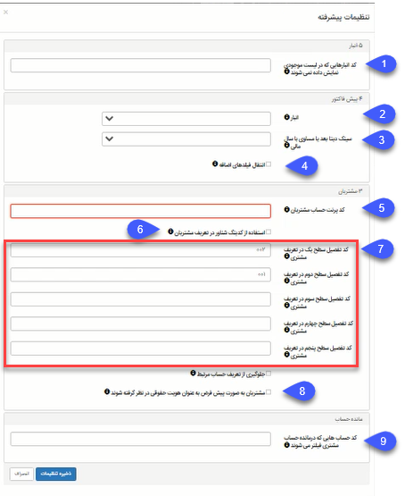

### تنظیمات پیشرفته همگامساز تدبیر و پیامگستر

#### انبار

کد انبارهایی که در لیست موجودی نمایش داده نمی‎شوند: در این قسمت می‌توان کد انبارهایی که نمی‌خواهید نام و موجودی کالایشان در لیست انبارها نمایش داده شوند را وارد کنید.

#### پیش‌فاکتور

2.	**انبار:** در این قسمت می توان انبار پیشفرض کالا را برای سینک پیش‌فاکتور از پیامگستر به پیوست مشخص کرد. لازم بذکر است در لیست انبارها تنها نام انبارهایی نمایش داده می‌شوند که در تنظیمات انبار محدود نشده باشند.

3.	**سینک دیتا بعد یا مساوی با سال مالی:** در این قسمت می‌توان مشخص کرد آیتم‌های مالی از چه سالی به بعد از سپیدار به پیامگستر سینک شود.

4.	**چک باکس انتقال فیلدهای اضافه:** در حال حاضر کاربردی ندارد

#### مشتریان

5.	**کد پرنت حساب مشتریان:** کد حساب مشتریان را در این قسمت وارد کنید

 مسیر منو : تب حسابداری > تب مدیریت حساب‌ها در سطح کل > وارد حساب مورد نظر شده > کد فیلد شماره حساب مورد نظر در فیلد کد پرنت حساب مشتری وارد شود.

دا	**چک باکس استفاده از کدینگ شناور:** در صورت تیک بودن این گزینه، شماره آیتم‌های مالی که از پیامگستر به پیوست سینک می‌شوند طبق الگوی کدینگ تعریف شده در پیوست می‌باشد؛ یعنی شماره آیتم مالی از ادامه آخرین آیتم ‌مالی صادر شده در پیوست است. در صورت فعال نشدن چک باکس شماره آیتم‌های مالی طبق کد پیامگستر وارد می‌شوند و طبق الگوی پیوست نیست.

**نکته:** برای خواندن مانده حساب باید چک باکس کد تفصیلی در صفحه مانده حساب و چک باکس استفاده از کدینگ شناور در همگام‌ساز هر دو تیک خورده شده باشند.

**7. کدهای سطح تفصیلی:** 

مسیر منو: تب حسابداری >  مدیریت حساب‌ها >  تفصیلی‌های شناور

**کد تفصیل سطح یک در تعریف مشتری:** کد تفصیلی سطح اول را وارد کنید.

**کد تفصیل سطح دوم در تعریف مشتری:** کد تفصیلی سطح دوم را وارد کنید.

**کد تفصیل سطح سوم تعریف مشتری:** کد تفصیلی سطح سوم را وارد کنید.

**کد تفصیل سطح چهارم مشتری:** کد تفصیلی سطح چهارم را وارد کنید.

**کد تفصیل سطح پنجم مشتری:** کد تفصیلی سطح پنجم را وارد کنید.

کدهای سطح تفصیلی به منظور مشخص کردن مسیر ذخیره مخاطبان از پیامگستر به تدبیر است. کد سطح‌‌ها به ترتیب تفصیلی اول، تفصیلی دوم، تفصیلی سوم، تفصیلی چهارم و تفصیلی پنجم می‌باشند که بر اساس ترتیب وارد شدن کدها، مسیر ذخیره مخاطبان در نرم‌افزار تدبیر مشخص می‌شود. به عنوان مثال اگر میسر ذخیره مشتریان در نرم‌افزار تدبیر " تفصیلی سطح اول: 002 : هویت‌ها > تفصیلی سطح دوم: 001: مشتریان "  باشد، کد سطح‌های

تفصیلی در تنظیمات پیشرفته همگام‌ساز مانند نمونه زیر وارد می‌شوند: 

کد تفصیل سطح یک در تعریف مشتری: 002

کد تفصیل سطح دو در تعریف مشتری: 001

8.	**چک باکس مشتریان به صورت پیشفرض به عنوان هویت حقوقی در نظر گرفته شوند:** برای سینک هویت‌ها از پیامگستر به پیوست الزامیست که این چک
باکس حتما تیک شود. با فعال شدن چک باکس تمامی هویت‌ها بصورت پیشفرض حقوقی در نظر گرفته می‌شوند.

لازم بذکر است، با فعال کردن چک باکس تمامی هویت‌ها به عنوان هویت حقوقی به پیامگستر منتقل می‌شوند. به منظور تفکیک هویت حقیقی و حقوقی، پس از فعال کردن اطلاعات مالیاتی می‌توان نوع هویت حقیقی و حقوقی را مشخص کرد.

#### مانده‌ حساب 

9.	 **کد حساب‌هایی که در مانده حساب مشتری فیلتر می‌شوند:** در این قسمت تمامی کد‍ حساب‌هایی که نمی‌خواهید در مانده حساب لحاظ شوند را وارد کنید. برای ورود چند کد حساب، کدها را با ویرگول از هم جدا کنید. به عنوان مثال: 001،002،003

نکته مهم :  بعد از انجام تغییرات در تنظیمات پیشرفته و ذخیره آن حتما یکبار سرویس های همگام ساز restart  شود.

