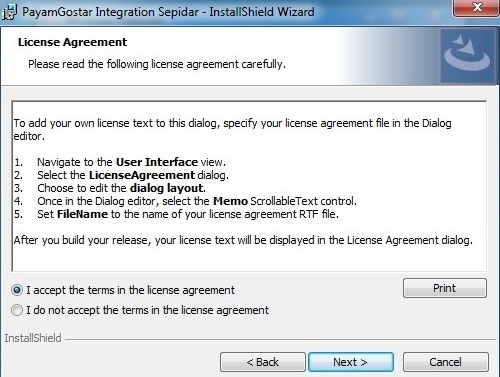
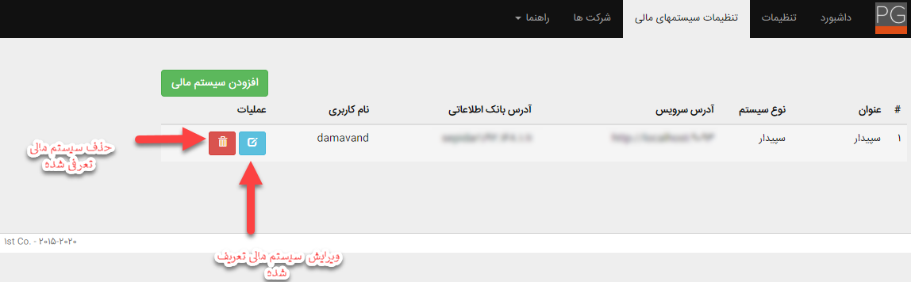
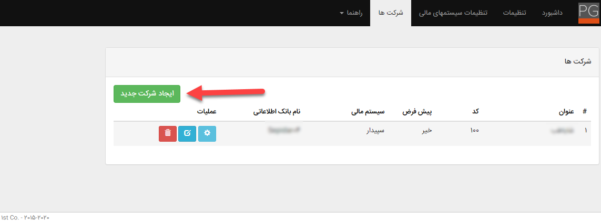

### تنظیمات مشترک همگام ساز نرم‌افزارها مالی

#### همگام ساز نرم‌افزار مالی

ماژول همگام ساز یک نرم‌افزار تکمیلی تولید‌شده توسط پیام‌گستر می‌باشد که وظیفه اصلی آن انتقال داده‌ها از نرم‌افزار مالی (سپیدار، پیوست، تدبیر، همکاران و راهکاران) به پیام‌گستر و از پیام‌گستر به نرم‌افزار مالی (سپیدار، پیوست، تدبیر و همکاران) است. لازم به ذکر است آیتم‌هایی که از مالی به پیام‌گستر و از پیام‌گستر به مالی منتقل می‌شوند باتوجه‌به نوع نرم‌افزار مالی متفاوت می‌باشد، یعنی برخی از آیتم‌ها دوطرفه و برخی دیگر یک‌طرفه هستند. همچنین تمامی آیتم‌ها باتوجه‌به سناریو سینک به‌محض ثبت در نرم‌افزار مالی به پیام‌گستر منتقل می‌شوند.

#### فرایند یکپارچه فروش و مالی

#### فرایند کاری بر اساس سوابق مالی

یکی از ویژگی‌های کلیدی پیام‌گستر امکان ایجاد فرایند و گردشکار بر اساس آیتم‌های اطلاعاتی است. اطلاعات دریافت شده از سیستم‌های مالی در قالب آیتم‌های اطلاعاتی پیام‌گستر در سوابق قرار می‌گیرند. این امکان آن را فراهم می‌کند که با تعریف چرخه‌های کاری بر روی آیتم‌های منتقل‌شده، از مزایای اطلاع‌رسانی و گردشکاری پیام‌گستر بر روی اطلاعات و عملیات موجود در نرم‌افزار مالی استفاده نمود. به‌عنوان‌مثال چنانچه فاکتوری برای مشتری صادر شود، از طریق ایمیل یا پیامک به وی اطلاع داده شود و پیگیری پرداخت وی توسط پرسنل فروش انجام شود یا با ثبت دریافت در نرم‌افزار مالی پیام تشکر برای مشتری ارسال شود و فرم نظرسنجی برای وی ایجاد گردد.
#### سال مالی

پیام‌گستر دارای مفهوم سال مالی نیست؛ بنابراین سال مالی مربوط به آیتم‌ها در شماره‌گذاری مشخص می‌شود و بر اساس شماره تشخیص داده می‌شود که آیتم دریافت‌شده مربوط به کدام سال مالی است. در تنظیمات شماره‌گذاری آیتم‌های پیام‌گستر می‌توان از پارامترهای {SHYY} و {MIYY} استفاده نمود تا مشخص شود که آیتم ایجاد شده در پیام‌گستر در کدام سال مالی سپیدار ثبت گردد.

### امکان اتصال همگام ساز به چند پایگاه‌داده

نرم‌افزار همگام ساز امکان همگام‌سازی هم‌زمان با چند پایگاه‌داده یک سیستم مالی (شرکت) را فراهم می‌کند.
همچنین امکان همگام‌سازی با چند سیستم مالی نیز وجود دارد.

> نکته: درصورتی‌که نیاز به همگام‌سازی چند پایگاه‌داده از یک سیستم مالی با یک پیام‌گستر باشد فقط نصب یک سرویس
>  Platfrom و Integration  کافی است.
 
> نکته: درصورتی‌که نیاز به همگام‌سازی از چند سیستم مالی با یک پیام‌گستر باشد نصب یک سرویس 
> Platfrom کافی است اما به‌ازای هر سیستم مالی باید سرویس Integration مرتبط با آن سیستم مالی در جاهای مختلف نصب شود. 

> نکته: درصورتی‌که نیاز به همگام‌سازی یک سیستم مالی با دو پیام‌گستر باشد حتماً باید دو سرویس
>  Platfrom   و integration  جدا نصب شود. (به‌ازای هر سرویس  integration باید پایگاه‌داده همگام ساز مرتبط وجود داشته باشد.)

انتقال آیتم‌ها از نرم‌افزار مالی به پیام‌گستر و بالعکس بر اساس شماره‌گذاری تنظیم‌شده در پنل همگام‌سازی و تنظیمات انواع آیتم‌های مالی مشخص می‌شوند. بر روی هر آیتم مالی یا هویت یک کد شرکت به شماره‌گذاری اضافه می‌گردد و کد شرکت مشخص‌کننده مقصد همگام‌سازی (پایگاه‌داده موردنظر) می‌باشد.

اطلاعات منتقل‌شده از نرم‌افزار مالی به پیام‌گستر بر اساس کد شرکت مربوطه شماره‌گذاری شده و همگی به یک نوع آیتم یا هویت (تنظیم‌شده در پنل همگام ساز) منتقل می‌شوند. همچنین در نرم‌افزارهای سپیدار، تدبیر، پیوست و راهکاران اطلاعات منتقل‌شده از پیام‌گستر به نرم‌افزار مالی (هویت، پیش‌فاکتور) بر اساس کد شرکت مشخص شده در شماره آیتم (قابل تنظیم در شخصی‌سازی آیتم) در پایگاه‌داده مربوطه ثبت می‌شوند. به بیان دیگر اطلاعات دریافت‌شده از نرم‌افزار مالی با شماره‌گذاری‌های مختلف در یک محل در پیام‌گستر ثبت می‌شوند ولی اطلاعات دریافت‌شده از پیام‌گستر باتوجه‌به کد شرکت می‌توانند در محل‌های مختلف نرم‌افزار مالی ثبت گردند.

#### نصب همگام ساز نرم‌افزار مالی

پیش‌نیازهای موردنیاز همگام ساز نرم‌افزار مالی

1- نصب .Net Framework 4.5.2 به بالا 

2- نصب سرویس IIS 

> نکته: چون سرویس همگام ساز به طور پیش‌فرض روی سرور پیام‌گستر نصب می‌شود موارد 1 و 2 در صورتی نیاز به نصب دارند که سرویس‌های همگام ساز روی سرور دیگری نصب شوند. 

3- دسترسی به SQL سرور نرم‌افزار مالی؛ سیستمی که قرار است همگام ساز نرم‌افزار مالی روی آن نصب شود به SQL  سرور نرم‌افزار مالی باید دسترسی داشته باشد.

4- چک کردن داشتن ماژول PgWebservice  در محصول مشتری؛ 

5- ورژن نرم‌افزار مالی برای سینک لازم است ورژن یک سال اخیر بوده و SQL نرم‌افزار مالی حتماً 2008 به بالا باشد. 

#### روش نصب همگام ساز نرم‌افزار مالی:

همگام ساز جدید پیام‌گستر دارای دو سرویس به نام‌های  PG Integration Platfrom و PG Integration Sepidar می‌باشد که در ادامه مسیر فایل LOG و فایل نصب ذکر شده است.

**آدرس log:**
Drive C > Program data septa > PG Integration  (PG Integration Platform) > DB conection.ini

Drive C > Program data septa > ERP Integration > اسم نرم‌افزار مالی > configuration (تنظیمات پیشرفته) و log

> نکته مهم: برای نصب همگام ساز همیشه از آخرین نسخه آن که در ftp  پیام‌گستر به آدرس زیر هم در دسترس می‌باشد استفاده شود.

ftp://ftp.payamgostar.com/ExtendedServers/PgIntegration

> نکته مهم: در ادامه، تصاویر مراحل نصب همگام ساز مربوط به نرم‌افزار مالی سپیدار بوده که همانند نصب مابقی نرم‌افزارهای مالی می‌باشد. لازم به ذکر است مراحل نصب همگام ساز در تمامی نرم‌افزارهای مالی یکسان می‌باشد.

 
 
**نصب PG Integration:**

در این مرحله سرویس PG Integration   را نصب کنید.

 
**نصب PG Integration Platform:**

در ادامه تصاویر 7-14 مراحل نصب PG Integration Platform را به تفصیل توضیح داده است.
 

 

 

 

 

 

 •    پس از نصب سرویس PG Integration Platfrom  صفحه نصب همگام ساز به طور اتوماتیک به آدرس زیر باز می‌شود: localhost:9092/install

•    در صورت باز نشدن می‌توانید همین آدرس را در یک مرورگر وارد کنید.

•    برای اینکه بتوان به صفحه تنظیمات همگام ساز در سیستم‌های دیگر از طریق مرورگر دسترسی داشت باید پورت 9092 را در firewall سیستمی که روی آن همگام ساز نصب شده است باز کرد. 

•    قبل از انجام تنظیمات همگام ساز چک شود که سرویس‌های آن start باشد.

 

**صفحه نصب همگام ساز نرم‌افزار مالی**

پس از بازکردن صفحه نصب تنظیمات همگام ساز در قسمت‌های مربوطه باید مقادیر موردنیاز را وارد کرد.

> نکته مهم:
>  داشتن رمز کاربری admin سیستم پیام‌گستر،IP سرور نرم‌افزار مالی، نام کاربری و پسورد الزامی است. 

•    سپیدار: sql server username:  amavand / sql server password:  amavand
Instance            پیش‌فرض سیستم مالی سپیدار sepidar  می‌باشد 

•    تدبیر: sql server username: tadbiruser / sql server password: $$$%%%
Instance پیش‌فرض سیستم مالی سپیدار Tadbir  می‌باشد

•    پیوست: sql server username: sbsc / sql server password: Hslhk hfd kvlhtchv
Instance پیش‌فرض سیستم مالی سپیدار Peyvast  می‌باشد

•    همکاران: نام کاربری و پسورد sql server  از شرکت ارائه‌دهنده مالی پیگیری شود.

•    راهکاران: نام کاربری و پسورد sql server  از شرکت ارائه‌دهنده مالی پیگیری شود.

پس از واردکردن مقادیر و زدن دکمه Install  صفحه نصب همگام ساز به حالت زیر درمی‌آید:

  
درصورتی‌که مقادیر و ارتباطات درست باشد پایگاه‌داده PgIntegration   در سرور نرم‌افزار مالی ساخته می‌شود و به SqlServer نرم‎افزار مالی attach می‌شود.

 
صفحه لاگین مربوط به همگام ساز پس از مراحل بالا باز می‌شود و با نام کاربری admin  پیام‌گستر و پسورد آن می‌توان وارد صفحه تنظیمات شد.

#### پنل همگام ساز پیام‌گستر

پس از نصب و فعال‌بودن سرویس‌های همگام ساز، پنل همگام ساز پیام‌گستر با آدرس   localhost:9092/install و یا آدرس سرور پیام‌گستر به همراه پورت 9092 قابل‌دسترس می‌باشد . 
و می‌توان با نام کاربری و پسورد مدیر سیستم پیام‌گستر وارد پنل شد.

                                                                                               
#### پنل همگام ساز شامل قسمت‌های زیر می‌باشد:

##### 1- داشبورد

 در آن می‌توان آیتم‌های در صف یا سینک شده را بر اساس آیتم‌هایی که قابل سینک شدن هستند به‌صورت مقداری دید.  همین‌طور خطاهایی که در هنگام سینک شدن اتفاق می‌افتد می‌توان مشاهده کرد و بر اساس روال مربوطه نسبت به حل آنها اقدام کرد. گزارش مختصری از اتفاقات روی داده در سیستم همگام ساز بر اساس تاریخ و ساعت و نوع و پیام قابل‌مشاهده است. با استفاده از این بخش امکان مشاهده وضعیت سرویس  PG Integration Service و راه‌اندازی یا متوقف کردن آن وجود دارد.

  
##### 2- تنظیمات 

در این قسمت می‌توان تنظیمات مربوط به سیستم پیام‌گستر را (آدرس، نام کاربری و پسورد کاربر پیام‌گستر) را تست و انتخاب کرد. لازم به ذکر است می‌توان از لیست کاربران موجود در پیام‌گستر، هر کاربر فعالی که در پیام‌گستر دسترسی‌های لازم و کافی را برای ایجاد آیتم‌های مدنظر داشته باشد را انتخاب نمود که کاربر پیشنهادی، ادمین می‌باشد. دلیل داشتن دسترسی کامل برای تمامی آیتم‌ها این است که آیتم‌های صادر شده در نرم‌افزار مالی به پیام‌گستر منتقل می‌شوند و به نام این کاربر انتخاب شده در پیام‌گستر ایجاد می‌شوند، پس کاربر انتخابی باید دسترسی و مجوز‌های کامل را برای آیتم موردنظر داشته باشد.

همچنین در این قسمت امکان حذف آیتم‌های در صف وجود دارد، به بیان دیگر می‌توان صف را خالی کرد.

> نکته: در این بخش امکان تست صحیح بودن تنظیمات سیستم پیام‌گستر در همگام ساز وجود دارد. 

##### 3- تنظیمات سیستم مالی

در این قسمت می‌توان تنظیمات مربوط به سیستم‌های مالی مربوطه را انجام داد. 

همچنین ویرایش و حذف تنظیمات از این قسمت امکان‌پذیر است.

#### تنظیمات سیستم مالی در همگام ساز نرم‌افزار مالی

با زدن دکمه افزودن سیستم مالی صفحه جدید به‌صورت زیر باز می‌شود:
 

**عنوان سیستم مالی:** در این بخش می‌توان نام مناسبی برای سیستم مالی موردنظر انتخاب کرد.

موجودی تمام انبارها تجمیع شود: پیاده‌سازی صورت‌گرفته نشده است.

**نوع سیستم:** در این قسمت سیستم مالی (سپیدار، تدبیر، پیوست، همکاران و راهکاران) موردنظر را که قابلیت همگام‌سازی با پیام‌گستر دارد را انتخاب کنید.

**آدرس سرویس:** آدرس سرور همگام ساز به همراه پورت 9093 در این قسمت وارد می‌گردد. (درصورتی‌که سرویس همگام ساز روی سرور پیام‌گستر باشد به‌صورت پیش‌فرض http://localhost:9093  وارد شود) 

درصورتی‌که دو سرویس بر روی یک سرور باشند:  http://localhost:9093  

ولی اگر integration  روی سرور دیگری باشد باید آدرس وب‌سرویس اتصال سرویس platform  و سرویس Integration و پورت 9093 را بزنید 

> نکته: پورت می‌تواند تغییر کند

**نام کاربری و گذرواژه:** در این قسمت نام کاربری و پسورد سرویس همگام ساز وارد می‌شود (به‌صورت پیش‌فرض نام کاربری admin  و پسورد admin می‌باشد) .

**آدرس سرور پایگاه‌داده:** آدرس سرور سیستم مالی موردنظر در این قسمت تعریف کنید.

**نام کاربر و رمز عبور پایگاه‌داده:** نام کاربری و پسورد دیتابیس موردنظر همچنین ویرایش و حذف تنظیمات از این قسمت امکان‌پذیر است.

همچنین برای چک کردن درست بودن مقادیر و ارتباطات، دکمه بررسی اتصال را می‌زنیم و در صورت صحیح بودن آن را ذخیره می‌کنیم.

 
پس از ذخیره سیستم مالی مربوطه در تنظیمات سیستم مالی اضافه می‌شود.

4 - شرکت‌ها

در این بخش با انتخاب گزینه ایجاد شرکت جدید، می‌توان تنظیمات مربوط به پایگاه‌داده شرکت مرتبط با سیستم مالی اضافه شده را انجام داد.

تنظیمات سینک آیتم‌های موردنظر که قصد دارید از نرم‌افزار مالی سپیدار، تدبیر، پیوست، راهکاران و همکاران به پیام‌گستر و آیتم‌هایی که از پیام‌گستر به نرم‌افزارهای مالی سپیدار، تدبیر، پیوست و راهکاران سینک شوند از این قسمت انجام دهید. 

####تنظیمات شرکت‌ها در همگام‌ساز نرم‌افزار مالی

با زدن دکمه ایجاد شرکت جدید صفحه به‌صورت زیر باز می‌شود:

**سیستم مالی مرتبط:** از سیستم‌های مالی تعریف شده در همگام ساز، سیستم مالی موردنظر برای تعریف این شرکت انتخاب کنید.

**عنوان شرکت:** نام شرکت مرتبط با پایگاه‌داده مربوطه جهت سینک را وارد کنید.

**کد شرکت:** کد دلخواه برای این شرکت را از 100 تا 999 تعریف نمایید.

**نام بانک اطلاعاتی:** بانک‌های اطلاعاتی سیستم مالی انتخاب شده نمایش داده می‌شوند و می‌توان بانک اطلاعاتی موردنظر را برای سینک شدن انتخاب نمایید. 

> نکته: درصورتی‌که این شرکت به‌عنوان شرکت پیش‌فرض تعریف شود اگر در شماره‌گذاری آیتم‌ها در پیام‌گستر، شماره شرکت تعریف نشده باشد، آیتم منتقل شده به نرم‌افزار مالی در این شرکت قرار خواهد گرفت. (دررابطه‌با شماره شرکت در ادامه توضیح داده خواهد شد.) 
> همچنین اگر در تعریف وب‌سرویس برای نمایش موجودی محصولات در انبارها کد شرکت موردنظر تعریف نشود، موجودی این شرکت به‌عنوان شرکت پیش‌فرض نمایش داده خواهد شد. (دررابطه‌با کد شرکت و تعریف وب‌سرویس برای انبار در ادامه توضیح داده خواهد شد.) 

**کاربرد کد شرکت در همگام‌ساز:**
در آیتم‌هایی که از نرم‌افزار مالی به پیام‌گستر سینک می‌شود درصورتی‌که چند شرکت مختلف را تعریف کرده باشیم در پیام‌گستر کد شرکت تعریف شده به شماره آیتم اضافه شده و مشخص می‌شود که این آیتم مربوط به کدام شرکت و پایگاه‌داده می‌باشد. به طور مثال شماره مشتری در پیام‌گستر به این صورت نشان داده می‌شود:

کد مشتری در نرم‌افزار مالی - کد شرکت  10255 – 100

 
#### تنظیمات مشتری در شرکت‌ها در همگام‌ساز نرم‌افزار مالی و سیستم پیام‌گستر

**1.    سیستم مالی به نرم‌افزار crm:** در صورت فعال‌کردن این گزینه هویت‌ها از نرم‌افزار مالی به پیام‌گستر منتقل می‌شوند.

**2.    نرم‌افزار crm به سیستم مالی:** در صورت فعال‌کردن این گزینه هویت‌ها از پیام‌گستر به نرم‌افزار مالی منتقل می‌شوند.

> نکته: لازم به ذکر است این چک باکس برای نرم‌افزارهای سپیدار، تدبیر، پیوست و همکاران که سینک هویت از پیام‌گستر به نرم‌افزار مالی دارند کاربرد دارد.

**3.    مرجع:** در این بخش امکان انتخاب مرجع موردنظر برای هویت وجود دارد.

•    **مرجع پیام‌گستر:**

ایجاد هویت: در نرم‌افزارهای دوطرفه (سپیدار، تدبیر، پیوست و راهکاران) که امکان انتقال هویت‌ها از پیام‌گستر به مالی وجود دارد، با انتخاب پیام‌گستر به‌عنوان مرجع تنها هویت‌ها از پیام‌گستر به نرم‌افزار مالی منتقل می‌شوند. 
ویرایش هویت: در تمامی نرم‌افزارهای یک‌طرفه و دوطرفه (سپیدار، تدبیر، پیوست، راهکاران و همکاران) در صورت انتخاب پیام‌گستر به‌عنوان مرجع، پیام‌گستر مرجع ویرایش هویت‌ها قرار خواهد گرفت و ویرایش انجام شده در نرم‌افزار مالی نیز اعمال می‌شود.

•    **مرجع سیستم مالی:**

**ایجاد هویت:** در نرم‌افزارهای یک‌طرفه و دوطرفه (سپیدار، تدبیر، پیوست و راهکاران و همکاران) با انتخاب سیستم مالی به‌عنوان مرجع تنها هویت‌ها از سیستم مالی به پیام‌گستر منتقل می‌شوند. 

**ویرایش هویت:** در تمامی نرم‌افزارهای یک‌طرفه و دوطرفه (سپیدار، تدبیر، پیوست، راهکاران و همکاران) در صورت انتخاب سیستم مالی به‌عنوان مرجع، سیستم مالی مرجع ویرایش هویت‌ها قرار خواهد گرفت و ویرایش انجام شده در پیام‌گستر نیز اعمال می‌شود.

•    **مرجع در سطح رکورد:** با انتخاب سطح رکورد تنها هویت‌هایی که در دو نرم‌افزار موجود هستند ویرایش خواهند شد.

•    در صورت فعال‌بودن چک باکس بروز رسانی در هویت، مرجع ویرایش نرم‌افزار مالی می‌باشد. به معنای دیگر ویرایش هویت از سمت نرم‌افزار مالی امکان‌پذیر است.

•    در صورت عدم فعال‌بودن چک باکس به‌روزرسانی در هویت، مرجع ویرایش پیام‌گستر می‌باشد. به معنای دیگر ویرایش هویت از سمت پیام‌گستر امکان‌پذیر است.

4.    **کلید کاربری:** واردکردن کلید کاربری مرتبط با دسته‌بندی مشخص شده در پیام‌گستر(به طور مثال zone0 )

5.    **کد نوع هویت حقوقی:** واردکردن کد هویت مربوط به مخاطب از نوع حقوقی در پیام‌گستر
(به طور مثال organization)

6.    **کد نوع هویت حقوقی:** واردکردن کد هویت مربوط به مخاطب از نوع حقیقی در پیام‌گستر(به طور مثال person )

7.    **آدرس مشتری را انتقال بده:** در صورت انتخاب این گزینه آدرس مشتریان که در نرم‌افزار مالی ثبت شده به پیام‌گستر منتقل می‌شود.
**انتقال همه:** با استفاده از این کلید تمامی مشتریان موجود در نرم‌افزار مالی در صف انتقال به پیام‌گستر قرار می‌گیرند.

#### اضافه‌کردن دسته‌بندی در سیستم پیام‌گستر جهت سینک مشتریان از نرم‌افزار مالی به پیام‌گستر

به‌منظور انتقال اطلاعات مشتریان از نرم‌افزار مالی به پیام‌گستر لازم است یک دسته‌بندی پیش‌فرض در بانک اطلاعاتی پیام‌گستر ایجاد شود که تمامی پروفایل‌هایی که از قبل در نرم‌افزار مالی موجود بوده و تمامی هویت‌های جدیدی که به نرم‌افزار مالی اضافه می‌شوند در این دسته‌بندی بانک اطلاعاتی پیام‌گستر ذخیره می‌شوند. روش ایجاد دسته‌بندی در ادامه به‌تفصیل توضیح داده شده است.

درصورتی‌که نخواهید تمامی هویت‌ها در یک دسته‌بندی قرار بگیرند و لازم باشد دسته‌بندی‌های مختلفی برای هویت‌ها وجود داشته باشد، ابتدا لازم است از تمامی هویت‌ها در نرم‌افزار مالی خروجی فایل اکسل تهیه کرده و بر اساس دسته‌بندی‌های موردنظر فایل‌های اکسل جداگانه را طبق فایل نمونه آماده کرده و در پیام‌گستر وارد کنید. جهت آشنایی با ورود اطلاعات هویت‌ها به پیام‌گستر به دسته‌بندی ورود اطلاعات هویت مراجعه کنید.

در ابتدا وارد بانک اطلاعاتی شده

در آخرین سطح دسته‌بندی انتخابی، بر روی افزودن گروه جدید کلیک کنید.

اطلاعات لازم را وارد و بر روی دکمه تایید کلیک کنید.

#### اضافه‌کردن فیلدهای همگام‌ساز برای هویت در نرم‌افزار پیام‌گستر

به‌منظور همگام‌سازی اطلاعات مشتریان در پیام‌گستر و سیستم مالی، لازم است سه فیلد به نام‌های مرجع مشتری، شناسه مرجع و اجازه بروز رسانی در تنظیمات شخصی‌سازی بر روی هویت به‌صورت گروه فیلد ساخته شود. 

 به‌منظور ایجاد فیلد‌ها به‌عنوان سوپر فیلد، بر روی آیتم مادر (هویت) کلیک کنید.

 
 
 
 
 نام گروه فیلد را مشخص کنید.
 
 
 
 با واردشدن به صفحه افزودن مشخصه، به ترتیب یک فیلد از نوع متن برای مرجع مشتری، یک فیلد از نوع متن برای شناسه مرجع و یک فیلد از نوع چک باکس برای اجازه به‌روزرسانی انتخاب کرده و تنظیمات هر فیلد را طبق عکس‌هایی که در ادامه آماده انجام دهید.
 
 
  
 
 
 
 
 
####اضافه‌کردن کد به آیتم‌های هویت‌های حقیقی و حقوقی در پیام‌گستر

 
به‌منظور همگام‌سازی مشتریان حقیقی و حقوقی در زیر نوع‌های مربوطه لازم است کد زیر نوع در قسمت تنظیمات مشتریان همگام ساز وارد شود. جهت آشنایی بیشتر طبق عکس‌هایی که در ادامه گذاشته شده است عمل کنید.

 

کد زیر نوع حقیقی را کپی کرده و در قسمت تعریف شده در همگام‎ساز برای مخاطب حقیقی وارد کنید. اگر کدی تعریف نشده بود ابتدا کد را تعریف کرده و سپس در فیلد مربوطه وارد کنید. 
لازم به ذکر است دسترسی به کد زیر نوع هویت حقوقی نیز همانند هویت حقیقی است.

> نکته مهم: تنظیمات شخصی‌سازی زیر نوع‌های هویت حقیقی و حقوقی لازم است طبق فرمت ذکر شده باشد.

> **نکته مهم**
> فرمت تنظیمات شخصی‌سازی هویت، برای ایجاد زیر نوع هویت جدید:

**1.    نوع پروفایل:** مشتری

**2.    عملکرد هویت:** مخاطب

**3.    نوع هویت:** باتوجه‌به حقیقی یا حقوقی بودن هویت موردنظر، نوع هویت انتخاب شود.

 
#### تنظیمات محصولات در پنل همگام ساز 

**1. محصولات:** با انتخاب این گزینه و انجام تنظیمات مرتبط تمامی محصولاتی که در نرم‌افزار مالی ثبت گردد به سیستم پیام‌گستر انتقال میابد.

**2. عنوان گروه محصولات:** واردکردن نام گروه تعریف شده در مدیریت محصولات سیستم پیام‌گستر جهت سینک محصولات از نرم‌افزار به آن گروه.

**3. جست‌وجو کالاها فقط در این گروه از محصولات:** در صورت انتخاب این گزینه کالاها فقط در گروه تعریف شده جهت سینک نرم‌افزار مالی جستجو می‌شود نه در کل سیستم پیام‌گستر. 
**انتقال همه:** انتقال کلیه محصولات ثبت شده در نرم‌افزار مالی به پیام‌گستر 

#### اضافه‌کردن دسته‌بندی در نرم‌افزار پیام‌گستر جهت سینک محصولات از نرم‌افزار مالی
 
 به‌منظور انتقال محصولات از نرم‌افزار مالی به پیام‌گستر لازم است یک دسته‌بندی پیش‌فرض محصولات نرم‌افزار مالی در پیام‌گستر ساخته شود و بعد از راه‌اندازی سینک تمامی محصولات بر اساس کد محصول با لیست قیمت مالی در این دسته‌بندی منتقل خواهد شد که در ادامه به‌تفصیل توضیح داده شده است.

درصورتی‌که نخواهید تمامی محصولات در یک دسته‌بندی قرار بگیرند، ابتدا لازم است خروجی کاملی از محصولات طبق شماره‌گذاری و مشخصات آن‌ها در سیستم مالی گرفته شود. بر اساس تعداد دسته‌بندی دلخواه فایل‌های اکسل محصولات را آماده کرده و در دسته‌بندی‌هایی که در پیام‌گستر برای محصولات ساخته می‌شود وارد کنید. برای آشنایی بیشتر به ورود محصولات از طریق اکسل در پیام‌گستر مراجعه کنید.

لازم به ذکر است محصولات از نرم‌افزار مالی تحت هیچ شرایطی به‌صورت دسته‌بندی به پیام‌گستر منتقل نمی‌شوند و حتماً باید طبق دستورالعمل ذکر شده در بالا اقدام شود. در ادامه مراحل ورود اطلاعات اکسل محصولات شرح داده خواهد شد.

 
 وارد صفحه مدیریت محصولات شده.

 
 مدیریت گروه‌ها را انتخاب کنید.

 
بر روی ایجاد گروه کلیک کرده و یک دسته‌بندی پیش‌فرض برای محصولات سیستم مالی ایجاد کنید.

#### تنظیمات پیش‌فاکتور فروش در پنل همگام ساز

**1. سیستم مالی به نرم‌افزار crm:** در صورت فعال‌کردن این گزینه پیش‌فاکتورها از نرم‌افزار مالی به پیام‌گستر منتقل می‌شوند.

**2.نرم‌افزار crm به سیستم مالی:** در صورت فعال‌کردن این گزینه پیش‌فاکتورها از پیام‌گستر به نرم‌افزار مالی منتقل می‌شوند.

> نکته: لازم به ذکر است این چک باکس برای نرم‌افزارهای سپیدار، تدبیر و پیوست که سینک پیش‌فاکتور از پیام‌گستر به نرم‌افزار مالی دارند کاربرد دارد.

**3. کد پیش‌فاکتور فروش:** در این قسمت کد تعریف شده در شخصی‌سازی پیش‌فاکتور فروش در پیام‌گستر را وارد نمایید.

انتقال همه: با استفاده از این گزینه کلیه پیش‌فاکتورهای فروش ثبت شده در نرم‌افزار مالی به پیام‌گستر منتقل می‌گردد. 

####  اضافه‌کردن فیلدهای اضافه بر روی پیش‌فاکتور فروش در پیام‌گستر

به‌منظور ورود اطلاعات پیش‌فاکتور فروش در پیام‌گستر لازم است دو فیلد به نام‌های شماره فاکتور فرعی و نام فروشنده در تنظیمات شخصی‌سازی بر روی پیش‌فاکتور فروش به‌صورت سوپر فیلد ساخته شود.
. 

 

به‌منظور ایجاد فیلد‌ها به‌عنوان سوپر فیلد، بر روی آیتم مادر ( یعنی پیش‌فاکتور) کلیک کنید.

با واردشدن به صفحه افزودن مشخصه، به ترتیب یک فیلد از نوع متن برای شماره فاکتور فرعی و یک فیلد دیگر از نوع متن برای نام فروشنده انتخاب کرده و تنظیمات هر فیلد را طبق مراحل زیر، انجام دهید.

**شماره فاکتور فرعی:** شماره فاکتور فرعی همان شماره مرجع در آیتم‌های مالی است. شماره مرجع فاکتور در نرم‌افزار مالی و پیام‌گستر باید یکسان باشند، در غیر این صورت در هنگام سینک پیغام خطا نشان داده می‌شود.

#### اضافه‌کردن کد آیتم در همگام ساز برای پیش‌فاکتور فروش در پیام‌گستر

 

 کد زیر نوع پیش‌فاکتور فروش را کپی کرده و در قسمت تعریف شده در همگام‎ساز برای پیش‌فاکتور فروش وارد کنید. اگر کدی تعریف نشده بود ابتدا کد را تعریف کرده و سپس در فیلد مربوطه وارد کنید. 
لازم به ذکر است جهت تنظیمات فاکتور فروش و فاکتور برگشت از فروش، فاکتور خرید، فاکتور برگشت از خرید، دریافت و پرداخت نیز همانند پیش‌فاکتور فروش می‌توان بعد از تنظیم در همگام ساز و تعریف فیلدهای همگام ساز مربوطه در سیستم پیام‌گستر اطلاعات از نرم‌افزار مالی به پیام‌گستر منتقل شوند. 

#### قراردادن وب هوک برای انتقال مشتری از پیام‌گستر به نرم‌افزار مالی

•    در تنظیمات نوع هویتی که قرار است به نرم‌افزار مالی سینک شود وب هوک زیر را وارد می‌کنیم:
•    http://localhost:9092/api/sync/customer
•    درصورتی‌که سرویس همگام ساز غیر از جایی از سرور پیام‌گستر نصب باشد به‌جای localhost  آی پی آن سیستم را وارد می‌کنیم.

 

•    برای اینکه هنگام گرفتن شماره مشتری خودکار، طبق الگوی شماره‌ی آن شرکتی که قرار است هویت به آن منتقل شود شماره مشتری بگیرد؛ در تنظیمات الگوی شماره‌گذاری مربوط به آن هویت طبق فرمت صحیح، شماره‌گذاری را به‌صورت زیر وارد کنید:
•    - کد شرکت (به طور مثال -100) به همراه پارامترهای مجاز برای الگوی شماره‌گذاری
به طور مثال برای سینک نرم‌افزار مالی برای هویت‌ها از الگوی 100-{*(AN)}  استفاده می‌شود.

 #### تنظیمات وب هوک برای ارسال پیش‌فاکتور از پیام‌گستر به نرم‌افزار مالی

•    در تنظیمات نوع پیش‌فاکتوری که قرار است به نرم‌افزار مالی سینک شود، وب هوک زیر را وارد کرده.
http://localhost:9092/api/sync/salequote

•    درصورتی‌که سرویس همگام ساز غیر از جایی از سرور پیام‌گستر نصب باشد به‌جای localhost  آی پی آن سیستم را وارد کرده.

> نکته مهم: به‌منظور موفق بودن عملیات سینک، الگوی شماره‌گذاری باید مطابق نمونه استاندارد باشد
کد شرکت/سال مالی (به طور مثال /1398-100)

100-{(SHYY)}/{*(AN)} 

#### فرمت صحیح واردکردن الگو شماره‌گذاری آیتم‌های مختلف به تفکیک نرم‌افزارهای مالی*

به‌منظور موفق بودن عملیات سینک بین دو نرم‌افزار، لازم است الگو شماره‌گذاری‎ها طبق فرمتی که در زیر شرح داده شده است باشد

**1. سپیدار**

هویت
100-{*(AN)} 

پیش‌فاکتور و فاکتور و برگشت از فرو
100-{____(SHYY)}/{*(AN)} 

پیش‌فاکتور خرید، فاکتور خرید و فاکتور برگشت از خرید
100-{____(SHYY)}/{*(FP:6)}-{*(AN)}

دریافت 
100-{____(SHYY)}/{*(DP:510)}-{__(DLP:dr)}-{*(AN)}
پرداخت

100-{____(SHYY)}/{*(DP:510)}-{__(DLP:pr)}-{*(AN)}

**2. تدبیر:**

هویت 
100-{*(AN)} 

پیش‌فاکتور، فاکتور، برگشت از فروش، پیش‌فاکتور خرید، فاکتور خرید و فاکتور برگشت از خرید 
100-{____(SHYY)}/{*(AN)} 

دریافت 
100-{____(SHYY)}/{*(FP:6)}-{*(AN)}

پرداخت 
100-{____(SHYY)}/{*(FP:6)}-{*(AN)

** 3. پیوست:**

هویت 
100-{*(AN)} 

پیش‌فاکتور و فاکتور و برگشت از فروش - فاکتور خرید و فاکتور برگشت از خرید:
100-{____(SHYY)}/{*(FP:6)}-{*(AN)}

دریافت 
100-{____(SHYY)}/{*(FP:6)}-{*(SP:6)}-{*(AN)}

پرداخت 
100-{____(SHYY)}/{*(FP:6)}-{*(SP:6)}-{*(AN)}

**4.  همکاران:**

هویت 
100-{*(AN)} 

پیش‌فاکتور و فاکتور و برگشت از فروش 
100-{____(SHYY)}/{*(FP:6)}-{*(AN)}

دریافت 
100-{____(SHYY)}/{*(FP:6)}-{*(SP:rca)}-{*(AN)}

پرداخت 
100-{____(SHYY)}/{*(FP:6)}-{*(SP:pca)}-{*(AN)}

**5. راهکاران:**

هویت
100-{*(AN)} 

پیش‌فاکتور و فاکتور و برگشت از فروش
100-{____(SHYY)}/{*(FP:6)}-{*(SP:2)}-{*(AN)}

دریافت
100-{____(SHYY)}/{*(FP:6)}-{*(SP:rca)}-{*(AN)}

پرداخت
100-{____(SHYY)}/{*(FP:6)}-{*(SP:pca)}-{*(AN)}

#### تنظیمات وب‌سرویس نمایش موجودی کالا از نرم‌افزار مالی

•    این سرویس در حال حاضر برای خواندن موجودی محصولات یک شرکت راه‌اندازی شده است که به تفکیک انبارهای تعریف شده در نرم‌افزار مالی موجودی محصولات را در هنگام زدن پیش‌فاکتور در پیام‌گستر نمایش می‌دهد.
•    برای تعریف این سرویس باید از نرم‌افزار پیام‌گستر بخش تنظیمات کلی سیستم قسمت انبارداری اقدام کرد و وب‌سرویس زیر را وارد کرده:
{کد شرکت}http://localhost:9092/api/inventory/
•    درصورتی‌که کد شرکت وارد نشود موجودی محصولات شرکتی را نشان می‌دهد که در تنظیمات شرکت در پنل همگام ساز تیک پیش‌فرض خورده باشد.
> نکته مهم: درصورتی‌که چند شرکت در همگام ساز تعریف شده باشد و تیک پیش‌فرض نخورده باشد، مجموع انبارهای شرکت‌های وارد شده را نشان می‌دهد. به معنای دیگر انبار شرکت‌ها را از یکدیگر تفکیک نمی‌کند. 
•    در تنظیمات کلی قسمت انبارداری، نمی‌توان تنظیمات انبار را هم‌زمان بر روی وب‌سرویس و انبارداری سریالی قرارداد و درصورتی‌که ماژول انبارداری پیشرفته تهیه شده و نوع انبارداری سریالی باشد، دیگر نمایش موجودی انبار از سیستم مالی امکان‌پذیر نخواهد بود.

 
#### تنظیمات وب‌سرویس خواندن مانده‌حساب مشتری از نرم‌افزار مالی

> " نکته مهم: این سرویس جدای از همگام ساز می‌باشد و برای آنکه مشتری از آن استفاده کند باید ماژول فرم ساز را داشته باشد." 

•    از این وب‌سرویس زمانی استفاده می‌شود که در نرم‌افزار مالی برای مشتری مانده اول دوره تعریف شده باشد و یا چکی که در نرم‌افزار مالی دریافت شده است چون پاس نشده است از حساب مشتری کم نشده است ولی چون به‌عنوان دریافت به پیام‌گستر آمده است از مانده‌حساب مشتری در پیام‌گستر کسر می‌شود. همچنین، عدم یکسان بودن مانده‌حساب در سیستم مالی و پیام‌گستر دلایل دیگری مثل سینک نشدن تمامی آیتم‌های مالی، تأیید نشدن آیتم‌های مالی در پیام‌گستر یا نداشتن ماژول دریافت و پرداخت می‌تواند باشد.

•    برای تنظیم این آیتم در شخصی‌سازی سوپر فیلد هویت باید یک فیلد از نوع وب‌سرویس در گروه فیلدهای همگام ساز ساخت و آدرس وب‌سرویس زیر را وارد نمود:

•    http://pgiadress:9092/api/customer/balance?code={prop{CustomerNo}}

•    این مانده‌حساب جدای از مانده‌حساب پیام‌گستر می‌باشد و در صورت زدن دکمه به‌روزرسانی مانده‌حساب را مستقیم از نرم‌افزار مالی می‌خواند.

در صورت سینک شدن با چند دیتابیس، مانده‌حساب مشتری را از دیتابیسی کدش را در تنظیمات هویت همگام ساز مشخص شده است می‌خواند.
