### تنظیمات مشترک همگام‌ساز نرم‌افزارها مالی

#### همگام‌ساز نرم‌افزار مالی
ماژول همگام‌ساز یک نرم‌افزار تکمیلی تولید‌شده توسط پیام‌گستر می‌باشد که وظیفه اصلی آن انتقال داده‌ها از نرم‌افزار مالی (سپیدار، پیوست، تدبیر، همکاران و راهکاران) به پیام‌گستر و از پیامگستر به نرم‌افزار مالی (سپیدار، پیوست، تدبیر و همکاران) است.

### امکان اتصال همگام‌ساز به چند پایگاه داده

نرم‌افزار همگام‌ساز امکان همگام‌سازی همزمان با چند پایگاه داده یک سیستم مالی (شرکت) را فراهم می‌کند.
همچنین امکان همگام سازی با چند سیستم مالی نیز وجود دارد.

**نکته:** در صورتیکه نیاز به همگامسازی چند دیتابیس از یک سیستم مالی با یک پیام گستر باشد فقط نصب یک سرویس Platfrom و Integration  کافی است.

****نکته:** در صورتیکه نیاز به همگامسازی از چند سیستم مالی با یک پیام گستر باشد نصب یک سرویس Platfrom کافی است اما به ازای هر سیستم مالی باید سرویس Integration مرتبط با آن سیستم مالی در جاهای مختلف نصب شود. 

**نکته:**  در صورتیکه نیاز به همگامسازی یک سیستم مالی با دو پیام گستر باشد حتما باید دو سرویس Platfrom   و integration  جدا نصب شود. (به ازای هر سرویس  integration باید دیتابیس همگامساز مرتبط وجود داشته باشد.)

انتقال آیتم ها از نرم‌افزار مالی به پیام‌گستر و بالعکس براساس شماره‌گذاری تنظیم‌شده در پنل همگام‌سازی و تنظیمات انواع آیتم‌های مالی مشخص می‌شوند. بر روی هر آیتم مالی یا هویت یک کد شرکت به شماره گذاری اضافه می‌گردد و کد شرکت مشخص‌ کننده مقصد همگام‌سازی (پایگاه داده مورد نظر) می‌باشد.

اطلاعات منتقل‌شده از نرم‌افزار مالی به پیام‌گستر بر اساس کد شرکت مربوطه شماره‌گذاری شده و همگی به یک نوع آیتم یا هویت (تنظیم‌شده در پنل همگام‌ساز) منتقل می‌شوند. همچنین در نرم‌افزارهای سپیدار، تدبیر، پیوست و راهکاران اطلاعات منتقل‌شده از پیام‌گستر به نرم‌افزار مالی (هویت، پیش‌فاکتور) براساس کد شرکت مشخص شده در شماره آیتم ( قابل تنظیم در شخصی‌سازی آیتم) در پایگاه داده(دیتا بیس)مربوطه ثبت می‌شوند. به بیان دیگر اطلاعات دریافت‌شده از نرم‌افزار مالی با شماره‌گذاری‌های مختلف در یک محل در پیام‌گستر ثبت می‌شوند ولی اطلاعات دریافت‌شده از پیام‌گستر با توجه به کد شرکت می‌توانند در محل‌های مختلف نرم‌افزار مالی ثبت گردند.

#### نصب همگام‌ساز نرم‌افزار مالی

پیش نیازهای مورد نیاز همگام ساز نرم‌افزار مالی

1- نصب .Net Framework 4.5.2 به بالا 

2- نصب سرویس IIS 

**نکته:** چون سرویس همگام ساز به طور پیش فرض روی سرور پیام گستر نصب می شود موارد 1 و 2 در صورتی نیاز به نصب دارند که سرویسهای همگامساز روی سرور دیگری نصب شوند. 

3- سیستمی که قرار است همگام‌ساز نرم‌افزار مالی روی آن نصب شود به SQL  سرور نرم‌افزار مالی باید دسترسی داشته باشد.

4- چک کردن داشتن ماژول PgWebservice  در محصول مشتری 

5- ورژن نرم‌افزار مالی برای سینک لازم است ورژن یک سال اخیر باشند. 

**روش نصب همگامساز نرم‌افزار مالی:**

همگام‌ساز جدید پیام گستر دارای دو سرویس به نامهای  PG Integration Platfrom و PG Integration Sepidar می باشد که به این صورت نصب می شود.

نکته مهم:  برای نصب همگامساز همیشه از آخرین نسخه آن که در ftp  پیام گستر  به آدرس زیر هم در دسترس می باشد استفاده شود ftp://ftp.payamgostar.com/ExtendedServers/PgIntegration

**نکته مهم: در ادامه، عکس‌های مراحل نصب همگام‌ساز مربوط به مالی سپیدار بوده که همانند نصب مابقی نرم‌افزارهای مالی می‌باشد. لازم بذکر است مراحل نصب** **همگام‌ساز در تمامی نرم‌افزارهای مالی یکسان می‌باشد.**
 
 
 
**نصب PG Integration:**

در این مرحله PG Integration   نرم‌افزار مالی را نصب کنید.

 
**نصب PG Integration Platform:**
 

 

 

 
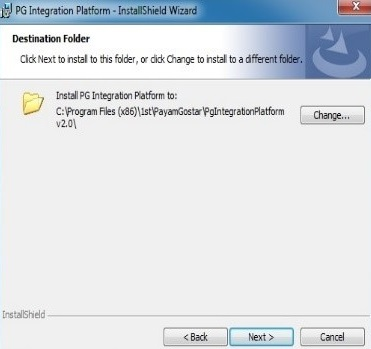
 

 

 

•	پس از نصب سرویس PG Integration Platfrom  صفحه نصب همگامساز به طور اتوماتیک به آدرس زیر باز میشود : localhost:9092/install

•	در صورت باز نشدن می توانید همین آدرس را در یک مرورگر وارد کنید.

•	برای اینکه بتوان به صفحه تنظیمات همگام‌ساز در سیستمهای دیگر از طریق مرورگر دسترسی داشت باید پورت 9092 را در firewall سیستمی که روی آن همگام ساز نصب شده است باز کرد. 

•	قبل از انجام تنظیمات همگام ساز چک شود که سرویسهای آن start باشد.

 

**صفحه نصب همگامساز نرم‌افزار مالی**

پس از باز کردن صفحه نصب تنظیمات همگامساز در قسمتهای مربوطه باید مقادیر مورد نیاز را وارد کرد.

**نکته مهم:**

 داشتن رمز کاربری admin سیستم پیام گستر،IP سرور نرم‌افزار مالی، نام کاربری و پسورد الزامی است. 
 
•	سپیدار: sql server username: damavand / sql server password: damavand
Instance       پیش فرض سیستم مالی سپیدار sepidar  می باشد.

•	تدبیر: sql server username: tadbiruser / sql server password: $$$%%%

•	پیوست: sql server username: sbsc / sql server password: Hslhk hfd kvlhtchv

•	همکاران: نام کاربری و پسورد sql server  از شرکت ارائه دهنده مالی پیگیری شود.

•	راهکاران: نام کاربری و پسورد sql server  از شرکت ارائه دهنده مالی پیگیری شود.

پس از وارد کردن مقادیر و زدن دکمه Install  صفحه نصب همگامساز به حالت زیر در می آید:

  
در صورتی که مقادیر و ارتباطات درست باشد دیتابیس PgIntegration   در سرور نرم‌افزار مالی ساخته میشود و به SqlServer نرم‎افزار مالی attach میشود.

 
صفحه لاگین مربوط به همگامساز پس از مراحل بالا باز میشود و با نام کاربری admin  پیام گستر و پسورد آن می توان وارد صفحه تنظیمات شد.

#### پنل همگامساز پیامگستر

پس از نصب و فعال بودن سرویس های همگامساز، پنل همگامساز پیامگستر با آدرس   localhost:9092/install و یا آدرس سرور پیامگستر به همراه پورت 9092 قابل دسترس می باشد . 
و می توان با نام کاربری و پسورد مدیرسیستم پیامگستر وارد پنل شد.

                                                                                               
پنل همگامساز شامل قسمتهای زیر می باشد :

##### 1- داشبورد

* در آن می توان آیتمهای در صف یا سینک شده را براساس آیتمهایی که قابل سینک شدن هستند به صورت مقداری دید. 
* همینطور خطاهایی که در هنگام سینک شدن اتفاق می افتد می توان مشاهده کرد و براساس روال مربوطه نسبت به حل آنها اقدام کرد.
* گزارش مختصری از اتفاقات روی داده در سیستم همگام‌ساز براساس تاریخ و ساعت و نوع و پیام قابل مشاهده است.
*با استفاده از این بخش امکان مشاهده وضعیت سرویس  PG Integration Service و راه اندازی یا متوقف کردن آن وجود دارد.
  

  
##### 2- تنظیمات 

* در آن می توان تنظیمات مربوط به سیستم پیام گستر را (آدرس، نام کاربری و پسورد کاربر پیام‌گستر) را تست و چک کرد و در صورت تغییر آنها را ویرایش کرد. 
*همچنین در این قسمت امکان حذف آیتم های در صف وجود دارد، به بیان دیگر می توان صف را خالی کرد.

**نکته:**  در این بخش امکان تست صحیح بودن تنظیمات سیستم پیام گستر در همگامساز وجود دارد . 

##### 3- تنظیمات سیستم مالی

* در این قسمت می توان تنظیمات مربوط به سیستم‌های مالی مربوطه را انجام داد. 
 

همچنین ویرایش و حذف تنظیمات از این قسمت امکانپذیر است.
 

#### تنظیمات سیستم مالی در همگامساز نرم‌افزار مالی

با زدن دکمه افزودن سیستم مالی صفحه جدید به صورت زیر باز میشود:
 

عنوان سیستم مالی : در این بخش می توان نام مناسبی برای سیستم مالی مورد نظر انتخاب کرد.

موجودی تمام انبارها تجمیع شود : پیاده سازی صورت گرفته نشده است.

نوع سیستم : در این قسمت سیستم مالی (سپیدار، تدبیر، پیوست، همکاران و راهکاران) مورد نظر را که قابلیت همگامسازی با پیام گستر دارد را انتخاب کنید.

آدرس سرویس: آدرس سرور همگام ساز به همراه پورت 9093 در این قسمت وارد می گردد. (در صورتیکه سرویس همگام‌ساز روی سرور پیام گستر باشد به صورت پیش فرض http://localhost:9093  وارد شود)

نام کاربری و گذرواژه : در این قسمت نام کاربری و پسورد سرویس همگام ساز وارد می شود(بصورت پیش فرض نام کاربری admin  و پسورد admin می باشد) .

آدرس سرور پایگاه داده : آدرس سرور سیستم مالی مورد نظررا در این قسمت تعریف کنید.

نام کاربر  و رمزعبور پایگاه داده : نام کاربری و پسورد دیتا بیس مورد نظر همچنین ویرایش و حذف تنظیمات از این قسمت امکانپذیر است.

همچنین برای چک کردن درست بودن مقادیر و ارتباطات، دکمه بررسی اتصال را می زنیم و در صورت صحیح بودن آن را ذخیره می کنیم.
 

 
پس از ذخیره سیستم مالی مربوطه در تنظیمات سیستم مالی اضافه میشود.
 

4 -شرکت ها

* در این بخش با انتخاب گزینه ایجاد شرکت جدید، می توان تنظیمات مربوط به پایگاه داده شرکت مرتبط با سیستم مالی اضافه شده را انجام داد.

تنظیمات سینک آیتم‌های مورد نظر که قصد دارید از نرم‌افزار مالی سپیدار، تدبیر، پیوست، راهکاران و همکاران به پیام‌گستر و آیتم‌هایی که از پیام‌گستر به نرم‌افزارهای مالی سپیدار، تدبیر، پیوست و راهکاران سینک ‌شوند از این قسمت انجام دهید. 

**تنظیمات شرکت ها در همگام‌ساز نرم‌افزار مالی**

با زدن دکمه ایجاد شرکت جدید صفحه  به صورت زیر باز میشود :
 

سیستم مالی مرتبط : از سیستم های مالی تعریف شده در همگام ساز، سیستم مالی مورد نظر برای تعریف این شرکت  انتخاب کنید.

عنوان شرکت : نام شرکت مرتبط با دیتابیس مربوطه جهت سینک را وارد کنید.

کد شرکت : کد دلخواه برای این شرکت را از 100 تا 999 تعریف نمایید.

نام بانک اطلاعاتی: بانک‌های اطلاعاتی سیستم مالی انتخاب شده نمایش داده می شوند و می توان بانک اطلاعاتی مورد نظر را برای سینک شدن انتخاب نمایید. 

**نکته:** در صورتی که این شرکت به عنوان شرکت پیش فرض تعریف شود اگر در شماره گذاری آیتم ها در پیام گستر، شماره شرکت تعریف نشده باشد، آیتم منتقل شده به نرم‌افزار مالی در این شرکت قرار خواهد گرفت. (در رابطه با شماره شرکت در ادامه توضیح داده خواهد شد.)

همچنین اگر در تعریف وب سرویس برای نمایش موجودی محصولات در انبار ها کد شرکت مورد نظر تعریف نشود، موجودی این شرکت به عنوان شرکت پیش فرض نمایش داده خواهد شد. (در رابطه با کد شرکت و تعریف وب سرویس برای انبار در ادامه توضیح داده خواهد شد.)

**کاربرد کد شرکت در همگام‌ساز :**

در آیتم‌هایی که از نرم‌افزار مالی به پیام گستر سینک میشود در صورتی که چند شرکت مختلف را تعریف کرده باشیم در پیام گستر کد شرکت تعریف شده به شماره آیتم اضافه شده و مشخص میشود که این آیتم مربوط به کدام شرکت و دیتابیس می باشد. به طور مثال شماره مشتری در پیام گستر به این صورت نشان داده میشود :

کد مشتری درنرم افزار مالی – کد شرکت 
10255 – 100
   

 

**تنظیمات مشتری در شرکت ها در  همگام‌ساز نرم‌افزار مالی و سیستم پیام گستر**

1.	در صورت فعال کردن گزینه مشتری و انجام تنظیمات مربوطه مشتریان از نرم‌افزار مالی به پیامگستر منتقل می‌شود

2.	مرجع : در این بخش امکان انتخاب مرجع مورد نظر برای هویت وجود دارد.

•	مرجع پیامگستر:

ایجاد هویت: در نرم‌افزارهای دو طرفه ( سپیدار، تدبیر، پیوست و همکاران) که امکان انتقال هویت‌ها از پیامگستر به مالی وجود دارد، با انتخاب پیامگستر به عنوان مرجع تنها هویت ها از پیام گستر به نرم‌افزار مالی منتقل می شوند. 

ویرایش هویت: در تمامی نرم‌افزارهای یک طرفه و دو طرفه (سپیدار، تدبیر، پیوست، راهکاران و همکاران) در صورت انتخاب پیامگستر به عنوان مرجع، پیامگستر مرجع ویرایش هویت‌ها قرار خواهد گرفت و ویرایش انجام شده در نرم‌افزار مالی نیز اعمال می‌شود.

•	مرجع سیستم مالی:

ایجاد هویت: در نرم‌افزارهای یک طرفه و دو طرفه ( سپیدار، تدبیر، پیوست و راهکاران و همکاران) با انتخاب سیستم مالی به عنوان مرجع تنها هویت ها از سیستم مالی به پیام گستر منتقل می شوند. 

ویرایش هویت: در تمامی نرم‌افزارهای یک طرفه و دو طرفه (سپیدار، تدبیر، پیوست، راهکاران و همکاران) در صورت انتخاب سیستم مالی به عنوان مرجع، سیستم مالی مرجع ویرایش هویت‌ها قرار خواهد گرفت و ویرایش انجام شده در پیامگستر نیز اعمال می‌شود.

•	مرجع در سطح رکورد: با انتخاب سطح رکورد تنها هویت‌هایی که در دو نرم‌افزار موجود هستند ویرایش خواهند شد.

•	در صورت فعال بودن چک باکس بروز رسانی در هویت، مرجع ویرایش نرم‌افزار مالی می باشد. به معنای دیگر ویرایش هویت از سمت نرم‌افزار مالی امکان پذیر است.

•	در صورت عدم فعال بودن چک باکس به روز رسانی در هویت، مرجع ویرایش پیام گستر می‌باشد. به معنای دیگر ویرایش هویت از سمت پیام گستر امکان پذیر است.

3.	کلید کاربری: وارد کردن کلید کاربری مرتبط با دسته بندی مشخص شده در پیامگستر(بطور مثال zone0 )

4.	کد نوع هویت حقوقی: وارد کردن کد هویت مربوط به مخاطب از نوع حقوقی در پیامگستر(بطور مثال organization)

5.	کد نوع هویت حقوقی: وارد کردن کد هویت مربوط به مخاطب از نوع حقیقی در پیامگستر(بطور مثال person )

6.	آدرس مشتری را انتقال بده: در صورت انتخاب این گزینه آدرس مشتریان که در نرم‌افزار مالی ثبت شده به پیامگستر منتقل می شود.

انتقال همه : با استفاده از این کلید تمامی مشتریان موجود در نرم‌افزار مالی در صف انتقال به پیامگستر قرار می‌گیرند. 

**اضافه کردن دسته بندی در سیستم پیام گستر جهت سینک مشتریان از نرم‌افزار مالی به پیامگستر**

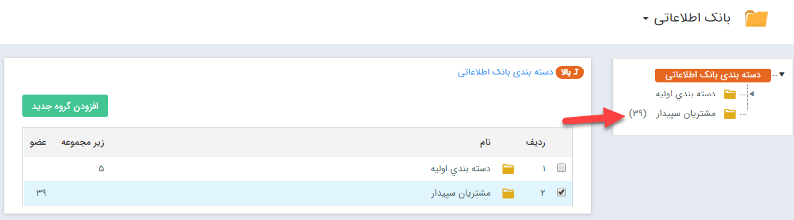

**اضافه کردن فیلدهای همگام‌ساز برای هویت در نرم افزار پیام گستر براساس راهنمای موجود**

 
 
 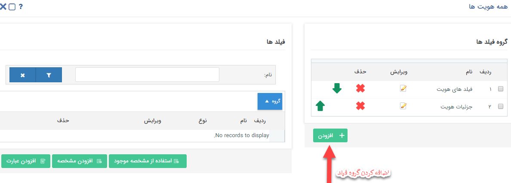
 
 
 
 
 
 
 
 
 
 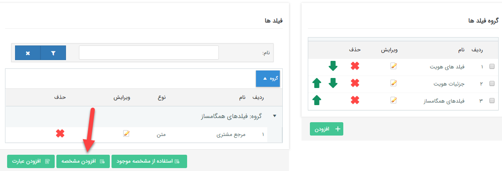
 
 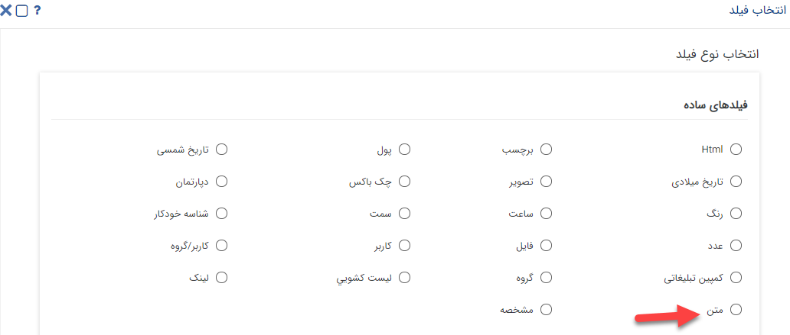
 
 
 
 
 
 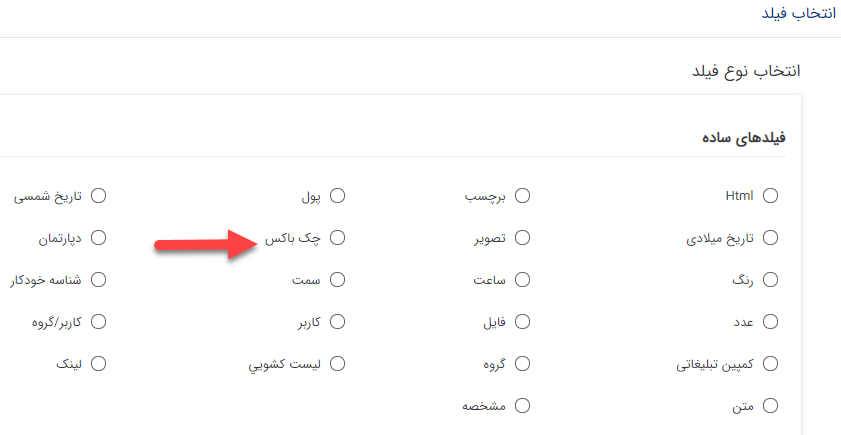
 
 
 
 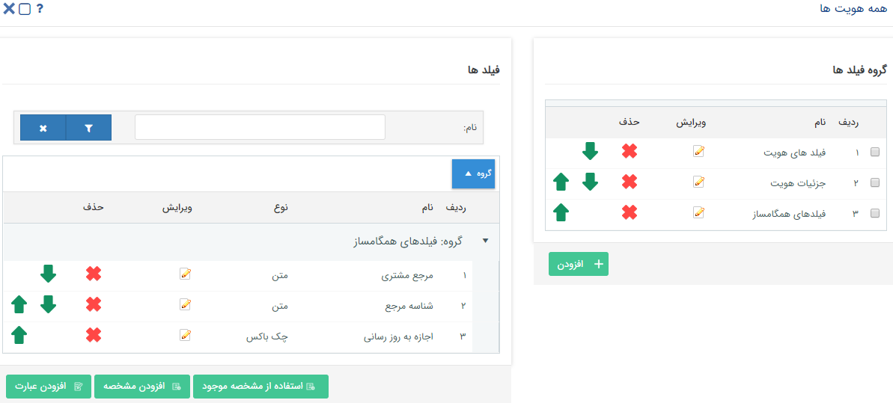
 
**اضافه کردن کدهای تعریف شده در همگامساز برای هویتهای حقیقی و حقوقی در سیستم پیام گستر براساس راهنمای موجود**

 

 

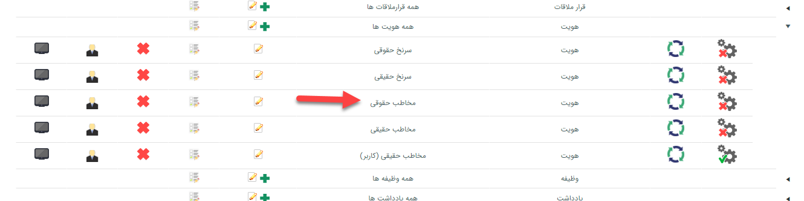

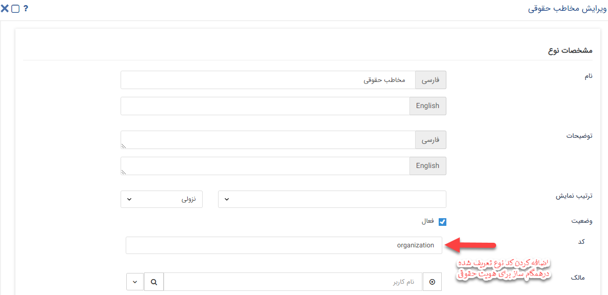

 
**نکته مهم**
فرمت تنظیمات شخصی‌سازی هویت، برای ایجاد زیرنوع هویت جدید:

1.	نوع پروفایل: مشتری

2.	عملکر هویت: مخاطب

3.	نوع هویت: با توجه به حقیقی یا حقوقی بودن هویت مورد نظر، نوع هویت انتخاب شود.

 
**تنظیمات محصولات در شرکت ها در همگامساز نرم‌افزار مالی و سیستم پیام گستر**

1. محصولات: با انتخاب این گزینه و انجام تنظمیات مرتبط تمامی محصولاتی که در نرم افزار مالی ثبت گردد به سیستم پیامگستر انتقال میابد.

2. عنوان گروه محصولات: وارد کردن نام گروه تعریف شده در مدیریت محصولات سیستم پیام گستر جهت سینک محصولات از نرم‌افزار به آن گروه.

3. جست و جو کالاها فقط در این گروه از محصولات: در صورت انتخاب این گزینه کالاها فقط در گروه تعریف شده جهت سینک نرم‌افزار مالی جستجو می شود نه در کل سیستم پیام گستر. 

انتقال همه: انتقال کلیه محصولات ثبت شده در نرم‌افزار مالی به پیام گستر
 
**اضافه کردن دسته بندی در نرم افزار پیام گستر جهت سینک محصولات از نرم‌افزار مالی**
 
 
 
 
 
 

**تنظیمات پیش فاکتور فروش در شرکت ها در همگامساز نرم‌افزار مالی و سیستم پیام گستر**

 

1. پیش‌فاکتور محصولات: با انتخاب گزینه پیش فاکتور و انجام تنظیمات مرتبط تمام پیش فاکتور های فروشی که در نرم افزار نرم‌افزار مالی ثبت گردد به نرم افزار پیامگستر منتقل می گردد. 

2. کد پیش‌فاکتور فروش: در این قسمت کد تعریف شده در شخصی سازی پیش فاکتور فروش در پیامگستر  را وارد نمایید.

انتقال همه : با استفاده از این گزینه کلیه پیش فاکتور های فروش ثبت شده در نرم‌افزار مالی به پیامگستر منتقل می گردد. 

**اضافه کردن فیلدهای همگامساز برای پیش فاکتور فروش در سیستم پیام گستر براساس راهنمای موجود**

 

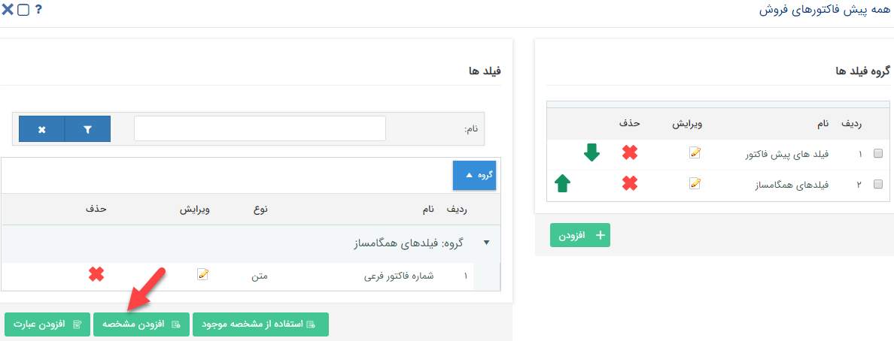
 
شماره فاکتور فرعی: شماره فاکتور فرعی همان شماره مرجع در آیتم‌های مالی است. شماره مرجع فاکتور در نرم‌افزار مالی و پیامگستر باید یکسان باشند، در غیر اینصورت در هنگام سینک پیغام خطا نشان داده می‌شود. لازم بذکر است شماره فاکتور فرعی برای مشتری نمایش داده نمی‌شود.

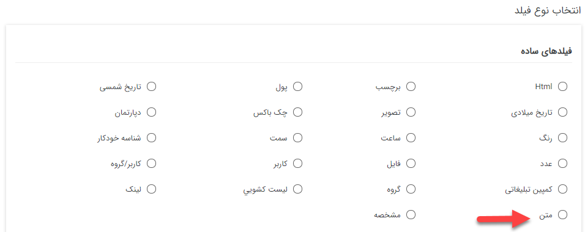

**اضافه کردن کد تعریف شده در هم‌گامساز برای پیش فاکتور فروش در سیستم پیام گستر براساس راهنمای موجود**

 
جهت تنظیمات فاکتور فروش و فاکتور برگشت از فروش، فاکتور خرید، فاکتور برگشت از خرید، دریافت و پرداخت نیز همانند پیش فاکتور فروش می توان بعد از تنظیم در همگام ساز و تعریف فیلدهای همگام ساز مربوطه در سیستم پیام گستر اطلاعات از نرم‌افزار مالی به پیام گستر منتقل شوند. 

**قراردادن وب هوک برای انتقال مشتری از پیام‌گستر به نرم‌افزار مالی**

•	در تنظیمات نوع هویتی که قرار است به نرم‌افزار مالی سینک شود وب هوک زیر را وارد می کنیم :
•	http://localhost:9092/api/sync/customer

•	در صورتی که سرویس همگامساز غیر از جایی از سرور پیام گستر نصب باشد به جای localhost  آی پی آن سیستم را وارد می کنیم.
 
 
 
 
 
•	برای اینکه هنگام گرفتن شماره مشتری  خودکار، طبق الگوی شماره ی آن شرکتی که قرار است هویت به آن منتقل شود شماره مشتری بگیرد در
تنظیمات الگوی شماره گذاری مربوط به آن هویت طبق فرمت درست شماره گذاری را به صورت زیر وارد کنید :

کد شرکت (به طور مثال -100) به همراه پارامترهای مجاز برای الگوی شماره گذاری
به طور مثال برای سینک نرم‌افزار مالی برای هویتها از الگوی 100-{*(AN)}  استفاده میشود

 
**تنظیمات وب هوک برای ارسال پیش فاکتور از پیام گستر به نرم‌افزار مالی**

•	در تنظیمات نوع پیش فاکتوری که قرار است به نرم‌افزار مالی سینک شود، وب هوک زیر را وارد کرده.
http://localhost:9092/api/sync/salequote

•	در صورتی که سرویس همگامساز غیر از جایی از سرور پیام گستر نصب باشد به جای localhost  آی پی آن سیستم را وارد کرده.

**نکته مهم:** به منظور موفق بودن عملیات سینک، الگوی شماره‌گذاری باید مطابق نمونه‌ استاندارد باشد. الگو شماره گذاری پیش‌فاکتورها به تفکیک نوع نرم‌افزار مالی به شرح زیر می‌باشد:

سپیدار و تدبیر:
/سال مالی- کد شرکت (به طور مثال /1398-100)
•	100-{____(SHYY)}/{*(AN)}

پیوست و همکاران:
•	100-{____(SHYY)}/{*(FP:6)}-{*(AN)}

راهکاران:
•	100-{____(SHYY)}/{*(FP:6)}-{*(SP:2)}-{*(AN)}

با توجه به این نکته که الگوی شماره گذاری در هر نوع پیش فاکتور می تواند قرار داشته باشد پس می توان همزمان برای یک شرکت چند نوع پیش فاکتور را به نرم‌افزار مالی سینک کرد. همینطور می توان پیش فاکتورهای مختلف را به شرکت های مختلف با رعایت الگوی شماره گذاری سینک کرد.

**تنظیمات وب سرویس خواندن موجودی کالا از نرم‌افزار مالی**

•	این سرویس در حال حاضر برای خواندن موجودی محصولات یک شرکت راه اندازی شده است که به تفکیک انبارهای تعریف شده در نرم‌افزار مالی موجودی محصولات  را در هنگام زدن پیش فاکتور در پیام گستر نمایش می دهد.

•	برای تعریف این سرویس باید ازنرم افزار پیامگستر بخش تنظیمات کلی سیستم قسمت انبارداری اقدام کرد و وب سرویس زیر را وارد کرده :
{کدشرکت}http://localhost:9092/api/inventory/

•	در صورتی که کد شرکت وارد نشود موجودی محصولات شرکتی را نشان می دهد که در تنظیمات شرکت در پنل همگامساز تیک پیش فرض خورده باشد.

**نکته مهم:** در صورتی که چند شرکت در همگام‌ساز تعریف شده باشد و تیک پیش‌فرض نخورده باشد،  مجموع انبارهای شرکت‌های وارد شده را نشان می‌دهد. به معنای دیگر انبار شرکت‌ها را از یک دیگر تفکیک نمی‌کند. 

•	در صورت دادن خطا در هنگام انتخاب موجودی انبار برای تنطیم وب سرویس به علت نداشتن ماژول انبارداری پیشرفته، مشکلی وجود ندارد و می‌توان سرویس را تعریف کرد.
 

 
**تنظیمات وب سرویس خواندن مانده حساب مشتری از نرم‌افزار مالی**

" **نکته مهم:** این سرویس جدای از همگامساز می باشد و برای آنکه مشتری از آن استفاده کند باید ماژول فرم ساز را داشته باشد."

•	از این وب سرویس زمانی استفاده میشود که در نرم‌افزار مالی برای مشتری مانده اول دوره تعریف شده باشد و یا چکی که در نرم‌افزار مالی دریافت شده است چون پاس نشده است از حساب مشتری کم نشده است ولی چون به عنوان دریافت به پیام گستر آمده است از مانده حساب مشتری در پیام گستر کم شده است.

•	برای تنظیم این آیتم در شخصی سازی سوپر فیلد هویت باید یک فیلد از نوع وب سرویس در گروه فیلدهای همگامساز ساخت و آدرس وب سرویس زیر را وارد نمود :
•	http://pgiadress:9092/api/customer/balance?code={prop{CustomerNo}}

•	این مانده حساب جدای از مانده حساب پیام گستر می باشد و در صورت زدن دکمه بروزرسانی مانده حساب را مستقیم از نرم افزار مالی میخواند.

**فرمت صحیح وارد کردن الگو شماره‌گذاری آیتم‌های مختلف به تفکیک نرم‌افزارهای مالی**

به منظور موفق بودن عملیات سینک بین دو نرم‌افزار، لازم است الگو شماره‌گذاری‎ها طبق فرمتی که در زیر شرح داده شده است باشد

1. سپیدار

هویت
100-{*(AN)} 

پیش فاکتور و فاکتور و برگشت از فرو
100-{____(SHYY)}/{*(AN)} 

پیش فاکتور خرید، فاکتورخرید و فاکتور برگشت از خرید
100-{____(SHYY)}/{*(FP:6)}-{*(AN)}

دریافت 
100-{____(SHYY)}/{*(DP:510)}-{__(DLP:dr)}-{*(AN)}
پرداخت

100-{____(SHYY)}/{*(DP:510)}-{__(DLP:pr)}-{*(AN)}

2. تدبیر:

هویت 
100-{*(AN)} 

پیش فاکتور، فاکتور، برگشت از فروش، پیش فاکتور خرید، فاکتور خرید و فاکتور برگشت از خرید 
100-{____(SHYY)}/{*(AN)} 

دریافت 
100-{____(SHYY)}/{*(FP:6)}-{*(AN)}

پرداخت 
100-{____(SHYY)}/{*(FP:6)}-{*(AN)

 
4.پیوست:

هویت 
100-{*(AN)} 

پیش فاکتور و فاکتور و برگشت از فروش - فاکتور خرید و فاکتور برگشت از خرید:
100-{____(SHYY)}/{*(FP:6)}-{*(AN)}

دریافت 
100-{____(SHYY)}/{*(FP:6)}-{*(SP:6)}-{*(AN)}

پرداخت 
100-{____(SHYY)}/{*(FP:6)}-{*(SP:6)}-{*(AN)}

4.  همکاران:

هویت 
100-{*(AN)} 

پیش فاکتور و فاکتور و برگشت از فروش 
100-{____(SHYY)}/{*(FP:6)}-{*(AN)}

دریافت 
100-{____(SHYY)}/{*(FP:6)}-{*(SP:rca)}-{*(AN)}

پرداخت 
100-{____(SHYY)}/{*(FP:6)}-{*(SP:pca)}-{*(AN)}

5. راهکاران:

هویت
100-{*(AN)} 

پیش فاکتور و فاکتور و برگشت از فروش
100-{____(SHYY)}/{*(FP:6)}-{*(SP:2)}-{*(AN)}

دریافت
100-{____(SHYY)}/{*(FP:6)}-{*(SP:rca)}-{*(AN)}

پرداخت
100-{____(SHYY)}/{*(FP:6)}-{*(SP:pca)}-{*(AN)}
