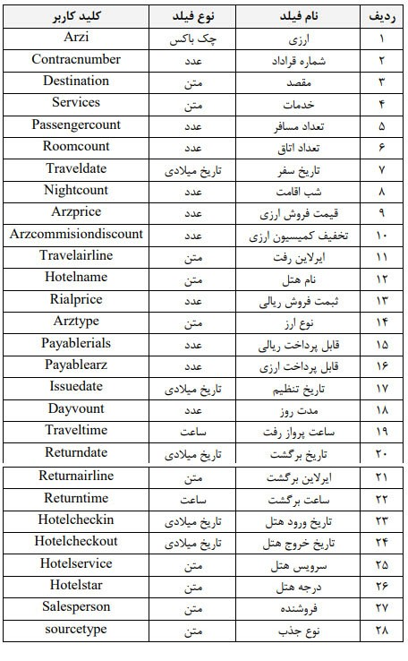

### همگام‌‍‌ساز نرم‌افزار ژنیک و پیام‌گستر

این همگام‎ساز کلیه قراردادهایی که در نرم‌افزار ژنیک وجود دارد (که شامل تورهای خریداری شده توسط مشتریان می‌باشد) را در قالب یک قرارداد به پیام‌گستر منتقل می‌کند. برای انجام این سینک چند نکته مهم وجود دارد: 

2-1 ایجاد نام کاربری و پسورد برای دسترسی ژنیک بنام mditor و ساخت یک table بنام crm که لازم است این موارد توسط شرکت ژنیک انجام شود.

2-2  وارد کردن مشتریان موجود در ژنیک بعنوان یک هویت در پیام‌گستر بر اساس شماره مشتری بصورت دستی یا با اکسل انجام می‌شود و اصلا انتقال هویت از سوی ژنیک به پیام‌گستر (یا برعکس) وجود ندارد.

2-3  ایجاد یک نوع قرارداد با کد tour و ایجاد فیلدهای زیر:

 

2-4	  داشتن نرخ ارزهای دلار، یورو و درهم به ریال برای وارد کردن در تنظیمات اعمال شده است.

‌-و	  این سینک بصورت لحظه‌ای نبوده و در یک زمان مشخص که در تنظیمات فایل config مرتبط همگام‌ساز انجام می‌شود. به عبارتی هر 24 ساعت یکبار انجام می‌شود.

2-6	امکان سینک هویت بر اساس شماره مشتری و ست کردن وب هوک از پیام‌گستر به فرانگر وجود دارد ولی حتما باید تعداد ارقام شماره مشتری که در فرانگر قابل ایجاد است ابتدا چک شود که دیتای مشتریان دوباره ایجاد نشود (داپلیکیت نشود). 

2-7	این همگام‌ساز دارای پنل نیست و کلیه موارد انجام شده یا خطاها در فایل log در محل نصب همگام‌ساز قابل بررسی است.

**نکته:** لازم بذکر است قرارداهای منتقل شده از سمت نرم‌افزار، قراردادهای تایید و نهایی شده می‌باشند. اقداماتی نظیر رسرواسیون و مالی انجام شده که پس از آن قرارداد ثبت شده و به پیام‌گستر منتقل می‌شود.  در صورت داشتن ماژول چرخه کاری و در صورت درخواست کارفرما جهت پیاده سازی فرآیندهای پیگیری‌ واحدهای مختلف، لازم است ترتیب زمانی و و هماهنگی واحدها (کانتر تور، رزرواسیون و مالی) در نظر گرفته شود.
