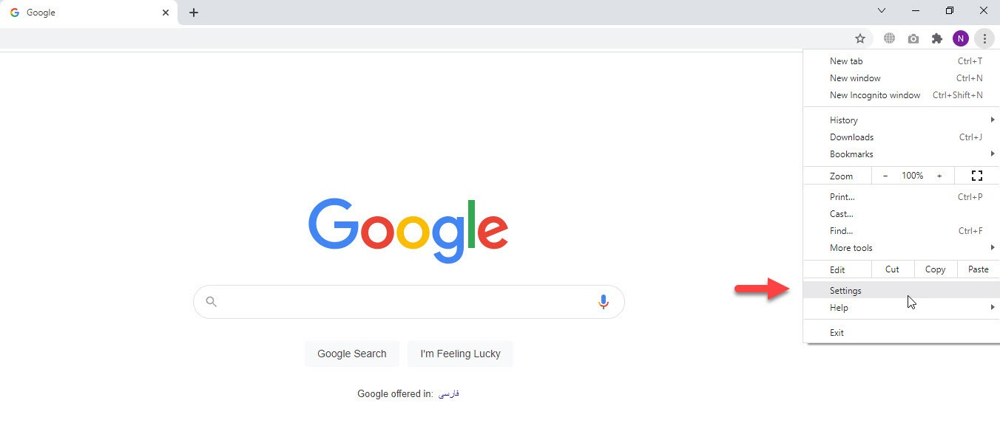
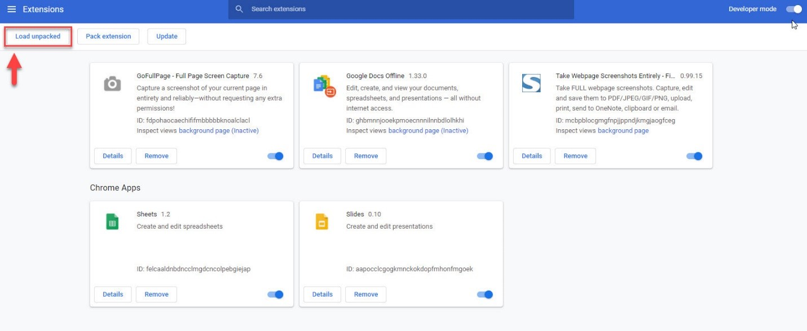
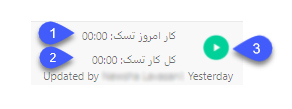

### ارتباط تایم نگر با سایر نرم‌افزارها

نصب  Extensionتایم نگر در مرورگر گوگل کروم
بمنظور استفاده از نرم‌افزارهای Azure Devops Serve (TFS) ، Trello و Jira Attlasian به همراه تایم نگر، ابتدا لازم است Extension تایم نگر در مرورگر نصب شود جهت فعال¬سازی Extension،  در قست Setting مرورگر کروم، گزینه Extension انتخاب شود. در این قسمت تمامی برنامه¬هایی که Extension آن¬ها در نرم¬افزار فعال شده است را نمایش می¬دهد.

 

بمنظور بارگذاری فایل وارد Load Unpacked شده.
 

در این مرحله فایل Extension را برای بارگذاری انتخاب نمایید.

پس از بارگذاری Extension آیکون تایم نگر در بالای مرورگر نمایش داده می‌شود. با کلیک بر روی آن می‌توان نوع وظیفه و پلتفرم مورد نظر برای نمایش وظیفه در تایم‌نگر را انتخاب کرد. همچنین می‌توان از تب دوم وظیفه را شروع کرد.

 

به عنوان مثال تصویر زیر، مرتبط با نرم‌افزار TFS می‌باشد و پس از نصب Extension تایم نگر، کادر مشخص شده (قرمز رنگ) بر روی task ها نشان داده می‌شود.
 

1.	**کار امروز تسک:** زمان اختصاص داده شده به وظیفه در روز جاری.

2.	**کل کار تسک:** کل زمان اختصاص داده شده به وظیفه.

3.	**دکمه Play:** جهت شروع محاسبه زمان کارکرد کاربر بر روی پروژه تعیین شده، بر این دکمه کلیک شود.

لازم به ذکر است قبل از کلیک بر روی دکمه شروع، لازم است ابتدا به نرم‌افزار تایم‌نگر وارد شده و نرم‌افزار در تمام مراحل انجام کار، بسته نشود. مراحل فعال¬سازی تایم‌نگر برای نرم‌افزارهای Trello و Jira Atlassian مشابه با موارد ذکر شده با نرم‌افزار TFS می‌باشد.

